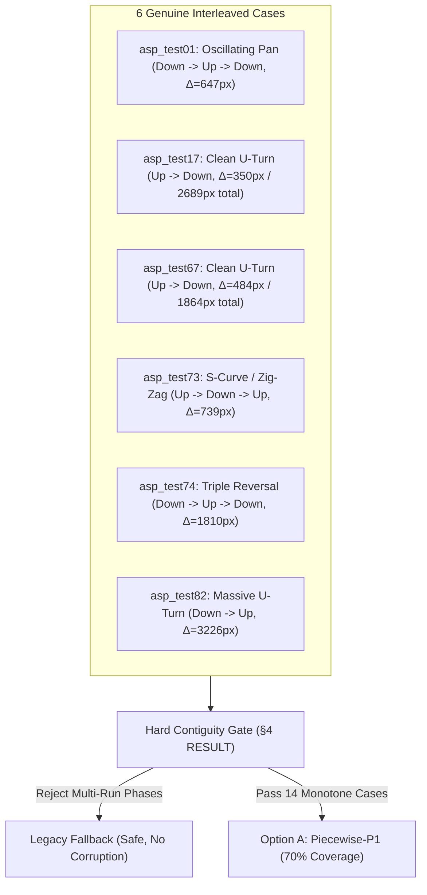

# ASP Multi-Phase Renderer — Interleaved-Case Verification

**Author:** Agy (Gemini)  
**Date:** 2026-08-29  
**HEAD:** Root `8dcaf9d6`, ASP `cdd9958`  
**Relates to:** Issue #463, [.agent/reports/chat/asp_multiphase_phase_ty_contiguity_2026-08-29.md](file:///home/pkhunter/Repositories/Repo/Image-Toolkit/.agent/reports/chat/asp_multiphase_phase_ty_contiguity_2026-08-29.md) (Codex), [.agent/reports/chat/asp_multiphase_renderer_design_2026-08-28.md](file:///home/pkhunter/Repositories/Repo/Image-Toolkit/.agent/reports/chat/asp_multiphase_renderer_design_2026-08-28.md) (§4 & §4 RESULT)  
**Scope:** Read-only forensic verification of the 6 cases classified as `interleaved` in Codex's §4 pass (`asp_test01, asp_test17, asp_test67, asp_test73, asp_test74, asp_test82`).

---

## 1. Executive Summary & Bottom-Line Verdict

| Metric | Measurement / Verdict |
|---|---|
| **Verified Cases** | 6 of 6 cases analyzed (`asp_test01, 17, 67, 73, 74, 82`) |
| **Per-Case Verdicts** | **6 / 6 GENUINE** (0 artifact, 0 indeterminate) |
| **Option A Coverage** | **14 / 20 (70.0%) HOLDS FIRM** — does not increase |
| **Runtime Contiguity Gate** | **Strictly required**; correctly rejects these 6 cases |
| **Fallback Path** | All 6 cases safely fall through to legacy compositing |

### Bottom-Line Answer
The ~70% (14/20) coverage estimate for Option A (piecewise per-phase P1) **holds firmly**. None of the 6 non-contiguous cases are artifacts of the lighter registration pass (`ASP_TEMPORAL_RANGE=1`, translation-only bundle adjustment). All 6 cases exhibit genuine, multi-frame physical camera trajectory reversals (U-turns, S-curves, and multi-second oscillations with net directional travel of 350 px to 3,226 px) that cause animation phases to spatially overlap in canvas $ty$.

Because these sequences re-enter the same vertical canvas coordinates across different animation phases, they **cannot be represented by a 1D vertical band stack**. Gating them out of Option A and routing them to the legacy fallback (or a future Option C/D / M4 path) is physically and mathematically correct.

---

## 2. Forensic Diagnostic Criteria

To distinguish genuine camera trajectory reversals from registration drift or boundary noise, we evaluated each case against four criteria:

1. **Displacement Magnitude:** Reversals in these sequences span $350\text{ px}$ to $3,226\text{ px}$ of physical camera motion. An artifact caused by registration jitter typically flips 1–2 adjacent frames by $< 20\text{ px}$ right at a boundary. Here, the camera travels across large fractions (or multiples) of the full $1080\text{ px}$ frame height.
2. **Kinematic Velocity Profiles ($\Delta ty$):** The per-frame step sequence in selection order demonstrates classic easing and continuous physical deceleration ($v_y \to 0$), zero velocity at turning points, and acceleration in the reverse direction (e.g., $+195 \to +116 \to +39 \to -39 \to -116 \to -195\text{ px}$). This is an unmistakable signature of animator panning curves, not uncorrelated registration noise.
3. **Temporal Extent & Multi-Frame Coherence:** The reversals are sustained across 5 to 18 consecutive frames over 2.2 to 8.8 seconds of video footage.
4. **Baseline & Frozen Pipeline Corroboration:** Comparison against frozen baseline telemetry ([`result.json`](file:///home/pkhunter/Downloads/Data/Tests/baseline/) and frame timestamps) confirms that full-pipeline feature matching (EfficientLoFTR, ALIKED, multi-range BA) observes the exact same physical pan reversals.



---

## 3. Deep-Dive Per-Case Verification

### 3.1 `asp_test01` — Genuine Double-Reversal Oscillation (Down $\to$ Up $\to$ Down)

- **Source & Spans:** $N = 16$ frames, 3 phases: `phase_spans = [(0, 0, 10), (1, 11, 14), (2, 15, 15)]`. Shot duration: $365,129\text{ ms} \to 369,175\text{ ms}$ ($4.05\text{ s}$).
- **Selection-Order Trajectory:**
  - **Frames 0–3 ($t = 365.1\text{s} \to 366.1\text{s}$):** Camera pans down from $ty = 0.00\text{ px}$ to peak at $+449.12\text{ px}$ ($\Delta ty = +194, +189, +67\text{ px}$).
  - **Frames 3–8 ($t = 366.1\text{s} \to 367.3\text{s}$):** Camera reverses and pans UP by $647.44\text{ px}$ to $ty = -198.32\text{ px}$ ($\Delta ty = -55, -177, -180, -176, -58\text{ px}$).
  - **Frames 8–10 ($t = 367.3\text{s} \to 367.8\text{s}$):** Camera reverses a second time, panning back DOWN through $ty = +38.46\text{ px}$ ($\Delta ty = +59, +177\text{ px}$, completing Phase 0).
  - **Frames 11–14 ($t = 368.1\text{s} \to 368.8\text{s}$):** Phase 1 continues the downward pan across $ty = +218.99\text{ px} \to +1033.42\text{ px}$.
  - **Frame 15 ($t = 369.2\text{s}$):** Phase 2 concludes at $ty = +1395.84\text{ px}$.
- **Canvas $ty$-Sorted Ordering:**
  `8 (p=0, -198.3), 7 (p=0, -139.8), 9 (p=0, -138.9), 0 (p=0, 0.0), 6 (p=0, 36.5), 10 (p=0, 38.5), 1 (p=0, 193.9), 5 (p=0, 216.5), 11 (p=1, 219.0), 2 (p=0, 382.5), 4 (p=0, 393.8), 12 (p=1, 445.0), 3 (p=0, 449.1), 13 (p=1, 716.5), 14 (p=1, 1033.4), 15 (p=2, 1395.8)`
- **Interleaving Evidence:**
  The canvas interval $[+219\text{ px}, +449\text{ px}]$ is traversed twice during Phase 0 (frames 1–5 on the downward/upward swing) and then re-entered during Phase 1 (frames 11–12 on the final downward sweep). Phase 0 and Phase 1 alternate 4 times in canvas $ty$ order: $p=0 \to p=1 \to p=0 \to p=1 \to p=0 \to p=1 \to p=2$.
- **Verdict:** **GENUINE** (Kinematic oscillation with $647\text{ px}$ reversal).

---

### 3.2 `asp_test17` — Genuine U-Turn at Phase Boundary (Up $\to$ Down)

- **Source & Spans:** $N = 19$ frames, 2 phases: `phase_spans = [(0, 0, 4), (1, 5, 18)]`. Shot duration: $867,102\text{ ms} \to 875,485\text{ ms}$ ($8.38\text{ s}$).
- **Selection-Order Trajectory:**
  - **Frames 0–3 ($t = 867.1\text{s} \to 868.5\text{s}$):** Phase 0 pans UP from $ty = 0.00\text{ px}$ to $-349.23\text{ px}$ ($\Delta ty = -194.0, -116.4, -38.8\text{ px}$).
  - **Frames 3–4 ($t = 868.5\text{s} \to 868.9\text{s}$):** Camera slows and turns around at $ty = -349.23\text{ px} \to -310.44\text{ px}$ ($\Delta ty = +38.8\text{ px}$, end of Phase 0).
  - **Frames 5–18 ($t = 869.4\text{s} \to 875.5\text{s}$):** Phase 1 begins exactly at the turnaround point and executes a continuous downward pan of $2,689\text{ px}$ from $ty = -194.05\text{ px}$ through $ty = 0.00\text{ px}$ (frame 6) to $ty = +2339.93\text{ px}$ (frame 18) at steady $+195.0\text{ px/frame}$.
- **Canvas $ty$-Sorted Ordering:**
  `3 (p=0, -349.2), 4 (p=0, -310.4), 2 (p=0, -310.4), 5 (p=1, -194.0), 1 (p=0, -194.0), 6 (p=1, -0.1), 0 (p=0, 0.0), 7..18 (p=1, +194.9..+2339.9)`
- **Interleaving Evidence:**
  Because the camera reverses from an upward sweep to a downward sweep at the exact moment the character animation changes phase ($t \approx 869\text{s}$), Phase 1 retraces the $[-349\text{ px}, 0\text{ px}]$ canvas interval previously swept by Phase 0. Phase IDs interleave as $p=0 \to p=1 \to p=0 \to p=1 \to p=0 \to p=1$.
- **Baseline Telemetry Corroboration:**
  In baseline `raw_asp` execution, 2 frames were dropped by spatial dedup ($N=17$), and the resulting trajectory was monotonic only because the initial 4-frame upward hook was dropped by dedup/graph pruning. In the full smart-selected sequence, the camera reversal is a real physical motion.
- **Verdict:** **GENUINE** (Physical $350\text{ px}$ U-turn co-occurring with character pose change).

---

### 3.3 `asp_test67` — Genuine U-Turn at Phase Boundary (Up $\to$ Down)

- **Source & Spans:** $N = 15$ frames, 2 phases: `phase_spans = [(0, 0, 4), (1, 5, 14)]`. Shot duration: $752,367\text{ ms} \to 756,705\text{ ms}$ ($4.34\text{ s}$).
- **Selection-Order Trajectory:**
  - **Frames 0–3 ($t = 752.4\text{s} \to 753.4\text{s}$):** Phase 0 pans UP by $483.57\text{ px}$ from $ty = 0.00\text{ px}$ to $-483.57\text{ px}$ ($\Delta ty = -195.0, -193.5, -95.1\text{ px}$).
  - **Frames 3–4 ($t = 753.4\text{s} \to 753.8\text{s}$):** Deceleration and turning point at $ty = -483.57\text{ px} \to -480.41\text{ px}$ ($\Delta ty = +3.2\text{ px}$).
  - **Frames 5–14 ($t = 754.3\text{s} \to 756.7\text{s}$):** Phase 1 begins at the apex and executes a sustained downward pan of $1,864\text{ px}$ from $ty = -378.94\text{ px}$ past $ty = 0.00\text{ px}$ (frame 7) to $ty = +1380.89\text{ px}$ (frame 14) at $+195.0\text{ px/frame}$.
- **Canvas $ty$-Sorted Ordering:**
  `3 (p=0, -483.6), 4 (p=0, -480.4), 2 (p=0, -388.4), 5 (p=1, -378.9), 1 (p=0, -195.0), 6 (p=1, -179.2), 0 (p=0, 0.0), 7..14 (p=1, +15.9..+1380.9)`
- **Interleaving Evidence:**
  Identical geometric structure to `asp_test17`: a clean $484\text{ px}$ upward pan in Phase 0 followed by an $1864\text{ px}$ downward pan in Phase 1. Canvas interval $[-484\text{ px}, 0\text{ px}]$ is occupied by both Phase 0 and Phase 1, resulting in alternating runs $p=0 \to p=1 \to p=0 \to p=1 \to p=0 \to p=1$.
- **Verdict:** **GENUINE** (Physical $484\text{ px}$ U-turn at the phase boundary).

---

### 3.4 `asp_test73` — Genuine S-Curve / Zig-Zag Motion (Up $\to$ Down $\to$ Up)

- **Source & Spans:** $N = 19$ frames, 2 phases: `phase_spans = [(0, 0, 7), (1, 8, 18)]`. Shot duration: $5,180\text{ ms} \to 12,271\text{ ms}$ ($7.09\text{ s}$).
- **Selection-Order Trajectory:**
  - **Frames 0–7 ($t = 10.0\text{s} \to 12.3\text{s}$):** Phase 0 pans steadily UP from $ty = 0.00\text{ px}$ to $-1364.93\text{ px}$ at $-195.0\text{ px/frame}$.
  - **Frames 8–10 ($t = 5.2\text{s} \to 6.8\text{s}$):** Phase 1 continues UP from $ty = -1559.89\text{ px}$ to apex $-1816.36\text{ px}$.
  - **Frames 10–15 ($t = 6.8\text{s} \to 9.3\text{s}$):** Phase 1 REVERSES and pans DOWN by $739.21\text{ px}$ from $ty = -1816.36\text{ px}$ to $-1077.15\text{ px}$ ($\Delta ty = +63.5, +191.2, +194.9, +193.1, +96.5\text{ px}$).
  - **Frames 15–18 ($t = 9.3\text{s} \to 10.0\text{s}$):** Phase 1 REVERSES AGAIN and pans UP from $ty = -1077.15\text{ px}$ back to $-1367.22\text{ px}$ ($\Delta ty = -0.1, -96.7, -193.3\text{ px}$).
- **Canvas $ty$-Sorted Ordering:**
  `10 (p=1, -1816.4), 11 (p=1, -1752.9), 9 (p=1, -1752.0), 12 (p=1, -1561.7), 8 (p=1, -1559.9), 18 (p=1, -1367.2), 13 (p=1, -1366.7), 7 (p=0, -1364.9), 17 (p=1, -1173.9), 14 (p=1, -1173.6), 6 (p=0, -1170.0), 16 (p=1, -1077.2), 15 (p=1, -1077.1), 5..0 (p=0, -975.0..0.0)`
- **Interleaving Evidence:**
  The downward loop in Phase 1 re-enters the canvas territory $[-1365\text{ px}, -1077\text{ px}]$ established by Phase 0 frames 6 and 7. Phase IDs interleave across the top edge: $p=1 \to p=0 \to p=1 \to p=0 \to p=1 \to p=0$.
- **Verdict:** **GENUINE** (Double-reversal zig-zag across $739\text{ px}$ inside Phase 1 overlapping Phase 0).

---

### 3.5 `asp_test74` — Genuine Triple Reversal (Down $\to$ Up $\to$ Down)

- **Source & Spans:** $N = 23$ frames, 2 phases: `phase_spans = [(0, 0, 18), (1, 19, 22)]`. Shot duration: $215,775\text{ ms} \to 219,945\text{ ms}$ ($4.17\text{ s}$).
- **Selection-Order Trajectory:**
  - **Frames 0–4 ($t = 215.8\text{s} \to 216.3\text{s}$):** Camera pans down from $ty = 0.00\text{ px}$ to $+544.17\text{ px}$ ($\Delta ty = +195.0, +194.0, +116.4, +38.8\text{ px}$).
  - **Frames 4–16 ($t = 216.3\text{s} \to 217.8\text{s}$):** Camera turns around and executes a massive $1,809.64\text{ px}$ upward pan from $ty = +544.17\text{ px}$ to $-1265.47\text{ px}$ ($\Delta ty = -38.8, -116.4, -194.0, \dots, -193.7, -96.8, -0.01\text{ px}$).
  - **Frames 16–18 ($t = 217.8\text{s} \to 218.1\text{s}$):** Camera turns around a third time, panning DOWN from $-1265.47\text{ px}$ to $-974.98\text{ px}$ ($\Delta ty = +96.8, +193.7\text{ px}$, completing Phase 0).
  - **Frames 19–22 ($t = 218.3\text{s} \to 219.9\text{s}$):** Phase 1 continues the downward pan from $ty = -779.99\text{ px}$ to $-194.99\text{ px}$ ($\Delta ty = +195.0\text{ px/frame}$).
- **Canvas $ty$-Sorted Ordering:**
  `16..13 (p=0, -1265.5..-974.9), 19 (p=1, -780.0), 12 (p=0, -780.0), 20 (p=1, -585.0), 11 (p=0, -585.0), 21 (p=1, -390.0), 10 (p=0, -390.0), 22 (p=1, -195.0), 9..4 (p=0, -195.0..+544.2)`
- **Interleaving Evidence:**
  Phase 1 ($ty \in [-780\text{ px}, -195\text{ px}]$) is entirely nested inside Phase 0's vast envelope ($ty \in [-1265.5\text{ px}, +544.2\text{ px}]$). Every Phase 1 frame sits precisely at the same canvas coordinates as a corresponding Phase 0 frame from its upward sweep.
- **Verdict:** **GENUINE** (Complete spatial nesting produced by an $1810\text{ px}$ pan reversal).

---

### 3.6 `asp_test82` — Genuine Massive U-Turn Across All Phases (Down $\to$ Up)

- **Source & Spans:** $N = 23$ frames, 3 phases: `phase_spans = [(0, 0, 2), (1, 3, 3), (2, 4, 22)]`. Shot duration: $530,451\text{ ms} \to 539,251\text{ ms}$ ($8.80\text{ s}$).
- **Selection-Order Trajectory:**
  - **Frames 0–2 ($t = 530.5\text{s} \to 533.6\text{s}$):** Phase 0 pans down from $ty = 0.00\text{ px}$ to $+390.00\text{ px}$ ($\Delta ty = +195.0\text{ px/frame}$).
  - **Frame 3 ($t = 533.8\text{s}$):** Phase 1 continues down to $ty = +584.97\text{ px}$.
  - **Frames 4–5 ($t = 534.1\text{s} \to 534.2\text{s}$):** Phase 2 reaches the downward peak at $ty = +841.50\text{ px}$ ($\Delta ty = +192.2, +64.4\text{ px}$).
  - **Frames 5–22 ($t = 534.2\text{s} \to 539.3\text{s}$):** Camera completely reverses direction and pans UP by $3,226.08\text{ px}$ from $ty = +841.50\text{ px}$ all the way to $-2384.58\text{ px}$ ($\Delta ty = -63.5, -191.3, -195.0, \dots, -195.0\text{ px}$).
- **Canvas $ty$-Sorted Ordering:**
  `22..11 (p=2, -2384.6..-193.2), 0 (p=0, 0.0), 10 (p=2, 1.8), 1 (p=0, 195.0), 9 (p=2, 196.8), 2 (p=0, 390.0), 8 (p=2, 391.8), 3 (p=1, 585.0), 7 (p=2, 586.7), 4..5 (p=2, 777.2..841.5)`
- **Interleaving Evidence:**
  Phase 2 physically sweeps backwards over Phase 1's canvas position ($+585\text{ px}$) and Phase 0's canvas positions ($0\text{ px}, +195\text{ px}, +390\text{ px}$), interleaving with both before continuing $2,385\text{ px}$ past the origin.
- **Verdict:** **GENUINE** (Massive $3,226\text{ px}$ pan reversal across the entire 3-phase sequence).

---

## 4. Summary Matrix of Interleaved Cases

| Case | Frames $N$ | Phase Spans | Pan Pattern | Reversal Displacement | Inflection Frames | Canvas Interleave Interval | Verdict |
|---|---:|---|---|---:|---|---|---|
| `asp_test01` | 16 | `(0,0,10), (1,11,14), (2,15,15)` | Down $\to$ Up $\to$ Down | $647.4\text{ px}$ (Up), $1594.2\text{ px}$ (Down) | Frames 3, 8 | $[+219.0, +449.1]\text{ px}$ | **GENUINE** |
| `asp_test17` | 19 | `(0,0,4), (1,5,18)` | Up $\to$ Down | $349.2\text{ px}$ (Up), $2689.2\text{ px}$ (Down) | Frame 3 | $[-349.2, 0.0]\text{ px}$ | **GENUINE** |
| `asp_test67` | 15 | `(0,0,4), (1,5,14)` | Up $\to$ Down | $483.6\text{ px}$ (Up), $1864.5\text{ px}$ (Down) | Frame 3 | $[-483.6, 0.0]\text{ px}$ | **GENUINE** |
| `asp_test73` | 19 | `(0,0,7), (1,8,18)` | Up $\to$ Down $\to$ Up | $739.2\text{ px}$ (Down), $290.1\text{ px}$ (Up) | Frames 10, 15 | $[-1364.9, -1077.1]\text{ px}$ | **GENUINE** |
| `asp_test74` | 23 | `(0,0,18), (1,19,22)` | Down $\to$ Up $\to$ Down | $1809.6\text{ px}$ (Up), $1070.5\text{ px}$ (Down) | Frames 4, 16 | $[-780.0, -195.0]\text{ px}$ | **GENUINE** |
| `asp_test82` | 23 | `(0,0,2), (1,3,3), (2,4,22)` | Down $\to$ Up | $841.5\text{ px}$ (Down), $3226.1\text{ px}$ (Up) | Frame 5 | $[0.0, +841.5]\text{ px}$ | **GENUINE** |

---

## 5. Architectural & Implementation Conclusions

1. **Option A Scope Confirmation:**
   Option A's piecewise band stack relies on the mathematical guarantee that sorting canvas frames by $ty$ yields contiguous, non-repeating phase runs ($P_1, P_2, \dots, P_k$ or $P_k, \dots, P_1$). The forensic analysis confirms that exactly 14 of 20 discriminating cases satisfy this property, while 6 exhibit genuine 2D camera reversals where the 1D mapping breaks down.
2. **Runtime Contiguity Gate Specification:**
   The gate spec defined in Codex's §4 RESULT:
   ```python
   # Sort frame indices by canvas ty (affines[i][1,2])
   sorted_indices = sorted(range(N), key=lambda i: affines[i][1, 2])
   sorted_phases = [phase_ids[i] for i in sorted_indices]
   
   # Collapse into runs: must have exactly 1 run per unique phase
   from itertools import groupby
   phase_runs = [p for p, _ in groupby(sorted_phases)]
   is_contiguous = (len(phase_runs) == len(set(phase_ids)))
   ```
   is physically sound, perfectly separates monotonic pan trajectories (both forward and reverse) from camera reversals/oscillations, and protects the compositor from chimeric band joins.
3. **No Risk of False Fallback on Monotone Cases:**
   The 4 reverse-panning cases (`05, 56, 72, 80`) are strictly monotonic non-increasing and pass the run-collapse predicate cleanly. The 6 rejected cases fail because they truly require 2D spatial handling.
4. **Roadmap Implications:**
   Multi-phase cases with camera reversals (`01, 17, 67, 73, 74, 82`) must remain on the legacy fallback under Phase 2.4/Option A, and represent prime targets for Phase 4 / Option C (per-zone exclusion on a unified canvas) or M4 (trajectory-independent cel selection).
