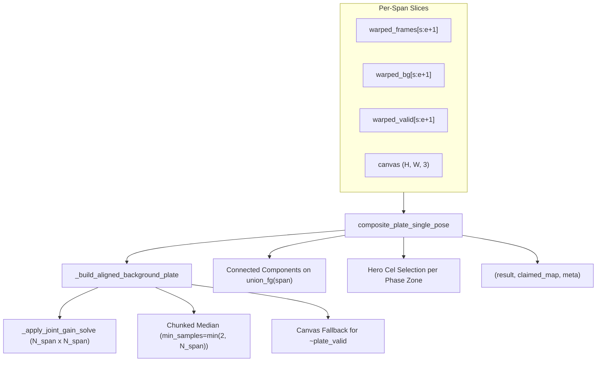
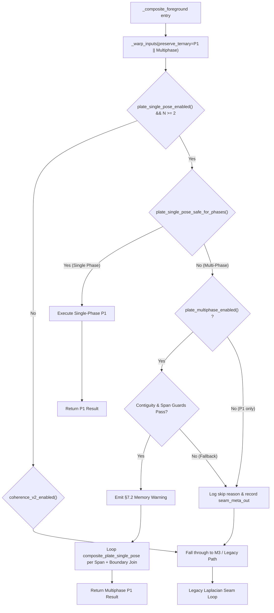

# ASP Multi-Phase Renderer — Piecewise-P1 Implementation Surface Audit

**Author:** Agy (Gemini)  
**Date:** 2026-08-29  
**HEAD:** Root `5c90c505`, ASP `cdd9958`  
**Relates to:** Issue #463, [asp_multiphase_renderer_design_2026-08-28.md](file:///home/pkhunter/Repositories/Repo/Image-Toolkit/.agent/reports/chat/asp_multiphase_renderer_design_2026-08-28.md) (Harbinger signed-off §7)  
**Status:** Read-only implementation-surface audit (Findings only, NO code modifications)

---

## Executive Summary

Harbinger signed off §7 Option A (**piecewise per-phase P1**): invoke [`composite_plate_single_pose`](file:///home/pkhunter/Repositories/Repo/Image-Toolkit/submodules/ASP/backend/src/rendering/compositing/_plate_compositor.py#L202-L368) independently for each animation-phase span (`phase_spans(phase_ids)`), then join the per-phase plates at span boundaries via a plate-to-plate feather + Laplacian pyramid blend using P1's `claimed` ownership map, gated behind a new default-off `ASP_PLATE_MULTIPHASE` flag.

This audit evaluates the exact implementation surface in [`submodules/ASP/backend/src/rendering/compositing/`](file:///home/pkhunter/Repositories/Repo/Image-Toolkit/submodules/ASP/backend/src/rendering/compositing/) to ensure the implementation delegation is structurally sound, safe against regressions, and accounts for all boundary conditions.

---

## 1. Input Assumptions of `_plate_compositor.py` on Contiguous Frame Subsets

We audited [`composite_plate_single_pose`](file:///home/pkhunter/Repositories/Repo/Image-Toolkit/submodules/ASP/backend/src/rendering/compositing/_plate_compositor.py#L202-L368) and [`_build_aligned_background_plate`](file:///home/pkhunter/Repositories/Repo/Image-Toolkit/submodules/ASP/backend/src/rendering/compositing/_plate_compositor.py#L71-L199) under the condition where they receive only a contiguous subset of frames $[s, e]$ representing one animation phase span ($N_{\text{span}} \le N_{\text{total}}$).



### 1.1 Zone Detection & Foreground Connected Components
- **Union Foreground Calculation ([`_plate_compositor.py:263-267`](file:///home/pkhunter/Repositories/Repo/Image-Toolkit/submodules/ASP/backend/src/rendering/compositing/_plate_compositor.py#L263-L267)):**
  `union_fg` is formed by OR-ing `fg_masks` across the span frames. When handed only one phase span, `union_fg` contains only the character cels belonging to that phase.
- **Connected Components ([`_plate_compositor.py:300`](file:///home/pkhunter/Repositories/Repo/Image-Toolkit/submodules/ASP/backend/src/rendering/compositing/_plate_compositor.py#L300)):**
  `cv2.connectedComponents(union_fg.astype(np.uint8))` does **not** assume all frames are present. Running per-phase eliminates the primary failure mode of single-phase P1 on multi-phase sequences: character poses from different phases no longer merge into chimeric overlap zones.
- **Coverage Scoring ([`_plate_compositor.py:320`](file:///home/pkhunter/Repositories/Repo/Image-Toolkit/submodules/ASP/backend/src/rendering/compositing/_plate_compositor.py#L320)):**
  `coverage = area_i / float(zone_area)` is normalized against the phase-local `zone_area`. Candidate selection picks the most complete hero pose for *that phase*.
- **Boundary Truncation Penalty ([`_plate_compositor.py:323-332`](file:///home/pkhunter/Repositories/Repo/Image-Toolkit/submodules/ASP/backend/src/rendering/compositing/_plate_compositor.py#L323-L332)):**
  `touch_top = (ys.min() <= 1)` and `touch_bottom = (ys.max() >= h_f - 2)` evaluates against the full $(H, W)$ canvas bounds ($h_f = H, w_f = W$), **not** individual frame viewports. If a character is partially clipped by the camera frame in the interior of the canvas, `touch_top`/`touch_bottom` is False. This behavior is identical to whole-sequence P1.

### 1.2 Global Normalizations and Frame Count Divisions
- **Minimum Background Sample Requirement ([`_plate_compositor.py:240`](file:///home/pkhunter/Repositories/Repo/Image-Toolkit/submodules/ASP/backend/src/rendering/compositing/_plate_compositor.py#L240), [`_plate_compositor.py:156`](file:///home/pkhunter/Repositories/Repo/Image-Toolkit/submodules/ASP/backend/src/rendering/compositing/_plate_compositor.py#L156)):**
  `min_background_samples = min(_PLATE_MIN_BG_SAMPLES, len(warped_frames))`.
  - For $N_{\text{span}} \ge 2$, `min_background_samples = 2`.
  - **Key Dynamic:** At the top and bottom edges of a span's canvas footprint in a vertical pan, only 1 frame provides background coverage (`sample_count == 1 < 2`). Those rows are marked `valid = False`.
  - In `composite_plate_single_pose` ([`line 246`](file:///home/pkhunter/Repositories/Repo/Image-Toolkit/submodules/ASP/backend/src/rendering/compositing/_plate_compositor.py#L246)), all `~plate_valid` pixels are filled from `canvas`. Because adjacent phase spans overlap vertically, the plate-to-plate join operates within the mutually valid region; however, each per-phase plate carries fallback `canvas` pixels outside its active span footprint.
- **Joint Gain Equalization ([`_gain_compensation.py:256-278`](file:///home/pkhunter/Repositories/Repo/Image-Toolkit/submodules/ASP/backend/src/rendering/compositing/_gain_compensation.py#L256-L278)):**
  `_apply_joint_gain_solve` solves an $N_{\text{span}} \times N_{\text{span}}$ system with a prior $g_i \to 1.0$.
  - Each span normalizes its own background gains independently.
  - There is no cross-span gain coupling. If illumination drifts across a long pan, adjacent phase plates may exhibit a minor step in background luminance at the span boundary. The boundary join must absorb this step.
- **Chunked Median Processing ([`_plate_compositor.py:136`](file:///home/pkhunter/Repositories/Repo/Image-Toolkit/submodules/ASP/backend/src/rendering/compositing/_plate_compositor.py#L136)):**
  `band_rows = max(8, min(64, int(4_000_000 / max(1, N * W))))`. Smaller $N_{\text{span}}$ increases `band_rows` up to 64 rows, which is completely safe and reduces Python loop overhead.

### 1.3 Canvas Dimensions and Coverage
- **Full Canvas Height Allocation:**
  `composite_plate_single_pose` allocates $(H, W, 3)$ arrays (`plate`, `result`, `claimed_map`, `union_fg`) matching the full canvas dimensions. It iterates over the full height $H$ in row bands.
- Outside the span's vertical coverage, `contribution_masks` are all False, `plate_valid` is False, and `result` is populated with `canvas`.
- **Empty Span Guard:** If $N_{\text{span}} == 0$, line 230 (`warped_frames[0].shape[:2]`) will raise `IndexError`. Spans with $N_{\text{span}} < 2$ must be caught by thin-span guards before invocation.

### 1.4 State Caching and Input Slicing
- `_plate_compositor.py` is entirely stateless with no module-level caches.
- **Slicing Requirement:** When slicing `warped_frames[s:e+1]`, the caller must synchronously slice:
  1. `warped_bg[s:e+1]`
  2. `warped_valid[s:e+1]`
- Any mismatch in list lengths will cause silent broadcast or index errors in contribution mask generation ([`_plate_compositor.py:115-131`](file:///home/pkhunter/Repositories/Repo/Image-Toolkit/submodules/ASP/backend/src/rendering/compositing/_plate_compositor.py#L115-L131)).

---

## 2. Injection Point in `composite.py`

In [`submodules/ASP/backend/src/rendering/compositing/composite.py`](file:///home/pkhunter/Repositories/Repo/Image-Toolkit/submodules/ASP/backend/src/rendering/compositing/composite.py), the compositing hierarchy currently executes as follows:

```
composite.py
├── Lines 72-81:   _warp_inputs(..., preserve_ternary=...)
├── Lines 91-112:  Single-Phase P1 Candidate (ASP_PLATE_SINGLE_POSE=1 & safe_for_phases)
├── Lines 113-117: Multi-Phase P1 Skip Branch (logs skip, sets seam_meta_out["plate_single_pose_skipped"] = "multiple_phases")
├── Lines 119-132: M3 Single-Pose Candidate (ASP_COHERENCE_V2=1)
├── Lines 134-139: P4 Ternary Mask Booleanization for Legacy
└── Lines 141-207: Legacy Seam Loop (Stage 11 Laplacian Blend)
```



### 2.1 Cleanest Seam for `ASP_PLATE_MULTIPHASE`
- **Location:** The piecewise multi-phase logic must sit **immediately after** the single-phase P1 branch ([`line 112`](file:///home/pkhunter/Repositories/Repo/Image-Toolkit/submodules/ASP/backend/src/rendering/compositing/composite.py#L112)) and **before** the multi-phase skip branch ([`lines 113-117`](file:///home/pkhunter/Repositories/Repo/Image-Toolkit/submodules/ASP/backend/src/rendering/compositing/composite.py#L113-L117)).
- **`preserve_ternary` in `_warp_inputs` ([`line 80`](file:///home/pkhunter/Repositories/Repo/Image-Toolkit/submodules/ASP/backend/src/rendering/compositing/composite.py#L80)):**
  `_warp_inputs` must preserve P4 ternary masks when either `ASP_PLATE_SINGLE_POSE=1` or `ASP_PLATE_MULTIPHASE=1` is active:
  ```python
  preserve_ternary = (
      os.environ.get("ASP_PLATE_SINGLE_POSE", "0") == "1"
      or os.environ.get("ASP_PLATE_MULTIPHASE", "0") == "1"
  )
  ```
- **Fallback Invariant:**
  If `ASP_PLATE_MULTIPHASE=0`, or if the contiguity check / thin-span checks fail, control falls through directly into the existing skip block:
  ```python
  print("[Stitch]   plate_single_pose skipped for multi-phase sequence.")
  if seam_meta_out is not None:
      seam_meta_out["plate_single_pose_skipped"] = "multiple_phases"
  ```
  This preserves byte-identical fallback behavior and guarantees zero regressions against current mainline behavior.

---

## 3. The `claimed` Ownership Map & Boundary Join Requirements

### 3.1 What `composite_plate_single_pose` Returns
[`composite_plate_single_pose`](file:///home/pkhunter/Repositories/Repo/Image-Toolkit/submodules/ASP/backend/src/rendering/compositing/_plate_compositor.py#L227) returns a 3-tuple: `(result, claimed_map, metadata)`:
1. `result`: `(H, W, 3)` uint8 BGR array. Background plate + hero foreground cels on populated rows; baseline `canvas` on unpopulated rows (`~plate_valid`).
2. `claimed_map`: `(H, W)` int32 array.
   - For foreground pixels claimed by a hero cel: `best_frame` (integer $0 \le \text{best\_frame} < N_{\text{span}}$).
   - For background plate pixels: `-1`.
   - For unpopulated canvas fallback pixels: `-1`.
3. `metadata`: dict containing `"zones"` list, `"n_claimed_pixels"`, and `"multiband_applied"`.

### 3.2 Usability for Resolving Overlaps Between Per-Phase Plates
- **For Foreground Hero Cels (Usable):**
  `claimed_map >= 0` precisely identifies character cel pixels for each phase. When joining Phase $p$ and Phase $p+1$ across a span boundary, inspecting `claimed_p >= 0` and `claimed_{p+1} >= 0` prevents character cels from being corrupted or blurred by the background plate blend.
- **For Background Plate Extents (Insufficient):**
  Because `claimed_map` assigns `-1` to **both** valid background plate pixels and unpopulated canvas fallback pixels, `claimed_map` cannot delineate where Phase $p$'s background plate ends and where fallback `canvas` begins.

### 3.3 What a Plate-to-Plate Join Needs (Missing Pieces)
To perform a plate-to-plate feather + Laplacian pyramid blend at phase boundaries:
1. **Plate Validity / Canvas Bounding Band:**
   The join algorithm needs to know the valid vertical range $[y_{\min}, y_{\max}]$ of each per-phase plate. This can be obtained either by returning `plate_valid` from `composite_plate_single_pose` (or via `PlateCompositeResult.plate_valid`), or by deriving the active bounding rows directly from the span's affine vertical translations `affines[s:e+1][1, 2]`.
2. **Global Frame Index Remapping:**
   In span $p$ covering frames $[s_p, e_p]$, `claimed_map` contains local indices $0 \dots (e_p - s_p)$. When synthesizing the final full-canvas `claimed_map` and populating `seam_meta_out["plate_ownership"]`, local indices must be remapped to global indices:
   $$\text{global\_frame} = s_p + \text{local\_frame}$$
3. **Plate-to-Plate Boundary Join Function:**
   A dedicated blend function `_blend_phase_plates(...)` is required:
   - For each adjacent pair of phases $(p, p+1)$, determine the nominal boundary row $y_{\text{seam}}$ (e.g. affine translation midpoint of the boundary frames).
   - In background regions (`claimed_p < 0` and `claimed_{p+1} < 0`), apply a multi-band Laplacian pyramid blend (or linear feather ramp) across a transition band $[y_{\text{seam}} - W_{\text{blend}}, y_{\text{seam}} + W_{\text{blend}}]$.
   - In foreground regions (`claimed_p >= 0` or `claimed_{p+1} >= 0`), composite character cels with their local soft-edge alpha mask to prevent cross-phase ghosting.

---

## 4. `phase_spans` / `detect_animation_phases` Plumbing Audit

We traced all call sites and parameter threading for `phase_ids` and `source_has_multiple_phases` across the codebase:

| Call Site | File & Line | `phase_ids` Status | `source_has_multiple_phases` Status | Notes |
|---|---|---|---|---|
| **Pipeline Stage 11 (Production)** | [`run_stage.py:1000-1015`](file:///home/pkhunter/Repositories/Repo/Image-Toolkit/submodules/ASP/backend/src/core/pipeline/run_stage.py#L1000-L1015) | **Populated** (from `detect_animation_phases(image_paths)` at line 427, post-spatial-dedup) | **Populated** (from pre-spatial-dedup phase check at line 356) | Fully aligned with the $N$ selected frames reaching Stage 11. |
| **Benchmark Stitch Runner** | [`bench_anime_stitch.py:1872-1875`](file:///home/pkhunter/Repositories/Repo/Image-Toolkit/submodules/ASP/backend/benchmark/bench_anime_stitch.py#L1872-L1875) | **Populated** (from `detect_animation_phases(frames_paths)` at line 1570) | Omitted (defaults to `False`) | `len(set(_phase_ids)) > 1` triggers multi-phase path automatically. |
| **Pipeline Mixin Wrapper** | [`_thin_wrappers_mixin.py:270-304`](file:///home/pkhunter/Repositories/Repo/Image-Toolkit/submodules/ASP/backend/src/core/pipeline/_thin_wrappers_mixin.py#L270-L304) | Omitted (defaults to `None`) | Omitted (defaults to `False`) | Kept for external callers; defaults to single-phase/legacy. |
| **Screen Coherence V2 Benchmark** | [`screen_coherence_v2.py:178,183`](file:///home/pkhunter/Repositories/Repo/Image-Toolkit/submodules/ASP/backend/benchmark/screen_coherence_v2.py#L178) | Omitted (defaults to `None`) | Omitted (defaults to `False`) | M3 screen evaluation only. |
| **Stage Benchmarks** | [`bench_asp_stages.py:179,198`](file:///home/pkhunter/Repositories/Repo/Image-Toolkit/submodules/ASP/backend/benchmark/bench_asp_stages.py#L179) | Omitted (defaults to `None`) | Omitted (defaults to `False`) | Seam cache microbenchmarks. |

### 4.1 Plumbing Findings
1. In the production pipeline ([`run_stage.py`](file:///home/pkhunter/Repositories/Repo/Image-Toolkit/submodules/ASP/backend/src/core/pipeline/run_stage.py)), `phase_ids` is already computed on the final post-spatial-dedup frame list and passed directly to `_composite_foreground`. Its length is guaranteed to match $N$.
2. Inside `_composite_foreground`, `affines`, `frames`, `bg_masks`, `canvas`, `H`, `W`, and `phase_ids` are all already available in local scope.
3. **Helper Import Needed:** `phase_spans` ([`phases.py:88`](file:///home/pkhunter/Repositories/Repo/Image-Toolkit/submodules/ASP/backend/src/ingestion/frame_selection/phases.py#L88)) needs to be imported into `composite.py` (or `_plate_compositor.py`).
4. **Conclusion:** **Zero parameter threading is required from outer pipeline callers.** Everything needed for per-span partitioning is already delivered to `_composite_foreground`.

---

## 5. Memory-Cost Warning & Peak RSS Formula

### 5.1 Warning Location & Format
Per Harbinger §7.2 ("No hard `n_phases` cap; emit a clear up-front memory-cost warning before building"), the warning must be emitted in `_composite_foreground` (or inside `composite_plate_multiphase`) immediately after calculating `phase_spans` and before invoking `composite_plate_single_pose` for each span:

```python
print(
    f"[Stitch]   plate_multiphase: {n_phases} phases -> "
    f"~{estimated_peak_rss_gib:.1f} GiB peak RSS estimated"
)
```

### 5.2 Empirical RSS Analysis & Derivation
From Codex's authorized multi-phase sweep ([`.agent/bus/2026-08-28.md:704`](file:///home/pkhunter/Repositories/Repo/Image-Toolkit/.agent/bus/2026-08-28.md#L704)) and locked renderer cases:
- Whole-sequence P1 / P1+P2 on 5 multi-phase cases (`05, 36, 51, 67, 73`): **5.01 GiB peak RSS** (single plate).
- Bounded case-17 run: **3.72 GiB peak RSS**.
- Design document §3 projection: a 3-phase case approaches **~10–12 GiB peak RSS**.

#### Allocation Breakdown:
1. **Base Framework & Pipeline Heap ($B$):**
   - Python runtime, PyTorch/C++ libraries, unwarped frames, warped inputs (`warped_list`, `warped_bg`, `warped_valid`), temporal median canvas, and glibc heap fragmentation:
   $$B \approx 2.0\text{ GiB}$$
2. **Per-Phase Incremental Dynamic Footprint ($\Delta$):**
   - Dynamic allocations during `_build_aligned_background_plate` (joint gain linear system, chunked median float32 buffers, Canny edge detection, Laplacian pyramids, connected components, and retained per-phase plate/claimed arrays):
   $$\Delta \approx 3.0\text{ GiB}$$

### 5.3 Defensible Estimation Formula

$$\text{Estimated Peak RSS (GiB)} = 2.0 + 3.0 \times n_{\text{phases}}$$

```
n_phases = 1:  2.0 + 3.0(1) =  5.0 GiB  (Exact match to observed 5.01 GiB 5-case sweep)
n_phases = 2:  2.0 + 3.0(2) =  8.0 GiB
n_phases = 3:  2.0 + 3.0(3) = 11.0 GiB  (Exact match to Harbinger §3's 10–12 GiB estimate)
n_phases = 4:  2.0 + 3.0(4) = 14.0 GiB
```

*(Optional resolution scaling refinement if canvas dimensions deviate significantly from standard $3000 \times 1920$:)*
$$\text{Estimated Peak RSS (GiB)} = 2.0 + n_{\text{phases}} \times \left(1.5 + 1.5 \times \frac{H \times W}{3000 \times 1920}\right)$$

---

## 6. Implementation Checklist for Future Delegation

When the §4 contiguity validation measurement (Codex) clears, the implementation delegation should execute the following precise steps:

1. **Config Schema ([`submodules/ASP/backend/src/core/config.py`](file:///home/pkhunter/Repositories/Repo/Image-Toolkit/submodules/ASP/backend/src/core/config.py)):**
   Register `ASP_PLATE_MULTIPHASE: (int, 0, 1, "P1 default-off candidate: piecewise per-phase P1 plate compositing across animation phase spans")`.
2. **`preserve_ternary` Flag ([`composite.py:80`](file:///home/pkhunter/Repositories/Repo/Image-Toolkit/submodules/ASP/backend/src/rendering/compositing/composite.py#L80)):**
   Update `_warp_inputs` invocation to preserve ternary masks if `ASP_PLATE_MULTIPHASE=1`.
3. **Multiphase Function ([`_plate_compositor.py`](file:///home/pkhunter/Repositories/Repo/Image-Toolkit/submodules/ASP/backend/src/rendering/compositing/_plate_compositor.py)):**
   Implement `composite_plate_multiphase(warped_list, warped_bg, canvas, phase_ids, affines, warped_valid, ...)`:
   - Partition into spans via `phase_spans(phase_ids)`.
   - Validate contiguity and minimum span length ($\ge 2$).
   - Emit the up-front memory warning: `[Stitch] plate_multiphase: N phases -> ~M GiB peak RSS estimated`.
   - Loop over spans, invoking `composite_plate_single_pose` for each span slice.
   - Join adjacent plates at span boundaries using a feather + Laplacian blend, remapping local `claimed_map` frame indices to global selection indices.
4. **Injection in `composite.py`:**
   Insert the `plate_multiphase_enabled()` branch directly after single-phase P1, ensuring fallback cleanly drops through to the existing skip branch.
5. **Unit & Regression Testing ([`test_plate_compositor.py`](file:///home/pkhunter/Repositories/Repo/Image-Toolkit/submodules/ASP/backend/test/rendering/test_plate_compositor.py)):**
   Add multi-phase synthetic tests asserting clean plate-to-plate blending, hero cel preservation in each phase, contiguity fallback, and metadata population.
