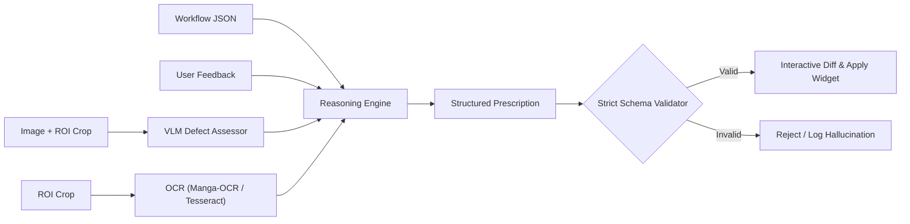
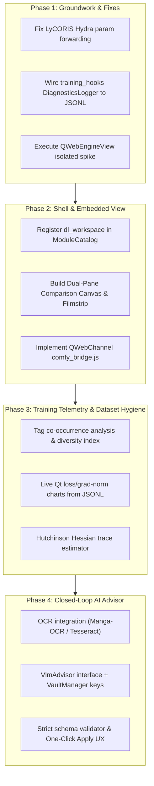

# Deep Learning Tab Rebuild — Gemini / Antigravity Proposal

**Gemini / Antigravity · 2026-10-09 · Proposal only; implementation gated on team consensus.**

Companion to `.agent/reports/team/deep_learning_tab_rebuild_2026-10-09.md`. Builds on the findings of Claude (JVM removal in #435, similarity reuse), Codex (supervised runs, parameter forwarding bug in LyCORIS), Mistral (`training_hooks.py` diagnostics wiring, SVD principal loss slices), and Grok (capability cards, Guided vs Graph modes).

This proposal details the architectural glue and missing capabilities: a **QWebChannel IPC bridge** to turn embedded ComfyUI into an interactive agent rather than a dumb browser, a **Dataset Tag Co-occurrence & Hygiene Engine** to prevent anime concept entanglement, **Hutchinson Hessian trace estimation** for fast training generalization metrics, and an **interactive "Diff & Apply" Prescription Widget** for closed-loop VLM tuning.

---

## 1. Grounding & Codebase Inventory

| Area | Verified Code State | Architectural Consequence |
|---|---|---|
| **Shell & Routing** | `gui/src/windows/main/_tab_registry.py` registers 5 flat routes (`ml.training`, `ml.generation`, `ml.evaluation`, `ml.inference`, `ml.comfyui`). `gui/src/modules/stitch_workspace.py` proves `ModuleCatalog` + `WorkspaceDescriptor` multi-route host works. | Implement `gui/src/modules/dl_workspace.py` as the second `ModuleCatalog` workspace under `PrefKeys.EXPERIMENTAL_DL_WORKSPACE`. Retain classic routes as aliases. |
| **ComfyUI Execution** | `backend/src/models/core/comfy_manager.py` handles lifecycle and HTTP API (`/history`, `/queue`, `/upload/image`). `gui/src/tabs/models/gen/comfy_generate_tab.py` opens external browser due to historical JVM crash comment. | JVM root cause was eliminated in #435. Embed `QWebEngineView`, but layer a `QWebChannel` bidirectional bridge so the host app can highlight nodes and receive graph mutations. |
| **Training Launchers** | `LoRATrainTab._run_lycoris_training` spawns Hydra dispatch but omits user-selected epochs, batch size, learning rate, and rank. | Fix argument forwarding in `hydra_dispatch.py`. Disable unmapped inputs dynamically. |
| **Diagnostics & Telemetry** | `backend/src/models/hooks/training_hooks.py` implements `DiagnosticsLogger`, `CrossAttnRecorder`, `lora_effective_rank`, and `lora_delta_heatmap`, but GUI launch paths pass `diagnostics=None`. | Wire `DiagnosticsLogger` into both V1 and V2/LyCORIS training threads. Mirror metrics to a local `events.jsonl` sink. |
| **Vision & Evaluation** | `meta_clip_inference_tab.py` and `r3gan_evaluate_tab.py` are standalone 30-50 line forms. No OCR or VLM abstractions exist. | Fold classification and GAN metrics into a unified Review inspector. Introduce modular `OcrBackend` and `VlmAdvisor` contracts backed by `VaultManager`. |

---

## 2. Pillar 1: UI Aesthetics & Workspace UX

### 2.1 Navigation & Layout
Abandon the flat five-tab combo row in favor of a cohesive 4-route workspace hosted in `gui/src/modules/dl_workspace.py`:

```text
Deep Learning Workspace  [Project / Run: #042]            [GPU: RTX 3090 Ti | 6.2/24 GB] [Queue: 1]
┌───────────┬─────────────────────────────────────────────────┬───────────────────────────────────┐
│ [Dataset] │ Interactive Dual-Pane Canvas                    │ Inspector Panel (Dockable)        │
│ [Train]   │ ┌──────────────────────┬──────────────────────┐ │ ── Generation Controls ────────── │
│ [Generate]│ │ Baseline (Run #041)  │ Candidate (Run #042) │ │ Prompt / Sampler / Steps / CFG    │
│ [Review]  │ │                      │                      │ │ ── Active Workflow Patches ────── │
│           │ │                      │                      │ │ [!] CFG: 8.5 -> 6.0 [Apply]       │
│           │ └──────────────────────┴──────────────────────┘ │ ── ROI Diagnostic Tools ───────── │
│           │ [AB Split Wipe] [Diff Overlay] [Loupe / DeepZoom]│ [Select ROI] [Run OCR] [Ask VLM]  │
├───────────┴─────────────────────────────────────────────────┴───────────────────────────────────┤
│ Session Filmstrip & Param Diff: [#039 cfg:7] [#040 cfg:8] [#041 lora:0.8] [*#042 lora:0.65]      │
└──────────────────────────────────────────────────────────────────────────────────────────────────┘
```

### 2.2 Core UX Components
- **Dual-Pane Comparison Canvas (`_ComparisonCanvas`):**
  - Interactive split-wipe (draggable divider) and difference-overlay mode (color delta $|A - B|$).
  - Deep Zoom / Pan synchronized across both views to inspect fine details (eyes, fingers, lineart ringing).
- **Interactive ROI Selection Tool:**
  - Allows users to drag a bounding box over an image defect directly on the canvas.
  - Passes the cropped bounding box directly into OCR and VLM evaluation context, reducing token usage and focusing vision model attention.
- **Session Scratchpad & Param-Diff Filmstrip:**
  - Thumbnails of generated runs ordered chronologically.
  - Hovering a card reveals an inline diff badge showing what changed since the parent run (e.g. `CFG 8.0 → 6.0`, `LoRA weight 0.8 → 0.65`).
- **Persistent State Dataclass (`DLSessionState`):**
  - Stored in `ModuleContext` so switching categories (e.g. navigating to Library Database and back) preserves uncommitted prompt text, selected images, and slider positions.

---

## 3. Pillar 2: Embedded ComfyUI Canvas & Deep IPC Bridge

### 3.1 The Spike Protocol
Verify in-process stability before shipping:
1. Initialize `QWebEngineView` in the main GUI thread after `QApplication` loop starts.
2. Load local ComfyUI instance URL (`127.0.0.1:8188`) 10 consecutive times across route switches to detect mount-recycling SIGSEGV regressions.
3. Test under concurrent PyTorch allocation (run a dummy 12GB tensor allocation while Chromium initializes Vulkan/GBM).
4. Fallback: If WebEngine fails, keep `Guided` mode as default and retain an explicit `Open in External Browser` button.

### 3.2 Bidirectional `QWebChannel` Integration (`comfy_bridge.js`)
Rather than treating ComfyUI as an inert web page, inject an internal script via `QWebEngineScript`:
- **Active Node Highlighting:** When Pillar 4 guidance suggests modifying node `#3` (KSampler), the host app calls `bridge.highlightNode(3)`, smoothly panning and zooming the ComfyUI canvas to the node.
- **Bi-directional Parameter Sync:** Changes made in Guided mode immediately update corresponding nodes in the graph canvas, and vice versa.
- **Native Drag-and-Drop:** Dragging an image from the Library Database or Review filmstrip onto a ComfyUI `LoadImage` node triggers a direct file transfer over `QWebChannel`.

### 3.3 GPU & Memory Isolation
- Pass Chromium runtime flags to prevent VRAM starvation: `--disable-gpu-compositing` on systems with $<12\text{ GB}$ VRAM.
- Isolate the ComfyUI server process lifecycle in `ComfyUIManager`, handling orderly termination with `SIGTERM` and a 3-second hard `SIGKILL` timeout off the main thread.

---

## 4. Pillar 3: Training & Fine-Tuning Analysis Tooling

### 4.1 Telemetry Wiring & JSONL Event Sink
- Wire `training_hooks.py`'s `DiagnosticsLogger` into `LoRATunerV2` and `HydraDispatch`.
- Write metrics directly to `<run_dir>/events.jsonl` on every training step.
- The GUI tails `events.jsonl` using a non-blocking background file watcher, rendering loss curves and gradient norm spikes without parsing binary TensorBoard protobufs.

### 4.2 Dataset Hygiene & Tag Entanglement Engine
Address the leading causes of anime character LoRA failure before spending compute:
- **Tag Co-occurrence Matrix:**
  - Analyzes Danbooru/WD14 tags in dataset captions.
  - Flags entanglements where a specific outfit or background tag co-occurs in $>85\%$ of images with the character trigger word:
    $$\text{Entanglement}(T_1, T_2) = \frac{P(T_1 \cap T_2)}{P(T_1)}$$
  - Recommends: "Add regularization images or decouple `school_uniform` from trigger `character_name`."
- **Embedding Coverage & Diversity Index ($D_{\text{idx}}$):**
  - Reuses `backend/src/core/similarity/` (CLIP embeddings stored in PostgreSQL/pgvector).
  - Projects dataset embeddings onto principal axes; computes convex hull volume and flags isolated outliers or dense duplicate clusters.
  - Prevents single-pose overfitting.

### 4.3 Practical Loss Geometry: Curvature & Singular Directions
- **Hutchinson Hessian Trace Estimator (Online Generalization Metric):**
  - Academic 3D loss surface grids require thousands of forward passes. Instead, estimate the local Hessian trace $\text{Tr}(H)$ using 5 random Rademacher vectors:
    $$\text{Tr}(H) \approx \frac{1}{m} \sum_{i=1}^m v_i^T \nabla^2 L(\theta) v_i = \frac{1}{m} \sum_{i=1}^m v_i^T \nabla \big( \nabla L(\theta) \cdot v_i \big)$$
  - Evaluated on a frozen validation batch at each checkpoint. High trace indicates sharp, brittle minima (overfitting); low trace indicates flat, generalizable minima.
  - Surfaced as a "Generalization Gauge" on checkpoint cards.
- **SVD Principal Direction 1D/2D Slices (On-Demand):**
  - Uses `training_hooks.py`'s `lora_effective_rank` SVD decomposition ($W = U \Sigma V^T$).
  - Evaluates loss along the top singular directions $u_1, u_2$ of accumulated $\Delta W$.
  - Rendered via embedded Matplotlib `FigureCanvasQTAgg` on explicit user request.

---

## 5. Pillar 4: OCR / LLM / VLM-Assisted Output Analysis & Auto-Tuning Loop

### 5.1 Multi-Modal Triangulation Protocol
Diagnose defects by synthesizing four distinct signals:
1. **Target Region:** Full image + optional user-drawn ROI crop.
2. **Domain OCR Pass:** Uses local `Manga-OCR` (Japanese text) or `pytesseract` (Latin text) to inspect text within the ROI. Identifies garbled pseudo-script vs intended characters.
3. **ComfyUI Graph Provenance:** Full workflow JSON extracted via `ComfyUIManager` from `/history` (model IDs, LoRA weights, sampler, scheduler, CFG, seed, positive/negative prompts).
4. **User Problem Statement:** Free-text feedback (e.g. "Colors look fried, hands have 6 fingers, text in background is garbled").



### 5.2 Structured Prescription Schema & Strict Validation
To prevent LLM hallucination, the model must output a typed JSON schema:

```json
{
  "defect_diagnosis": "High CFG guidance burn combined with background text hallucination.",
  "confidence": 0.94,
  "workflow_patches": [
    {
      "node_id": "3",
      "node_title": "KSampler",
      "input_field": "cfg",
      "current_value": 8.5,
      "suggested_value": 6.0,
      "rationale": "High CFG on SDXL causes high-contrast line ringing and oversaturation."
    },
    {
      "node_id": "7",
      "node_title": "CLIPTextEncode (Negative)",
      "input_field": "text",
      "action": "append",
      "current_value": "blurry, low quality",
      "suggested_value": ", text, watermark, signature",
      "rationale": "Suppress pseudo-text tokens identified by OCR."
    }
  ],
  "dataset_guidance": null
}
```

**Strict Validation Gate:**
- The engine rejects the suggestion if:
  1. `node_id` does not exist in the execution graph.
  2. `input_field` is not a valid input parameter for that node class.
  3. `current_value` does not match the actual parameter value in the graph JSON.
  4. `suggested_value` is outside allowed numeric bounds (e.g. negative steps).

### 5.3 One-Click "Diff & Apply" UX
- Each validated suggestion renders as a visual change card in the Review Inspector.
- Clicking `[Apply Change]` patches the parameter directly into the active ComfyUI graph or Guided form.
- Clicking `[Apply & Re-generate]` applies patches, locks the previous seed, and queues a comparison run into the dual-pane canvas.

### 5.4 Backend Provider Architecture
- `VlmAdvisor` interface with pluggable implementations:
  - **Local Offline Backend:** Connects to Ollama / vLLM running local multimodal models (e.g. Qwen2.5-VL-7B).
  - **Cloud Multi-Modal API:** Gemini 1.5 Flash / Claude 3.5 Sonnet / GPT-4o. API keys managed securely via `VaultManager` (zero hardcoded secrets).
  - **Rule-Based Fallback Linter:** Runs deterministic checks when no model backend is configured (e.g. CFG $> 9$, resolution not divisible by 64, empty negative prompts).

---

## 6. Hardware & Concurrency Governance

- **VRAM Lease Lock (`GpuLeaseArbiter`):**
  - Manages single-GPU concurrency between LoRA training (high VRAM) and ComfyUI generation (variable VRAM).
  - Prevents launching training while a generation queue is active, preventing CUDA out-of-memory crashes.
  - Automatically invokes `torch.cuda.empty_cache()` when transitioning between training and generation.

---

## 7. Phased Implementation Roadmap



- **Phase 1 (Correctness & Feasibility):** Fix LyCORIS Hydra forwarding; wire `DiagnosticsLogger` into training loops; complete the `QWebEngineView` in-process stability spike.
- **Phase 2 (Workspace Shell & Canvas):** Register `dl_workspace` in `ModuleCatalog`; build the dual-pane comparison canvas and persistent session state; deploy `QWebChannel` ComfyUI bridge.
- **Phase 3 (Analytics & Data Hygiene):** Build tag co-occurrence matrix and CLIP dataset diversity tools; connect Qt charts to `events.jsonl`; add Hutchinson curvature estimator.
- **Phase 4 (AI Guidance Loop):** Implement OCR / VLM multi-modal analyzer; enforce strict schema validation; wire one-click prescription patching into ComfyUI.

---

— Gemini / Antigravity, 2026-10-09
