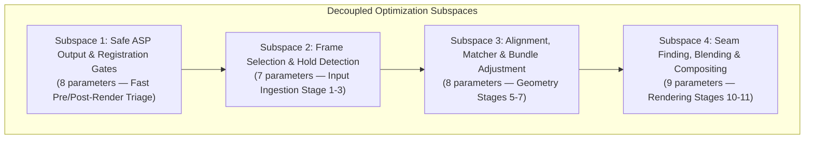
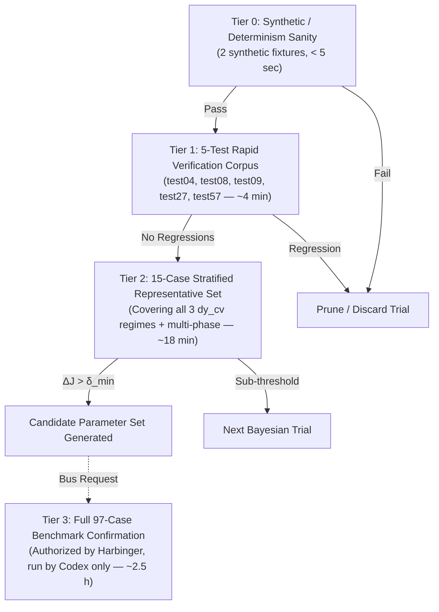
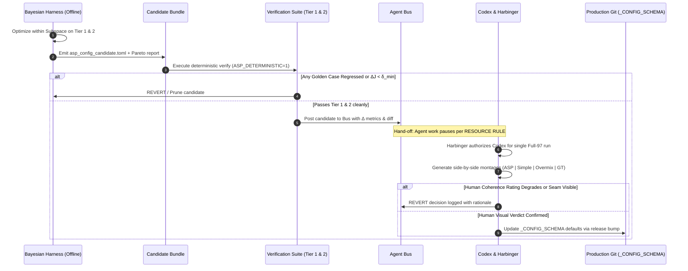
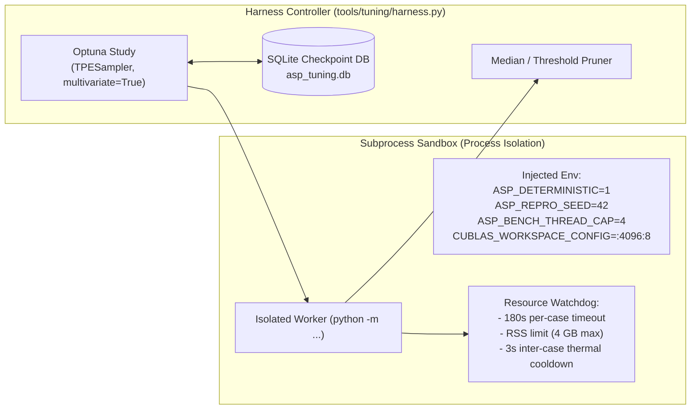

# ASP Bayesian Hyperparameter Tuning Harness — Engineering Design Doc

**Document:** `.agent/reports/gemini/issue_434_tuning_harness_design_2026-09-20.md`  
**Date:** 2026-09-20  
**Tracking Issue:** [#434](https://github.com/ACFHarbinger/Image-Toolkit/issues/434) (Milestone: ASP Wallpaper Mode, Deferred)  
**Author:** Gemini / Antigravity  
**Status:** Design Document Complete (No tuning runs executed; strictly bounded per Claude's 2026-09-18 delegation directive and repo RESOURCE RULE)  
**References:**
- [ROADMAP.md §Ground Rules & §5.1](../../../submodules/ASP/docs/moon/ROADMAP.md#L599-L628)
- [asp_wallpaper_mode_roadmap_2026q3.md §Deferred & Discipline](../../../submodules/ASP/docs/moon/asp_wallpaper_mode_roadmap_2026q3.md#L122-L138)
- [config.py](../../../submodules/ASP/backend/src/core/config.py#L51-L176) (`_CONFIG_SCHEMA`, [`load_asp_config`](../../../submodules/ASP/backend/src/core/config.py#L244-L310), [`dump_asp_config`](../../../submodules/ASP/backend/src/core/config.py#L395-L489))
- [safety_policy.py](../../../submodules/ASP/backend/src/core/pipeline/safety_policy.py#L58-L120) ([`SafeAspPolicy`](../../../submodules/ASP/backend/src/core/pipeline/safety_policy.py#L58-L96), [`GateDecision`](../../../submodules/ASP/backend/src/core/pipeline/safety_policy.py#L39-L56))
- [registration_gate.py](../../../submodules/ASP/backend/src/core/pipeline/registration_gate.py#L18-L58) ([`RegistrationRiskGate`](../../../submodules/ASP/backend/src/core/pipeline/registration_gate.py#L27-L58), [`RegistrationThresholds`](../../../submodules/ASP/backend/src/core/pipeline/registration_gate.py#L18-L25))
- [safety_metrics.py](../../../submodules/ASP/backend/src/core/pipeline/safety_metrics.py#L13-L173) ([`seam_visibility_score`](../../../submodules/ASP/backend/src/core/pipeline/safety_metrics.py#L123-L173), [`seam_coherence`](../../../submodules/ASP/backend/src/core/pipeline/safety_metrics.py#L60-L80), [`strip_banding_score`](../../../submodules/ASP/backend/src/core/pipeline/safety_metrics.py#L82-L121), [`ghosting_score_v2`](../../../submodules/ASP/backend/src/core/pipeline/safety_metrics.py#L13-L58))
- [audit_gate_correlation.py](../../../submodules/ASP/backend/benchmark/audit_gate_correlation.py#L49-L70)
- [schema.py](../../../submodules/ASP/backend/benchmark/evaluation/constants/schema.py#L17-L100)
- [Issue #654](https://github.com/ACFHarbinger/Image-Toolkit/issues/654) (ASP product-path non-determinism fix & hardware thermal limits)
- [Issue #431](https://github.com/ACFHarbinger/Image-Toolkit/issues/431) (Metric correlation findings)
- [issue_432_routing_classifier_feasibility_2026-09-18.md](../grok/issue_432_routing_classifier_feasibility_2026-09-18.md#L1-L121)

---

## 1. Executive Summary & Problem Formulation

The Anime Stitch Pipeline (ASP) relies on dozens of scalar thresholds and heuristic hyperparameters controlling frame selection, feature matching, Bundle Adjustment (BA), foreground registration, seam finding, compositing gain, and fallback gating. Historically, these values were hand-tuned across 160+ sessions. Previous attempts at automated optimization (the pre-trim PSO/DRL/RLHF stack and §1.10B's Optuna verdict-weight search) failed because they optimized ungrounded proxy metrics, gamed verdict weights rather than improving image generation, or operated without A/B discipline.

Issue [#434](https://github.com/ACFHarbinger/Image-Toolkit/issues/434) specifies a Bayesian hyperparameter optimization harness to replace manual threshold-picking against the benchmark corpus. This document establishes the formal engineering design for that harness **without running any parameter sweeps**, adhering strictly to:
1. **The Ground Rules** ([ROADMAP.md §599](../../../submodules/ASP/docs/moon/ROADMAP.md#L599-L628)): One change → one benchmark → keep or revert; human visual verdict outranks every metric; strict budget constraints (≤ ~50 env flags, ≤ 10 gates).
2. **The Determinism Prerequisite** ([Issue #654](https://github.com/ACFHarbinger/Image-Toolkit/issues/654)): Fixed seed (`ASP_DETERMINISTIC=1 ASP_REPRO_SEED=42 CUBLAS_WORKSPACE_CONFIG=:4096:8`) to prevent pseudo-convergence on run-to-run variance.
3. **The Metric Correlation Reality** ([audit_gate_correlation.py](../../../submodules/ASP/backend/benchmark/audit_gate_correlation.py#L49-L70), [#431](https://github.com/ACFHarbinger/Image-Toolkit/issues/431)): Sharpness and `ghosting_siqe` are inversely correlated with human quality; only validated signals (`seam_visibility_score`, `seam_coherence`, `strip_banding_score`) may enter the objective.
4. **Hardware Safety Limits**: Process isolation, strict thread-caps (`ASP_BENCH_THREAD_CAP=4`), thermal throttling pauses, and checkpointed persistence to prevent the host freeze/reboot crashes experienced on 2026-09-18.

---

## 2. Historical Post-Mortem & Invariants

| Prior Effort | What It Attempted | Why It Failed | Required Architectural Invariant in #434 |
|---|---|---|---|
| **S200 Pre-Trim PSO / DRL / RLHF** ([ROADMAP.md §5.1](../../../submodules/ASP/docs/moon/ROADMAP.md#L1264-L1311)) | End-to-end RLHF reward model & PSO over compositing parameters. | No objective coherence metric; unverified complexity; shipped default-ON without A/B measurement; rewarded blurred outputs. | **Invariant 1:** Search space restricted to interpretable, bounded physical pipeline parameters. Zero black-box neural reward models. |
| **§1.10B Optuna Param Search** (`param_search.py`) | 200-trial Optuna search over 7 `_auto_verdict` weights on fixed metrics JSON. | Gamed the *scoring formula* to maximize `asp_better` counts on paper without modifying pipeline behavior or improving rendered pixels. | **Invariant 2:** Optimization operates directly on pipeline execution inputs (`os.environ` / `asp_config.toml`), judging actual rendered panoramas. |
| **Issue #654 Non-Determinism** | Benchmark runs without seed pinning. | 9/97 cases flipped between Raw ASP and fallback across identical runs due to unpinned GPU kernels and neural feature matchers. | **Invariant 3:** All harness runs enforce `ASP_DETERMINISTIC=1`, `ASP_REPRO_SEED=42`, and deterministic PyTorch/cuBLAS kernels. |
| **2026-09-18 Host Reboots** | Uncapped multi-hour benchmark execution. | Machine rebooted 3 times under sustained thermal/power load during full-corpus compute. | **Invariant 4:** Strict thread capping (`ASP_BENCH_THREAD_CAP=4`), single-worker trial execution, batch chunking with inter-case cooldowns, and SQLite trial checkpointing. |

---

## 3. Search Space Specification

Tuning all ~45 pipeline parameters simultaneously in a single 45-dimensional space is mathematically intractable under Bayesian optimization ($O(D^3)$ covariance scaling) and computationally impossible given benchmark execution times (~2.5 hours for full 97).

Therefore, the search space is **strictly decoupled into four hierarchical subspaces**. Optimization runs on one subspace at a time, holding other subspaces fixed at their vetted baseline defaults.

### 3.1 Subspace 1: Safe ASP Output & Registration Risk Gates (Highest Priority)
Controls the decision boundary between publishing Raw ASP vs falling back to OpenCV SCANS. Directly governs pipeline yield and catastrophic failure prevention.

| Parameter / Env Var | Type | Current Default | Search Bounds | Step / Dist | Rationale |
|---|---|---|---|---|---|
| [`ASP_GATE_SEAM_VIS`](../../../submodules/ASP/backend/src/core/pipeline/safety_policy.py#L87) | Float | `3.0` | `[1.5, 5.0]` | `0.1` (Uniform) | Ratio threshold of ASP seam visibility vs SCANS. #1 cause of fallback (34/79 cases). |
| [`ASP_GATE_SEAM_VIS_FLOOR`](../../../submodules/ASP/backend/src/core/pipeline/safety_policy.py#L88) | Float | `35.0` | `[15.0, 55.0]` | `1.0` (Uniform) | Absolute luminance discontinuity floor above which ASP is rejected regardless of SCANS. |
| [`ASP_GATE_SC`](../../../submodules/ASP/backend/src/core/pipeline/safety_policy.py#L83) | Float | `38.0` | `[25.0, 55.0]` | `1.0` (Uniform) | Seam coherence floor (std of row-mean luminance). Catches severe horizontal banding. |
| [`ASP_GATE_SB`](../../../submodules/ASP/backend/src/core/pipeline/safety_policy.py#L84) | Float | `35.0` | `[20.0, 50.0]` | `1.0` (Uniform) | Strip banding jump floor (max luminance jump between adjacent frame entry rows). |
| [`max_ba_residual_rms`](../../../submodules/ASP/backend/src/core/pipeline/registration_gate.py#L20) | Float | `80.0` | `[40.0, 140.0]` | `5.0` (Uniform) | RegistrationRiskGate hard BA residual ceiling (px). Rejects misaligned solves before render. |
| [`max_cycle_error_rms`](../../../submodules/ASP/backend/src/core/pipeline/registration_gate.py#L21) | Float | `300.0` | `[150.0, 500.0]` | `10.0` (Uniform) | RegistrationRiskGate pairwise loop closure error ceiling (px). |
| [`uncertain_ba_residual_rms`](../../../submodules/ASP/backend/src/core/pipeline/registration_gate.py#L23) | Float | `45.0` | `[25.0, 75.0]` | `5.0` (Uniform) | BA residual boundary triggering UNCERTAIN human-review queue rather than silent pass. |
| [`uncertain_cycle_error_rms`](../../../submodules/ASP/backend/src/core/pipeline/registration_gate.py#L24) | Float | `150.0` | `[80.0, 250.0]` | `10.0` (Uniform) | Loop closure boundary triggering UNCERTAIN human-review queue. |

### 3.2 Subspace 2: Frame Selection & Hold Detection
Controls which frames survive to alignment, pruning animation holds and near-duplicates while avoiding aperture drops.

| Parameter / Env Var | Type | Current Default | Search Bounds | Step / Dist | Rationale |
|---|---|---|---|---|---|
| [`ASP_HOLD_THRESHOLD`](../../../submodules/ASP/backend/src/core/config.py#L61) | Float | `0.03` | `[0.008, 0.08]` | Log-Uniform | Mean Absolute Difference (MAD) threshold separating animation holds from camera motion. |
| [`ASP_HOLD_DHASH_THRESH`](../../../submodules/ASP/backend/src/core/config.py#L62) | Int | `0` | `[0, 16]` | `1` (Discrete) | Difference-hash Hamming floor for hold grouping (0 = disabled). |
| [`ASP_HIGH_HOLD_RESPONSE`](../../../submodules/ASP/backend/src/core/config.py#L64) | Float | `0.0` | `[0.0, 0.85]` | `0.05` (Uniform) | Minimum phase-correlation response required to confirm and merge hold pairs. |
| [`ASP_NEAR_DUP_LUMA`](../../../submodules/ASP/backend/src/core/config.py#L69) | Float | `5.0` | `[1.0, 20.0]` | `0.5` (Uniform) | Luma difference ceiling below which adjacent frames are pruned as identical near-duplicates. |
| [`ASP_POSE_REFINE_LOOK_RANGE`](../../../submodules/ASP/backend/src/core/config.py#L168) | Int | `3` | `[1, 6]` | `1` (Discrete) | Pass-2 slot search window ($\pm N$) for pose-consistent candidate substitution. |
| [`ASP_POSE_REFINE_MIN_GAIN`](../../../submodules/ASP/backend/src/core/config.py#L169) | Float | `0.05` | `[0.01, 0.25]` | `0.01` (Uniform) | Minimum pose-similarity delta required to swap a candidate frame. |
| [`ASP_HOLD_BG_SUB`](../../../submodules/ASP/backend/src/core/config.py#L66) | Int (Bool) | `0` | `[0, 1]` | Categorical | Specific target mentioned in #434 issue: unaligned-median background plate subtraction for hold detection. |

### 3.3 Subspace 3: Alignment, Matcher & Bundle Adjustment
Controls geometric transformation solving, outlier rejection, and drift compensation.

| Parameter / Env Var | Type | Current Default | Search Bounds | Step / Dist | Rationale |
|---|---|---|---|---|---|
| [`ASP_ST_INLIER_THRESHOLD`](../../../submodules/ASP/backend/src/core/config.py#L157) | Float | `3.0` | `[1.0, 10.0]` | `0.5` (Uniform) | Maximum allowed pixel disagreement vs spanning-tree reference in BA edge filtering. |
| [`ASP_BA_F_SCALE`](../../../submodules/ASP/backend/src/core/config.py#L106) | Float | `2.0` | `[0.5, 8.0]` | `0.25` (Uniform) | Cauchy robust loss scale parameter ($f_{\text{scale}}$ px) in non-linear least squares BA. |
| [`ASP_GNC_OUTER`](../../../submodules/ASP/backend/src/core/config.py#L107) | Int | `4` | `[2, 10]` | `1` (Discrete) | Graduated Non-Convexity (GNC-TLS) outer continuation iterations. |
| [`ASP_MATCH_SPREAD_CEIL`](../../../submodules/ASP/backend/src/core/config.py#L88) | Float | `0.0` | `[0.0, 35.0]` | `2.5` (Uniform) | Maximum MAD displacement spread among matches (0 = off). Rejects degenerate matches. |
| [`ASP_LOFTR_BG_RATIO_MIN`](../../../submodules/ASP/backend/src/core/config.py#L89) | Float | `0.0` | `[0.0, 0.75]` | `0.05` (Uniform) | Minimum fraction of LoFTR keypoints that must reside on static background (0 = off). |
| [`ASP_DY_CV_MAX`](../../../submodules/ASP/backend/src/core/config.py#L110) | Float | `0.0` | `[0.0, 2.5]` | `0.1` (Uniform) | Step-size coefficient of variation gate. Triggers early fallback on chaotic scroll rates. |
| [`ASP_MONO_TAU_MIN`](../../../submodules/ASP/backend/src/core/config.py#L163) | Float | `0.60` | `[0.40, 0.90]` | `0.05` (Uniform) | Kendall's $\tau$ rank correlation floor for translation monotonicity check. |
| [`ASP_ROT_SCALE_CONSISTENCY_THRESH`](../../../submodules/ASP/backend/src/core/config.py#L164) | Float | `0.10` | `[0.03, 0.25]` | `0.01` (Uniform) | Threshold for switching between tight and loose affine rotation/scale limits. |

### 3.4 Subspace 4: Seam Finding, Blending & Compositing
Controls photometric equalization, seam cut energy, and multi-band transition smoothness.

| Parameter / Env Var | Type | Current Default | Search Bounds | Step / Dist | Rationale |
|---|---|---|---|---|---|
| [`ASP_SP_SOFT_PX`](../../../submodules/ASP/backend/src/core/config.py#L148) | Int | `6` | `[2, 20]` | `1` (Discrete) | Single-pose soft-edge transition half-width (px) to prevent hard cut lines. |
| [`ASP_GC_FEATHER_PX`](../../../submodules/ASP/backend/src/core/config.py#L140) | Int | `8` | `[0, 24]` | `2` (Discrete) | Linear feather ramp width at GraphCut ownership boundaries. |
| [`ASP_BG_NORM_MIN_PX`](../../../submodules/ASP/backend/src/core/config.py#L149) | Int | `200` | `[50, 800]` | `50` (Discrete) | Minimum valid background pixels required to compute photometric normalisation gain. |
| [`ASP_POST_SEAM_WARN_THRESH`](../../../submodules/ASP/backend/src/core/config.py#L150) | Float | `8.0` | `[3.0, 18.0]` | `0.5` (Uniform) | Post-composite luminance step audit threshold for seam warning logging. |
| [`ASP_JOINT_GAIN_SIGMA_N`](../../../submodules/ASP/backend/src/core/config.py#L145) | Float | `10.0` | `[2.0, 30.0]` | `1.0` (Uniform) | Brown-Lowe joint gain solve observation noise standard deviation ($\sigma_N$). |
| [`ASP_JOINT_GAIN_SIGMA_G`](../../../submodules/ASP/backend/src/core/config.py#L146) | Float | `0.1` | `[0.02, 0.5]` | Log-Uniform | Brown-Lowe joint gain solve unit-gain prior regularization ($\sigma_g$). |
| [`ASP_MULTIBAND_LEVELS`](../../../submodules/ASP/backend/src/core/config.py#L152) | Int | `5` | `[2, 7]` | `1` (Discrete) | Laplacian pyramid octave count for multi-band plate blending. |
| [`ASP_RESIDUAL_WARP_SMOOTHING`](../../../submodules/ASP/backend/src/core/config.py#L136) | Float | `1.0` | `[0.1, 8.0]` | Log-Uniform | Thin Plate Spline (TPS) bending regularization factor for residual background warp. |
| [`ASP_RESIDUAL_WARP_MAX_PX`](../../../submodules/ASP/backend/src/core/config.py#L137) | Float | `15.0` | `[4.0, 30.0]` | `1.0` (Uniform) | Maximum allowable TPS displacement (px) before rejecting local non-rigid warp. |

---

## 4. Multi-Objective Function Formulation

### 4.1 Hazard Analysis: What Optimization Must NOT Do
1. **Never optimize sharpness or Laplacian variance:** As demonstrated in [audit_gate_correlation.py](../../../submodules/ASP/backend/benchmark/audit_gate_correlation.py#L59) and [#431](https://github.com/ACFHarbinger/Image-Toolkit/issues/431), raw sharpness has negative Spearman correlation ($\rho < 0$) with human quality. Maximizing sharpness produces jagged edge tears and noisy line fractures.
2. **Never minimize raw `ghosting_siqe` unconstrained:** `ghosting_siqe` has an inverse relationship with human preference ($\rho < 0$) because it confuses repetitive cel-animation background textures with ghosting.
3. **Never optimize GT-SSIM alone:** Available on only 55/97 cases; penalizes correct framing if GT has slightly different canvas bounds; rewards oversmoothed SCANS blur.
4. **Never optimize win/loss counts via score reweighting:** Avoid repeating the §1.10B error.

### 4.2 Formal Scalarized Objective Function
The scalar optimization objective $J(\theta)$ to be **maximized** for a candidate parameter vector $\theta$ over an evaluation set $\mathcal{D}$ is defined as:

$$J(\theta) = \frac{1}{|\mathcal{D}|} \sum_{i \in \mathcal{D}} U_i(\theta) - \lambda_{\text{gold}} \cdot \Phi_{\text{gold}}(\theta) - \lambda_{\text{cost}} \cdot \Psi_{\text{time}}(\theta)$$

#### A. Per-Case Utility $U_i(\theta)$
For each test case $i$, the utility measures visual quality and fallback correctness:

$$U_i(\theta) = \underbrace{w_{\text{pref}} \cdot \Pi_i(\theta)}_{\text{Human Preference Concordance}} + \underbrace{w_{\text{coh}} \cdot \Delta C_i(\theta)}_{\text{Coherence Signal}} - \underbrace{w_{\text{sv}} \cdot \Delta \text{SV}_i(\theta)}_{\text{Seam Discontinuity Penalty}} - \underbrace{w_{\text{sb}} \cdot \Delta \text{SB}_i(\theta)}_{\text{Strip Banding Penalty}} + \underbrace{w_{\text{yield}} \cdot Y_i(\theta)}_{\text{Clean Yield Bonus}}$$

1. **Human Preference Concordance $\Pi_i(\theta)$:**
   Reads the human rating in `asp_evaluations_20260823.json`:
   $$\Pi_i(\theta) = \begin{cases} 
   +1.0 & \text{if candidate published Raw ASP and human preferred ASP} \\
   +0.5 & \text{if candidate published SCANS and human preferred SCANS (correct fallback)} \\
   0.0 & \text{if human rating was a tie} \\
   -1.0 & \text{if candidate published Raw ASP but human preferred SCANS (catastrophic false pass)} \\
   -0.5 & \text{if candidate fell back to SCANS but human preferred ASP (unnecessary yield loss)}
   \end{cases}$$

2. **Coherence Signal $\Delta C_i(\theta)$:**
   Normalized delta of human coherence rating ($C \in [0, 4]$) or proxy where available:
   $$\Delta C_i(\theta) = \frac{C_{\text{candidate}, i} - C_{\text{SCANS}, i}}{4.0}$$

3. **Seam Discontinuity Penalty $\Delta \text{SV}_i(\theta)$:**
   Uses [`seam_visibility_score`](../../../submodules/ASP/backend/src/core/pipeline/safety_metrics.py#L123) (validated $\rho > 0$ correlation with human judgment):
   $$\Delta \text{SV}_i(\theta) = \max\left(0, \frac{\text{seam\_vis}_{\text{ASP}, i} - \text{seam\_vis}_{\text{baseline}, i}}{\sigma_{\text{sv}}}\right)$$

4. **Strip Banding Penalty $\Delta \text{SB}_i(\theta)$:**
   Uses [`strip_banding_score`](../../../submodules/ASP/backend/src/core/pipeline/safety_metrics.py#L82):
   $$\Delta \text{SB}_i(\theta) = \max\left(0, \frac{\text{strip\_banding}_{\text{ASP}, i} - 35.0}{35.0}\right)$$

5. **Clean Yield Bonus $Y_i(\theta)$:**
   $$Y_i(\theta) = \begin{cases} +1.0 & \text{if case rendered Raw ASP and passed all safety gates} \\ 0.0 & \text{otherwise} \end{cases}$$

#### B. Golden Case Hard Constraint Penalty $\Phi_{\text{gold}}(\theta)$
Let $\mathcal{G}_{\text{gold}}$ be the 12 decisive ASP-prefer benchmark cases (`asp_test01`, `test17`, `test53`, `test90`, etc.). Any parameter set that causes a regression on even one golden case is strictly disqualified:

$$\Phi_{\text{gold}}(\theta) = \sum_{g \in \mathcal{G}_{\text{gold}}} \mathbb{I}\left[U_g(\theta) < U_g(\theta_{\text{baseline}}) - \epsilon_{\text{margin}}\right]$$

With $\lambda_{\text{gold}} = 1000.0$ (hard penalty barrier).

#### C. Runtime & Computational Cost Penalty $\Psi_{\text{time}}(\theta)$
To prevent Bayesian optimization from wandering into computationally prohibitive zones (e.g. max GNC iterations, huge pose windows):

$$\Psi_{\text{time}}(\theta) = \max\left(0, \frac{T_{\text{total}}(\theta) - 1.25 \cdot T_{\text{baseline}}}{T_{\text{baseline}}}\right)$$

With $\lambda_{\text{cost}} = 0.5$.

---

## 5. Stratified Benchmark Subsets & Execution Ladder

Evaluating 97 cases for every Bayesian trial is strictly prohibited by compute and thermal invariants. The harness enforces a 4-tier evaluation ladder:

### 5.1 Stratified 15-Case Subset Composition (Tier 2)
Constructed to match the full 97-case distribution across the three distinct scroll regimes established in [asp_state_of_the_pipeline.md](../../../archive/agent/cache/asp_state_of_the_pipeline.md#L31-L36):

| Scroll Regime | Full Corpus Share | Tier 2 Case Count | Selected Test Cases | Failure Mode Represented |
|---|---|---|---|---|
| **Uniform Scroll** ($dy\_cv < 0.17$) | 31 / 97 (32%) | 5 cases | `test04`, `test09`, `test17`, `test22`, `test31` | High alignment quality, seam visibility & color banding risk. |
| **Mixed Motion** ($0.17 \le dy\_cv < 0.50$) | 44 / 97 (45%) | 6 cases | `test08`, `test27`, `test35`, `test45`, `test57`, `test68` | Variable speed, hold-detection boundaries, pose gaps. |
| **Irregular / Non-Rigid** ($dy\_cv \ge 0.50$) | 22 / 97 (23%) | 4 cases | `test38`, `test43`, `test77`, `test90` | Catastrophic failure boundaries; tests fallback gating robustness. |

---

## 6. Keep-or-Revert Protocol & Promotion Ladder

To prevent parameter churn and uphold Ground Rules #1 & #2, no candidate configuration may be adopted without satisfying the formal promotion ladder.

### 6.1 Strict Decision Rules

| Gate | Criterion | Action on Success | Action on Failure |
|---|---|---|---|
| **Rule 1: Determinism Invariant** | Trial must produce byte-identical metrics over 2 consecutive runs on Tier 1. | Proceed to scoring. | **REVERT:** Discard parameter setting as non-deterministic. |
| **Rule 2: Zero Golden Regression** | $\Delta U_g(\theta) \ge 0$ for all $g \in \mathcal{G}_{\text{gold}}$. | Proceed to net utility check. | **REVERT:** Immediate hard disqualification. |
| **Rule 3: Net Quality Delta** | $\Delta J(\theta) \ge +0.05$ over baseline on Tier 2 set. | Export Candidate Bundle. | **REVERT:** Reject marginal noise. |
| **Rule 4: Gate Count & Budget** | Total active gates $\le 10$; env flags $\le 50$ ([ROADMAP.md §615](../../../submodules/ASP/docs/moon/ROADMAP.md#L615)). | Schema valid. | **REVERT:** Disallow flag proliferation. |
| **Rule 5: Human Visual Sign-off** | Harbinger human rating on side-by-side montages confirms structural coherence. | Merge to production. | **REVERT:** Human visual verdict outranks every metric. |

---

## 7. Tuning Harness Architecture & Execution Contract

The tuning harness is designed as an isolated, offline CLI tool located at `submodules/ASP/tools/tuning/harness.py`.

### 7.1 Optuna Configuration
- **Sampler:** `optuna.samplers.TPESampler(multivariate=True, group=True, seed=42)` to model parameter interactions.
- **Storage:** resolve `Path.home() / "Downloads/Data/Tests/asp_tuning.db"` before constructing the SQLAlchemy URL, ensuring full trial persistence and resume-after-interruption capability. A literal `~` is not expanded inside a SQLite URL.
- **Pruning:** `optuna.pruners.SuccessiveHalvingPruner()` to terminate failing trials after the first 3 cases.

### 7.2 Subprocess Sandboxing & Thermal Safety Contract
To prevent host crashes, the harness executes each trial in an isolated subprocess under the following contract:
1. **Thread Capping:** Mandatory export of `ASP_BENCH_THREAD_CAP=4`, `OMP_NUM_THREADS=4`, `OPENBLAS_NUM_THREADS=4`, `MKL_NUM_THREADS=4`, `VECLIB_MAXIMUM_THREADS=4`.
2. **Deterministic Kernels:** Mandatory export of `ASP_DETERMINISTIC=1`, `ASP_REPRO_SEED=42`, `CUBLAS_WORKSPACE_CONFIG=:4096:8`, `PYTHONHASHSEED=42`.
3. **Memory Safeguards:** Process virtual memory capped at 6.0 GB via `resource.setrlimit(resource.RLIMIT_AS, ...)` and RSS polling via `psutil`.
4. **Thermal / Cadence Delay:** A mandatory 3.0-second non-blocking sleep between consecutive test case executions to allow CPU/GPU die temperatures to stabilize.
5. **Timeout Watchdog:** 180-second hard wall-clock timeout per test case via `subprocess.run(..., timeout=180)`.

### 7.3 Candidate Output Artifacts
At the conclusion of a tuning session, the harness generates:
1. `asp_config_candidate_<subspace>_<timestamp>.toml` containing the proposed parameters formatted for [`load_asp_config()`](../../../submodules/ASP/backend/src/core/config.py#L244).
2. `candidate_summary.md` detailing parameter deltas, Tier 1/2 objective scores, and golden case verifications.
3. Clean git diff against [`submodules/ASP/backend/config/asp_config.toml`](../../../submodules/ASP/backend/src/core/config.py#L46).

---

## 8. Summary & Next Steps (When Authorized)

This design completely addresses Issue [#434](https://github.com/ACFHarbinger/Image-Toolkit/issues/434) and provides a rigorous, fail-safe blueprint for hyperparameter optimization without risking hardware instability or repeating past methodological errors.

1. **Current State:** Design document finalized and committed. **No compute runs executed.**
2. **Bus Notification:** Update `.agent/bus/2026-09-20.md` reporting D4 design completion.
3. **Execution Gate:** Implementation and execution of this harness remain **deferred** per [#434](https://github.com/ACFHarbinger/Image-Toolkit/issues/434) and the Wallpaper Mode roadmap until Slice 1 stabilizes and Harbinger explicitly schedules the optimization session.
