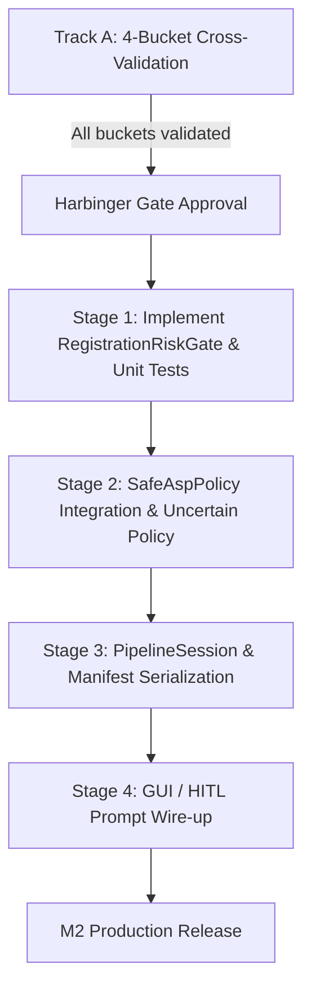

# Architecture & Scope: ASP `RegistrationRiskGate` Production Design

**Document:** `.agent/reports/gemini/m2_registration_risk_gate_design_2026-08-23.md`  
**Date:** 2026-08-23  
**Status:** Design / Scoping Document (Track B). Decision record updated
2026-08-23; implementation remains pending the roadmap critique round.
**Author:** Agy  
**References:**  
- `m2_registration_gate_proposal_2026-08-23.md` (Proposal & Decisions A–D)  
- `m2_calibration_holdout_2026-08-23.md` (Calibration & Hold-Out Baseline)  
- `submodules/ASP/backend/src/core/pipeline/safety_policy.py` (`SafeAspPolicy`, `GateDecision`)  
- `submodules/ASP/backend/src/core/pipeline/telemetry.py` (`RegistrationTelemetry`)  
- `submodules/ASP/docs/moon/asp_change_roadmap_2026q3.md` (§15.3 M2 Gate Roadmap)

---

## 1. Overview & Objectives

The M2 discriminating gate objective is to provide a reliable, pre-render mechanism that:
1. **Rejects all known catastrophic failure modes** (misalignment, duplicate strips, loop inconsistencies) with high confidence.
2. **Retains clean Raw ASP candidates** for at least 5 of the 10 score-order
   known-good cases; “at least one” is no longer an adequate M2 target.
3. **Replaces obsolete photometric-only render gates** (Ghost/Composite, which show inverse or near-zero human correlation) with true geometric registration signals.
4. **Routes uncertain and low-risk Raw-ASP candidates through targeted human
   review**; no Raw ASP result silently publishes merely because it is low-risk.

---

## 2. Component Architecture

```
                                  +---------------------------------------+
                                  | Stage 5/6: Pairwise Match & BA Solve  |
                                  +---------------------------------------+
                                                      |
                                                      v
                                      [Registration Telemetry Vector]
                                      - raw / filtered edges
                                      - per-pair RANSAC inlier ratio & RMS
                                      - global BA residual RMS & p95
                                      - translation loop closure RMS
                                      - affine health (valid, scale, rot)
                                                      |
                                                      v
+---------------------------------------------------------------------------------------------------+
|                                      RegistrationRiskGate                                         |
|                                                                                                   |
|  +---------------------------+  +-------------------------------+  +---------------------------+  |
|  |   Hard Validity Filter    |  |    Geometric Health Score     |  |   Secondary Crop Check    |  |
|  | - Disconnected graph      |  | - BA Residual RMS > 80.0      |  | - Coverage floor < 0.35   |  |
|  | - affine_health.valid=F   |  | - Loop closure RMS > 300.0    |  | - Aspect distortion       |  |
|  | - raw_edges <= 10         |  | - inlier_ratio < 0.20         |  |   (hard non-Raw-ASP path) |  |
|  +---------------------------+  +-------------------------------+  +---------------------------+  |
|                                             |                                                     |
|                                             v                                                     |
|                           [Three-Way Risk Classification]                                         |
|                         LOW_RISK | UNCERTAIN | HIGH_RISK                                          |
+---------------------------------------------------------------------------------------------------+
                                              |
                     +------------------------+------------------------+
                     |                                                 |
             (LOW_RISK)                                        (HIGH_RISK)
                     v                                                 v
        Queue Raw ASP review                                     Select SCANS
                     |                                                 |
                     +------------------- (UNCERTAIN) -----------------+
                                              |
                                              v
                              [uncertain_result_policy]
                               /              |             \
                              v               v              v
                       "scans" (Default)   "prompt" (HITL)  "raw_asp"
```

---

## 3. Module Specification

### 3.1 New Module: `submodules/ASP/backend/src/core/pipeline/registration_gate.py`

```python
"""Registration-risk gate for Safe ASP (M2).

Evaluates geometric registration telemetry (BA residuals, translation loop
closure, RANSAC inlier ratios, affine graph consistency) before rendering,
producing a typed three-way GateDecision: LOW_RISK, UNCERTAIN, or HIGH_RISK.
"""

from __future__ import annotations

from dataclasses import dataclass, field
from enum import Enum
from typing import Any

import numpy as np

from .safety_policy import GateDecision
from .session import PipelineSession, ResultIdentity


class RiskLevel(str, Enum):
    LOW_RISK = "low_risk"
    UNCERTAIN = "uncertain"
    HIGH_RISK = "high_risk"


@dataclass(frozen=True)
class RegistrationThresholds:
    """Calibrated thresholds for registration risk classification."""
    # Hard rejection ceilings (Calibration split fit)
    max_ba_residual_rms: float = 80.0
    max_cycle_error_rms: float = 300.0
    min_raw_edges: int = 10
    min_inlier_ratio: float = 0.15

    # Secondary crop-coverage floor (Decision D §3.4)
    min_crop_coverage: float = 0.35

    # Uncertainty boundaries
    uncertain_ba_residual_rms: float = 45.0
    uncertain_cycle_error_rms: float = 150.0


class RegistrationRiskGate:
    """Pre-render gate evaluating pairwise alignment and bundle adjustment health."""

    def __init__(self, thresholds: RegistrationThresholds | None = None):
        self.thresholds = thresholds or RegistrationThresholds()

    def evaluate(
        self,
        telemetry: dict[str, Any],
        affine_health: dict[str, Any] | None = None,
        crop_coverage: float | None = None,
    ) -> GateDecision:
        """Classify registration risk from session telemetry.
        
        Returns GateDecision with:
          - accept=True for LOW_RISK
          - accept=False for HIGH_RISK (fallback to SCANS)
          - status="uncertain" when metrics fall into the ambiguity band
        """
        ...
```

### 3.2 Gate Evaluation Logic & Decision Rules

1. **Hard Invalidation (Escalates directly to `HIGH_RISK` / `accept=False`):**
   - Matching graph disconnected or missing observed edges.
   - `affine_health["valid"] is False`.
   - `raw_edges <= thresholds.min_raw_edges` (insufficient correspondences).
   - BA residual missing / BA failed to converge.

2. **Metric Ceilings (Escalates to `HIGH_RISK` / `accept=False`):**
   - `ba_residual_rms > thresholds.max_ba_residual_rms` (> 80.0 px).
   - `cycle_error_rms > thresholds.max_cycle_error_rms` (> 300.0 px).
   - `inlier_ratio < thresholds.min_inlier_ratio` (< 15%).

3. **Secondary Crop-Coverage Hard Check (Decision D §3.4):**
   - If `crop_coverage is not None` and `crop_coverage < thresholds.min_crop_coverage`:
     - Escalate directly to `HIGH_RISK`; never select or publish Raw ASP.
     - Rationale: severe crop loss is not human-acceptable even when
       registration metrics look clean; a single-frame-like result is not a
       valid low-risk outcome.

4. **Uncertainty Band (`status="uncertain"`):**
   - 45.0 < ba_residual_rms <= 80.0 OR 150.0 < cycle_error_rms <= 300.0.
   - Behavior governed by `uncertain_result_policy`.

5. **Clean Pass (`LOW_RISK` / `accept=True`):**
   - All metrics below uncertainty thresholds; no structural defects detected.
   - Produces a Raw ASP candidate plus SCANS comparison artifacts and queues
     targeted human review before final publication.

---

## 4. Uncertainty Policy Integration (Decision A)

### 4.1 Configuration Options in `SafeAspPolicy`

Extend `SafeAspPolicy` in `submodules/ASP/backend/src/core/pipeline/safety_policy.py`:

```python
class UncertainResultPolicy(str, Enum):
    SCANS = "scans"        # Conservative batch fallback / interim default
    PROMPT = "prompt"      # HITL review dialog / interactive default
    RAW_ASP = "raw_asp"    # Speculative Raw ASP selection


@dataclass
class SafeAspPolicy:
    # Existing fields...
    registration_gate_enabled: bool = True
    uncertain_result_policy: UncertainResultPolicy = UncertainResultPolicy.SCANS
    registration_thresholds: RegistrationThresholds = field(default_factory=RegistrationThresholds)
```

### 4.2 Handling Policies at Runtime

- **In Batch / Benchmark Mode (`bench_anime_stitch.py`):**
  - If policy is `"scans"`: `uncertain` counts as SCANS selection; recorded with `reason="registration_uncertain:fallback_scans"`.
  - If policy is `"prompt"` in automated batch: logs a review prompt marker and defaults to `"scans"` safely while serializing the dual output candidates to `run_manifest.json`.

- **In GUI / Desktop App Mode (`ImageToolkit`):**
  - `"prompt"` is the intended interactive default. When the pipeline emits
    `status="uncertain"` or `LOW_RISK`, the UI triggers the
    `SafeAspReviewDialog` (or HITL comparison card in the gallery), presenting:
    - Side-by-side view: Raw ASP vs. SCANS.
    - Diagnostic badges: BA Residual RMS, Cycle Error, Crop Coverage.
    - Action buttons: "Keep Raw ASP", "Use SCANS", "Edit Seam/Crop".

---

## 5. Relationship with Other Gates

| Gate | Stage | Role | Status in M2 Production |
|:---|:---|:---|:---|
| **RegistrationRiskGate** | Pre-render | Primary structural & alignment filter | **Primary candidate gate; every Raw-ASP candidate reviewed** |
| **SeamVisGate** | Post-render | Surface seam discontinuity detection | **Active Backstop** ($\rho=+0.43$, floor 35.0, ratio 3.0) |
| **GhostGate** | Post-render | Ghosting / SIQE metric | **Telemetry Only** (`telemetry_only_inverse_validated`) |
| **CompositeGate** | Post-render | Heuristic strip-banding & coherence | **Telemetry Only** (`telemetry_only_inverse_validated`) |

---

## 6. Implementation Stages & Dependencies



1. **Prerequisite:** Codex Track A completes repeated hold-out validation across all 4 defect-stratified buckets.
2. **Phase 1 (Core Module):** Implement `registration_gate.py` with 100% unit test coverage in `submodules/ASP/backend/test/test_registration_gate.py`.
3. **Phase 2 (Policy Integration):** Wire `RegistrationRiskGate` into `SafeAspPolicy.evaluate_all()` and `safe_asp_counterfactual()`.
4. **Phase 3 (Session Telemetry):** Serialize `registration_gate` decision object into `PipelineSession` and `_checkpoint.json`.
5. **Phase 4 (HITL / UI Integration):** Connect `UncertainResultPolicy.PROMPT` to the GUI review dialog for uncertain and low-risk Raw-ASP candidates.

---

## 7. Verification & Safety Guarantees

- **Backwards Compatibility:** Unattended pipelines and benchmarks remain non-breaking; default `uncertain_result_policy="scans"` preserves conservative fallback guarantees.
- **Traceability:** Every decision (low-risk, uncertain, high-risk) serializes all scalar metrics (`ba_residual_rms`, `cycle_error_rms`, `raw_edges`, `crop_coverage`) into session JSON for auditability.
- **Review guarantee:** every low-risk Raw-ASP candidate is paired with its
  SCANS artifact and receives targeted human review before publication.
- **Promotion target:** retain at least 5 of the 10 score-order known-good
  cases while every known catastrophe remains non-Raw-ASP.
- **Zero Heavy Computations on UI Thread:** Gate evaluation operates purely on already-computed scalar telemetry from Stages 5 & 6 (< 1 ms overhead).
