# Image Stitching Pipelines — Architecture Reference

This document provides detailed Mermaid diagrams for the two anime/scan stitching pipelines:

- **`_merge_images_scan_stitch`** — lightweight OpenCV SCANS-mode baseline (10 steps)
- **`perfect_stitch` / `AnimeStitchPipeline`** — 13-stage research pipeline with deep-learning models, bundle adjustment, temporal rendering, and hard-partition compositing

The diagrams are intentionally verbose: every algorithmic parameter, conditional branch, model, and fallback path is documented.

> **Mermaid compatibility:** All diagrams target v8.8.0. `direction` inside subgraphs and `~~~` links require v9+ and are not used here.

---

## 1. High-Level Pipeline Comparison

### 1a. `_merge_images_scan_stitch` (simple)

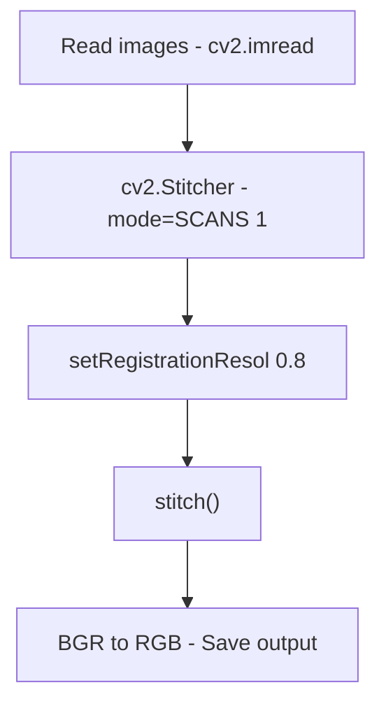

### 1b. `perfect_stitch` / `AnimeStitchPipeline` (13 stages)

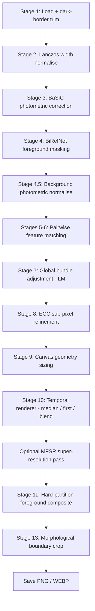

---

## 2. `_merge_images_scan_stitch` — Detailed Flowchart

**Source:** `backend/src/core/image_merger.py:129`

This method wraps OpenCV's built-in SCANS stitcher with minimal preprocessing. It is also used as the fallback inside `AnimeStitchPipeline` when no valid feature edges are found.

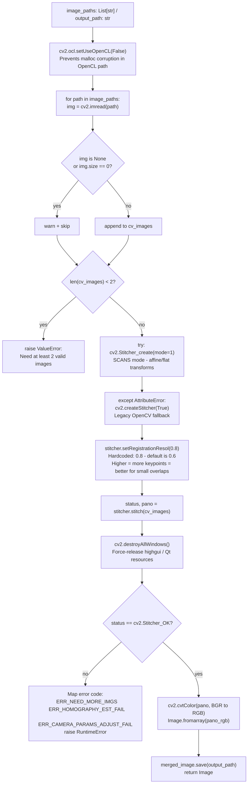

### Key Parameters

| Parameter | Value | Source |
|-----------|-------|--------|
| Stitcher mode | `1` (SCANS — affine/flat) | Hardcoded |
| Registration resolution | `0.8` | Hardcoded (OpenCV default is 0.6) |
| OpenCL | Disabled | Hardcoded (prevents malloc corruption) |
| Feature detector | ORB/AKAZE (OpenCV default) | Inside OpenCV |
| Matcher | BFMatcher / FLANN | Inside OpenCV |
| Homography | RANSAC | Inside OpenCV |

---

## 3. `perfect_stitch` / `AnimeStitchPipeline` — Full Pipeline

**Entry point:** `backend/src/core/image_merger.py:737`
**Orchestrator:** `backend/src/anim/pipeline.py:87`

### 3.1 Parameter Resolution Chain

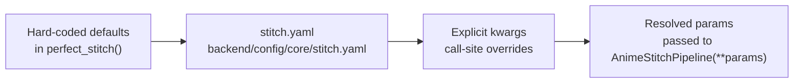

### Default Parameter Values

| Parameter | Default | Type | Description |
|-----------|---------|------|-------------|
| `use_basic` | `False` | bool | Enable BaSiC flat-field correction |
| `use_birefnet` | `True` | bool | Enable BiRefNet foreground masking |
| `use_loftr` | `True` | bool | Enable LoFTR dense matching |
| `use_ecc` | `False` | bool | Enable ECC sub-pixel refinement |
| `renderer` | `"median"` | str | `"median"` / `"first"` / `"blend"` |
| `composite_fg` | `True` | bool | Hard-partition foreground composite |
| `motion_model` | `"translation"` | str | `"translation"` (2-DOF) / `"affine"` (4-DOF) |
| `edge_crop` | `80` | int | Pixels to crop from all sides at output |
| `laplacian_bands` | `8` | int | Bands for multi-band blend renderer |
| `mfsr_mode` | `False` | bool | Enable MFSR super-resolution pass |
| `mfsr_n_dct_iter` | `20` | int | DCT restoration iterations |
| `mfsr_use_prior` | `True` | bool | Enable prior injection in MFSR |
| `mfsr_use_diffusion` | `False` | bool | Enable diffusion inpainting in MFSR |
| `stitch_net_ckpt` | `""` | str | Path to AnimeStitchNet checkpoint |

---

### 3.2 Stage 1 — Frame Loading and Dark-Border Trim

**Module:** `backend/src/anim/canvas.py:17` (`_load_frames`)
**Helper:** `backend/src/anim/stateless.py` (`_trim_dark_border`)

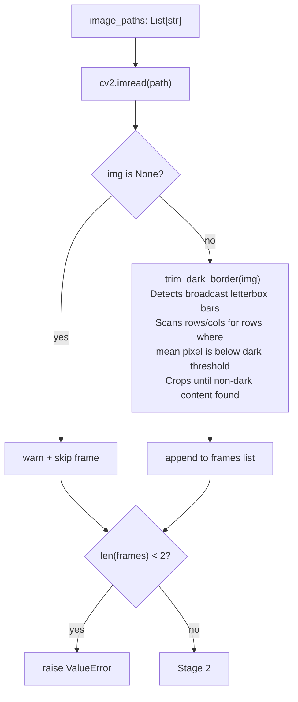

---

### 3.3 Stage 2 — Width Normalisation

**Module:** `backend/src/anim/canvas.py:30` (`_normalise_widths`)

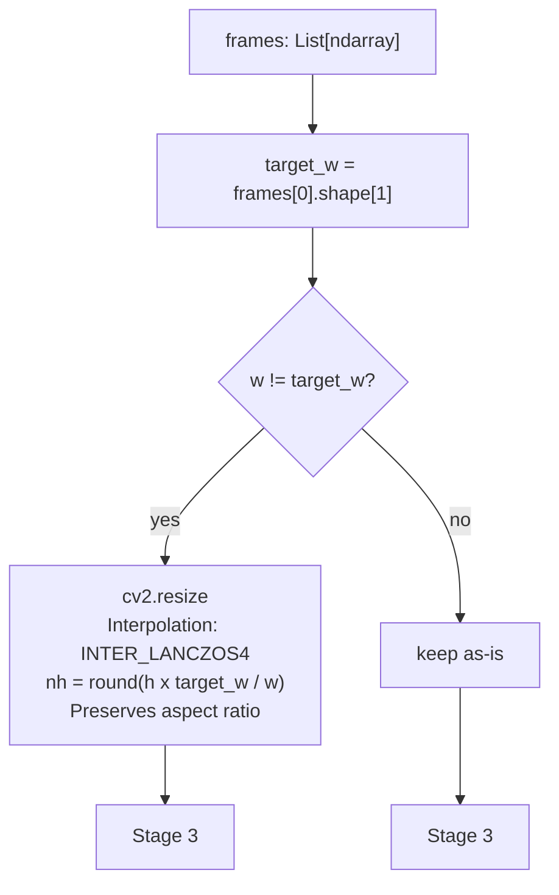

---

### 3.4 Stage 3 — BaSiC Photometric Correction

**Module:** `backend/src/anim/photometric.py`
**Activated by:** `use_basic=True`

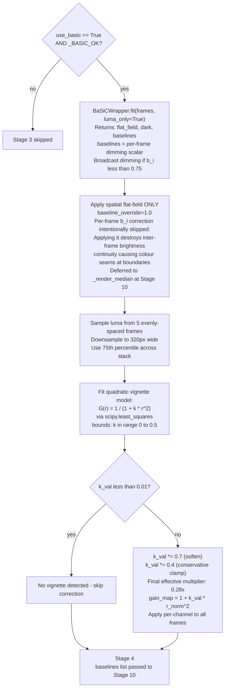

---

### 3.5 Stage 4 — BiRefNet Foreground Masking

**Module:** `backend/src/anim/masking.py` (`_compute_fg_masks`)
**Constants:** `_FOREGROUND_DILATION=16`, `_FOREGROUND_EROSION=8`

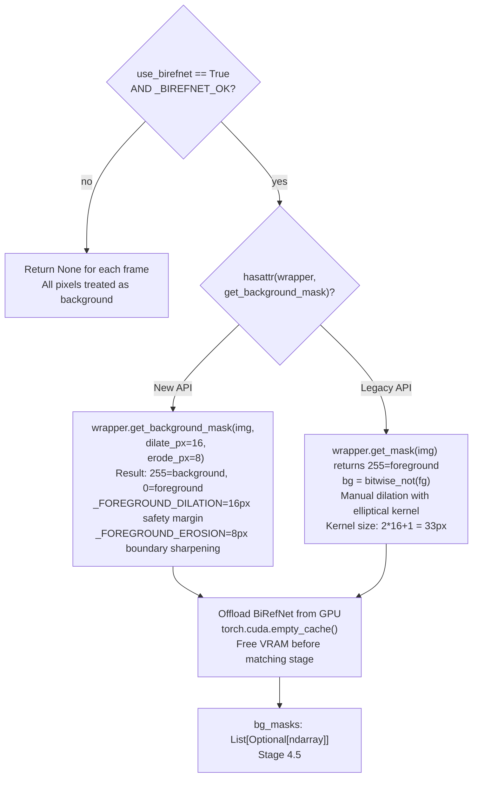

---

### 3.6 Stage 4.5 — Background Photometric Normalisation

**Module:** `backend/src/anim/pipeline.py:420` (inline in `run()`)

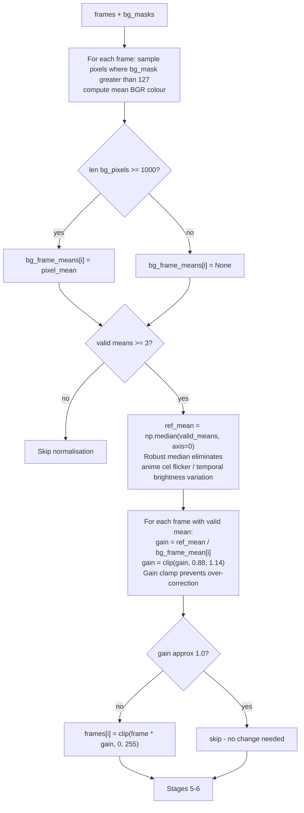

---

### 3.7 Stages 5-6 — Pairwise Feature Matching

**Module:** `backend/src/anim/matching.py`

#### 3.7.1 Edge Graph Construction

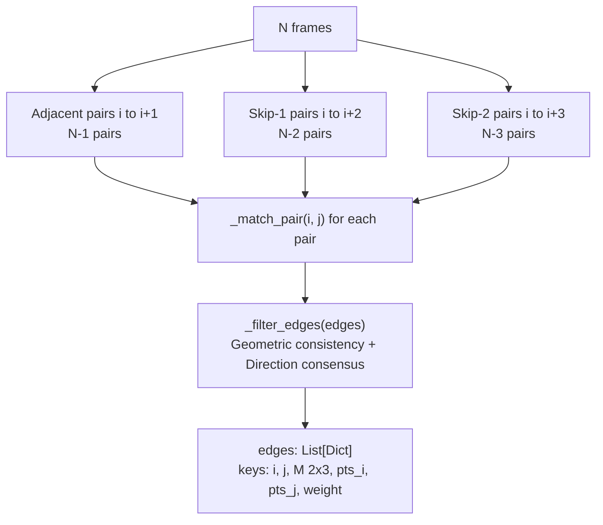

#### 3.7.2 Per-Pair Matching Fallback Chain

```mermaid
flowchart TD
    START["_match_pair(frames, bg_masks, i, j)"] --> CROP

    CROP["Edge Crop pre-match distortion removal:\nec_h = H * 0.05  _MATCH_EDGE_CROP=0.05\nec_w = W * 0.05\nCrop 5% from all sides before matching"] --> ATT1

    ATT1["Attempt 1: LoFTR Dense Matching\nloftr_wrapper.match(img_i_c, img_j_c)\nReturns: pts1, pts2, conf"] --> L2{"len pts1 >= 30?"}
    L2 -- "no" --> ATT2_START
    L2 -- "yes" --> L3["Filter: keep only bg points\nboth masks greater than 127\n_MIN_LOFTR_INLIERS=20 required after filter"]
    L3 --> L4{"motion_model?"}
    L4 -- "translation" --> L5["dx = median(pts2[:,0] - pts1[:,0])\ndy = median(pts2[:,1] - pts1[:,1])\nM = [[1,0,dx],[0,1,dy]]"]
    L4 -- "affine" --> L6["cv2.estimateAffine2D\n  pts1, pts2\n  method=cv2.RANSAC\n  ransacReprojThreshold=5.0\nRequire at least 15 RANSAC inliers"]
    L5 --> DXCHECK{"dx valid?\nabs(dx) less than W * 0.01\n_MAX_DX_DRIFT_RATIO=0.01\nVertical pans have near-zero horizontal drift"}
    L6 --> DXCHECK
    DXCHECK -- "no" --> ATT2_START
    DXCHECK -- "yes" --> SUCCESS["M found - skip remaining attempts"]

    ATT2_START["Attempt 2: Template Match Fallback\n_template_match(img_i_c, img_j_c, mask_i, mask_j, H_c)"] --> T2
    T2["Bidirectional search:\nConfig A: bottom of i in top of j  dy greater than 0 downward pan\nConfig B: top of i in bottom of j  dy less than 0 upward pan\nslice_h=256  template strip height\nmax_search_frac=0.8  ROI = 80% of frame height\nmax_dy_frac=0.70  reject abs dy greater than 70% of H\nEnforces minimum 30% frame overlap\ndirection_sign=0 bidirectional by default\ncv2.matchTemplate TM_CCORR_NORMED with mask"] --> T4{"conf greater than 0.6\nAND conf greater than _MIN_TEMPLATE_SCORE 0.85?"}
    T4 -- "yes" --> SUCCESS2["M found"]
    T4 -- "no" --> ATT3A

    ATT3A["Attempt 3a: Masked Phase Correlation\ng_i = _highpass(_luma(img_i_c))\ng_j = _highpass(_luma(img_j_c))\nHigh-pass filter isolates edges removes DC\nZero out foreground pixels mask == 0\nPrevents moving characters biasing shift\nHanning window\ncv2.phaseCorrelate(g_i, g_j, hann)\nReturns shift=(dx,dy), response"] --> PC4{"response greater than 0.25\nabs(dx) less than W * 0.01?"}
    PC4 -- "yes" --> SUCCESS3["M found"]
    PC4 -- "no" --> ATT3B

    ATT3B["Attempt 3b: Unmasked Phase Correlation\nSame as 3a but use_mask=False\nCharacter provides dominant phase signal\nwhen background is uniform\nMinimum response: _PC_CONF_THRESHOLD=0.05"] --> PU2{"response greater than 0.15\nabs(dx) less than W * 0.01?"}
    PU2 -- "yes" --> SUCCESS4["M found"]
    PU2 -- "no" --> FAIL["All methods failed - edge dropped"]

    SUCCESS --> BUILD["Build edge dict:\nEnforce translation-only M\nrotation and scale locked to identity\nBuild pts_i / pts_j anchor points\nweight = mean_conf"]
    SUCCESS2 --> BUILD
    SUCCESS3 --> BUILD
    SUCCESS4 --> BUILD
```

#### 3.7.3 Edge Filter

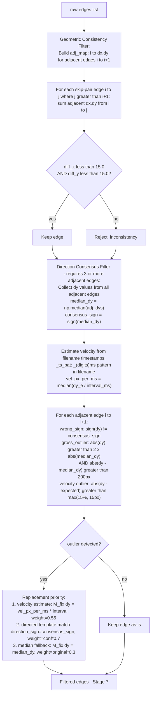

---

### 3.8 Stage 7 — Global Bundle Adjustment

**Module:** `backend/src/anim/bundle_adjust.py` (`_bundle_adjust_affine`)

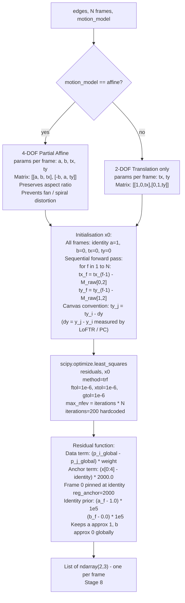

---

### 3.9 Stage 8 — ECC Sub-Pixel Refinement

**Module:** `backend/src/anim/ecc.py` (`_ecc_refine`)
**Activated by:** `use_ecc=True`

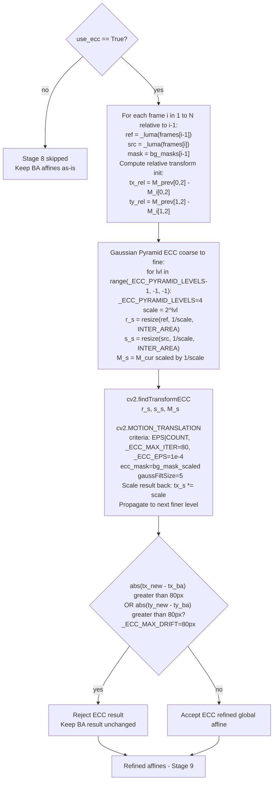

---

### 3.10 Stage 9 — Canvas Construction

**Module:** `backend/src/anim/canvas.py:43` (`_compute_canvas`)

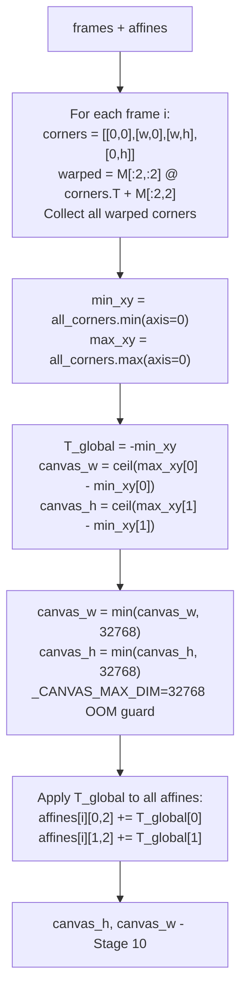

---

### 3.11 Stage 10 — Temporal Renderer

**Module:** `backend/src/anim/rendering.py`

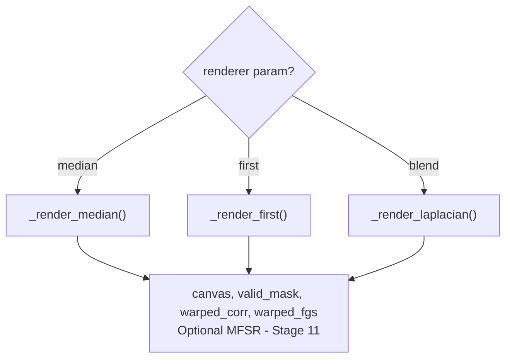

#### Median Renderer (default — Overmix temporal denoising)

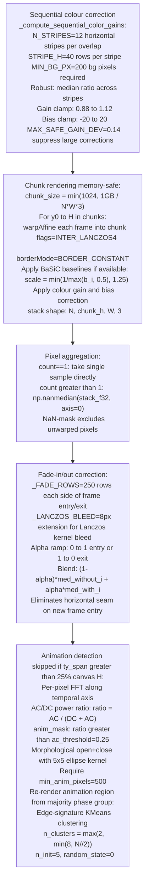

#### First-Frame-Wins Renderer

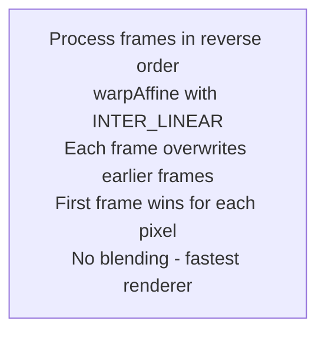

#### Laplacian Blend Renderer

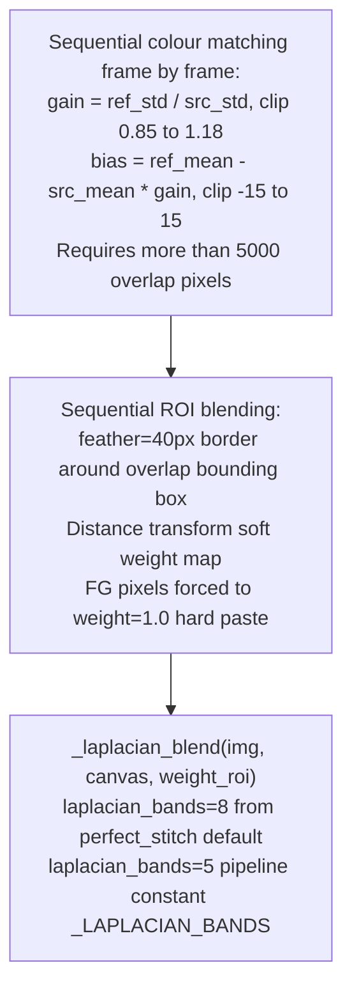

---

### 3.12 Optional MFSR Super-Resolution Pass

**Module:** `backend/src/anim/mfsr/`
**Activated by:** `mfsr_mode=True`

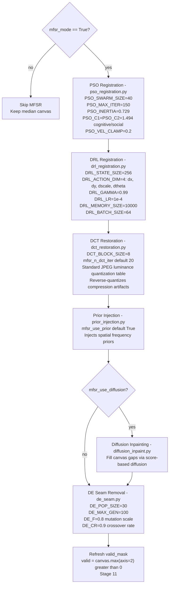

---

### 3.13 Stage 11 — Hard-Partition Foreground Composite (Deghost)

**Module:** `backend/src/anim/compositing.py` (`_composite_foreground`)
**Activated by:** `composite_fg=True AND use_birefnet=True`

```mermaid
flowchart TD
    IN["canvas temporal median\nframes, affines, bg_masks"] --> CENTERS

    CENTERS["Strip ownership ordering:\nstrip_center_ys[i] = affines[i][1,2] + frame_h[i] / 2\norder = argsort(strip_center_ys)\ninitial_boundaries = midpoints between sorted centres"] --> WARP

    WARP["Warp all N frames to full canvas:\ncv2.warpAffine(frame, affine, W,H\n  flags=INTER_LANCZOS4\n  borderMode=BORDER_CONSTANT)"] --> PASS1

    PASS1["Pass 1 Boundary Search pre-normalisation:\n_find_optimal_boundaries on raw frames\n_SEARCH_RANGE=250px each side of midpoint\n_SEARCH_SLAB=20 row height for scoring\nScore = 0.4 * bg_diff + 0.6 * total_diff\nbg pixels preferred: both masks agree\nMinimum 50 valid pixels to score\nBoundaries spaced at least 2*_SEARCH_SLAB apart"] --> LSNORM

    LSNORM["Global Brightness Normalisation:\nLeast-squares log-gain minimisation:\n  min sum_k w_k*(alpha_k - alpha_{k+1} - log_ratio_k)^2 + lambda*sum_i*alpha_i^2\n  lambda=5e2 regularisation\nPrefer bg pixels: both frames agree, mu greater than 50\nFallback: all-pixel at weight*0.8\nGains clamped 0.70 to 1.45\nApply per-frame gain in-place to warped_list"] --> PASS2

    PASS2["Pass 2: Re-run boundary search on normalised frames\nAdaptive feather lookup _FEATHER_TABLE:\n  diff <=  5.0: feather=300px\n  diff <= 10.0: feather=250px\n  diff <= 20.0: feather=200px\n  diff <= 35.0: feather=150px\n  diff <= 50.0: feather=100px\n  diff >  50.0: feather= 80px  _FEATHER_MIN\nCap: feather <= nat_overlap//2 AND <= _FEATHER_MAX=300"] --> SEAM

    SEAM["Per-boundary colour correction and DP seam paths:\nMeasure photometric calibration at overlap zone\nSLAB_HALF=25 rows each side of y_cut\nCompare SAME canvas rows in both frames\nPrefer bg pixels mu greater than 50, delta less than 12%\nGain clamp: GAIN_CLAMP_LOCAL = 0.72 to 1.40\nDP seam cut _seam_cut:\n  Energy = diff + 0.5*|grad(diff)|\n         + 15 * (edges_img1 + edges_img2)\n  edge_weight=15.0 avoids outlines in either frame\n  DP left to right pass on transposed matrix\n  Backtrack: minimum energy path\n  seam_path[x] = y-coordinate of cut at column x"] --> COMP

    COMP["Chunk composite CHUNK=512 rows:\nHard-partition rows outside seam zones:\n  strip_weights[owner_frame, y] = 1.0\n  weighted average by content presence\nSeam-zone rows:\n  Per-column cosine feather centred on DP path\n  d_seam = local_y - seam_path[x]\n  t_blend = clip(1 - abs(d_seam)/zone_half, 0, 1)\n  gain_fa = 1 + t_blend*(1/sqrt(gain_seam) - 1)\n  gain_fb = 1 + t_blend*(sqrt(gain_seam) - 1)\n  t_lin = clip((d_seam + zone_half)/(2*zone_half), 0, 1)\n  t_hf = 0.5*(1 - cos(pi*t_lin)) half-cosine\n  result = (1-t_hf)*fa_corr + t_hf*fb_corr"] --> RAMP

    RAMP["Post-composite seam colour ramp:\n_apply_canvas_seam_correction\nramp_half = min(250, half_above, half_below)\n_SEAM_MEAS_SLAB=40 rows for measurement\nTrigger: abs(delta) greater than _SEAM_STEP_THRESHOLD=1.5\nReject: ratio greater than _SEAM_MAX_RATIO=1.35 scene content\nGain clamp: _GAIN_CLAMP = 0.88 to 1.14\nApply cosine ramp over +/- ramp_half rows\nAbove seam: gain 1/sqrt(gains) at seam to 1.0 at far edge\nBelow seam: gain sqrt(gains) at seam to 1.0 at far edge"] --> OUT
    OUT["Updated canvas - Stage 13"]
```

---

### 3.14 Stage 13 — Boundary Crop

**Module:** `backend/src/anim/canvas.py:75` (`_crop_to_valid`)

```mermaid
flowchart TD
    IN["canvas + valid_mask"] --> C1["row_has_content = any(valid_mask > 0, axis=1)\ncol_has_content = any(valid_mask > 0, axis=0)\nr0..r1 = first and last row with content\nc0..c1 = first and last col with content\nO(H+W) projection-based crop"]
    C1 --> C2["canvas = canvas[r0:r1, c0:c1]"]
    C2 --> E1{"edge_crop > 0?"}
    E1 -- "yes" --> E2["canvas = canvas[ec:-ec, ec:-ec]\nDefault ec=80px in perfect_stitch\nDefault ec=30px in AnimeStitchPipeline init\nRemoves vignette and distortion from warped edges"]
    E1 -- "no" --> E3["skip edge crop"]
    E2 --> SAVE["cv2.cvtColor BGR to RGB\nImage.fromarray(rgb)\nout.save(output_path)\ngc.collect()"]
    E3 --> SAVE
```

---

## 4. Fallback Chain Summary

```mermaid
flowchart LR
    START["Frame pair i to j"] --> L1["LoFTR\n20+ bg inliers"]
    L1 -- "fail" --> L2["Template Match\nconf >= 0.85"]
    L2 -- "fail" --> L3["Phase Corr masked\nresponse >= 0.25"]
    L3 -- "fail" --> L4["Phase Corr unmasked\nresponse >= 0.15"]
    L4 -- "fail" --> L5["Edge dropped\npair skipped"]
    L5 -- "all pairs fail" --> L6["SCANS fallback\n_scan_stitch_fallback\nsame as _merge_images_scan_stitch"]
```

---

## 5. Module Dependency Map

```mermaid
graph TD
    PS["perfect_stitch\nimage_merger.py"] --> ASP["AnimeStitchPipeline\npipeline.py"]
    ASP --> CAN["canvas.py\n_load_frames\n_normalise_widths\n_compute_canvas\n_crop_to_valid\n_scan_stitch_fallback"]
    ASP --> PHOTO["photometric.py\n_apply_basic\n_correct_vignetting"]
    ASP --> MASK["masking.py\n_compute_fg_masks"]
    ASP --> MATCH["matching.py\n_pairwise_match\n_match_pair\n_template_match\n_phase_correlate"]
    ASP --> BA["bundle_adjust.py\n_bundle_adjust_affine"]
    ASP --> ECC["ecc.py\n_ecc_refine"]
    ASP --> REND["rendering.py\n_render\n_render_median\n_render_first\n_render_laplacian\n_cluster_animation_phases"]
    ASP --> COMP["compositing.py\n_composite_foreground"]
    ASP --> MFSR["mfsr/\nrun_mfsr\npso_register\nde_seam\nrestore_dct\napply_prior\ninpaint_gaps\nRegistrationAgent"]
    ASP --> CONST["constants.py\nall thresholds"]
    PHOTO --> BW["BaSiCWrapper\nmodels/basic_wrapper.py"]
    MASK --> BRN["BiRefNetWrapper\nmodels/birefnet_wrapper.py"]
    MATCH --> LOFTR["LoFTRWrapper\nmodels/loftr_wrapper.py"]
    SS["_merge_images_scan_stitch\nimage_merger.py"] --> OCV["cv2.Stitcher\nmode=SCANS 1"]
```

---

## 6. Constants Quick Reference

All tunable constants live in `backend/src/anim/constants.py`.

### Core Stitching

| Constant | Value | Description |
|----------|-------|-------------|
| `_LAPLACIAN_BANDS` | `5` | Pyramid depth for multi-band blend |
| `_ECC_MAX_ITER` | `80` | ECC termination: max iterations |
| `_ECC_EPS` | `1e-4` | ECC termination: convergence epsilon |
| `_ECC_PYRAMID_LEVELS` | `4` | Gaussian pyramid levels for ECC |
| `_MIN_LOFTR_INLIERS` | `20` | Min bg inliers after LoFTR mask filter |
| `_MAX_DX_DRIFT_RATIO` | `0.01` | Max horizontal drift (1% of width) |
| `_MATCH_EDGE_CROP` | `0.05` | Pre-match edge trim fraction (5%) |
| `_MIN_TEMPLATE_SCORE` | `0.85` | Min TM_CCORR_NORMED confidence |
| `_PC_CONF_THRESHOLD` | `0.05` | Min phase-correlation response |
| `_CANVAS_MAX_DIM` | `32768` | Hard OOM cap on canvas |
| `_MEDIAN_MIN_SAMPLES` | `3` | Min valid samples for median render |
| `_FOREGROUND_DILATION` | `16` | BiRefNet mask dilation (px) |
| `_FOREGROUND_EROSION` | `8` | BiRefNet mask erosion (px) |
| `_SMOOTHSTEP_BLEND_PX` | `96` | Fallback blend height |

### Compositing (`compositing.py`)

| Constant | Value | Description |
|----------|-------|-------------|
| `_FEATHER_MAX` | `300` | Max feather half-width |
| `_FEATHER_MIN` | `80` | Min feather half-width |
| `_GAIN_CLAMP` | `(0.88, 1.14)` | Per-boundary photometric gain limit |
| `_SEQ_SAMPLE_HALF` | `40` | Rows each side for gain estimation |
| `_SEQ_MIN_PX` | `200` | Min pixels for reliable gain est. |
| `_SEARCH_RANGE` | `250` | Boundary search radius (px) |
| `_SEARCH_SLAB` | `20` | Row height for boundary scoring |
| `_SEAM_RAMP_HALF` | `250` | Post-composite ramp half-width |
| `_SEAM_MEAS_SLAB` | `40` | Rows for seam colour measurement |
| `_SEAM_STEP_THRESHOLD` | `1.5` | Min colour step to trigger ramp |
| `_SEAM_MAX_RATIO` | `1.35` | Max ratio before treating as content |

### MFSR Constants

| Constant | Value | Description |
|----------|-------|-------------|
| `PSO_SWARM_SIZE` | `40` | PSO: swarm particle count |
| `PSO_MAX_ITER` | `150` | PSO: max iterations |
| `PSO_INERTIA` | `0.729` | PSO: inertia weight |
| `PSO_C1` / `PSO_C2` | `1.494` | PSO: cognitive/social coefficients |
| `PSO_VEL_CLAMP` | `0.2` | PSO: velocity clamp fraction |
| `DE_POP_SIZE` | `30` | DE: population size |
| `DE_MAX_GEN` | `100` | DE: max generations |
| `DE_F` | `0.8` | DE: mutation scale factor |
| `DE_CR` | `0.9` | DE: crossover rate |
| `DCT_BLOCK_SIZE` | `8` | DCT: block size (JPEG-standard) |
| `DCT_ITERATIONS` | `20` | DCT: default restoration iterations |
| `DRL_STATE_SIZE` | `256` | DRL: state feature dimension |
| `DRL_ACTION_DIM` | `4` | DRL: action space (dx,dy,dscale,dtheta) |
| `DRL_GAMMA` | `0.99` | DRL: discount factor |
| `DRL_LR` | `1e-4` | DRL: learning rate |
| `DRL_MEMORY_SIZE` | `10000` | DRL: replay buffer size |
| `DRL_BATCH_SIZE` | `64` | DRL: training batch size |
