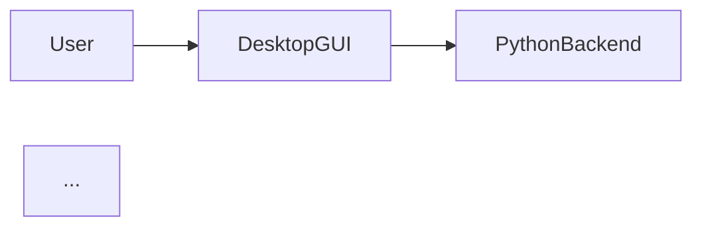

# C4 Architecture Model (Structurizr)

Image Toolkit's architecture is modelled using the [C4 model](https://c4model.com) and
encoded in Structurizr DSL. The model lives in [`docs/structurizr/workspace.dsl`](../docs/structurizr/workspace.dsl)
and covers four views across three C4 levels.

## Views

| Level | View | What it shows |
|-------|------|----------------|
| 1 — System Context | SystemContext | Image Toolkit vs. 4 external systems and 2 user personas |
| 2 — Containers | Containers | 10 deployable units (Desktop GUI, Android, iOS, Extension, Web Frontend, Django API, Python Backend, Rust Core, Crypto Module) |
| 3 — Components | PythonBackendComponents | ASP Pipeline · ML Models · VaultManager · ImageDatabase · Web Wrappers |
| 3 — Components | RustCoreComponents | Math Backbone · Image Processing · Web Crawlers · File System Scanner |
| 3 — Components | DjangoApiComponents | DRF API Views · Celery Task Workers · OpenAPI Endpoints |

## Key architectural decisions captured

- **PyO3 FFI boundary** — all IO-heavy and math-heavy logic lives in Rust; the Python backend calls it via the compiled `base` extension.
- **JPype JVM bridge** — `VaultManager` starts the JVM once at login (before Qt initialises) and calls into the Kotlin `cryptoModule` for AES-256-GCM operations. This avoids native-dialog RTTI conflicts (see TROUBLESHOOTING.md).
- **Celery task dispatch** — every REST endpoint returns `{task_id, status: "processing"}` with HTTP 202. No blocking calls in the Django views.
- **pgvector for semantic search** — CLIP embeddings stored as `vector(512)` columns; nearest-neighbour queries use the `ivfflat` index.

## Rendering locally

```bash
# Structurizr Lite (recommended — live reload on DSL save)
docker run -it --rm -p 8080:8080 \
  -v "$(pwd)/docs/structurizr:/usr/local/structurizr" \
  structurizr/lite
open http://localhost:8080
```

See [`docs/structurizr/README.md`](../docs/structurizr/README.md) for export instructions
(Mermaid CLI, PlantUML).

## Exporting diagrams for the portal

The Structurizr CLI can export any view as a Mermaid `.mmd` file. Those files embed directly in MkDocs via the `pymdownx.superfences` extension:

````markdown

````

The module-dependency Mermaid diagram in [`docs/ARCHITECTURE.md`](ARCHITECTURE.md)
is pre-rendered to `site/architecture-diagram.svg` by Mermaid CLI in the
`docs-typescript` CI job.
