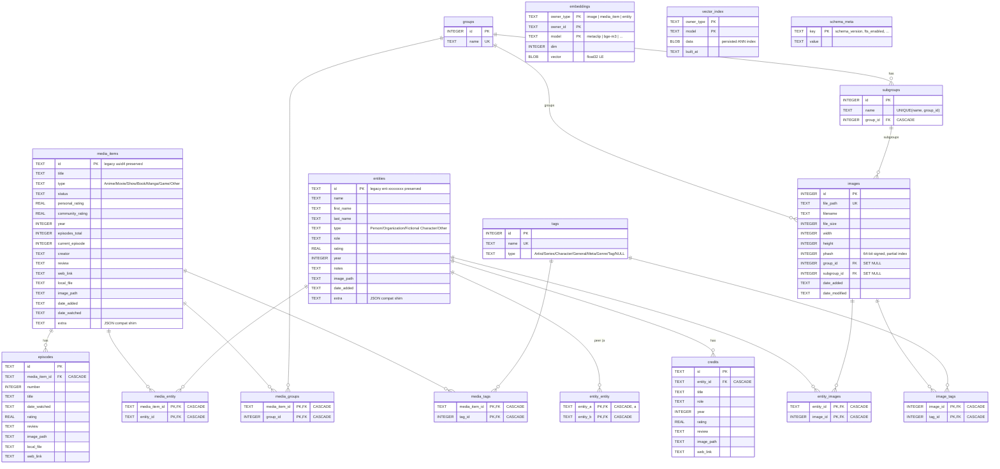

# Unified Library Database — Schema v1

*Phase DB, item DB.1 — see [moon/roadmaps/unified_database.md](../../moon/roadmaps/unified_database.md).*

One SQLCipher-encrypted SQLite database at `~/.image-toolkit/library.db` replaces both legacy stores:

| Legacy store | Legacy shape | Where it lands here |
|---|---|---|
| `~/.image-toolkit/listings_secure.db` (`base.secret`) | single `listings` table, everything in a `metadata` JSON blob | `media_items`, `episodes`, `entities`, `credits`, `media_entity`, `entity_entity`, `media_tags` |
| PostgreSQL + pgvector (`imagedb`) | relational, plaintext, denormalized `group_name`/`subgroup_name` text columns, dead `vector(128)` column | `images` (FK'd to `groups`/`subgroups`), `tags`, `image_tags` |

**DDL source of truth:** [`backend/src/database/unified/schema.sql`](../../backend/src/database/unified/schema.sql) (core, always applied) + [`schema_fts.sql`](../../backend/src/database/unified/schema_fts.sql) (FTS5 layer, applied only when the linked SQLCipher has FTS5; `schema_meta.fts_enabled` records the outcome). Migration `backend/migrations/001_create_library_db.py` applies both and stamps `schema_meta.schema_version = 1`. This document is a mirror — change the `.sql` files first.

## ER diagram

## Design decisions

1. **ID strategy.** `media_items`, `entities`, `episodes`, `credits` keep TEXT PKs so every legacy id survives migration byte-identical (external references — `.enc` backups, rec-engine payloads, MAL association caches — keep working). Image-domain tables use INTEGER PKs as before.
2. **`extra` JSON columns** on `media_items`/`entities` hold any legacy metadata key without a normalized column, making the 002 migration lossless by construction. They are a *read-mostly compatibility shim*: new features must add columns/tables, never new `extra` keys.
3. **Associations are M2M tables** with FK cascades. The legacy `associated_entities`/`associated_content`/peer-entity lists — kept consistent by ~500 LOC of fetch-all/diff/re-upsert Python — become `INSERT OR IGNORE`/`DELETE` in one transaction. `entity_entity` stores each undirected pair once (`CHECK (entity_a < entity_b)`).
4. **CSV genres/tags → `media_tags`.** Listings' comma-separated `genres`/`tags` strings are split into rows of the shared `tags` table with `type='Genre'`/`'Tag'`; the image side's typed tags (Artist/Series/Character/General/Meta) live in the same table — one vocabulary (DB.8c).
5. **Group/subgroup denormalization dropped.** Postgres stored `group_name`/`subgroup_name` as text on `images` *and* as separate tables; here `images` holds FKs only (`ON DELETE SET NULL` — deleting a group orphans images rather than deleting them, matching the old tabs' warning text).
6. **Episodes/credits get real tables** instead of JSON arrays — sortable, countable, and individually addressable by the Data Browser (DB.9).
7. **`embeddings` is polymorphic** (`owner_type` + `owner_id` text) so one table serves image CBIR (MetaCLIP), listings semantics (BGE-M3), and anything later; the PK includes `model` so multiple embedding models coexist. Vectors are little-endian float32 BLOBs; `vector_index` persists the ANN index per (owner_type, model) inside the encrypted file.
8. **FTS5 is optional at runtime.** `schema_fts.sql` creates external-content FTS tables + sync triggers; if the linked SQLCipher lacks FTS5, `schema_meta.fts_enabled='0'` and `search_repo` degrades to indexed `LIKE`. Content tables with TEXT PKs are addressed through their implicit `rowid` (`images` uses `id` directly since INTEGER PK ≡ rowid).
9. **Dates are ISO-8601 TEXT** (`date('now')` / `datetime('now')`), matching both legacy stores' string dates and keeping migration comparisons trivial.
10. **`PRAGMA foreign_keys = ON`** is set per-connection by the engine (`base.database`), not in the schema (SQLite pragma is connection-scoped).

## Legacy field mapping (for migration 002)

| Legacy listings JSON key | Destination |
|---|---|
| `id`, `title`, `type`, `status`, `year`, `creator`, `review`, `web_link`, `local_file`, `image_path`, `date_added`, `date_watched` | `media_items` columns (same names; `type` was the row `category`) |
| `personal_rating` / `rating`, `community_rating` | `media_items.personal_rating` / `community_rating` |
| `episodes`, `current_episode` | `media_items.episodes_total`, `current_episode` |
| `genres`, `tags` (CSV strings) | `tags` rows (`type='Genre'`/`'Tag'`) + `media_tags` |
| `episode_list` (JSON array) | `episodes` rows |
| `associated_entities` | `media_entity` rows |
| — entity rows (`category='Entity'`) — | |
| `name`, `first_name`, `last_name`, `type`, `role`, `rating`, `year`, `notes`, `image_path`, `date_added` | `entities` columns |
| `credit_list` (JSON array) | `credits` rows |
| `associated_content` | `media_entity` rows (deduped against the media side) |
| `associated_entities` (on entities) | `entity_entity` rows (normalized `a<b`) |
| any other key | `extra` JSON |

| Legacy Postgres column | Destination |
|---|---|
| `images.*` except `group_name`/`subgroup_name`/`embedding` | `images` columns (same names; timestamps → ISO text) |
| `images.group_name`/`subgroup_name` (text) | resolved to `group_id`/`subgroup_id` FKs |
| `images.embedding` | dropped (NULL everywhere in practice; real embeddings arrive in DB.7) |
| `groups`, `subgroups`, `tags`, `image_tags` | same-named tables |
