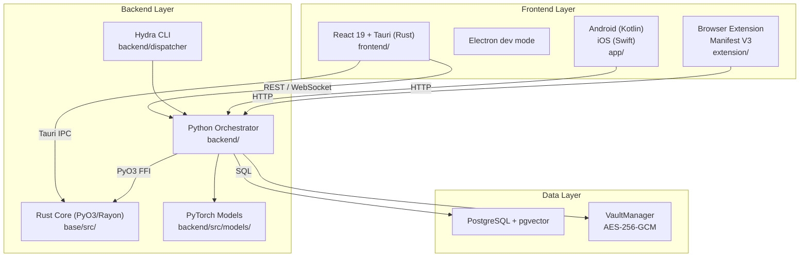

# Image-Toolkit Documentation

**Image-Toolkit** is an integrated image database and editing framework that bridges high-performance computer vision (PyTorch, OpenCV, Rust/PyO3) with robust web automation (Selenium) and cross-platform accessibility.

---

## What's here

| Section | Description |
|---------|-------------|
| [Quick Start](../README.md) | 5-minute setup, environment bootstrapping, CLI reference |
| [Architecture](ARCHITECTURE.md) | Module dependency graph, data-flow diagrams, tech stack |
| [Troubleshooting](TROUBLESHOOTING.md) | PySide6 crashes, ASP errors, Rust builds, Hydra, mobile |
| [Python API](api/python/animation.md) | Auto-generated reference from Google-style docstrings |
| [Rust API](api/rust/math.md) | Math backbone: linalg, stats, distance, information, graph |
| [Benchmarks](BENCHMARKS.md) | ASP corpus, Rust criterion, frontend math benchmarks |
| [Dependency Policy](DEPENDENCY_POLICY.md) | Version pins, upgrade cadence, security CVE SLA |
| [Documentation Standards](DOCUMENTATION_STANDARDS.md) | Docstring style, TOC rules, enforcement hooks |
| [Roadmaps](../moon/ROADMAP.md) | Architecture, performance, features, GUI/UX, ASP, docs |
| [Changelog](../moon/CHANGELOG.md) | All shipped features ordered by session |


---

## Project at a glance



---

## Key entry points

```bash
# Tauri web app (recommended)
npm run dev

# Python PySide6 desktop GUI
source .venv/bin/activate && python main.py

# Hydra CLI (training, embedding, ComfyUI)
python -m backend.dispatcher command=train

# ASP benchmark suite
pytest backend/test/animation/ --skip-gpu

# Rust doc generation
cd base && cargo doc --no-deps --open
```

---

## Stack versions

| Component | Required |
|-----------|---------|
| Python | 3.11+ |
| Rust | 1.70+ |
| Node.js | 18+ |
| PostgreSQL | 14+ |
| pgvector | 0.5.0+ |
| Android SDK | API 26+ |
| iOS / Xcode | 16+ / 15+ |
