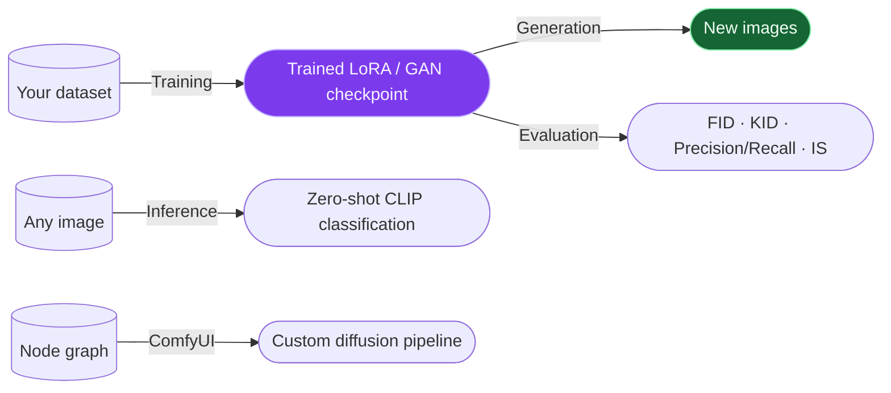
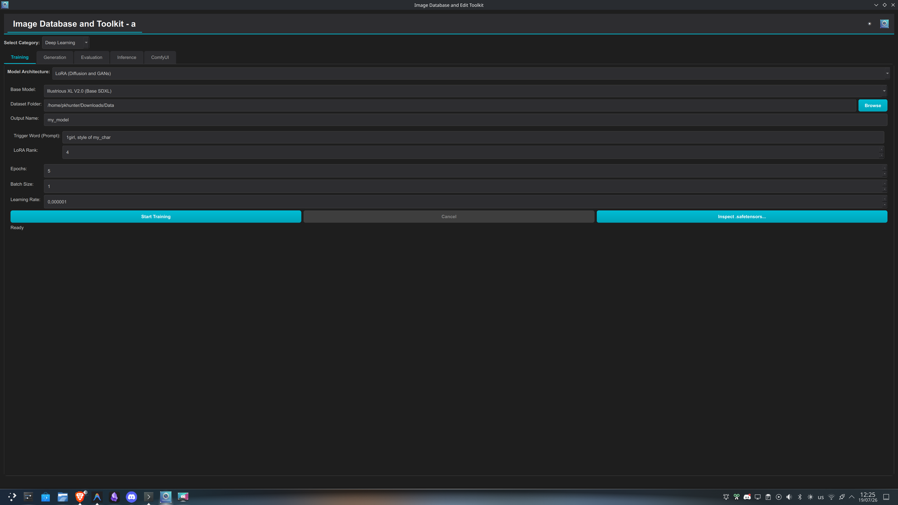
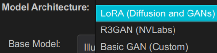
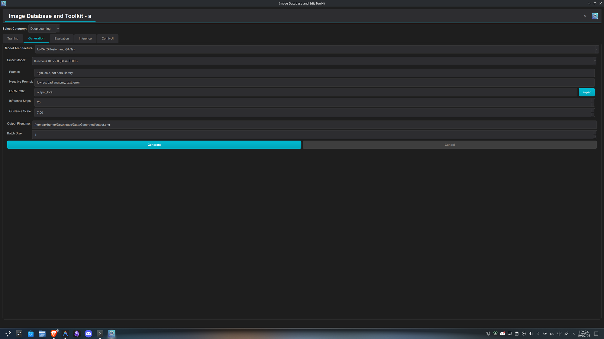
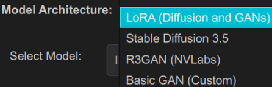
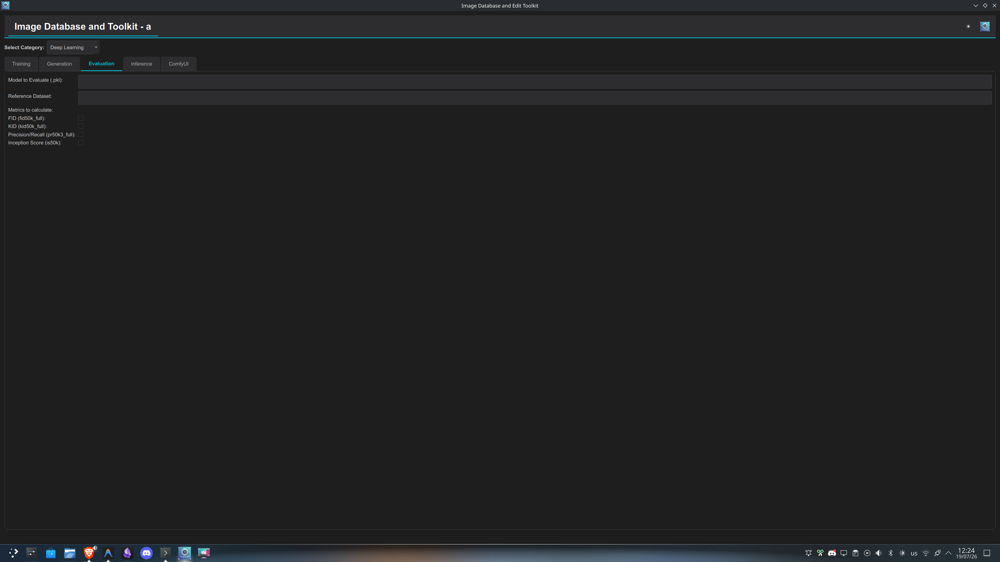
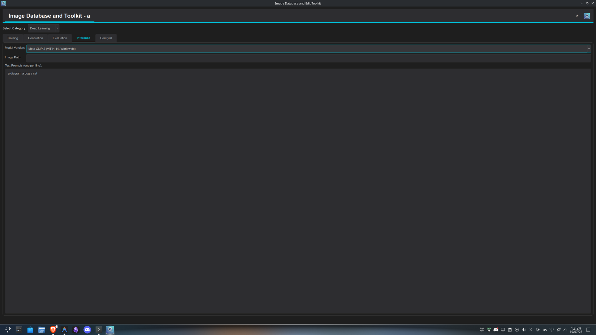
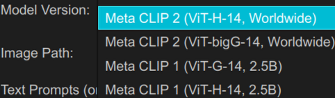
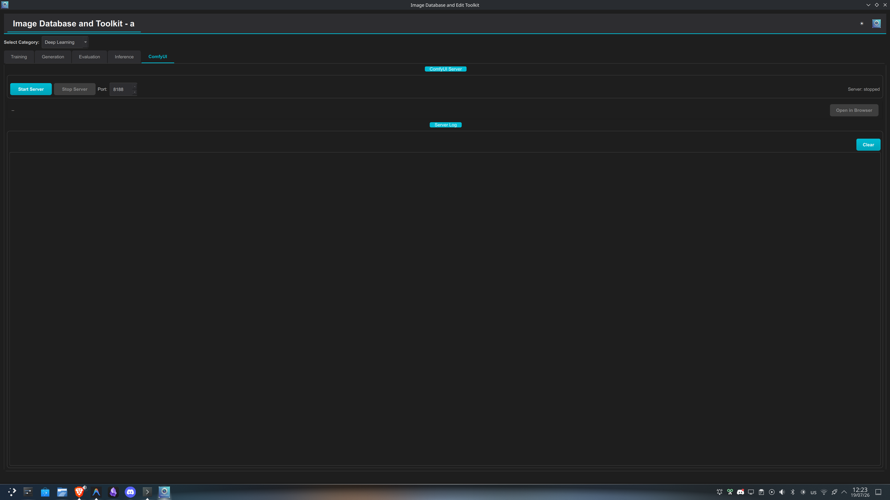

# :material-brain: Deep Learning — Tab Tutorials

The **Deep Learning** category hosts model training, image generation, model evaluation, zero-shot inference, and the embedded ComfyUI server. All tabs run models locally (GPU used when available, CPU otherwise).

!!! tip "Which tab do I want?"
    **Training** to teach a model *your* style/character. **Generation** to produce images from a model you already have. **Evaluation** to score a trained GAN objectively. **Inference** for one-off zero-shot classification, no training involved. **ComfyUI** when you need a pipeline more complex than a single prompt.

---

## Training

Trains or fine-tunes an image model. The **Model Architecture** selector switches the whole form between three architectures.

=== "LoRA (Diffusion and GANs)"
    Fine-tunes an existing diffusion model with a LoRA (Low-Rank Adaptation) — the practical way to teach a big model your character/style with a small dataset and modest VRAM, producing a small `.safetensors` file instead of a whole model.

    - **Base Model** — the pretrained model to adapt: `Illustrious XL V2.0 (Base SDXL)`, `Illustrious Lumina (Base SDXL)`, `Anything V3 / V4.5 / V5`, `Waifu Diffusion v1.4`, `Counterfeit V2.5`, `Animagine XL 3.1 / 4.0`, or `AnimeGANv2` (the one GAN entry — picking it hides the LoRA-specific fields). Choose the base whose default style is *closest* to what you want; the LoRA only has to learn the difference.
    - **Dataset Folder** — directory of training images.
    - **Output Name** — filename stem for the produced LoRA.
    - **Trigger Word (Prompt)** — the caption used during training (e.g. `1girl, style of my_char`). This becomes the token you later put in generation prompts to activate the LoRA — pick something unique that won't collide with normal vocabulary.
    - **LoRA Rank** — the adapter's capacity (default 4). Higher rank = more expressive power and a larger file, but more risk of overfitting a small dataset; 4–16 covers most character/style LoRAs.
    - **Epochs** (1–100, default 5) — passes over the dataset. More epochs = stronger learning, until it starts memorizing.
    - **Batch Size** (1–32, default 1) — images per training step; raise only if VRAM allows.
    - **Learning Rate** (1e-6–1e-3, default 1e-4) — step size of the optimizer. Too high diverges/fries the LoRA, too low barely learns; 1e-4 is the standard LoRA starting point.
    - **Inspect .safetensors…** — opens any `.safetensors` file and shows its embedded metadata (useful for checking what a downloaded LoRA was trained on).

=== "R3GAN (NVLabs)"
    Trains NVIDIA's R3GAN from scratch on your dataset. GAN training is a much bigger undertaking than a LoRA — expect long runs.

    - **Output Directory** (default `./training-runs`) — where run folders, logs, and snapshots go.
    - **Dataset (.zip)** — the training set as a ZIP archive (the format the NVLabs pipeline expects — images packed into a zip, optionally with labels for conditional training).
    - **Preset** — a bundled hyperparameter recipe named after the benchmark it was tuned for: `CIFAR10` (32px), `FFHQ-64`, `FFHQ-256` (faces at 64/256px), `ImageNet-32`, `ImageNet-64`. Pick the preset whose *resolution and diversity* best matches your data; it sets internal architecture/regularization defaults.
    - **GPUs** — number of GPUs to spread training over.
    - **Batch Size** (default 256) — total batch across all GPUs; the presets assume large batches, reduce for small VRAM.
    - **Mirror Data** — augments by horizontal flipping (doubles the effective dataset; leave off for text or asymmetric content).
    - **Use Augmentation** — enables adaptive discriminator augmentation, the main defense against discriminator overfitting on small datasets.
    - **Conditional GAN** — trains class-conditional (requires labels in the dataset zip); lets you pick the class at generation time.
    - **Log Frequency (ticks)** — how often (in training "ticks") progress is logged.
    - **Snapshot Frequency (snaps)** — how often a checkpoint `.pkl` is saved. Snapshots are what you later evaluate/generate from, but each costs disk space.

=== "Basic GAN (Custom)"
    A small self-contained DCGAN-style implementation — the "watch a GAN learn" option, good for experiments and small datasets, not for production quality.

    - **Dataset Path** — folder of training images (expects class subfolders, torchvision-style).
    - **Output Dir** (default `gan_checkpoints/`) — where `.pth` checkpoints are written.
    - **Epochs** (default 50), **Batch Size** (default 64), **Learning Rate** (default 0.0002 — the classic DCGAN/Adam value).
    - A live **Training Log** and a **Latest Training Sample** preview update during the run so you can watch sample quality evolve.

!!! warning "Scale mismatch between architectures"
    LoRA training (minutes to a couple hours, modest VRAM) and from-scratch GAN training (R3GAN, Basic GAN — hours to days) are not interchangeable time budgets. If you just want your character/style in existing art, LoRA is almost always the right first choice.

---

## Generation

Generates images with a trained/downloaded model. The **Model Architecture** selector mirrors the Training tab, plus Stable Diffusion 3.5.

=== "LoRA (Diffusion and GANs)"
    - **Select Model** — same base-model list as training (`Illustrious XL`, `Anything V3–V5`, `Waifu Diffusion`, `Counterfeit`, `Animagine XL`, `AnimeGANv2`). Use the same base the LoRA was trained on.
    - Diffusion settings (hidden when AnimeGANv2 is selected):
        - **Prompt** — what to generate; include your LoRA's trigger word.
        - **Negative Prompt** — what to steer *away* from (defaults list common failure terms: `lowres, bad anatomy, text, error`).
        - **LoRA Path** — the trained LoRA to load (with an **Inspect** button for its metadata).
        - **Inference Steps** (1–100, default 25) — denoising steps; more = slower and usually cleaner, with diminishing returns past ~30.
        - **Guidance Scale** (default 7.0) — how strongly the image must follow the prompt. Low (~3–5) = freer, more varied; high (~10+) = literal but risks artifacts/oversaturation.
    - GAN settings (AnimeGANv2 only): **Input Image** — AnimeGANv2 is an image-to-image stylizer, so it transforms an existing photo instead of generating from text.
    - Common: **Output Filename** (default under `…/Generated/output.png`) and **Batch Size** (1–8 images per run).

=== "Stable Diffusion 3.5"
    Runs SD3/SD3.5 checkpoints, optionally with ControlNet conditioning:

    - **Base Model** — a checkpoint path: `sd3.5_large`, `sd3.5_large_turbo` (few-step distilled variant), `sd3.5_medium`, `sd3_medium` (editable for custom paths).
    - **Prompt** — the text prompt.
    - **Output Postfix (opt.)** — appended to output filenames to tell runs apart.
    - **Width / Height** (256–4096, default 1024×1024) — output resolution; SD3.5 is tuned around ~1 MP.
    - **Steps** (default 28) — sampling steps (use far fewer with the *turbo* model).
    - **Skip Layer Cfg (SD3.5-M)** — enables the skip-layer-guidance trick recommended specifically for SD3.5 **Medium**, improving its coherence; leave off for Large.
    - **ControlNet Model** — `None`, or a `blur` / `canny` / `depth` ControlNet checkpoint: structure guidance that forces the output to follow an input map (edges, depth, or a blurred layout).
    - **ControlNet Cond. Image** — the conditioning image the ControlNet reads (e.g. a canny edge map for the canny model).

=== "R3GAN (NVLabs)"
    - **Network (.pkl)** — a snapshot produced by R3GAN training.
    - **Output Directory** — where generated images are written.
    - **Seeds** — which latent seeds to render, as a range/list (`0-7`); the same seed always reproduces the same image for a given network.
    - **Class Index (opt.)** — for conditional networks, which class to generate (−1 = unconditional).

=== "Basic GAN (Custom)"
    - **Checkpoint** — a `.pth` file from Basic GAN training.
    - **Count** (1–64, default 8) — how many samples to generate; results appear in the grid below.

!!! tip "Inference Steps vs. Guidance Scale"
    Think of Steps as *how carefully* the model denoises (quality/time trade-off) and Guidance as *how literally* it follows your prompt (freedom/fidelity trade-off). They're independent — raising one doesn't compensate for the other.

---

## Evaluation

Scores a trained R3GAN generator (`.pkl`) against a reference dataset using the standard GAN metric suite.

- **Model to Evaluate (.pkl)** — the snapshot to score.
- **Reference Dataset** — the real-image dataset the generator's outputs are compared to.

!!! danger "Reference dataset must match training"
    Use the *same dataset (and format) the model was trained on* — the ZIP archive (or its directory) of images at the training resolution. Every metric below is a comparison between generated-image statistics and *this* dataset's statistics, so an unrepresentative reference (different content, resolution, or preprocessing) makes the scores meaningless rather than just worse.

### Metrics to calculate

Each is a checkbox; the names carry the sample counts (`50k` = 50,000 generated samples — thorough but slow):

| Metric | Direction | What it measures |
|---|:---:|---|
| **FID** (fid50k_full) | ↓ lower better | *Fréchet Inception Distance* — embeds real and generated images with an Inception network and measures the distance between the two distributions (mean+covariance). The de-facto standard single number for "how close is the generated distribution to the real one." Captures both quality and diversity, but conflates them: you can't tell from FID alone whether a bad score means ugly images or mode collapse. |
| **KID** (kid50k_full) | ↓ lower better | *Kernel Inception Distance* — same idea with a kernel-based estimator that is **unbiased for small sample counts**. Prefer it over FID when your reference set is small (a few thousand images or fewer); roughly interchangeable with FID in what it seeks to capture. |
| **Precision/Recall** (pr50k3_full) | — | Separates what FID conflates: **Precision** = what fraction of *generated* images fall inside the real-image manifold (fidelity — are the outputs realistic?); **Recall** = what fraction of *real* images are covered by the generated manifold (diversity — can the model produce everything the dataset contains?). A high-precision/low-recall model makes pretty but repetitive images (mode collapse); low-precision/high-recall makes varied junk. |
| **Inception Score** (is50k) | ↑ higher better | Scores generated images alone (no reference needed): high when each image is *confidently classifiable* (sharp, recognizable content) and the set as a whole is *varied* across classes. The oldest metric of the group; least meaningful on narrow/non-ImageNet-like domains (e.g. all-anime datasets), so treat it as a sanity check rather than the headline number. |

---

## Inference

**What this tab is:** zero-shot image classification with Meta CLIP — it answers *"which of these descriptions best matches this image?"* without any training. CLIP models embed images and texts into the same vector space; the tab embeds your image once, embeds each text prompt, and ranks the prompts by cosine similarity to the image. "Zero-shot" means the candidate labels are whatever text you type, invented on the spot — no classifier is trained, no dataset needed.

- **Model Version** — which pretrained Meta CLIP to load:

    

    | Generation | Variant | Notes |
    |---|---|---|
    | **Meta CLIP 2** | ViT-H-14 (Worldwide) | Newer, multilingual training data |
    | **Meta CLIP 2** | ViT-bigG-14 (Worldwide) | Larger/more accurate/heavier than H-14 |
    | **Meta CLIP 1** | ViT-G-14 (2.5B) | First generation, 2.5B image-text pairs |
    | **Meta CLIP 1** | ViT-H-14 (2.5B) | First generation, 2.5B image-text pairs |

    Bigger ViT variants score more accurately but load slower and need more memory; start with an `H-14`.

- **Image Path** — the image to classify.
- **Text Prompts (one per line)** — the candidate labels, one per line (default example: `a diagram` / `a dog` / `a cat`). Each line is treated as one candidate class; phrasing matters — "a photo of a cat" style prompts typically score better than bare nouns, and prompts should be mutually comparable (same level of specificity).
- **Run** — executes the classification; the output is the list of your prompts with the model's probability for each (softmax over the similarities), i.e. how confident CLIP is that each description matches the image.

!!! example "What it's for in practice"
    Quickly checking whether an image matches a concept ("is this a Grimm or a Huntsman?"), prototyping label sets before committing to an auto-tagger, sanity-testing prompt wording, or comparing what different CLIP generations "see" in the same image.

---

## ComfyUI

**What ComfyUI is:** a widely used open-source, node-graph interface for diffusion pipelines. Instead of a fixed form (prompt → image), you build the pipeline visually from nodes — load checkpoint → encode prompt → sample → upscale → save — wiring outputs to inputs. That makes it the tool of choice for *complex or repeatable* workflows: multi-stage upscaling, ControlNet chains, inpainting pipelines, LoRA mixing, video/animation graphs — anything a one-shot form can't express. Workflows are shareable JSON files, so the community exchanges reproducible pipelines.

**What this tab does:** it manages a **local ComfyUI server** as a subprocess so you don't have to run it by hand.

- **Start Server / Stop Server** — launch or shut down the ComfyUI HTTP server.
- **Port** — the TCP port to serve on (auto-increments if the port is busy).
- **Status / URL** — shows the server state and, once ready, the local URL.
- **Open in Browser** — opens the ComfyUI web interface (the node editor) in your system browser; the actual workflow building and generation happen there.
- **Server Log** — the live server output (model loads, generation progress, errors), with a Clear button.

!!! tip "When to reach for ComfyUI vs. Generation"
    Use **this tab** when you need pipelines beyond what the Generation tab's forms offer (chained models, ControlNet stacks, custom node workflows). Use the **Generation** tab when a simple prompt-to-image is enough — it's faster to configure for the common case.
