# :material-image-multiple: Image Stitching — Tab Tutorials

The **Image Stitching** category is the Anime Stitch Pipeline (ASP) front-end: it reconstructs full backgrounds/panoramas from anime pan shots, webtoon strips, and video frames. Eight tabs cover the whole workflow: **Stitch** (the automatic pipeline), **Graph** (multi-stitch orchestration), **Adjust** (pre/post image correction), **Canvas** (simple compositing), **Statistics** (stitchability analysis), **Sequence Builder** (automatic frame ordering), **Hybrid Stitch** (fully manual, human-in-the-loop stitching), and **Animation Clusters** (animation-phase detection).

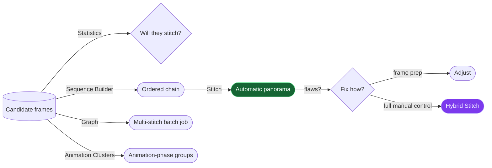

!!! tip "A typical session"
    Gather candidate frames → check them in **Statistics** → order them with **Sequence Builder** (or Auto-Order) → run **Stitch** → if the automatic result has flaws, fix frames in **Adjust** or take over completely in **Hybrid Stitch**.

!!! success ":material-new-box: Recent layout pass (S213)"
    The Stitch, Adjust, Statistics, and Hybrid Stitch tabs were reorganized for readability — no functionality changed, but the screenshots below reflect the *current* layout, not the older one. The concrete changes: the Stitch tab's Human-in-the-loop controls now live in their own **HITL** group box between **Output** and the run buttons; Adjust's buttons were enlarged so labels stop clipping; Statistics moved **K neighbors** to its own row above **Compute Statistics**; Hybrid Stitch's sidebar buttons got taller; and the Graph tab's output-directory button was relabeled from **…** to **Browse…**.

---

## Stitch

The main automatic pipeline. Three-pane layout: frame list (left), match preview (center), pipeline configuration (right), with progress/log/result at the bottom.

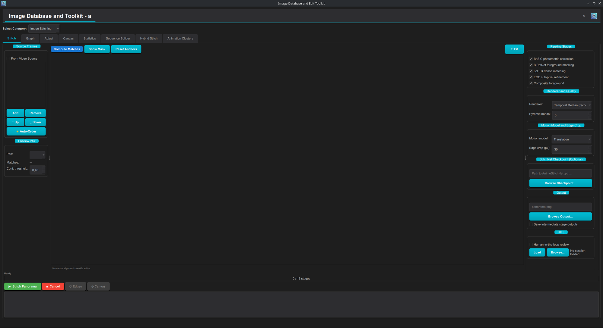

!!! info "Want the deep dive?"
    [Typical Workflows → Stitch anime frames into a panorama](workflows.md#workflow-2-stitch-anime-frames-into-a-panorama) walks every control on this tab step-by-step with the technical mechanics behind each one (what LoFTR's Conf. threshold actually gates, why Translation vs. Affine motion models trade off the way they do, what each of the ten possible HITL checkpoints lets you edit), plus paper/documentation links for the algorithms involved.

### Source Frames (left pane)

- **Add… / Remove / Move Up / Move Down** — build the frame list with a thumbnail file picker; you can also drag rows to reorder. **Order matters**: the list order is the stitching sequence (first = leftmost/topmost).

    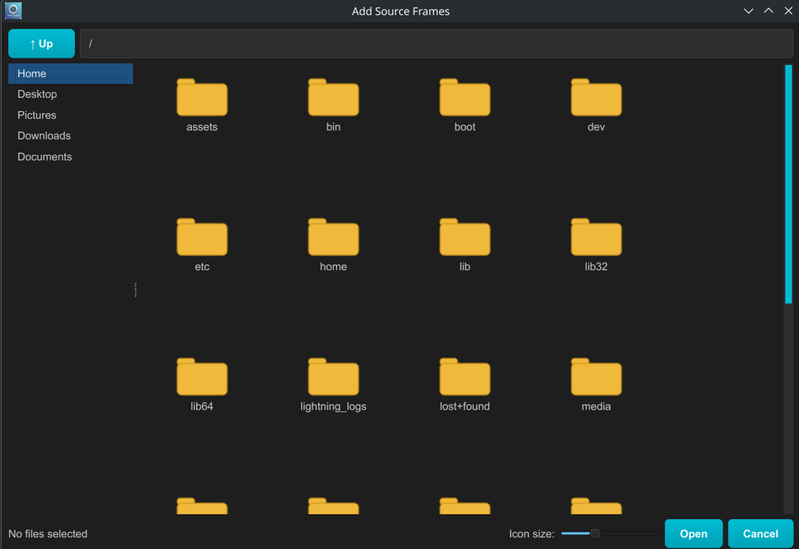

- **⚡ Auto-Order** — computes the longest coherent sequence starting from the selected image and reorders the list accordingly — the quick fix when frames were added out of order.
- **From Video Source** — instead of images, point at a video file and set **N** (2–200): N frames are extracted (requires PyAV) and become the frame list.
- **Preview Pair** — selects which consecutive (or skip-one) frame pair the center view displays. **Matches** shows the LoFTR correspondence count; **Conf. threshold** (0.10–0.99, default 0.40) hides matches below that LoFTR confidence — raise it to see only rock-solid correspondences.

### Match preview (center pane)

- **Compute Matches** — runs LoFTR on the selected pair and draws the correspondences between the two frames.
- **Show Mask** — overlays the BiRefNet foreground (character) mask on the left frame, so you can see exactly which regions are being *excluded* from matching.
- **Draggable anchors** — the displayed match anchors can be dragged to *manually override the alignment* for that pair; the label below reports when a manual override is active. **Reset Anchors** discards the override.
- **⊡ Fit** — refit the view.

### Pipeline Stages (right pane)

Five stage toggles, all on by default:

- **BaSiC photometric correction** — removes broadcast dimming and vignettes *before* matching, so brightness drift between frames doesn't corrupt alignment or blending.
- **BiRefNet foreground masking** — detects anime characters and excludes them from LoFTR matching. Strongly recommended: characters move between frames, and matching on them drags the background alignment along with the character.
- **LoFTR dense matching** — subpixel-accurate learned dense correspondences; unchecking falls back to classical template matching.
- **ECC sub-pixel refinement** — a final ECC pass after bundle adjustment that polishes each alignment to sub-pixel accuracy.
- **Composite foreground** — after the background is stitched (with characters suppressed), pastes the character back from the single best frame onto the result.

### Renderer and Quality

- **Renderer** — how overlapping pixels become one image:
    - **Temporal Median (recommended)** — per-pixel median across frames; Overmix-style suppression of MPEG noise and moving foreground remnants.
    - **First-Valid Pixel** — fastest; each output pixel comes from the first frame that covers it (no blending, seams possible).
    - **Sequential Laplacian Blend** — SCANS-style multi-band blending; smoothest seams.
- **Pyramid bands** (1–8, default 5) — Laplacian pyramid depth for the multi-band seam blending; more bands = smoother transitions at more compute.

### Motion Model and Edge Crop

- **Motion model** — **Translation** (fast; right for pure pans, the common anime case) or **Affine 4-DOF** (adds rotation/scale; for rotated panels at some robustness cost).
- **Edge crop (px)** (default 30) — strips this many pixels from each long edge of the final panorama, removing the alignment artefacts that accumulate at borders.

### StitchNet Checkpoint (Optional)

Path to a trained AnimeStitchNet `.pth` that supplements LoFTR's matches; leave blank to use LoFTR alone.

### Output

- **Output path** — where the panorama is written.
- **Save intermediate stage outputs** — dumps every pipeline stage into `<output>_stages/`: normalized frames (stages 1–3), background masks (4), edge graph JSON (5), affine matrices (6–7), canvas info (8), and canvas images per post-processing step (9–12). Enable when diagnosing misalignments — it also unlocks the **⬡ Edges** and **⬗ Canvas** inspector buttons for the last run.

### :material-new-box: HITL (its own group box)

Human-in-the-loop review now lives in a dedicated **HITL** group box, sitting between **Output** and the run controls:

- **Human-in-the-loop review** (checkbox) — pauses the pipeline at key checkpoints for manual intervention: stage 4 (exclude/reorder frames), stage 5 (toggle/disable edge-graph matches), stage 8 (nudge frame positions on the canvas), stage 9 (inspect the coverage heatmap). Your decisions are recorded as a *session*.
- **Load** — replay a saved HITL session non-interactively (all prior override decisions applied, no dialogs).
- **Browse…** — opens the HITL Session Browser to inspect, delete, export, or replay saved sessions. The status label next to the buttons (e.g. *"No session loaded"*) always shows what's currently active.

**▶ Stitch Panorama** runs the staged pipeline (progress bar counts stages); the log streams details; the **Stitch Result** box previews the output with a **Before/After** toggle and quality metrics. **■ Cancel** stops a running stitch; **⬡ Edges** / **⬗ Canvas** open the intermediate-stage inspectors described above (only enabled when **Save intermediate stage outputs** was on for the last run).

---

## Graph

A node-graph *planner* for multi-stitch jobs — stitch several pairs/groups in one run, including feeding one stitch's output into another (hierarchical stitching).

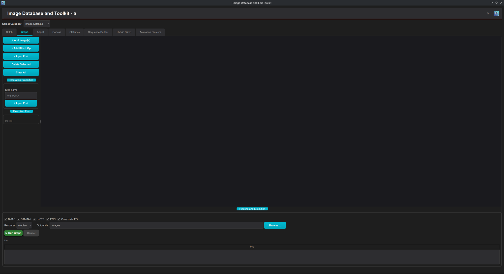

Workflow:

1. **+ Add Image(s)** — creates source nodes on the canvas.
2. **+ Add Stitch Op** — creates a stitch-operation node. **+ Input Port** adds extra inputs to the selected op (stitch 3, 4, … images in one op).
3. **Connect** — drag from an output port (right side, blue) to an input port (left side, green). An op's output can feed another op's input, chaining stitches.
4. **Selected Op Properties** — name the step (used for its output file); the **Execution Plan** box shows the resolved topological order.
5. Configure the shared pipeline at the bottom — the same toggles as the Stitch tab (**BaSiC / BiRefNet / LoFTR / ECC / Composite FG**), the **Renderer** (`median`/`first`/`blend`), and the **Output dir** where every op writes its result (its browse button is labeled **Browse…**).

    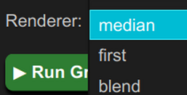

6. **▶ Run Graph** — executes all operations in dependency order with progress and log.

**Delete Selected** / **Clear All** manage the canvas. Use Graph instead of Stitch when one panorama isn't the goal — e.g. stitching each scene of an episode in a single batch, or building a large canvas from sub-stitches.

---

## Adjust

A lightweight image editor tuned for *preparing frames for stitching* and *polishing stitched results*. Load an image (**Open…**), tweak with live preview, then **Save As…** (full resolution), **→ Add to Stitch** (apply and append to the Stitch frame list), or **→ Add to Canvas** (append to the Canvas tab's image list).

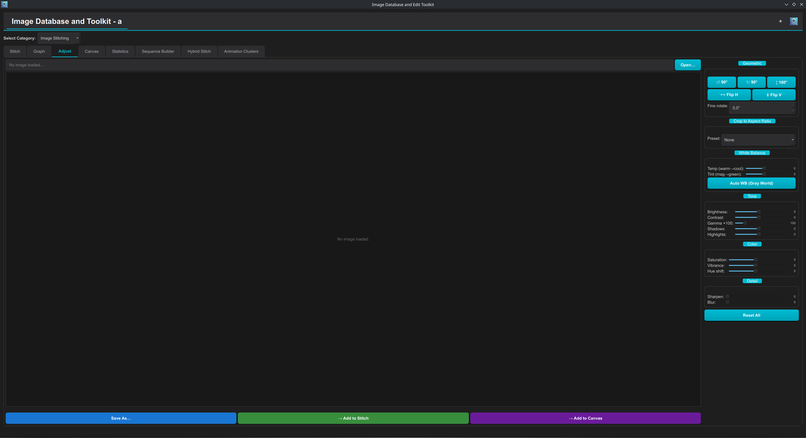

Control groups (all sliders −100…+100 unless noted):

- **Geometric** — 90°/180° rotations, **Flip H/V**, and **Fine rotate** (−180°…+180° in 0.1° steps; positive = clockwise) for straightening slightly tilted frames.
- **Crop to Aspect Ratio** — center-crop presets applied before the other adjustments.

    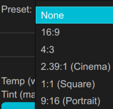

- **White Balance** — **Temp** (warm↔cool) and **Tint** (magenta↔green) sliders, plus **Auto WB (Gray World)** which removes dominant color casts — specifically the yellow/blue tinting that appears when stitching frames graded differently.
- **Tone** — Brightness, Contrast, **Gamma ×100** (10–500, 100 = neutral), Shadows, Highlights.
- **Color** — Saturation, Vibrance (saturation that spares already-saturated areas), Hue shift (−180°…180°).
- **Detail** — Sharpen (0–100) and Blur (0–50).
- **Reset All** — back to defaults.

---

## Canvas

Simple deterministic compositing — no content-aware stitching, just laying images out (the in-category counterpart of the Merge tab, aimed at contact sheets and strip assembly from already-stitched pieces).

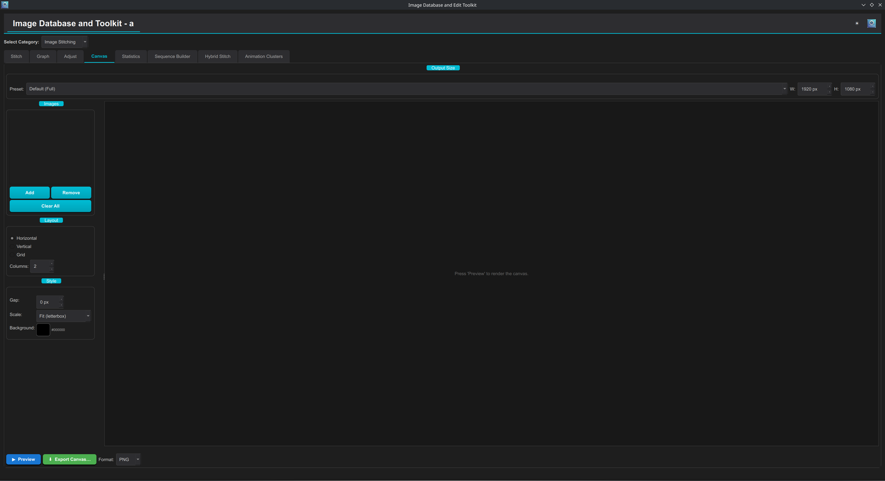

- **Output Size** — a preset list plus explicit **W/H** spinboxes (64–16384 px).

    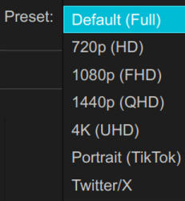

- **Images** — add/remove/clear; drag to reorder. Images are placed left-to-right / top-to-bottom in list order.
- **Layout** — **Horizontal**, **Vertical**, or **Grid** (with a **Columns** count).
- **Style**:
    - **Gap** (0–200 px) — spacing between cells.
    - **Scale** — per-cell fitting:

        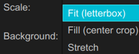

        **Fit (letterbox)** preserves aspect ratio with background bars, **Fill (center crop)** covers the cell and crops the excess, **Stretch** deforms to fill.
    - **Background** — the canvas/letterbox color.
- **▶ Preview** renders in-app; **⬇ Export Canvas…** writes the result as **PNG / JPEG / WebP**.

---

## Statistics

Answers "*will these frames stitch well?*" before you spend minutes on a pipeline run.

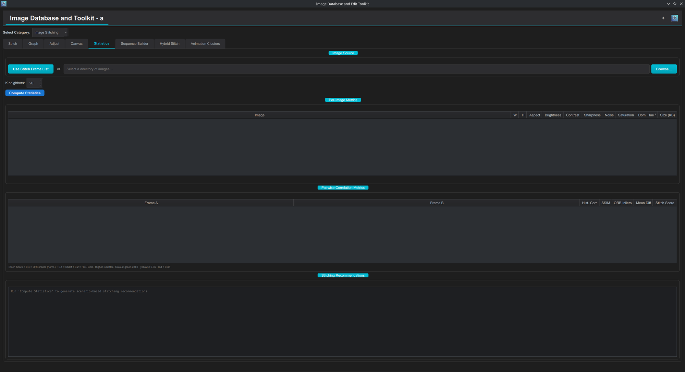

- **Image Source** — analyze the Stitch tab's current frame list (**Use Stitch Frame List**) or any directory.
- **K neighbors** (1–100, default 20) — when a consecutive pair scores below the weak threshold, each frame is also compared against its K nearest frames ahead/behind to find better matches; higher K catches periodic pose repetitions further apart at more compute cost. Now sits on its own row directly above **Compute Statistics**.
- **Per-Image Metrics** table — for every frame: dimensions, aspect, **Brightness**, **Contrast**, **Sharpness** (blurry frames hurt alignment), **Noise**, **Saturation**, **Dominant Hue**, file size — with a summary row. Outliers here (one dark frame, one blurry frame) are the frames to fix in Adjust or drop.
- **Pairwise Correlation Metrics** table — for each frame pair: **Histogram Correlation** (global color similarity), **SSIM** (structural similarity), **ORB Inliers** (geometrically consistent feature matches — the strongest stitchability signal), **Mean Diff**, and the combined **Stitch Score** = 0.4 × normalized ORB inliers + 0.4 × SSIM + 0.2 × histogram correlation. Rows are color-coded: green ≥ 0.6 (should stitch cleanly), yellow ≥ 0.35 (marginal), red < 0.35 (likely to fail).
- **Stitching Recommendations** — a generated scenario-based report reading the numbers for you (which pairs to trust, which frames to drop, suggested settings).

---

## Sequence Builder

Automatically discovers the best stitching *chain* from a pool of candidate frames — the answer to "I have a folder of frames; which belong to the pan, and in what order?"

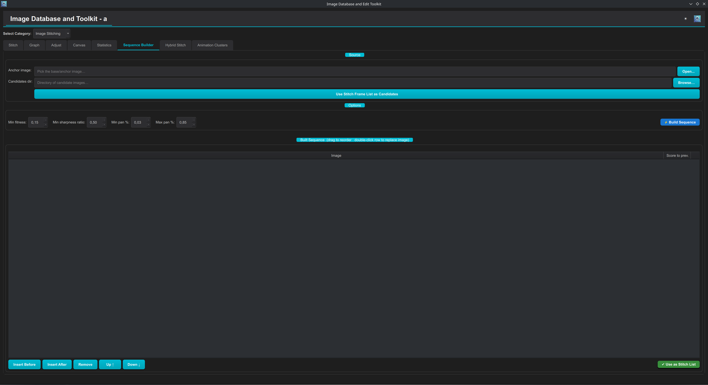

- **Source** — an **Anchor image** (the chain's starting frame) and a **Candidates dir** (the pool), or **Use Stitch Frame List as Candidates**.
- **Options**:
    - **Min fitness** (0.01–0.99, default 0.15) — the minimum stitching fitness to extend the chain, where fitness = ORB inlier ratio × displacement quality (which peaks around a ~30%-of-diagonal pan and hits zero for near-duplicates or non-overlapping frames). Raise to demand stronger links.
    - **Min sharpness ratio** (0–1, default 0.50) — rejects candidates whose Laplacian sharpness is below this fraction of the anchor's (filters motion-blurred frames); 0 disables.
    - **Min pan %** (default 0.03) — minimum camera translation as a fraction of the frame diagonal; below it a candidate is a near-duplicate and is rejected. Raise if duplicates sneak in.
    - **Max pan %** (default 0.85) — maximum translation; above it frames don't overlap enough to stitch. Lower it if stitches fail at large offsets.
- **⚡ Build Sequence** greedily grows the chain in both directions from the anchor.
- **Built Sequence** table — the resulting ordered chain with each row's *score to the previous frame*. Fully editable: drag to reorder, double-click a row to replace its image, **Insert Before/After**, **Remove**, **Up ↑ / Down ↓** (relabeled with text alongside the arrows, and widened, so the buttons are fully readable).
- **✔ Use as Stitch List** — replaces the Stitch tab's frame list with this sequence.

---

## Hybrid Stitch

The fully manual, human-in-the-loop stitcher — for shots where the automatic pipeline fails (heavy parallax, effects layers, extreme style). You align *one pair at a time* with hand-placed correspondences, then render. Five tool tabs sit across the top of the working area; the **Sequence** and **Working Pair** sidebar on the left (buttons enlarged to 36px tall) stays the same across all of them.

- **Sequence** (left sidebar) — the ordered frame list (**Add Frames…** / **Remove Selected** / **Move Up** / **Move Down** / **Clear All**).
- **Working Pair** — picks **Frame A** and **Frame B**, **Load Pair →** loads them into the active tool, and **✔ Accept H** stores the currently solved homography + seam for that pair. Work through the sequence pair by pair, accepting each. **✔ Use as Stitch List** sends the sequence back to the Stitch tab if you want the automatic pipeline to try it instead.

=== "Control Points"
    Two synchronized canvases (A and B); click matching points in both images (left[i] ↔ right[i]). **Add Points**, **Clear All**, **Auto-Detect (ORB)** (seed points from feature matching), **Suggest Next** (proposes the next correspondence to place).

    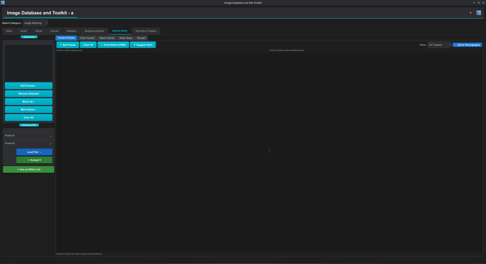

    Three solve modes:

    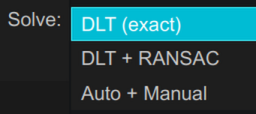

    **DLT (exact)** fits a homography through *every* pair with no outlier rejection (use when you trust every click), **DLT + RANSAC** is robust to a few bad clicks, **Auto + Manual** runs ORB feature matching first and appends your clicked pairs on top before re-solving. **Solve Homography** reports the mean reprojection error so you can judge the fit.

=== "Color Correct"
    Per-frame color/exposure corrections, to equalize frames graded differently before blending: **Brightness**, **Contrast**, **Saturation**, **Gamma**, **Temperature** sliders, **Reset All**, and **Match Adjacent →** (propagates the correction to the neighboring frame in the sequence).

    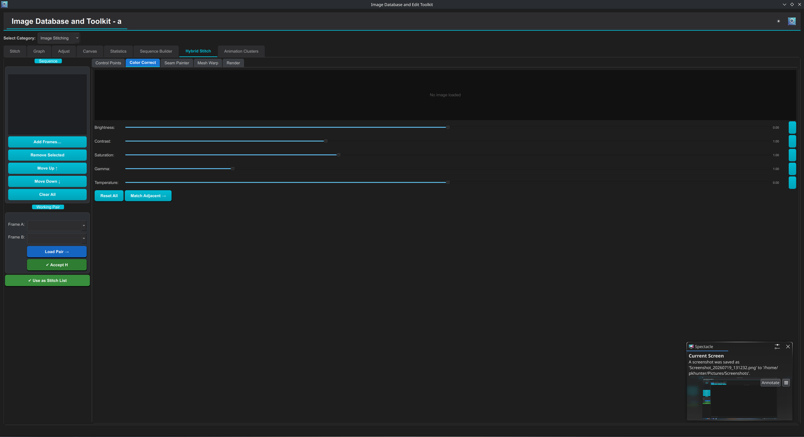

=== "Seam Painter"
    Shows the blended overlap after alignment; paint *hard seam constraints* with a brush to force the seam through regions you choose (e.g. around a character). **Brush: Force A (red) / Force B (blue) / Erase**, adjustable **Size**, **Preview Blend**, **Compute Seam**, **Clear Paint**.

    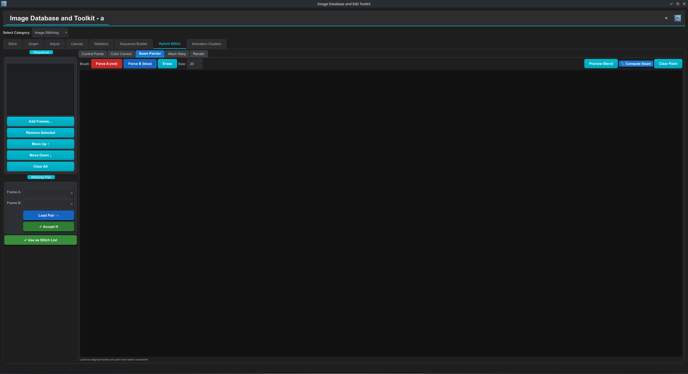

=== "Mesh Warp"
    A pin-based grid warp: drag grid pins to locally deform a frame, absorbing parallax or perspective the homography can't express. **Grid: rows/cols**, **Rebuild Grid**, **Reset Pins**, **⚡ Apply Warp**.

    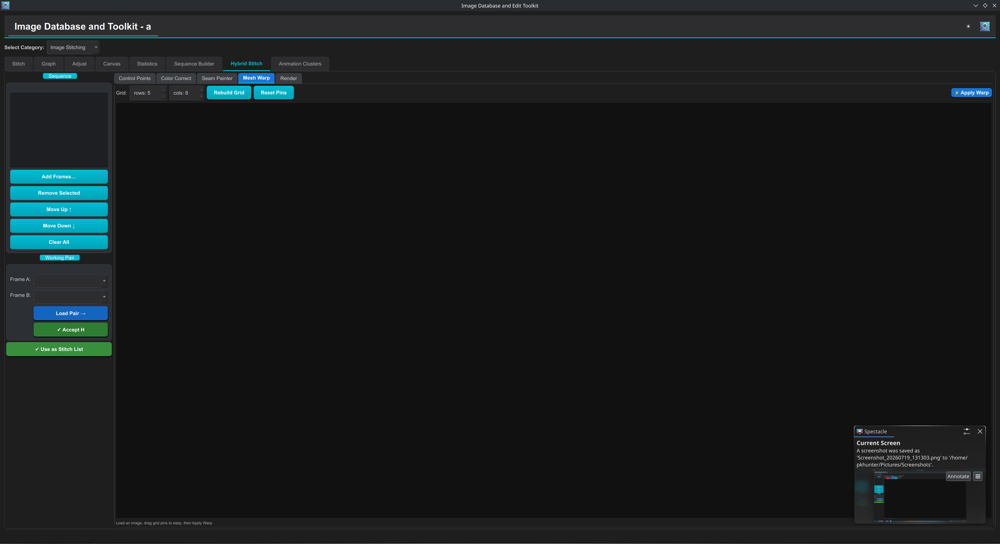

=== "Render"
    Composites the accepted pairs. **Blend mode** = `Seam mask` (use the painted seams), `Feather (50% overlap)`, or `Laplacian (5-band)`; toggles for **Apply color corrections** and **Use painted seam masks**; **⚡ Render Panorama** + **Save…** with preview.

    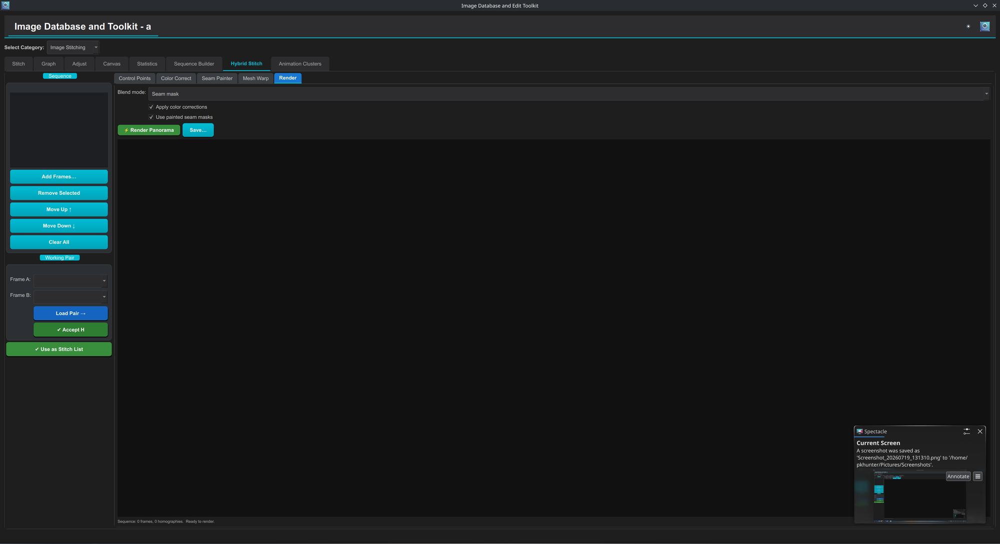
    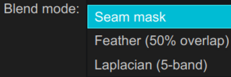

---

## Animation Clusters

Separates *animation phases* in a frame set. Anime loops cel phases (mouth flaps, blinking, cycles); frames from different phases must not be stitched together — this tab tells you which frames belong together.

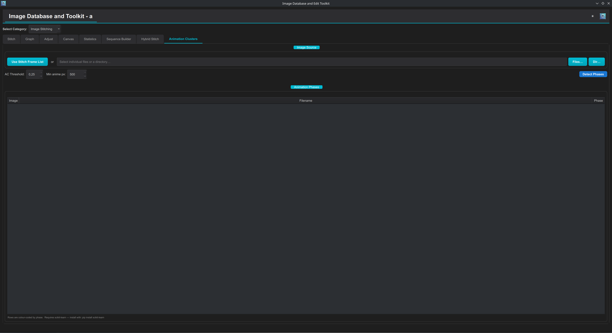

- **Image Source** — the Stitch frame list, picked files, or a directory.
- **AC Threshold** (0.01–1.0, default 0.25) — a pixel is labelled *animated* when at least this fraction of its temporal signal power sits in AC (non-constant) frequencies; lower = more sensitive to subtle motion.
- **Min anime px** (default 500) — minimum number of animated pixels (at the 320-px analysis scale) required before clustering is attempted; raise to suppress noise detections.
- **Detect Phases** — analyzes the set and fills the **Animation Phases** table: every frame with its assigned phase, rows color-coded per phase. (Clustering requires `scikit-learn`.)

!!! tip "Using the phase labels"
    Split your frame list by phase — stitch each phase separately, or feed only the dominant phase to the Stitch tab and let *Composite foreground* handle the character.
