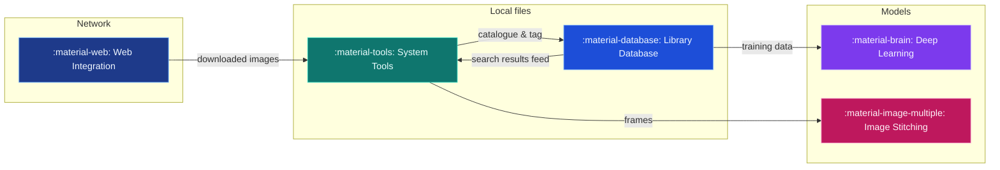

# :material-compass: Tab Tutorials

Task-oriented tutorials for every tab in the Image-Toolkit GUI, organized by the categories in the main window's *Select Category* dropdown. Each tutorial explains what a tab is for, how to use it, what its parameters mean, and shows the actual UI — **114 screenshots** across the five categories, plus diagrams and reference tables.

-   :material-tools:{ .lg .middle } **[System Tools](system_tools.md)**

    ---

    Convert (Format · Codec · Sampler) · Merge · Similarity · Extractor (Video · Image) · Wallpaper (System Display(s) · Monitor Display)

    *38 screenshots · 3 diagrams*

-   :material-database:{ .lg .middle } **[Library Database](library_database.md)**

    ---

    Listings (Content · Entity) · Image Search · Scan and Tag · Maintenance

    *26 screenshots · covers the new Metadata Editor, side-by-side filter lists, and Image Registry*

-   :material-web:{ .lg .middle } **[Web Integration](web_integration.md)**

    ---

    Crawler · Requests · Cloud Synchronization · Reverse Search · Entity Reconnaissance

    *23 screenshots · privacy trade-offs called out explicitly*

-   :material-brain:{ .lg .middle } **[Deep Learning](deep_learning.md)**

    ---

    Training · Generation · Evaluation · Inference · ComfyUI

    *8 screenshots · GAN metric reference table*

-   :material-image-multiple:{ .lg .middle } **[Image Stitching](image_stitching.md)**

    ---

    Stitch · Graph · Adjust · Canvas · Statistics · Sequence Builder · Hybrid Stitch · Animation Clusters

    *19 screenshots · the full ASP pipeline workflow*

!!! tip "Tab layouts evolve"
    When a control described here has moved, its group-box title (quoted in the tutorials) is the fastest thing to search for in the UI. Sections marked :material-new-box: **New** document behavior that changed recently — check those first if something doesn't match what you see.

!!! info "How these were built"
    Every screenshot was captured live against the running app (not mocked up), and every described behavior was cross-checked against the current widget source and recent commits/changelog entries — not written from memory. If a tutorial and the app ever disagree, the app is right; please flag the mismatch.
