# :material-database: Library Database — Tab Tutorials

The **Library Database** category is everything that lives in the unified encrypted library (`~/.image-toolkit/library.db`, SQLCipher): your media/entity listings, the image search index, image tagging, and store maintenance. The library opens automatically with your vault session — the same login-time key derivation unlocks it, so there is no separate password.

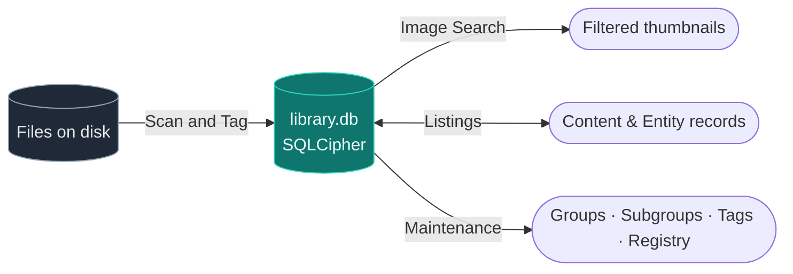
```mermaid
flowchart LR
    Files[(Files on disk)] -->|Scan and Tag| DB[(library.db\nSQLCipher)]
    DB -->|Image Search| Results([Filtered thumbnails])
    DB <-->|Listings| Catalogue([Content & Entity records])
    DB -->|Maintenance| Admin([Groups · Subgroups · Tags · Registry])

    style DB fill:#0f766e,stroke:#2dd4bf,color:#ecfeff
    style Files fill:#1f2937,stroke:#94a3b8,color:#e5e7eb
```

!!! tip "Recently changed"
    The **Scan and Tag** batch-metadata flow, **Image Search**'s group/tag filters, and the **Maintenance** tab all got a significant upgrade — see the callouts marked :material-new-box: **New** below.

---

## Listings

A personal catalogue of *content* (anime, movies, shows, books, manga, games…) and *entities* (people, studios, characters…), stored encrypted. Two subtabs: **Content Listings** and **Entity Listings**. Both show a searchable card gallery on the left and a detail panel for the selected entry on the right.

### Content Listings

Each entry holds a title, type, status, ratings, year, episode counts, genres, tags, associated entities, an optional local file, a web link, a summary, and your review.

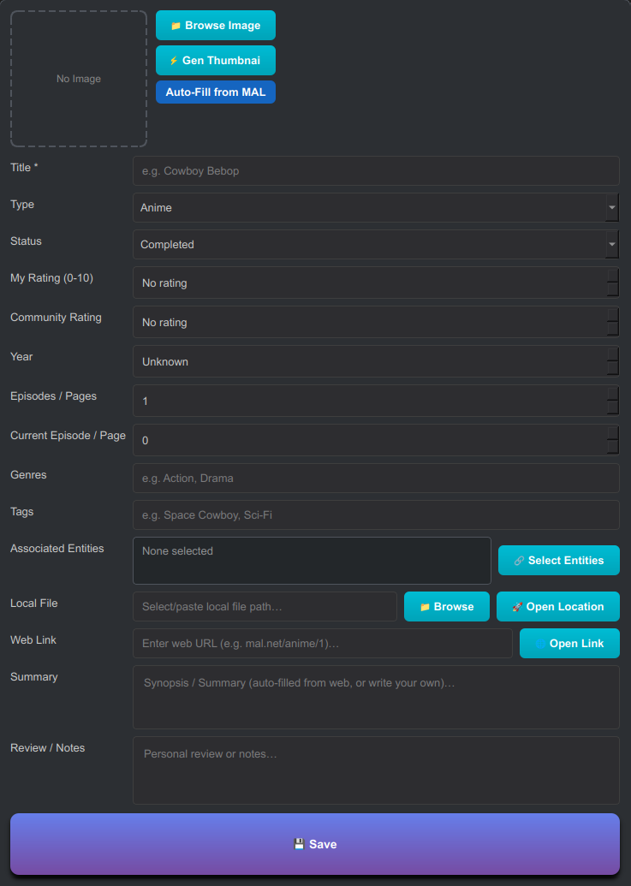

- **⚡ Gen Thumbnail** — extracts a cover image *from the entry's associated Local File*. Point the entry's Local File at a video (or a file inside the series' folder), click the button, and a representative frame is grabbed and stored as the entry's thumbnail — no manual screenshotting. (The same button exists inside the episode editor to generate per-episode thumbnails.)
- **Auto-Fill from MAL** — fetches metadata from MyAnimeList and fills the form (title, ratings, year, episode count, genres, synopsis, and — where the fetch method provides them — characters/staff matched to your entities). Only enabled while **Type = Anime**. Three fetch methods are selectable in *Settings → System and Logging → MyAnimeList Auto-Fill*: **Jikan** (default; richest data, no key, but depends on the Jikan proxy's health), **official MAL API v2** (needs a free client ID; no character/staff data), and **direct scraping** (no key, full data). Transient gateway errors (429/502/503/504) are retried automatically with backoff.
- **Tags** (and **Genres**) — free comma-separated text fields on the entry. They power the gallery's tag/genre sorting, the Advanced Search include/exclude filters, and the Recommend engine's sparse features — consistent naming pays off.
- **Associated Entities** — links the entry to Entity Listings records via **🔗 Select Entities** (a picker dialog). Links are bidirectional: the entity's own detail panel lists the content back, and the read-only display box under the field shows the currently linked names.

    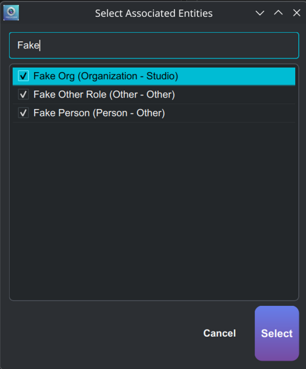

- **Episodes / Chapters / Parts** section — a per-entry sub-list for tracking individual episodes, chapters, or parts. **＋ Add Episode Entry** opens an editor with *Number, Title, Date, Rating, Review, Local File, Web Link* (and its own Gen Thumbnail). Saved rows are listed with a star-rating display, quick open-file/open-link buttons, and per-row edit/delete.
- **Advanced Search** — a criteria dialog (reached from the search row) with three tabs — **Entities**, **Tags**, **Genres** — each providing *Include* and *Exclude* lists. **Match Mode (Inclusions)** decides whether an entry must match **ALL** positive criteria (AND) or **ANY** of them (OR); exclusions always remove matches. Use it for queries a plain text search can't express ("everything with entity X and tag Y but not genre Z").
- **🌟 Recommend** — ranks your *own* catalogue against a query using the local recommendation engine (BGE-M3 embeddings + hybrid retrieval; fully offline). The dialog takes an optional **Type** filter, comma-separated **Genres/Tags/Entities**, and a free-text **Natural Language Prompt**; results replace the gallery, sorted by relevance score. First run embeds new entries, so it can take a moment on a fresh catalogue.
- **Sort by / Order** — the gallery header's sort controls: sort by Title, Rating, Episodes, Current Episode, Date, Type, Status, Local Filename, or Tags, either **Ascending** or **Descending**.

    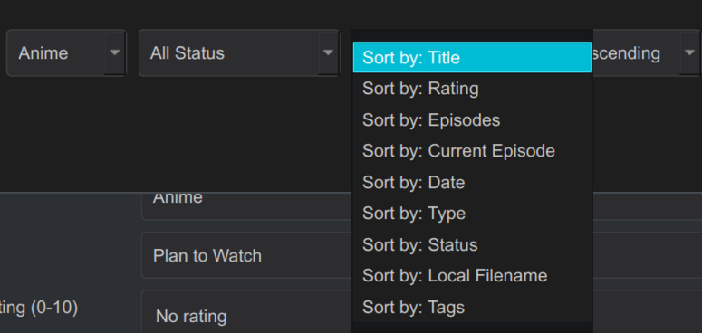
    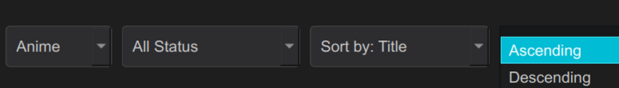

### Entity Listings

Entries for people and organizations connected to your content.

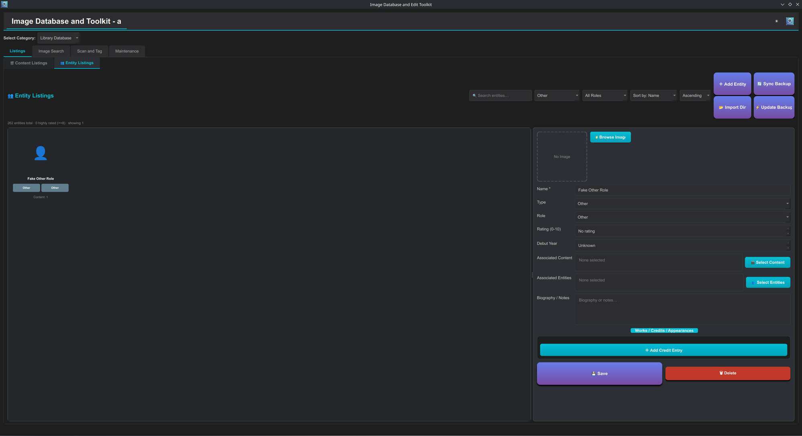

- **Type vs. Role** — two different axes:
    - **Type** is *what the entity is*: `Person`, `Organization`, `Fictional Character`, or `Other`. It drives the card's color coding and top-level filtering.
    - **Role** is *what the entity does relative to your content*: `Actor / Seiyuu`, `Director`, `Producer`, `Writer`, `Studio`, `Publisher`, `Fictional Character`, `Other`. A Type=Person can have Role=Director; a Type=Organization is typically Role=Studio or Publisher.

    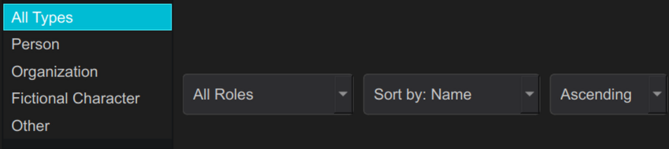
    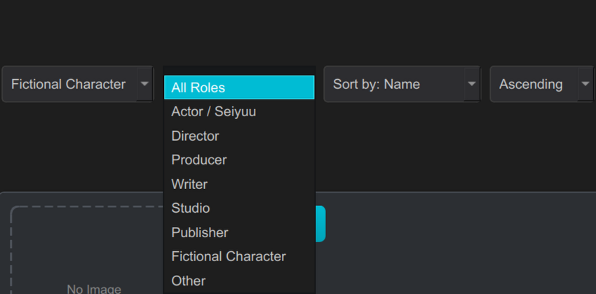

- **Associated Content** — links the entity to Content Listings entries (the mirror of the content side's Associated Entities) via **Select Content**. The read-only box shows linked titles and scrolls when the list is long.

    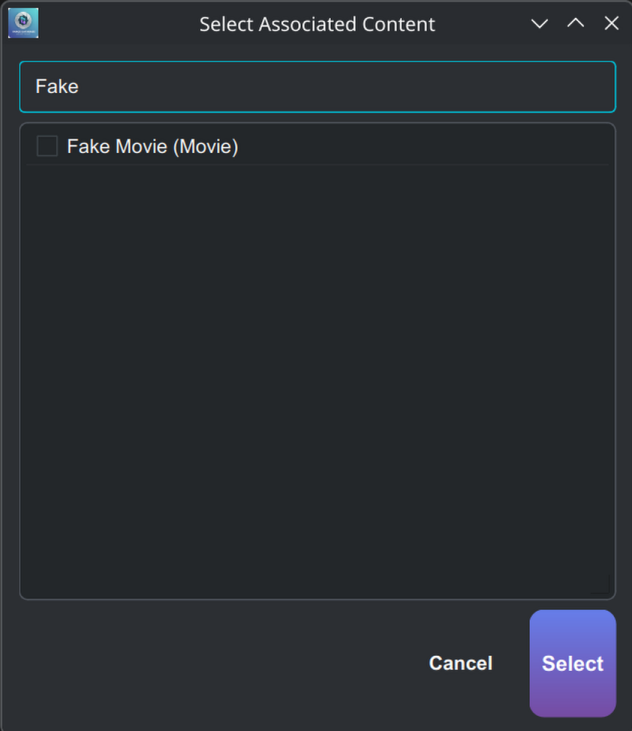

- **Associated Entities** — links entities *to each other* (a character to their voice actor, a person to their studio…) via **Select Entities** — same picker-dialog pattern, shown here alongside the detail panel it feeds.

    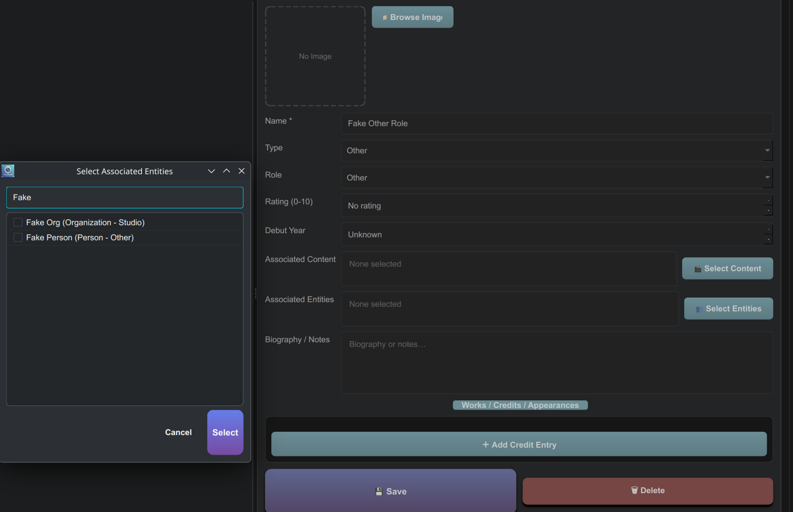

- **Works / Credits / Appearances** — **+ Add Credit Entry** builds a free-form credits list on the entity (e.g. roles across different productions).
- **Sort by / Order** — sort entities by Name, Rating, Type, Role, Date Added, or Credits Count, ascending or descending.

    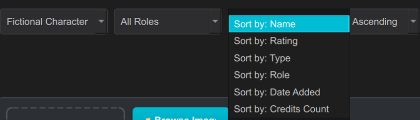

### Both subtabs

- **📂 Import Dir** — a one-shot import wizard: pick a directory of video/image files → the wizard groups the files into detected series (or detects entity images) → configure shared metadata → confirm.

    === "Content Listings"
        Scans for video files, groups them into series by filename, and expects `<Series> - <##> [suffix].ext` naming. Per series it creates: title from the filename prefix, episode count from matching files, the first episode as the Local File, individual episode entries, and episode numbers parsed from filenames.

        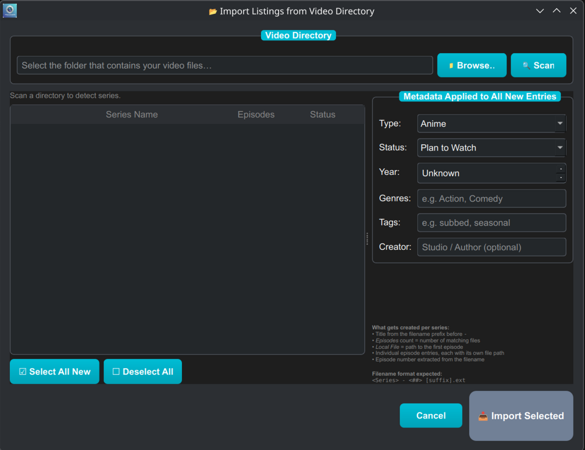
        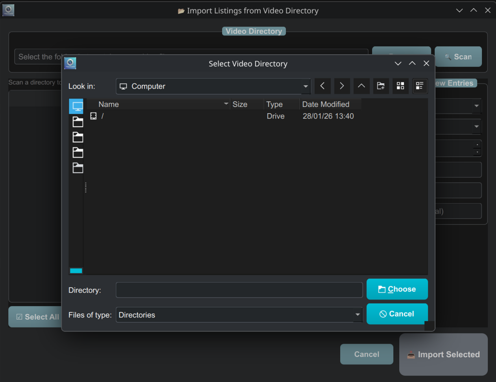

    === "Entity Listings"
        Scans for image files and expects `<First Name> <Last Name><Optional Number>.ext` naming — first/last name are parsed from the filename, trailing digits are stripped, and the image is copied in as the entity's profile picture automatically.

        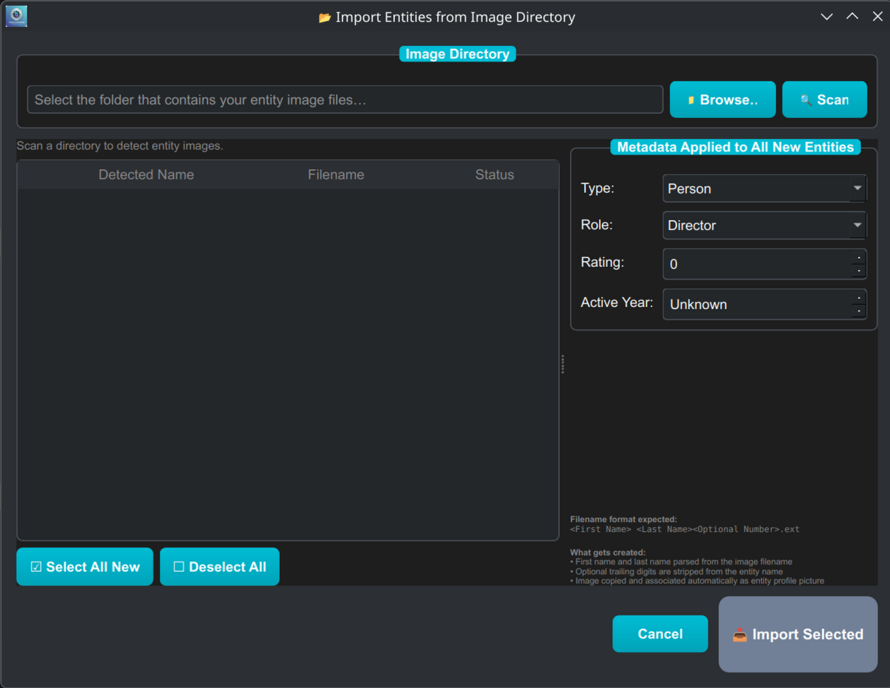

    Each ticked series/entity becomes a new entry; existing titles/names are skipped. **Select All New** / **Deselect All** manage the checkboxes.
- **🔄 Sync Backup / ⚡ Update Backup** — the encrypted-file backup pair:
    - **Update Backup** *writes* the backup: encrypts all current entries to a `.enc` file (using your vault key) and archives every referenced image (covers, episode thumbnails) into multi-part ZIPs.
    - **Sync Backup** *reads* it: decrypts the `.enc` file and upserts its entries into the library — the recovery path after data loss or when moving to a new machine. It refuses to run if no backup file exists yet ("Use 'Update Backup' first").
    - Rule of thumb: run **Update Backup** after significant editing sessions; touch **Sync Backup** only to restore.

!!! danger "Backups are your only recovery path"
    The library is encrypted at rest — there's no way to recover data if the vault key is lost except from a `.enc` backup. Run **Update Backup** regularly, especially after big cataloguing sessions.

---

## Image Search

Queries the image index of the unified library and shows matching thumbnails. Its power is that one query can mix **database metadata** with **file-system facts**.

!!! success ":material-new-box: New — side-by-side checkable filter lists"
    Group and Subgroup filters used to be free-text boxes; they're now **checkable list widgets** shown side by side, matching the Tag Types + Tags layout. This makes multi-select filtering (several groups or several tags at once) discoverable and mistake-proof instead of requiring exact-name typing.

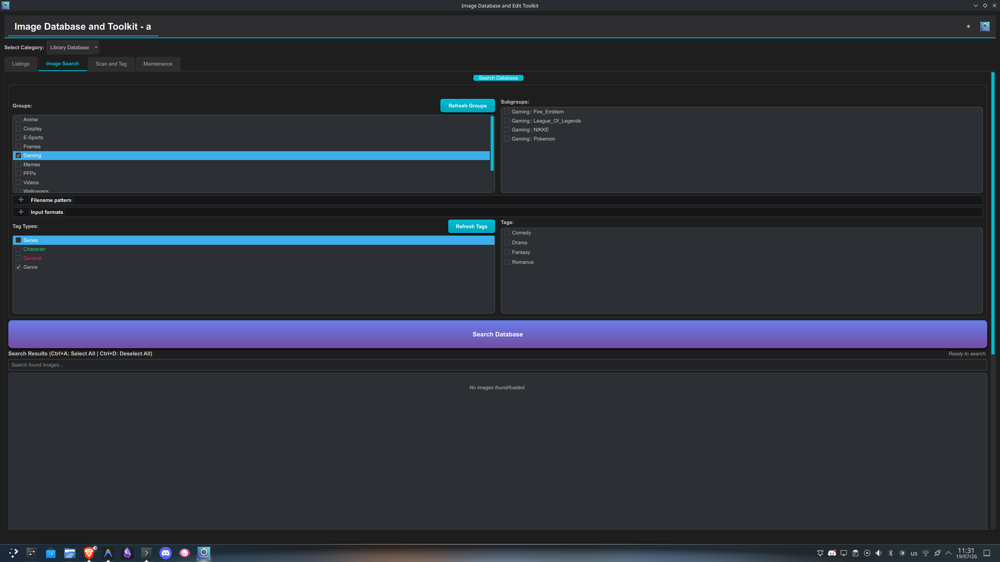

- **Groups** (left list) — check any number of groups. **Subgroups** (right list) updates dynamically to show only subgroups belonging to the checked groups, each entry prefixed `Group:: Subgroup` (e.g. `Gaming:: League_Of_Legends`) so the parent is always visible even with several groups checked at once.
- **Refresh Groups** — re-reads the group/subgroup list from the database; use after creating groups elsewhere (e.g. in Maintenance) so they appear here.
- **Tag Types** (left list) — check any number of tag *types* (`Series`, `Character`, `General`, `Genre`, …) to narrow which tags the **Tags** list (right) offers; **Refresh Tags** re-reads the tag vocabulary from the database.
- **Filename pattern** and **Input formats** (collapsible sections) — file-system criteria independent of any DB metadata: a glob-style pattern (`*.png`, `img_001`) and per-format toggle buttons (with **Add All** / **Remove All**).

    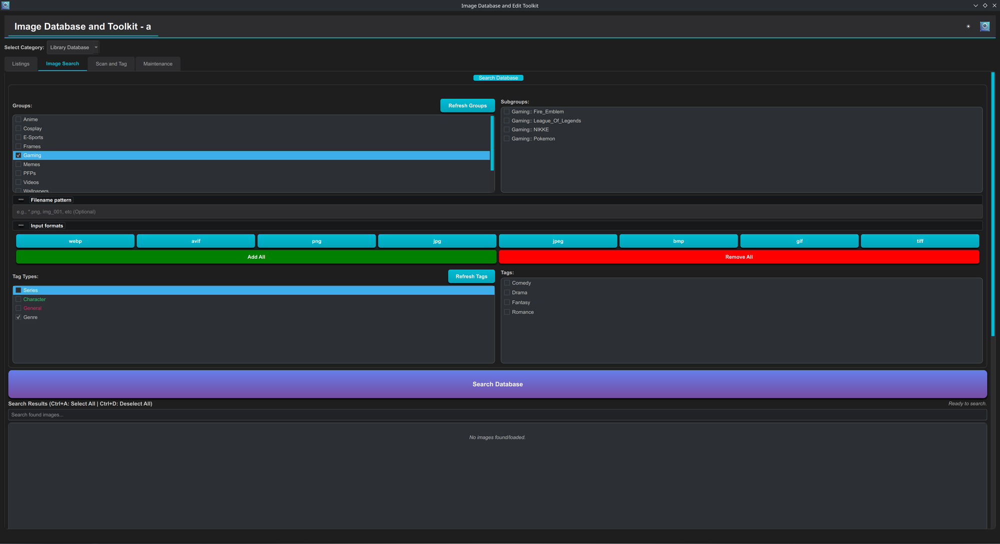

- **Combining criteria** — everything filled in is ANDed. Example: Group `Gaming` + Subgroup `Gaming:: League_Of_Legends` + tag type `Genre` + tag `Comedy` + format `png` returns only PNGs registered under that subgroup and tagged Comedy. Leave a criterion empty/unchecked to not constrain on it; an empty form returns everything.
- **Search Results / Selected Images** — results support marquee selection, Ctrl+A / Ctrl+D select/deselect-all, previews, and sending selections to other tabs (Scan and Tag, Merge, Similarity, Wallpaper).

    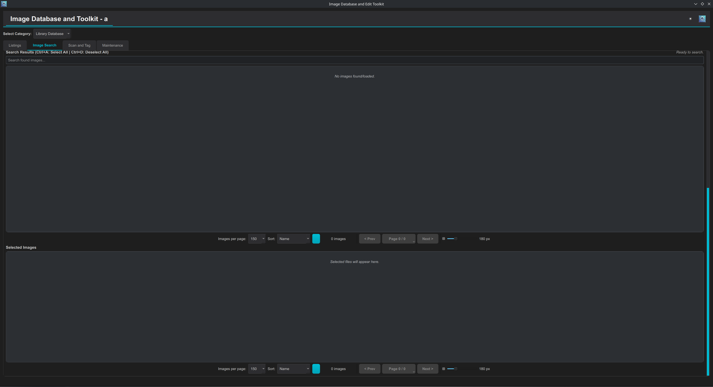

---

## Scan and Tag

Registers image files into the library and batch-edits their metadata. Workflow: choose a **Scan Directory** → thumbnails appear in the scan gallery → click images to move them into the *Selected* gallery → apply batch metadata.

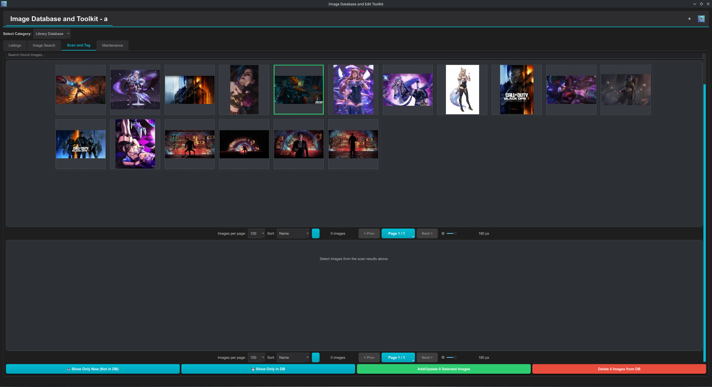

- **👁️ Show Only New (Not in DB)** vs. **💾 Show Only In DB** — two toggle filters on the scan gallery (mutually exclusive in practice):
    - **Show Only New** hides every file already registered, leaving exactly the files that still need to be imported — the "what's left to catalogue" view. After you add images while this is on, they disappear from the gallery immediately.

        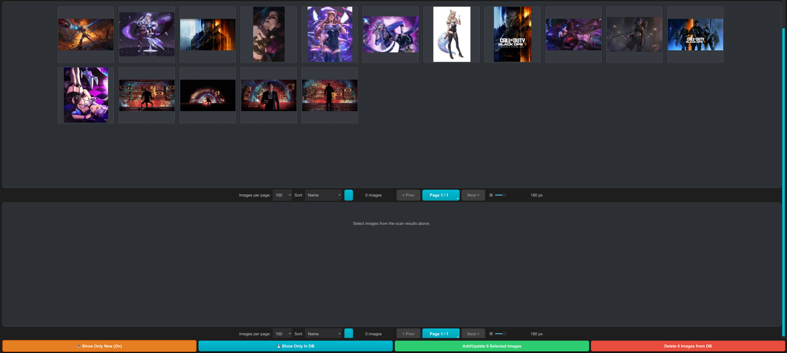

    - **Show Only In DB** is the inverse: only files already registered — the view for *re-tagging or auditing* existing records.
    - With neither active you see everything, with in-DB images visually marked.
- **Right-click a thumbnail** for a context menu including :material-new-box: **🔌 Remove from Database** — deletes the image's *database record* while leaving the file on disk untouched (distinct from **Delete Images Data from Database** below only in that it's a single-image, in-context action with its own confirmation and immediate card/filter refresh).

### :material-new-box: Add/Update N Selected Images — the Metadata Editor

Clicking the green **Add/Update N Selected Images** button now opens a dedicated **Metadata Editor** dialog instead of writing a single flat batch straight away. It has one **Batch / Overview** tab plus one tab *per selected image*.

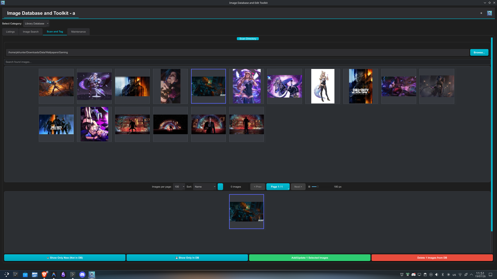

=== "Batch / Overview tab"
    Set metadata once and fan it out:

    - **Group** / **Subgroup** — set for all images; **↓ Apply to All Image Tabs** copies these values (plus the checked tags) onto every per-image tab in one click.
    - **Tags** — a checkable list with an optional **Filter by Type** toggle (off by default): switch it on to reveal per-type checkboxes (`Artist`, `Series`, `Character`, `General`, `Meta`, …) and narrow the list to only the checked types.
    - **Clusters (optional — override specific image subsets)** — **+ Add Cluster** creates a named override group: pick which of the selected images belong to it, then give *that subset* its own Group/Subgroup/Tags independent of the main batch values. Use this when most images share metadata but a few need something different — no need to close the dialog and re-select.
    - **Group pattern (sequential)** — inside a cluster, check this to turn the Group/Subgroup fields into **templates**: `{n}` is replaced by the image's position in the cluster (1-based), or if you omit `{n}` the index is auto-appended. E.g. `Episode{n}` → `Episode1`, `Episode2`, … across the cluster's images in order. This is the fast path for tagging a batch of sequentially-numbered episode/page screenshots without editing each one by hand.
    - **↓ Apply All Clusters to Image Tabs** — writes every cluster's resolved values onto their member images' individual tabs.

=== "Per-image tabs"
    One tab per selected image (titled with its filename), pre-filled from the Batch tab's values and independently editable — a thumbnail, Group, Subgroup, and the same Filter-by-Type tag list, scoped to *this* image only.

    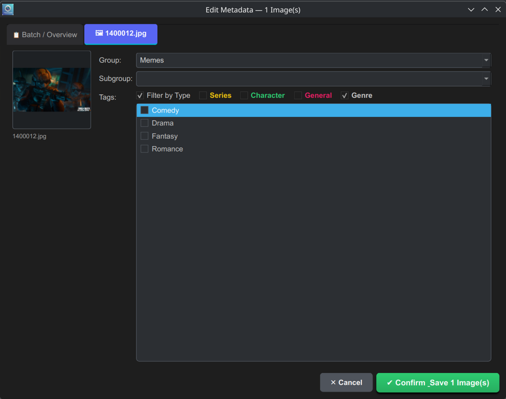

**✔ Confirm & Save N Image(s)** commits every tab's current values to the database in one transaction — new images get a fresh record (path, probed width/height, Group/Subgroup/tags); existing images are updated in place.

!!! tip "When to reach for clusters vs. per-image tabs"
    Use a **cluster** when a *subset* shares metadata that differs from the rest of the batch (fast, still bulk). Use **per-image tabs** for one-off corrections on individual outliers. Clusters and per-image edits can be combined — apply a cluster first, then fine-tune specific tabs afterward.

- **Delete Images Data from Database** removes the *records* of the selected images (never the files themselves) — the bulk counterpart to the right-click **Remove from Database** action above.

---

## Maintenance

Administration of the unified library store itself (this tab was the old "Database" tab; since Phase DB it manages the encrypted SQLCipher library).

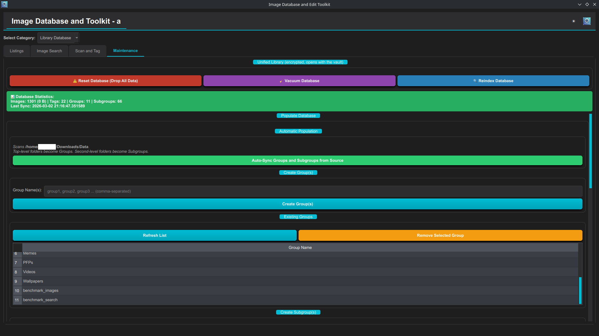

### Unified Library buttons

- **🔓 Open Library** — opens the encrypted store using the current vault session key. Normally the library auto-opens at login; this button exists for the locked-vault edge case. A statistics banner (image/group/subgroup/tag counts, dates) confirms a healthy connection.
- **⚠️ Reset Database (Drop All Data)** — wipes all data from the store. Deliberately gated: it refuses to run unless a *verified* backup manifest exists, and asks for confirmation. Use only when you truly want a fresh library.
- **🧹 Vacuum Database** — SQLite `VACUUM`: rewrites the database file to reclaim free space after large deletions and defragment pages. Safe any time; takes a moment on large stores.
- **🔍 Reindex Database** — rebuilds SQL indexes. Useful if searches have become slow or after bulk imports; also safe any time.

### Populate Database

- **Automatic Population** — **Auto-Sync Groups and Subgroups from Source** scans your configured source directory and mirrors its folder structure: *top-level folders become Groups, second-level folders become Subgroups*. The fastest way to bootstrap a group hierarchy that matches how your files are already organized.
- **Groups vs. Subgroups** — the two-level organizational hierarchy for images: a **Group** is the broad collection (a series, a trip, an artist), a **Subgroup** is a subdivision *belonging to one group* (an arc, a location, an album). Every subgroup has a parent group; images can then be filed under group alone or group+subgroup (see Scan and Tag). The *Create Group(s)* / *Create Subgroup(s)* forms accept comma-separated names for bulk creation (subgroups additionally need the parent group picked), and the *Existing …* lists support refresh/remove.

    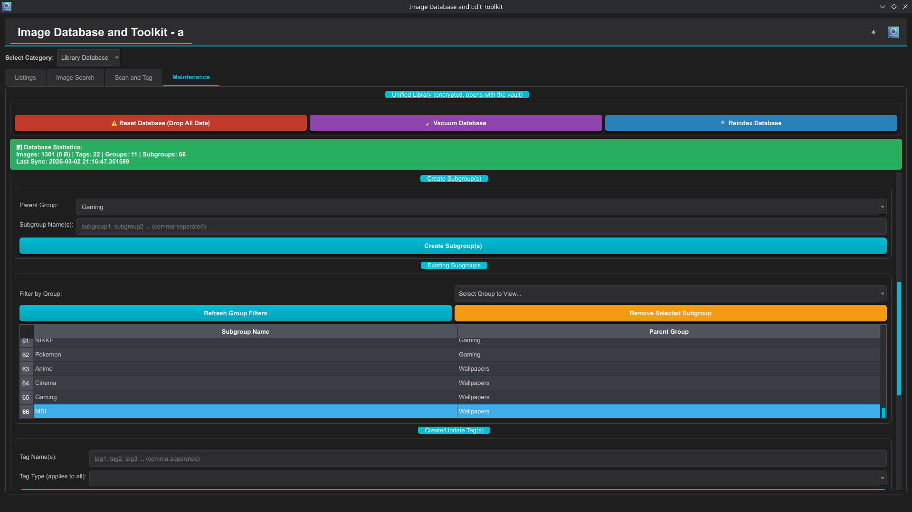

- **Tags** — the flat, typed labels that cut across groups (`Artist`, `Series`, `Character`, `General`, `Meta` types are offered, and the type combo is editable for custom types). *Create/Update Tag(s)* accepts comma-separated names with one **Tag Type** applied to all; the *Existing Tags* list supports refresh/remove. Tags are what the Image Search tab's checkbox list and Scan and Tag's batch panel draw from.

    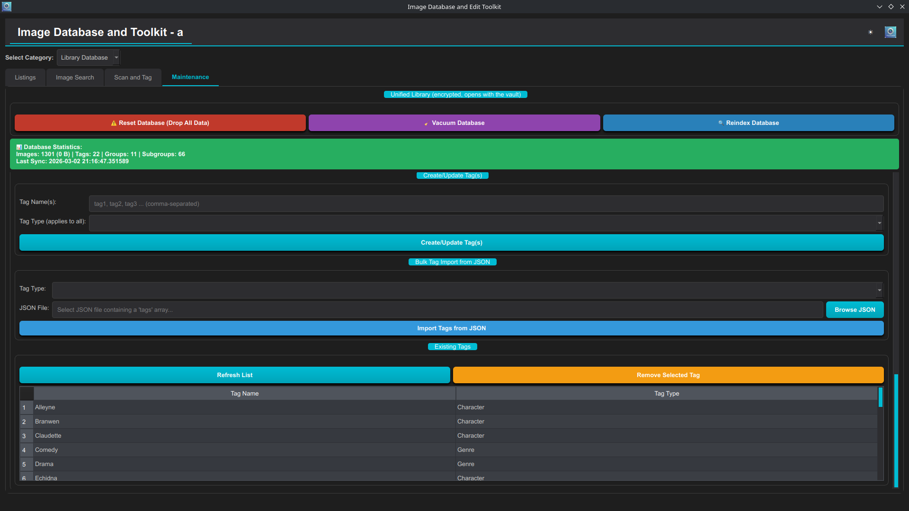

!!! success ":material-new-box: Fixed — accidental-rename double prompt"
    Removing a tag, subgroup, or group used to sometimes trigger a spurious inline-rename prompt right after the deletion (a focus-loss/row-removal side effect). Deletions now clear the pending-edit state first, so **Remove Selected Tag/Subgroup/Group** is a clean single confirmation.

    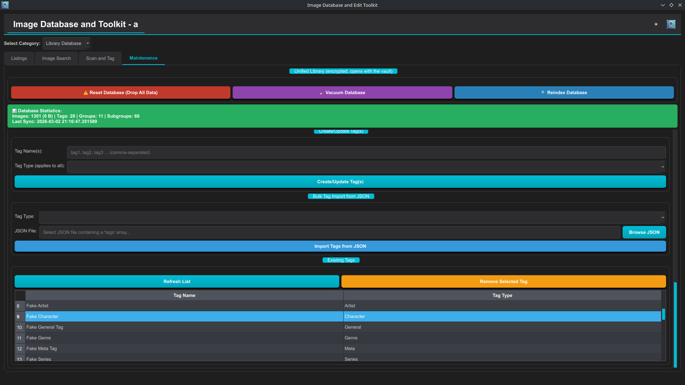

### Bulk Tag Import from JSON

Imports a whole tag vocabulary in one go. Select a JSON file, pick the **Tag Type** to apply to every imported tag, and click **Import Tags from JSON**. Two accepted file shapes:

```json
{ "tags": ["tag one", "tag two", "tag three"] }
```

or a bare array as a fallback:

```json
["tag one", "tag two", "tag three"]
```

Anything else (objects per tag, nested structures) is rejected with a format error. Duplicate tags are updated rather than duplicated (same upsert semantics as Create/Update Tag(s)).

### :material-new-box: Image Registry

A new section at the bottom of the tab: a live table of **every filepath currently indexed in the database**, alongside its associated Group and Subgroup — the fastest way to answer "is this file actually in my library, and how is it filed?" without leaving Maintenance.

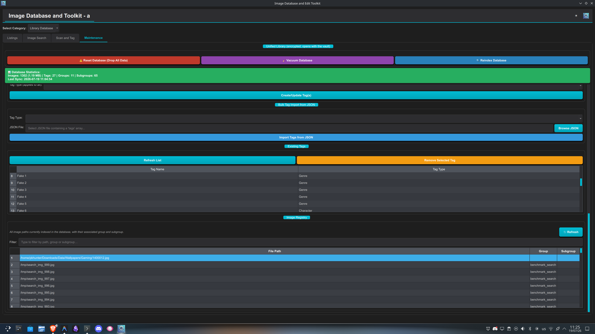

- **Refresh** — reloads the table from the database (it does not auto-update as you work in other tabs).
- **Filter** — a client-side text filter across path, group, and subgroup — no database round-trip, so it's instant even on large libraries.
- Right-click a row for a context menu with row-scoped actions.

!!! tip "Auditing an import"
    After a big **Scan and Tag** or **Import Dir** session, open **Image Registry** and filter by the group/subgroup you just populated to spot-check that every file landed where you expected.
