# :material-cog: Settings and Login — Window Tutorials

Unlike the category tutorials, this page covers the two windows that sit *outside* the tab strip: the **Login Window** you see before the Main Window ever appears, and the **Application Settings** window (opened from the Main Window's menu), which configures the app as a whole rather than any single tab.

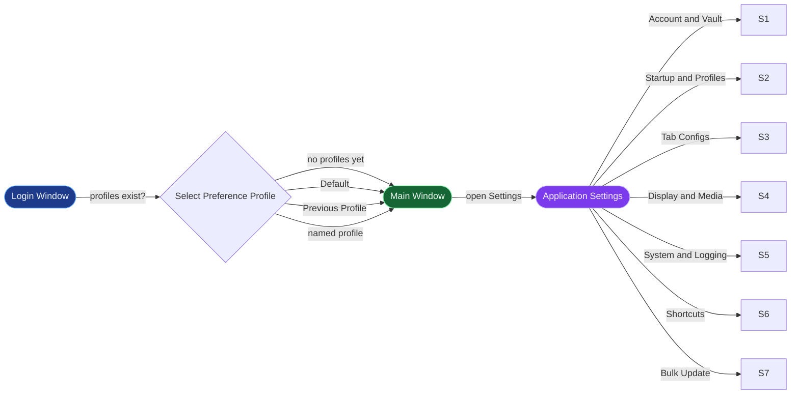

---

## Login Window

The **Secure Login** window is the first thing you see on launch — it unlocks the encrypted vault that everything else in the app depends on.

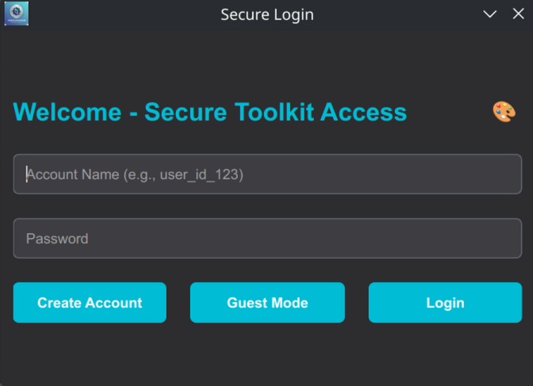

- **Account Name** / **Password** — your vault credentials. **Login** verifies them against the stored hash and, on success, decrypts the vault.
- **Create Account** — first-run setup: creates a new account, keystore, and vault.
- **Guest Mode** — logs in with just a username, no password. A guest session runs against a fully volatile, in-memory vault: nothing is written to disk, `QSettings` persistence and session-recovery file generation are both suppressed, and the Main Window title bar/settings header label the session as a Guest account so you always know you're in one.

!!! success ":material-new-box: New — Guest Mode"
    Guest Mode is for trying the app or working with sensitive data you don't want touched on disk at all — every setting, credential, and preference from a guest session disappears the moment you close the app.

### Preference Profile selection

If your account has **at least one saved preference profile** (see [System Preference Profiles](#system-preference-profiles) below), a successful login is followed by an extra prompt before the Main Window opens:

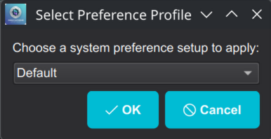
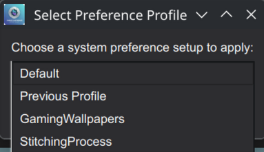

| Option | Effect |
|---|---|
| **Default** | Resets appearance to the app's built-in defaults — theme `dark`, UI density `Comfortable`, font scale `100%`, default accent colors — and clears all active tab configurations. This only touches appearance/tab-config state; it does **not** change unrelated startup settings like **Session Recovery Level**. |
| **Previous Profile** | Leaves everything exactly as it was left in the vault from your last session — effectively "don't apply any profile." No vault write happens unless something actually needs to change. |
| *(a named profile)* | Applies that profile's saved theme, tab configs, and appearance preferences (accent colors, font scale, UI density). |

If you have **no profiles saved yet**, this dialog never appears — login proceeds straight to the Main Window, same as before profiles existed.

Login finishes with a confirmation dialog, after which the Main Window opens:

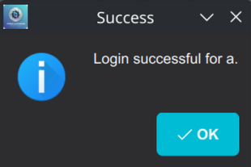

!!! tip "Default vs. Previous Profile — which do I want?"
    Pick **Default** when you want a clean, predictable appearance regardless of whatever you last had configured (e.g. after experimenting with themes/tab configs). Pick **Previous Profile** — the dialog's preselected option — for the common case of just continuing where you left off. Pick a named profile when you keep genuinely different setups (e.g. a `GamingWallpapers` profile vs. a `StitchingProcess` profile) and want to switch between them at login instead of digging through Settings.

---

## Application Settings

Opened from the Main Window. Seven tabs, all sharing the same bottom action bar:

| Button | Effect |
|---|---|
| **Reset to default** | Restores every setting on the *current* tab to its built-in default. |
| **Reload settings** | Discards unsaved edits and re-reads settings from disk/vault. |
| **Refresh Application (Relaunch)** | Restarts the app so changes that need a fresh process (e.g. LRU cache sizes) take effect. |
| **Update settings** | Persists everything you've changed. |

### Account and Vault

Vault-level account management and API credential storage.

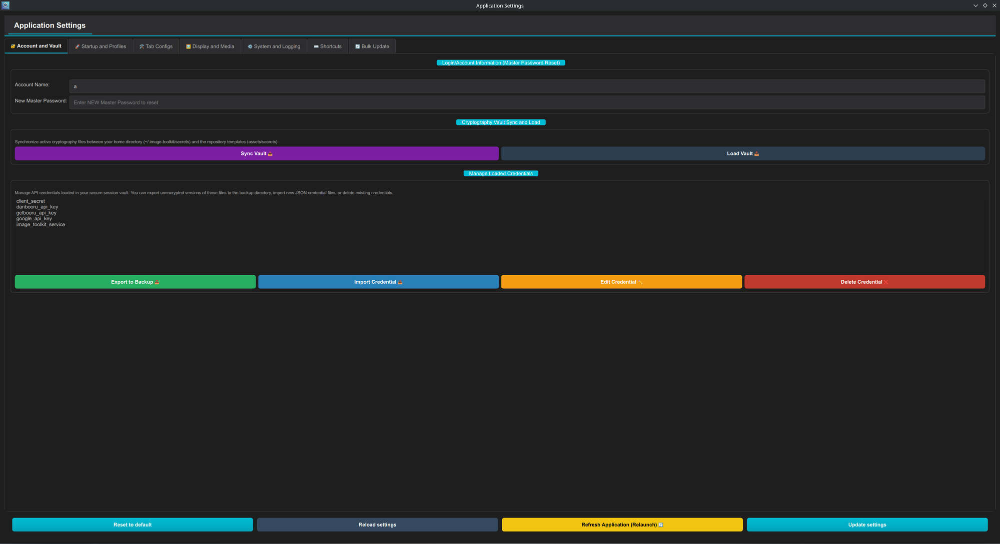

- **Login/Account Information (Master Password Reset)** — shows your **Account Name**; **New Master Password** lets you rotate your master password without recreating the account.
- **Cryptography Vault Sync and Load** — **Sync Vault** synchronizes the active cryptography files between your home directory (`~/.image-toolkit/secrets`) and the repository's template files (`assets/secrets`); **Load Vault** (re)loads the vault from disk.
- **Manage Loaded Credentials** — lists every API credential currently loaded in your session vault (e.g. `client_secret`, `danbooru_api_key`, `gelbooru_api_key`, `google_api_key`). **Export to Backup** writes unencrypted copies to the backup directory; **Import Credential** loads a new JSON credential file; **Edit Credential** / **Delete Credential** manage an existing one.

!!! danger "Master password reset has no undo"
    Resetting the master password re-derives your vault's encryption key. Make sure you actually remember the new password — there's no recovery path if you lose it.

### Startup and Profiles

What loads when the app starts, plus the profile system referenced by the Login Window.

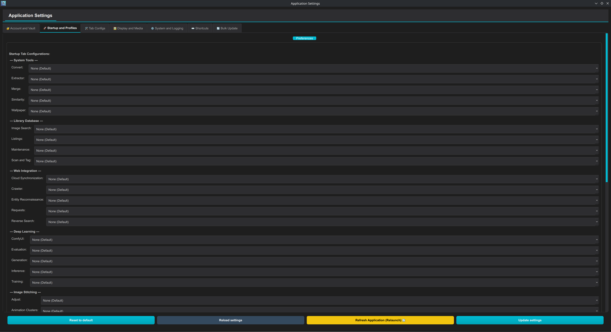

#### Startup Tab Configurations

Every tab in the app gets its own dropdown here (grouped by category — System Tools, Library Database, Web Integration, Deep Learning, Image Stitching), each defaulting to **None (Default)**. Setting one to a saved config (see [Tab Configs](#tab-configs) below) makes that tab open pre-configured with those settings every time the app starts — independent from the profile system, and independent from each other tab's dropdown.

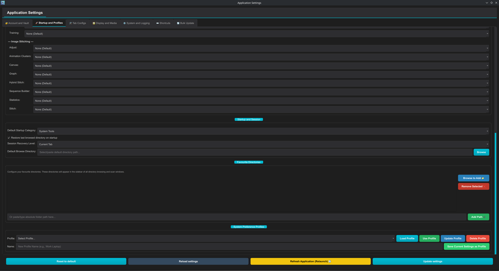

#### Startup and Session

- **Default Startup Category** — which category the **Select Category** dropdown starts on.

    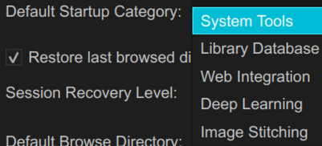

- **Restore last browsed directory on startup** — reopens whatever directory a tab last had scanned/loaded.
- **Session Recovery Level** — how much UI state is restored on relaunch:

    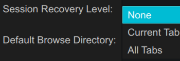

    **None** starts fresh every time; **Current Tab** restores just whichever tab/subtab was active when you closed the app; **All Tabs** restores every tab's individual state.
- **Default Browse Directory** — the directory file/directory pickers open to when nothing more specific applies.

!!! note "This setting is untouched by login profile selection"
    Session Recovery Level (and the rest of Startup and Session) lives outside the appearance/tab-config state the Login Window's profile dialog touches — choosing **Default** at login resets your theme and tab configs, but never this section.

#### Favourite Directories

Directories pinned to the sidebar of every directory-browsing/scan window in the app. **Browse to Add** picks one via a file dialog; **Add Path** accepts a pasted/typed absolute path instead; **Remove Selected** unpins one.

#### System Preference Profiles

The profile store the Login Window's selection dialog reads from.

- **Profile** dropdown + **Load Profile** (apply the profile's settings to the fields on this tab, without saving) / **Use Profile** (apply *and* activate immediately) / **Update Profile** (overwrite the selected profile with the UI's current state) / **Delete Profile**.
- **Name** field + **Save Current Settings as Profile** — snapshots the current theme and tab configs as a brand-new named profile.

!!! tip "Profiles need at least one entry to matter"
    The Login Window's preference-profile prompt only appears once you've saved at least one profile here. Until then, login goes straight to the Main Window.

---

### Tab Configs

Save, load, and manage named configuration presets *per tab* — the configs referenced by both **Startup Tab Configurations** above and each tab's own config-loading UI.

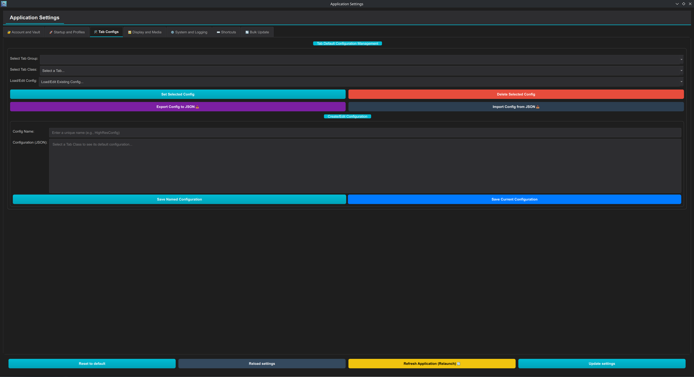

- **Select Tab Group** → **Select Tab Class** — a two-level picker: first the category, then the specific tab within it.

    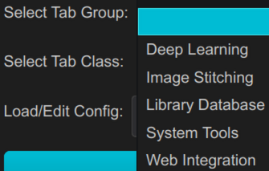

    === "Deep Learning"
        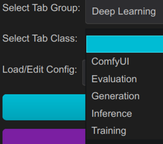

    === "Image Stitching"
        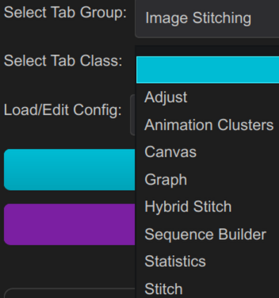

    === "Library Database"
        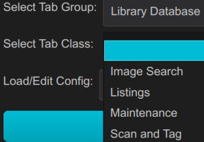

    === "System Tools"
        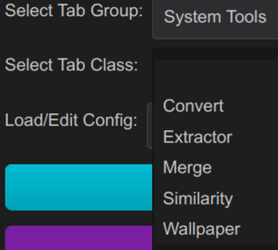

    === "Web Integration"
        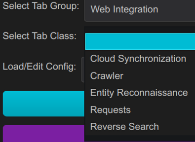

- **Load/Edit Config** — pick an existing saved config for the chosen tab class; **Set Selected Config** applies it, **Delete Selected Config** removes it, **Export Config to JSON** / **Import Config from JSON** move a single config in or out of the app.
- **Create/Edit Configuration** — **Config Name** + a raw **Configuration (JSON)** editor (pre-filled with the tab class's default configuration once a class is picked); **Save Named Configuration** stores it under that name, **Save Current Configuration** overwrites whichever config is currently loaded.

!!! tip "Where this connects"
    A config saved here is what populates the per-tab dropdowns on the **Startup and Profiles** tab — save a config first, then assign it as a tab's startup default.

---

### Display and Media

Visual appearance and default media-related behavior, app-wide.

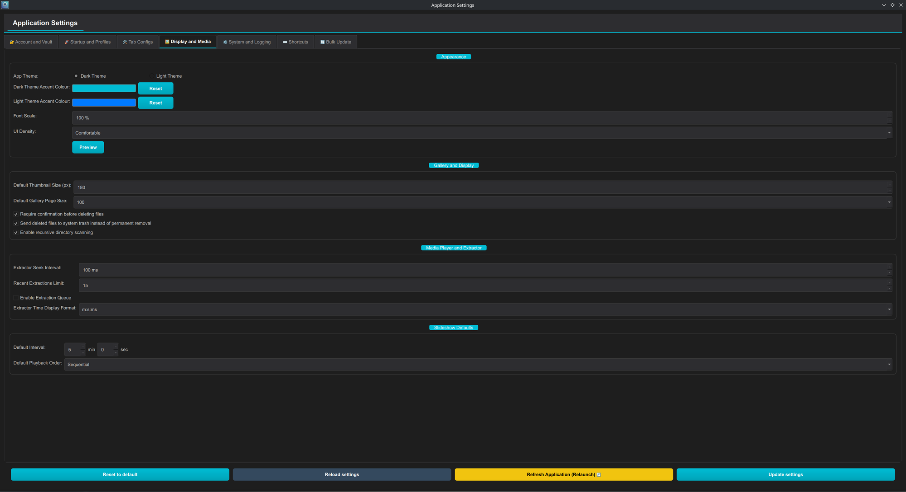

#### Appearance

- **App Theme** — **Dark Theme** or **Light Theme**.
- **Dark/Light Theme Accent Colour** — swatch + picker per theme, each with its own **Reset**.
- **Font Scale** — global UI text scale (100% = default).
- **UI Density** — spacing between UI elements:

    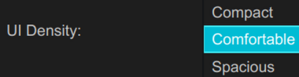

- **Preview** — see the appearance changes applied before committing them with **Update settings**.

!!! success ":material-new-box: New — app-level zoom"
    **Zoom − / Zoom +** buttons next to the density/scale controls step a global `app_zoom` offset by ±10% (−50% to +100%, shown live as a label), compounding with **Font Scale** to resize the whole UI. You don't need to open Settings for this at all: **Ctrl + Mouse Wheel** anywhere in the Main Window zooms in/out on the spot, and the change applies immediately without a settings save or restart.

#### Gallery and Display

- **Default Thumbnail Size (px)** and **Default Gallery Page Size** — starting values for every gallery's thumbnail size and items-per-page.

    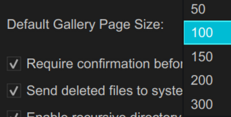

- **Require confirmation before deleting files** — the safety prompt used across every delete action in the app (Similarity, Scan and Tag, Listings, …).
- **Send deleted files to system trash instead of permanent removal** — routes deletions through the OS trash/recycle bin when checked.
- **Enable recursive directory scanning** — default recursion behavior for directory scans.

#### Media Player and Extractor

- **Extractor Seek Interval** — granularity of the Extractor tab's player scrubbing.
- **Recent Extractions Limit** — how many entries the Extractor's **Recent Extractions** history keeps.
- **Enable Extraction Queue** — turns on the queued/batched extraction mode referenced in the [System Tools tutorial](system_tools.md#video-subtab).
- **Extractor Time Display Format** — how timestamps are rendered in the Extractor UI:

    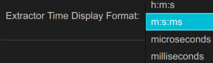

#### Slideshow Defaults

- **Default Interval** (min + sec) and **Default Playback Order** — starting values for new Wallpaper slideshows:

    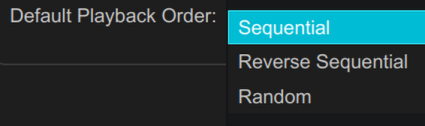

---

### System and Logging

Performance tuning, MyAnimeList integration, logging, and destructive reset actions.

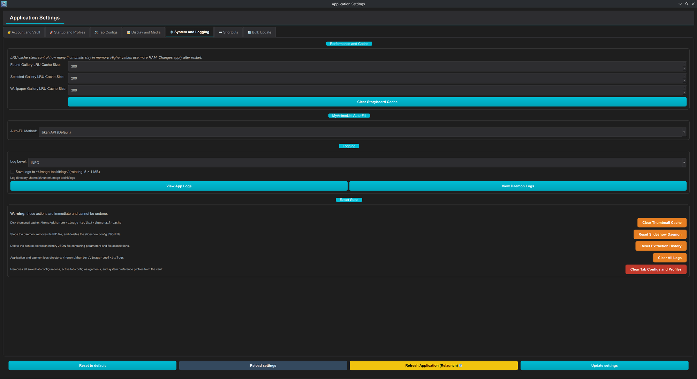

#### Performance and Cache

**Found Gallery**, **Selected Gallery**, and **Wallpaper Gallery LRU Cache Size** control how many thumbnails stay resident in memory per gallery — higher values use more RAM; changes apply after restart. **Clear Storyboard Cache** wipes the Image Stitching storyboard cache immediately.

#### MyAnimeList Auto-Fill

**Auto-Fill Method** — which of the three fetch strategies the Content Listings **Auto-Fill from MAL** button uses:

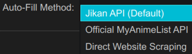

See the [Library Database tutorial](library_database.md#content-listings) for what each method trades off.

#### Logging

**Log Level** and **Save logs to `~/.image-toolkit/logs/`** (rotating, 5 × 1 MB) control what gets recorded; **View App Logs** / **View Daemon Logs** open the current log files.

#### Reset State

!!! danger "Every action here is immediate and irreversible"
    | Button | What it deletes |
    |---|---|
    | **Clear Thumbnail Cache** | The on-disk thumbnail cache — thumbnails regenerate on next gallery load. |
    | **Reset Slideshow Daemon** | Stops the daemon, removes its PID file, deletes the slideshow config JSON. |
    | **Reset Extraction History** | The central extraction-history JSON (parameters + file associations) and the Extractor's Recent Extractions dropdown. |
    | **Clear All Logs** | The entire application + daemon logs directory. |
    | **Clear Tab Configs and Profiles** | Every saved tab configuration, active tab-config assignment, and system preference profile from the vault — this is what would make the Login Window's profile prompt stop appearing. |

---

### Shortcuts

Rebindable keyboard shortcuts, scoped by context.

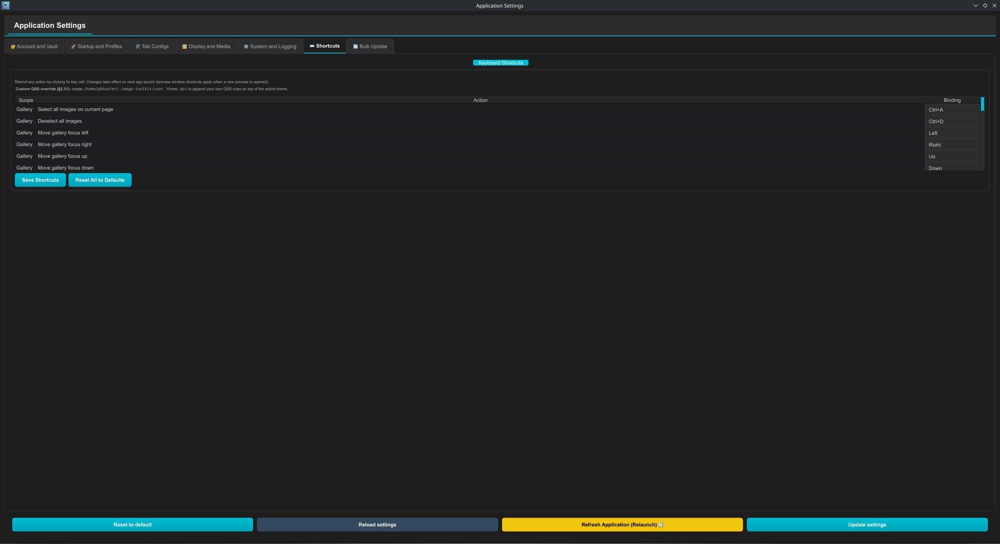

Click any cell in the **Binding** column to rebind that action (e.g. `Select all images on current page`, `Deselect all images`, `Move gallery focus left/right/up/down` under the **Gallery** scope). Changes take effect on the next app launch — except preview-window shortcuts, which apply as soon as a new preview is opened. **Save Shortcuts** commits your rebindings; **Reset All to Defaults** discards all customization.

!!! tip "Going further than the shortcuts table"
    The tab also documents a **Custom QSS override**: create `~/.image-toolkit/user_theme.qss` to append your own Qt stylesheet rules on top of the active theme — useful for tweaks the Appearance settings don't expose.

---

### Bulk Update

A single find-and-replace that can rewrite settings across *every* storage location at once, instead of editing them one by one.

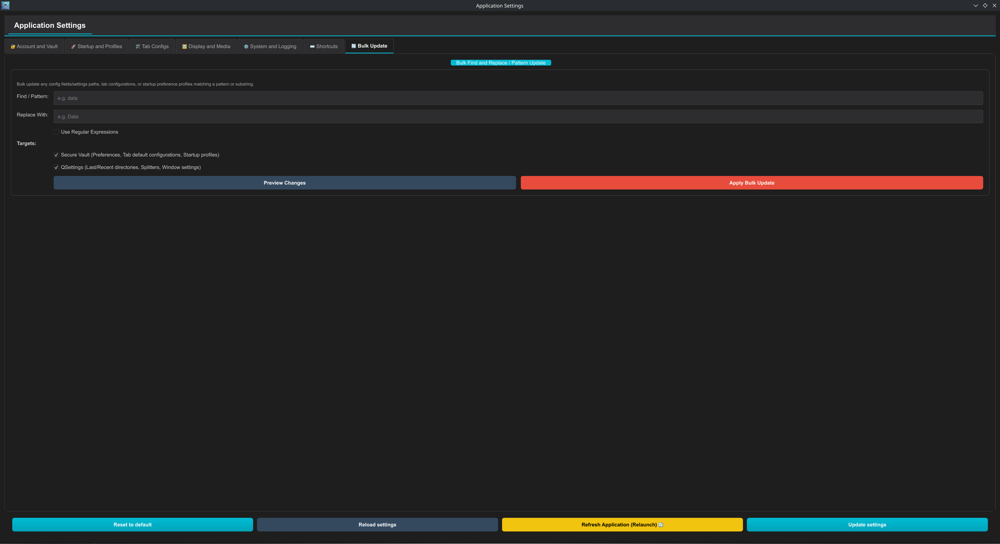

- **Find / Pattern** / **Replace With** — the substring (or, with **Use Regular Expressions** checked, a regex pattern) to match and its replacement.
- **Targets** — which storage layers to rewrite: **Secure Vault** (Preferences, Tab default configurations, Startup profiles) and/or **QSettings** (Last/Recent directories, Splitters, Window settings) — both checked by default.
- **Preview Changes** — shows exactly what would change without writing anything.
- **Apply Bulk Update** — commits the rewrite.

!!! danger "Preview before you apply"
    This tool can touch every saved tab config, startup profile, and QSettings key matching your pattern in one pass. Always run **Preview Changes** first, especially with **Use Regular Expressions** on — a loose pattern can match more than you intended.
