# :material-tools: System Tools — Tab Tutorials

The **System Tools** category groups the local file-manipulation tabs: converting media between formats, compositing images, finding duplicates, extracting frames, and driving your desktop wallpaper.

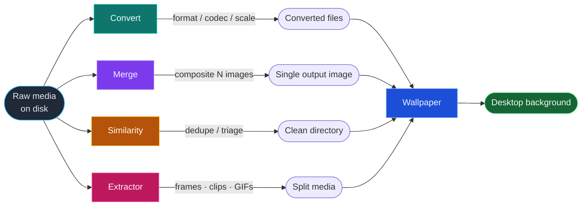
```mermaid
flowchart LR
    A([Raw media\non disk]) --> B[Convert]
    A --> C[Merge]
    A --> D[Similarity]
    A --> E[Extractor]
    B -->|format / codec / scale| F([Converted files])
    C -->|composite N images| G([Single output image])
    D -->|dedupe / triage| H([Clean directory])
    E -->|frames · clips · GIFs| I([Split media])
    F & G & H & I --> J[Wallpaper]
    J --> K([Desktop background])

    style A fill:#1f2937,stroke:#38bdf8,color:#e5e7eb
    style B fill:#0f766e,stroke:#2dd4bf,color:#ecfeff
    style C fill:#7c3aed,stroke:#c4b5fd,color:#f5f3ff
    style D fill:#b45309,stroke:#fbbf24,color:#fffbeb
    style E fill:#be185d,stroke:#f9a8d4,color:#fdf2f8
    style J fill:#1d4ed8,stroke:#93c5fd,color:#eff6ff
    style K fill:#166534,stroke:#86efac,color:#f0fdf4
```

!!! tip "Where these tabs live"
    Open the app → **Select Category: System Tools** → pick **Convert**, **Merge**, **Similarity**, **Extractor**, or **Wallpaper** from the tab strip underneath.

---

## Convert

Converts images and videos between formats. The tab has three subtabs — **Format**, **Codec**, and **Sampler** — each aimed at a different kind of conversion.

| Subtab | Operates on | Changes | Typical use |
|---|---|---|---|
| **Format** | Images | Container/extension (PNG ↔ JPEG ↔ WebP…), optional aspect ratio | Normalize a folder to one image format |
| **Codec** | Videos | Internal video/audio codec, quality, encode speed | Shrink file size or gain compatibility without re-cropping |
| **Sampler** | Images & videos | Pixel dimensions (up/downscale) | Prepare assets for a specific resolution |

### Format subtab

Batch-converts image files from one *container format* to another (PNG → JPEG, WebP → PNG, …). Pick a source directory, select the images in the gallery, choose the output format, and run.

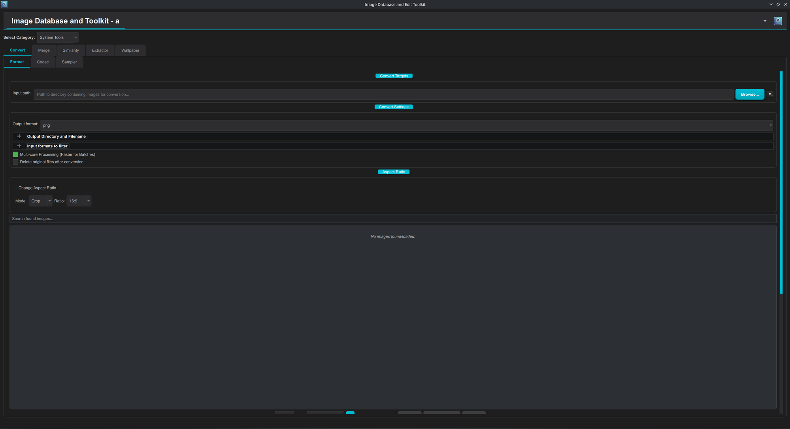

!!! success "Multi-core Processing (Faster for Batches)"
    Checked by default. Converting each file is independent of every other file in the batch — there's no shared state between them — so this checkbox dispatches the conversions across a process pool instead of running them one after another on a single CPU core. Expect wall-clock time to drop roughly in proportion to the number of cores actually used, at the cost of higher peak CPU utilization (and slightly higher peak RAM, since several files decode/encode concurrently instead of one at a time). Leave it on for any batch of more than a handful of files; only turn it off if you need to keep the machine responsive for other work while a very large batch converts in the background.

#### Aspect Ratio

Off by default; enable it with the **Change Aspect Ratio** checkbox to also reshape every converted image to a target aspect ratio. Two controls matter:

=== ":material-crop: Mode"
    What to do when the source image doesn't already match the target ratio:

    - **Crop** — cuts away the excess. No distortion, but pixels outside the target ratio are lost.
    - **Pad** — adds background bars (letterbox/pillarbox). Nothing is lost, but bars are added.
    - **Stretch** — resizes non-uniformly to fit. Nothing is lost and no bars appear, but the image is distorted.

=== ":material-aspect-ratio: Ratio"
    The target ratio itself: presets `16:9`, `4:3`, `1:1`, `9:16`, `3:2`, or **Custom**, which reveals **W**/**H** spinboxes so you can type any ratio (e.g. 21:9 → W=21, H=9). The numbers describe a *proportion*, not a pixel size.

!!! warning "Crop vs. Pad vs. Stretch — pick the right trade-off"
    There is no free lunch: **Crop** loses content, **Pad** adds visible bars, **Stretch** distorts geometry. Choose based on what matters least for your source material (e.g. Stretch is usually wrong for photos of people, but fine for abstract backgrounds).

### Codec subtab

Re-encodes video files' internal streams without necessarily changing the container. Sources are scanned and can be filtered by their probed codec via toggle buttons.

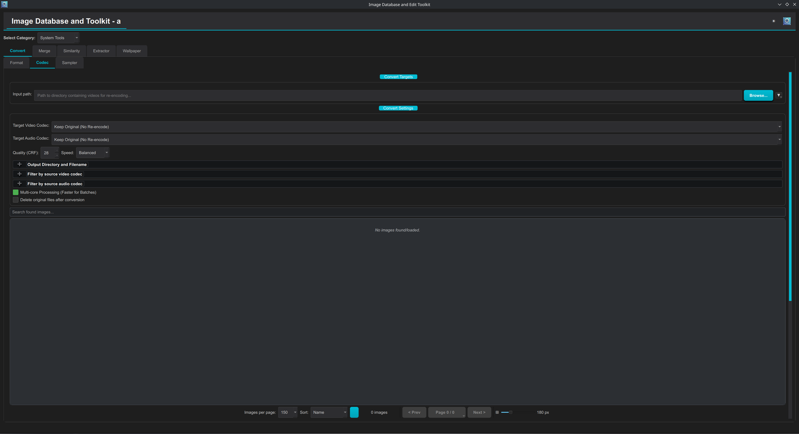

- **Target Video Codec** — the codec the video stream is re-encoded to:

| Codec | Compression | Encode speed | Compatibility |
|---|:---:|:---:|:---:|
| **Keep Original (No Re-encode)** | — (stream-copy) | :material-speedometer: Instant | :material-check-all: Perfect (unchanged) |
| **H.264** | Baseline | :material-speedometer: Fast | :material-check-all: Universal |
| **H.265 / HEVC** | ~2× H.264 | :material-speedometer-slow: Slower | :material-check: Modern players |
| **AV1** | Best | :material-speedometer-slow: Slowest | :material-alert: Newest players only |
| **VP9** | Good | :material-speedometer-slow: Slower | :material-check: Browsers/WebM |

- **Target Audio Codec** — **Keep Original**, **AAC** (universal lossy default), **Opus** (best quality-per-bitrate lossy), **MP3** (legacy compatibility), **FLAC** (lossless, larger).
- **Quality (CRF)** — the Constant Rate Factor, 0–63. *Lower = higher quality and larger files.* The default 28 is a sensible size/quality balance for HEVC/AV1; try 18–23 for near-transparent quality. The value is automatically clamped to whatever range the selected target codec actually supports.
- **Speed** — the encoder's speed-vs-efficiency preset: **Fastest → Fast → Balanced → Slow → Best Quality**. Slower settings spend more CPU time searching for better compression: the *same* CRF produces a *smaller* file, but encoding takes longer.

!!! note "CRF vs. Speed — two independent knobs"
    **Quality** is governed by CRF; **Speed** mostly trades encode time against file size *at that same CRF*. Don't confuse them — raising Speed's quality preset won't sharpen the image, it'll just search harder for a smaller file at the CRF you already set.

### Sampler subtab

Resamples (rescales) images and videos. Scale either by a **factor** (with 0.25×/0.5×/2×/4× quick buttons) or to explicit **W×H dimensions** (optionally preserving aspect ratio).

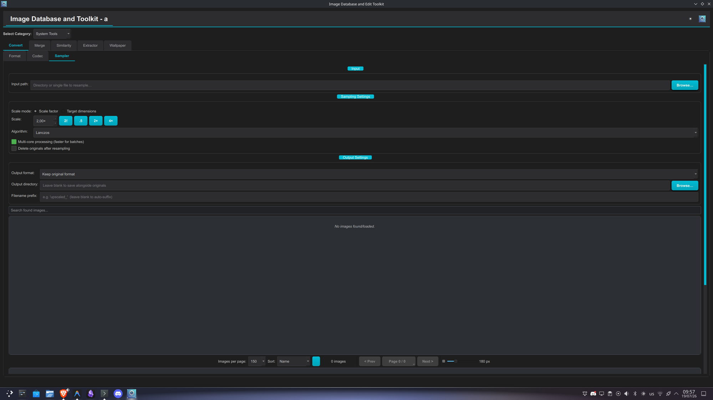

- **Algorithm** — the resampling filter used for the rescale, each sampling from a progressively larger neighborhood of source pixels to compute each output pixel:

    | Algorithm | Neighborhood | Technical detail | Result |
    |---|:---:|---|---|
    | **Nearest Neighbor** | 1 pixel | Copies the single closest source pixel — no interpolation at all. | "Pixel-perfect" but aliased/blocky. The *only* correct choice for pixel art or when you must not introduce new colors; wrong for photos. |
    | **Bilinear** | 4 pixels (2×2) | Linear interpolation across the two nearest pixels on each axis. | Very fast, but can look soft/blurry — the small sample window can't reconstruct sharp edges well. |
    | **Bicubic** | 16 pixels (4×4) | Cubic-polynomial interpolation across a wider neighborhood. | An adequate balance of speed and quality: moderately fast, with smoother edges and better sharpness than bilinear. |
    | **Lanczos** | 36 pixels (6×6) | A windowed-sinc filter — approximates ideal frequency-domain low-pass reconstruction, using more neighboring pixels than either alternative above. | The sharpest results, best at preserving fine texture — at the cost of the most runtime and processing power of the three. Highest quality, especially for downscaling; the default choice for quality work. |

    !!! info "Learn more"
        [Lanczos resampling on Wikipedia](https://en.wikipedia.org/wiki/Lanczos_resampling) covers the sinc-windowing math behind why a larger neighborhood produces sharper results, and why Lanczos in particular can introduce ringing (overshoot) artifacts near very high-contrast edges that bicubic/bilinear don't.

---

## Merge

Composites multiple selected images into a single output. Select images in the gallery, pick a **Mode**, configure it, and press **Run Merge**.

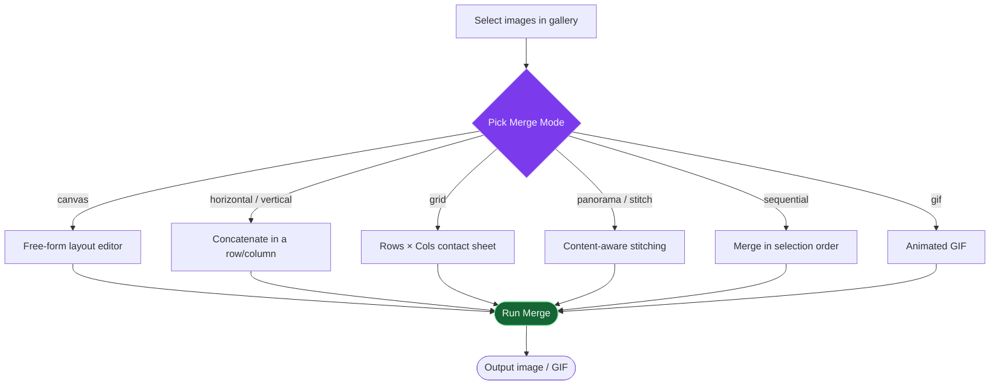
```mermaid
flowchart TD
    Sel[Select images in gallery] --> Mode{Pick Merge Mode}
    Mode -->|canvas| Canvas[Free-form layout editor]
    Mode -->|horizontal / vertical| Strip[Concatenate in a row/column]
    Mode -->|grid| Grid[Rows × Cols contact sheet]
    Mode -->|panorama / stitch| Pano[Content-aware stitching]
    Mode -->|sequential| Seq[Merge in selection order]
    Mode -->|gif| Gif[Animated GIF]
    Canvas & Strip & Grid & Pano & Seq & Gif --> Run([Run Merge]) --> Out([Output image / GIF])

    style Mode fill:#7c3aed,stroke:#c4b5fd,color:#f5f3ff
    style Run fill:#166534,stroke:#86efac,color:#f0fdf4
```

### Merge Canvas (canvas mode)

Canvas mode turns the tab into a small layout editor.

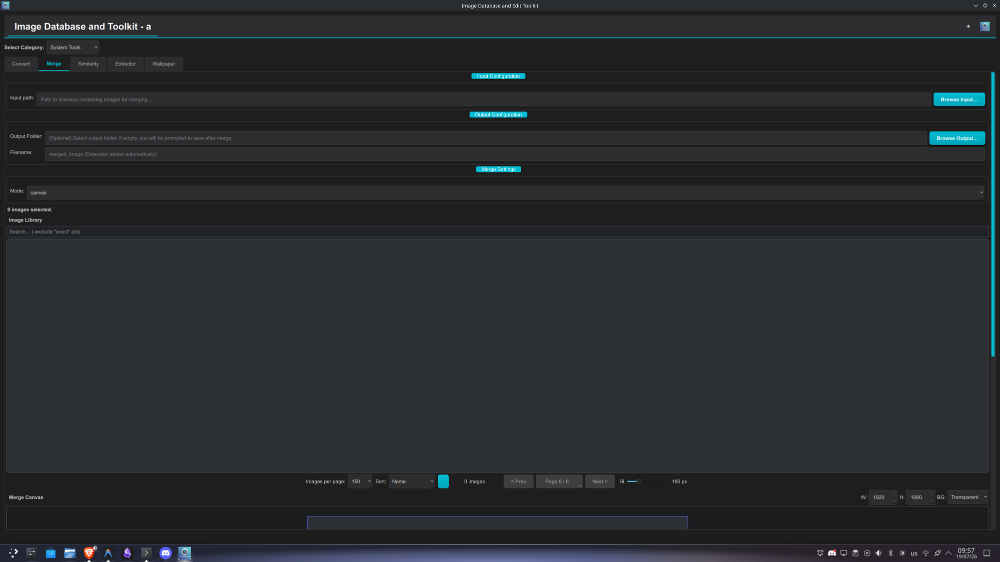

Placing images from the gallery drops them onto the canvas as movable, resizable tiles:

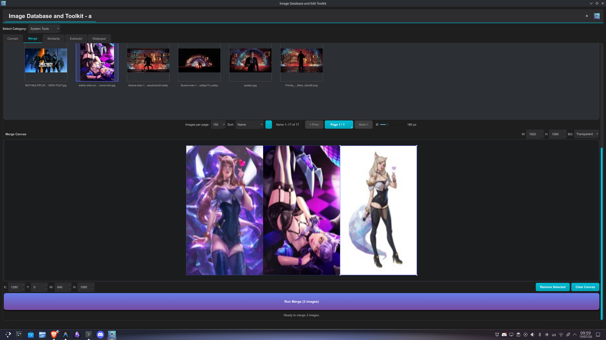

- **Canvas size & background** — the header row sets the output pixel size (**W**/**H**, up to 20000×20000) and the **BG** fill for uncovered areas: `Transparent`, `White`, or `Black`.
- **Placing images** — clicking a gallery thumbnail toggles it onto/off the canvas. Each placed image is a movable, resizable tile: drag to move, drag its corner handles to resize.
- **Precise geometry** — selecting a tile activates the **X / Y / W / H** spinboxes below the canvas, letting you type exact positions/sizes (negative X/Y are allowed — tiles may extend past the canvas edge; anything outside is cropped in the output).
- **Join (snapping)** — right-click a tile to open the *Join* menu: **Join Top / Bottom / Left / Right** each list the other tiles; choosing one snaps that tile flush against the clicked tile's side with a 0-px gap. This is the quick way to build exact strips or mosaics without pixel-nudging.
- Right-clicking empty canvas offers **Fit Canvas** (re-fit the view); **Remove Selected** and **Clear Canvas** manage placed tiles.

### Merge Mode

Click through each mode below to see its own settings panel:

=== "canvas"
    Free-form compositing on the interactive canvas above. The output is exactly what you laid out.

=== "horizontal / vertical"
    Concatenates the selected images in a row/column, with a configurable **Spacing (px)** gap and an **Alignment/Resize** rule (`Default (Top/Center)`, `Align Top/Left`, `Align Bottom/Right`, `Center`, `Scaled (Grow Smallest)`, `Squish (Shrink Largest)`) governing how differently-sized images line up.

    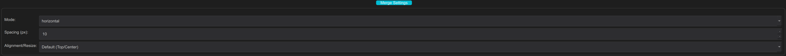
    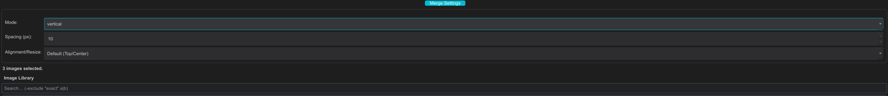

=== "grid"
    Arranges images into a **Rows × Cols** grid (contact-sheet style).

    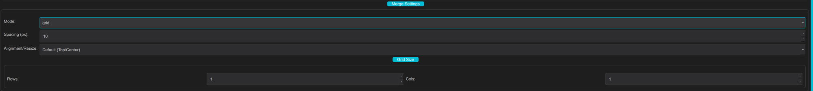

=== "panorama / stitch"
    Content-aware stitching for overlapping shots. **Perfect Stitch Mode (Digital Art)** enables the anime-pan pipeline (template matching + pyramidal blending) with **Edge Crop** (neutralizes vignettes before matching) and **Pyramid Levels** (seam blend width), plus the *AI Optimization* toggles (Siamese order-agnostic matching, APAP parallax mesh, LSD structure preservation, AnimeGAN2 refinement, BiRefNet character-aware seams, BaSiC luma correction, LoFTR dense matching, ECC sub-pixel alignment) and a **renderer** choice — `blend` (multi-band, robust), `median` (temporal denoise, sharpest), `first` (no blending, fastest).

    
    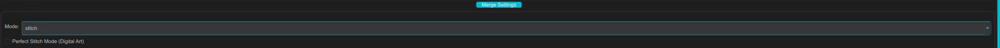

    !!! tip "Need the full stitching toolkit?"
        This is the quick path. For frame ordering, statistics, manual hybrid stitching, and animation-phase clustering, see the dedicated [Image Stitching](image_stitching.md) category.

=== "sequential"
    Merges images in selection order rather than layout order.

    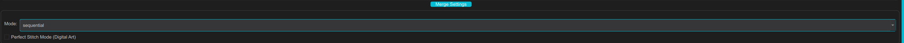

=== "gif"
    Assembles the selection into an animated GIF; a **Duration (ms/frame)** spinbox appears to set per-frame timing.

    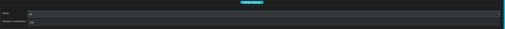

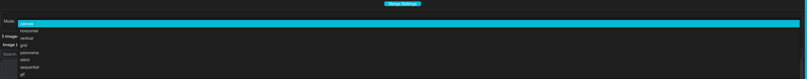

When you run the merge, the composite is rendered at the configured canvas size (or mode-specific layout) with each tile at its exact position and scale.

---

## Similarity

Finds duplicate or visually similar images inside a directory (optionally recursive), groups them, and helps you triage which copies to keep, hardlink, or delete.

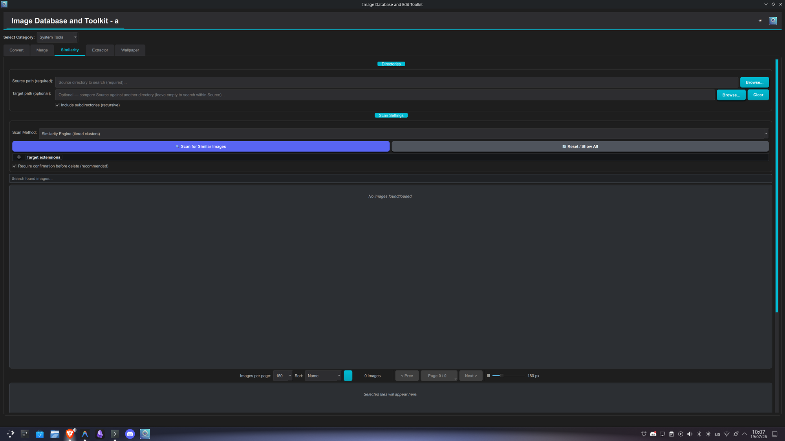

### Scan Method

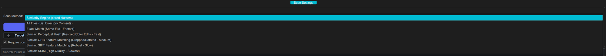

Ordered roughly from fastest/strictest to slowest/most tolerant:

| Method | Speed | Catches | Misses |
|---|:---:|---|---|
| **All Files (List Directory Contents)** | :material-speedometer: Instant | Nothing (no analysis — just lists everything) | Everything (manual triage only) |
| **Exact Match (Same File)** | :material-speedometer: Fastest | Byte-identical copies/renames | Any edit, even 1 pixel |
| **Perceptual Hash** | :material-speedometer: Fast | Resized, recompressed, mild color edits | Crops, rotations |
| **ORB Feature Matching** | :material-speedometer-medium: Medium | Cropped, rotated, moderate edits | Heavy stylistic transforms |
| **SIFT Feature Matching** | :material-speedometer-slow: Slow | Heavily transformed variants | — (best recall of the feature methods) |
| **SSIM (High Quality)** | :material-speedometer-slow: Slowest | The most precise structural comparison | Best reserved for small, pre-filtered sets |
| **Similarity Engine (tiered clusters)** :material-star: | Adaptive | **Recommended default** — runs the full C++ pipeline (exact → perceptual → VP-tree/HNSW → structural verification), caching results so re-scans are fast | — |

!!! tip "Start with the tiered engine"
    **Similarity Engine (tiered clusters)** is the recommended default: it runs every tier automatically and caches results, so a second scan of the same directory is fast. Reach for a single specific method only when you know exactly what kind of duplicate you're hunting.

Use **Reset / Show All** after a scan to restore the full directory view (a scan filters the gallery down to the matched groups).

### Triage actions

Once a scan produces groups, the bottom bar exposes destructive-but-guarded cleanup actions:

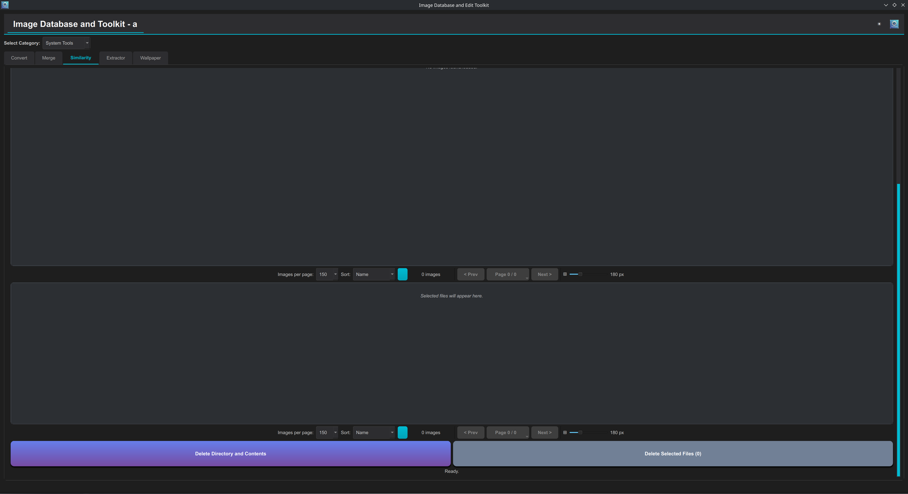

!!! danger "Confirmation gate"
    **Require confirmation before delete (recommended)** is checked by default — leave it on. **Delete Directory and Contents** and **Delete Selected Files** are irreversible; the confirmation step is your safety net.

---

## Extractor

Extracts frames from media. Two subtabs: **Video** (frames/clips/GIFs out of video files) and **Image** (splitting one multi-frame image into its frames).

### Video subtab

Point **Source Directory** at a folder of videos/GIFs, click a thumbnail to open it in the built-in player (or an external one), then use the **Extraction Settings** section to produce output into the **Output Directory**.

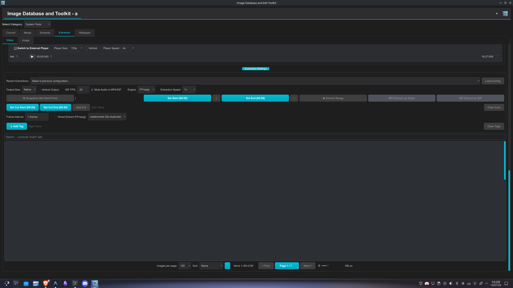

#### Extraction Settings section

- **Recent Extractions / Load Config** — a history of your last extraction runs; selecting one and clicking *Load Config* restores that run's full parameter set (source, ranges, cuts, tags…).

    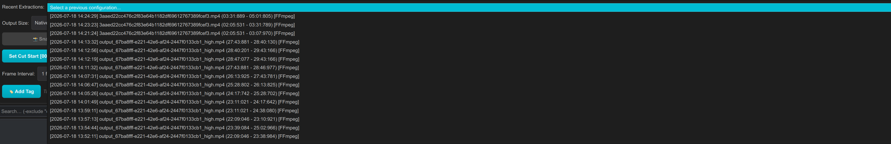

- **Output Size** — resolution of extracted frames/clips: `Native` (source resolution), `Player` (whatever the player is currently sized to), or fixed presets `480p`–`4K`. **Vertical Output** swaps width/height for portrait sources.

    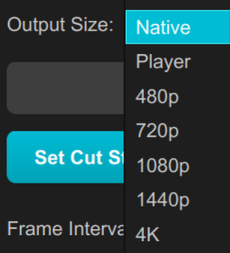

- **GIF FPS** — frame rate used when exporting a range as GIF (1–60).
- **Mute Audio in MP4/GIF** — strips the audio track from clip exports.
- **Engine** — `FFmpeg` (fast, robust, recommended) or `MoviePy` (Python fallback).

    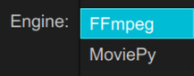

- **Extraction Speed** — speed multiplier applied to exported clips (0.25×–4×), independent of the player's playback speed.

    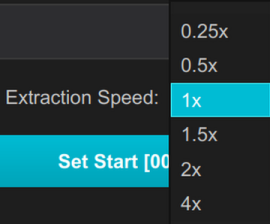

- **📸 Snapshot Frame** — saves the single frame at the current playhead position.
- **Set Start / Set End (+ Go)** — mark the in/out points of the extraction range at the current playhead; *Go* jumps back to a marked point. **🎞️ Extract Range** exports every frame in the range as images, **MP4 Extract as Video** / **GIF Extract as GIF** export it as a clip.
- **Cuts row** — *Set Cut Start* / *Set Cut End* / *Add Cut* define **sub-ranges to skip**: when the range is extracted, the listed cuts are removed from it (e.g. cut out an ad or a scene transition mid-range). *Clear Cuts* resets the list.
- **Frame Interval** — extract every Nth frame instead of every frame (e.g. `12 frames` keeps 1 in 12).
- **Smart Extract (FFmpeg)** — replaces the fixed interval with an FFmpeg filter that selects frames by content: `mpdecimate (De-duplicate)` drops consecutive near-identical frames (ideal for anime/limited animation); the `scene (0.1–0.6)` options keep only scene-change frames, with the number as the change threshold (lower = more sensitive = more frames kept).

    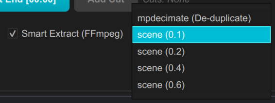

- **Tags row** — attach named markers to timestamps; tags travel with the extraction history so you can annotate why a range mattered.
- If the **extraction queue** is enabled in Settings, configured extractions can be queued and processed later, sequentially or in parallel.

#### Player controls

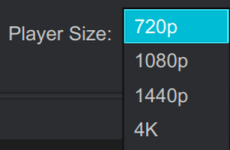
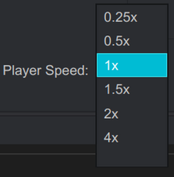

### Image subtab

Splits one image file that *contains* multiple frames — a vertical strip, horizontal strip, or grid sheet — into individual frame images.

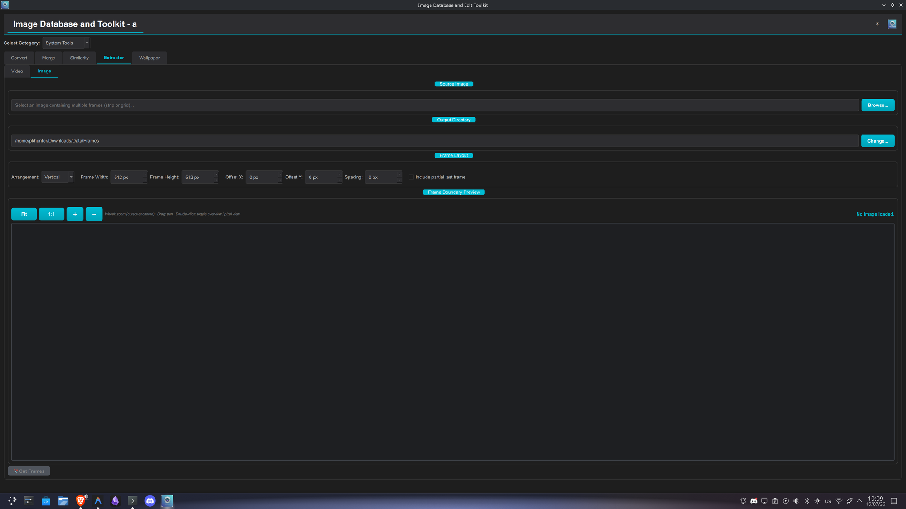

#### Frame Layout section

- **Arrangement** — how frames are packed in the file: **Vertical** (stacked top-to-bottom), **Horizontal** (side by side), or **Grid** (rows × columns).

    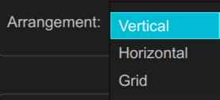

- **Frame Width / Frame Height** — the size of *one* frame in pixels. Strips only need one number (a vertical strip needs **Frame Height**; the width spans the whole image — and vice versa for horizontal). **Grid** needs both.
- **Offset X / Offset Y** — skips margin pixels before the first frame starts (for sheets with a border).
- **Spacing** — the pixel gap *between* consecutive frames (applied on both axes in Grid mode), for sheets with gutters.
- **Include partial last frame** — when the image size isn't an exact multiple of the frame size, the trailing remainder is normally shown dashed and skipped; check this to extract it too (as a smaller final frame).

The info label on the canvas toolbar always shows the source size and how many frames the current parameters produce, and the **Cut N Frames** button reflects the count live.

#### Frame Boundary Preview section

The canvas exists so you can *verify the boundaries before cutting*:

- Every frame that will be extracted is outlined in alternating **cyan/magenta** (alternating colors make the shared edge between adjacent frames readable). Any region the parameters leave uncovered is outlined **dashed amber** — if you see amber where a frame should be, your frame size or offset is slightly off.
- **Buttons** — **Fit** zooms out so the whole image is visible (overview); **1:1** shows exactly one image pixel per screen pixel; **＋ / －** step the zoom in/out.
- **Mouse** — the wheel zooms (anchored under the cursor, covering a huge 0.01×–80× range in a few notches), left-drag pans, and **double-click toggles** between fit-to-view and 1:1 at the clicked point.

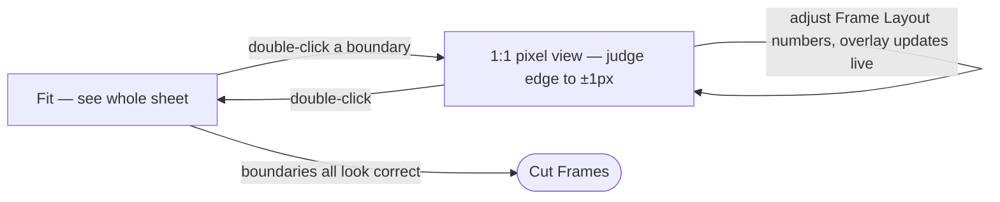
```mermaid
flowchart LR
    Fit[Fit — see whole sheet] -->|double-click a boundary| Px[1:1 pixel view — judge edge to ±1px]
    Px -->|adjust Frame Layout numbers, overlay updates live| Px
    Px -->|double-click| Fit
    Fit -->|boundaries all look correct| Cut([Cut Frames])
```

Frames are saved as `{name}_f001.png`, `{name}_f002.png`, … into the configured output directory.

---

## Wallpaper

Controls your desktop wallpaper(s). Two subtabs: **System Display(s)** applies wallpapers to the real desktop; **Monitor Display** builds graph-driven wallpaper sequences per monitor.

### System Display(s) subtab

Shows your physical monitor layout; assign an image to each monitor from the scanned gallery, then apply.

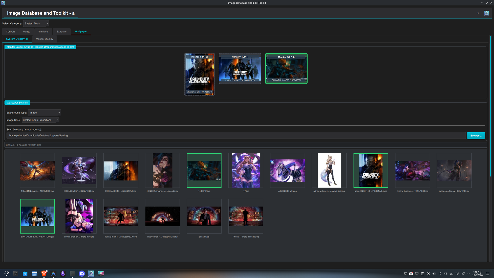

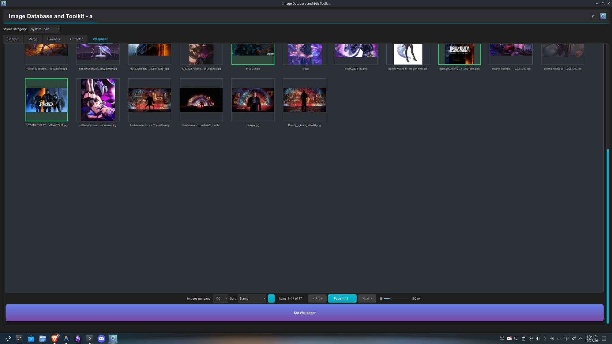

#### Background Type

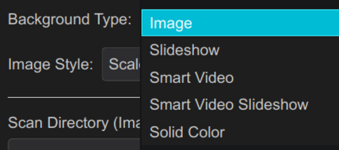

Each type reveals its own configuration controls:

=== ":material-image: Image"
    A static wallpaper per monitor.

    - **Image Style** — how the image maps onto the screen. The list adapts to your desktop environment: on KDE — `Scaled, Keep Proportions`, `Scaled and Cropped (Zoom)`, `Centered`, `Stretch`, `Tiled`, `Center Tiled`, `Span`; on GNOME — `Wallpaper`, `Centered`, `Scaled`, `Stretched`, `Zoom`, `Spanned`, `None`; on Windows — `Fill`, `Fit`, `Stretch`, `Center`, `Tile`.

    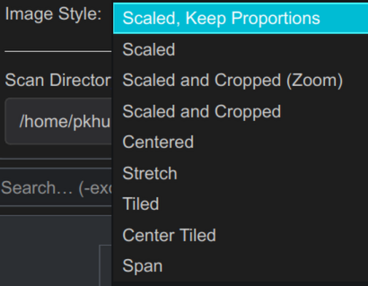

=== ":material-play-box-multiple: Slideshow"
    Cycles images automatically.

    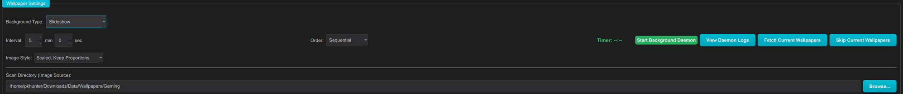

    - **Interval** (`min` + `sec`) — time between wallpaper changes.
    - **Order** — `Sequential`, `Reverse Sequential`, or `Random`.
    - **Start/Stop Background Daemon** — runs the slideshow as a detached background process that keeps cycling after the app closes (with **View Daemon Logs** for troubleshooting). A countdown label shows time to the next change. **Fetch Current Wallpapers** pulls what's currently on screen into the layout; **Skip Current Wallpapers** advances immediately.
    - **Image Style** — same as Image mode.

=== ":material-video: Smart Video"
    A video file as an animated wallpaper.

    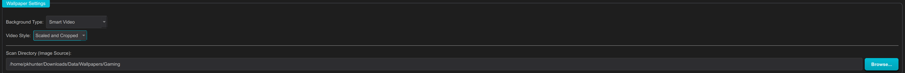
    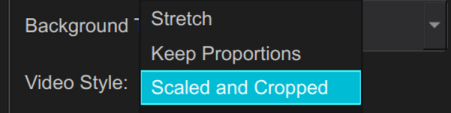

    - **Video Style** — `Stretch`, `Keep Proportions`, or `Scaled and Cropped` (replaces Image Style while a video type is active).

=== ":material-video-box: Smart Video Slideshow"
    Cycles through *videos*; combines the Slideshow controls (Interval, Order, daemon) with the **Video Style** setting.

    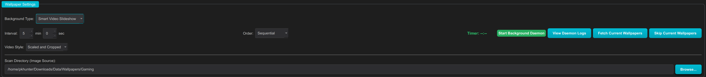

=== ":material-palette: Solid Color"
    No image at all. The gallery and scan directory are disabled; a **Color** swatch + **Select Color…** picker choose the flat background color.

    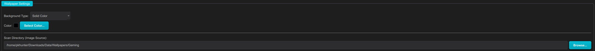
    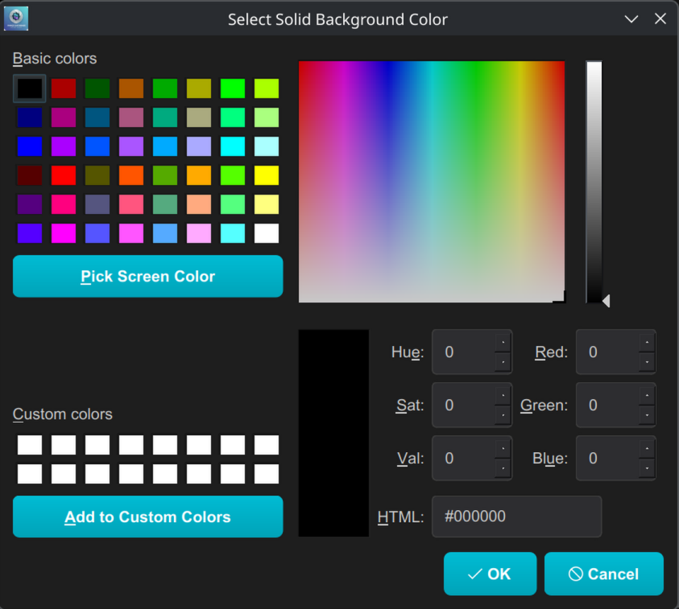

### Monitor Display subtab

A per-monitor **wallpaper sequencer**: instead of a flat playlist, each display gets a *graph* whose traversal defines the wallpaper order.

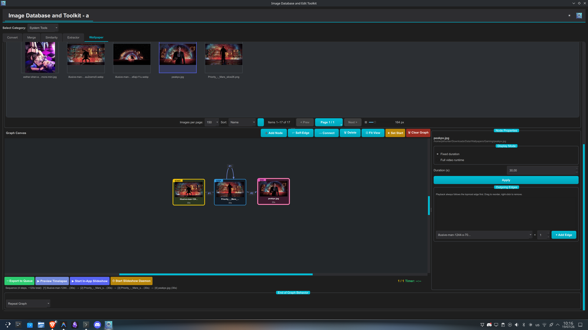

#### Graph Canvas

- **➕ Add Node** — adds a wallpaper file as a node (you can also drag images from the gallery straight onto the canvas).
- **↩ Self-Edge** — the selected node repeats (loops on itself).
- **→ Connect** — draws an edge from the selected node to another; edges define what plays next.
- **🗑 Delete** — removes the selected node or edge (the `Del` key works too).
- **⊡ Fit View** — re-frames the whole graph.
- **★ Set Start** — marks the selected node as the traversal's entry point.
- **🗑 Clear Graph** — wipes the graph.
- The bottom bar operates on the traversal: **⇥ Export to Queue** appends the graph's current sequence to the monitor's Wallpaper Queue; **▶ Preview Timelapse** renders a quick preview video of the sequence; **▶ Start In-App Slideshow** cycles the queue while the app is open; **⏱ Start Slideshow Daemon** cycles it from a detached process that survives closing the app (one display's daemon at a time). The `-- / --` counter and `Timer` label show the live queue position and time to the next change; a summary line spells out the resolved sequence.

#### Node Properties

Double-click (or right-click) a node to edit it:

- **Display Mode** — how long the node's wallpaper stays up: **Fixed duration** (uses the **Duration (s)** spinbox, 0.5 s–24 h) or **Full video runtime** (video nodes hold until the video finishes).
- **Outgoing Edges** — the node's exits, listed in priority order: *playback always follows the topmost edge first*; drag entries to reorder, right-click to remove. Add a new edge by picking a target node, a **×N repeat count** (the target plays N times back-to-back when this edge is taken), and **+ Add Edge**.
- **Apply** commits the changes.

#### End of Graph Behavior

What happens when traversal reaches a node with no outgoing edges:

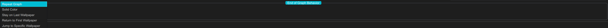

| Option | Effect |
|---|---|
| **Repeat Graph** | Start over from the start node. |
| **Solid Color** | Switch to a flat color (a **Pick Color** button + swatch appear). |
| **Stay on Last Wallpaper** | Freeze on the final wallpaper. |
| **Return to First Wallpaper** | Show the start node's wallpaper and stop. |
| **Jump to Specific Wallpaper** | A node picker appears; traversal jumps there (letting you build an "intro once, then loop this part" structure). |
