# :material-web: Web Integration — Tab Tutorials

The **Web Integration** category holds every tab that talks to the network: bulk image crawling, raw HTTP requests, cloud backup synchronization, reverse image search, and identity reconnaissance. API credentials generally come from the encrypted vault (Settings → API keys) rather than being typed in plain text.

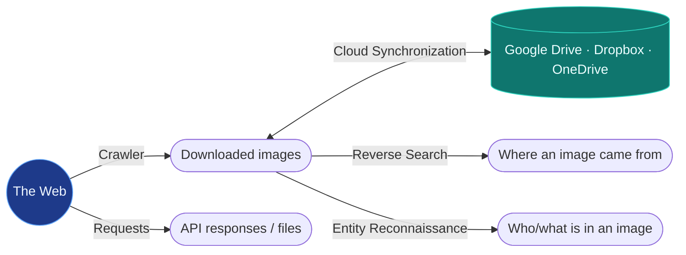

!!! warning "Privacy note"
    Reverse Search and Entity Reconnaissance can send image data to third-party services (Google Lens, TinEye) unless you restrict them to their fully offline modes (**Local AI Search**, **Local only (offline)**). Check the mode before searching anything sensitive.

---

## Crawler

Bulk-downloads images from websites into a chosen **Download Dir**.

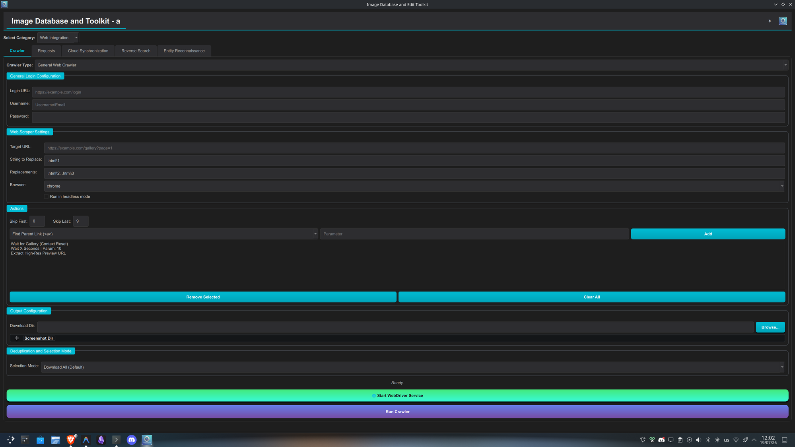
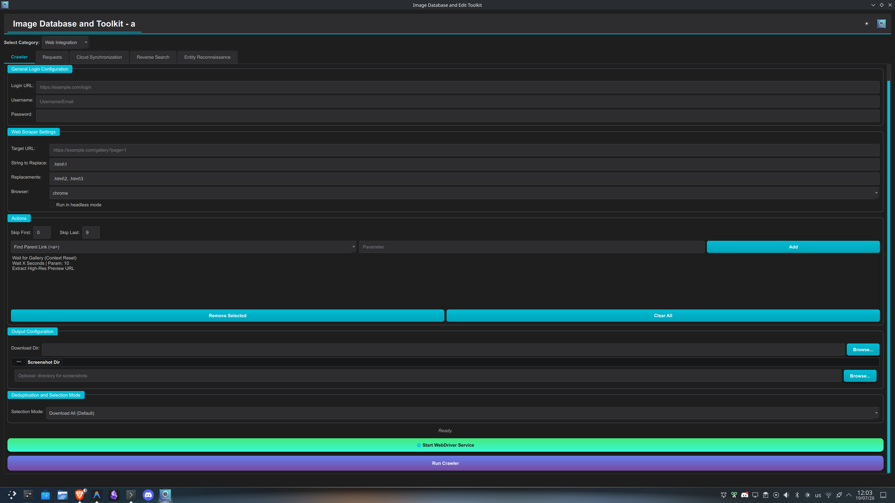

### Crawler Type

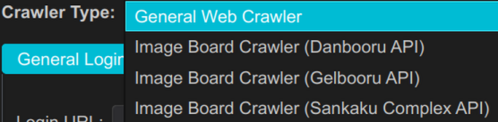

The type switches the whole settings page:

=== "General Web Crawler"
    A Selenium-driven browser scraper for arbitrary sites. You describe *how to walk the page* yourself with the Actions list (below). Extra settings: target **Browser** (`chrome`, `firefox`, `edge`, `brave`) and **headless mode** (run the browser invisibly; disable to watch it work or to get past interactive checks). A *General Login Configuration* section handles sites that need a signed-in session.

    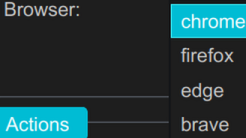

=== "Image Board Crawler (API)"
    No browser at all; talks to the board's public API directly. Three boards are supported, each with its own **API Configuration** and **Authentication (Optional)** section:

    | Board | Default Board URL | Resource | Auth fields |
    |---|---|---|---|
    | **Danbooru** | `danbooru.donmai.us` | `posts` | Username + API Key |
    | **Gelbooru** | `gelbooru.com` | `post` | User ID + API Key |
    | **Sankaku Complex** | `capi-v2.sankakucomplex.com` | `posts` | Username/Email + Password |

    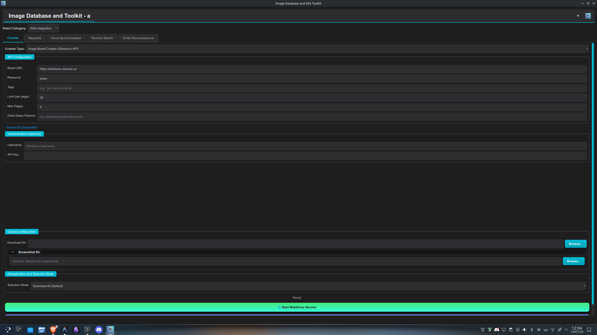
    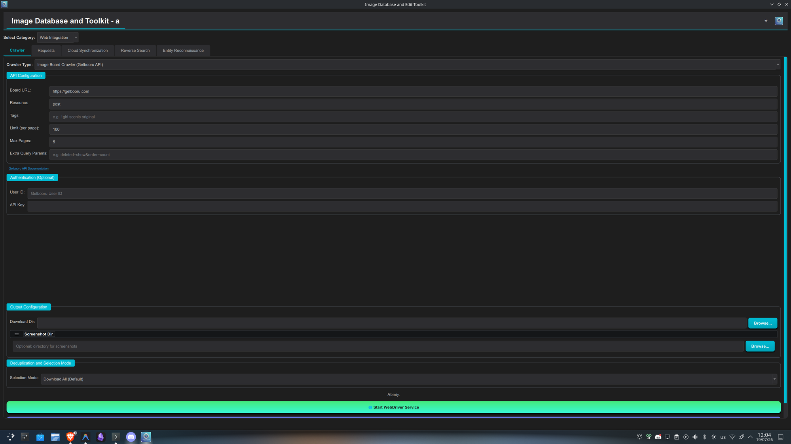
    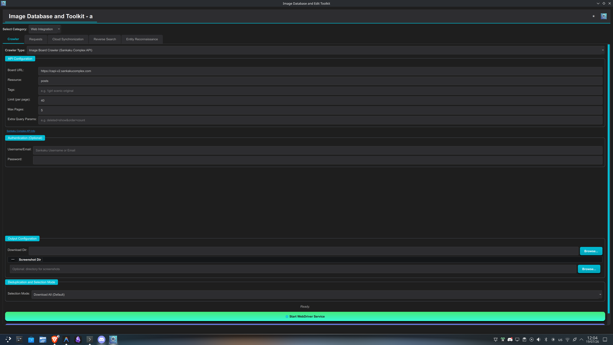

    Common fields across all three: **Tags** (the board's own tag query syntax, e.g. `1girl scenic original`), **Limit (per page)**, **Max Pages**, and **Extra Query Params** (raw query-string extras like `deleted=show&order=count`). Authentication is optional and only raises rate limits / unlocks restricted content — anonymous querying works out of the box.

### String to Replace + Replacements (General crawler)

The pagination mechanism. The crawler visits the **Target URL** once *per replacement*: it takes the substring given in **String to Replace** (e.g. `page=1`) and substitutes each comma-separated value from **Replacements** (e.g. `page=2, page=3`) in turn — so `https://example.com/gallery?page=1` with replacements `page=2, page=3` crawls pages 1→2→3 with the same Actions applied on every page. Any URL substring works: path segments (`/chapter-1/` → `/chapter-2/`), query values, IDs. Leave both empty to crawl only the Target URL.

### Actions (General crawler)

An ordered mini-program executed *for each image/element* found on the page (with **Skip First / Skip Last** trimming the element list). Build it by picking an action, optionally a parameter, and **Add**; the list runs top to bottom.

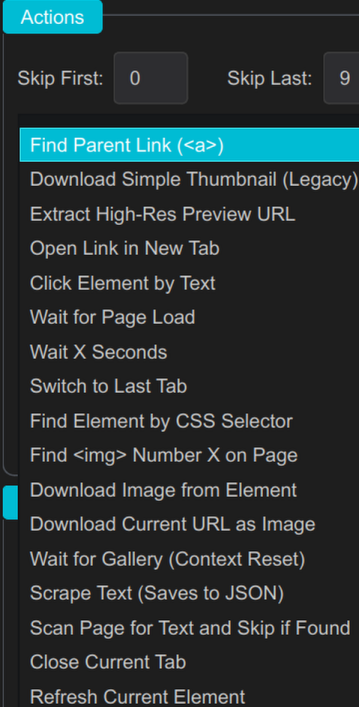

| Action | What it does |
|---|---|
| **Find Parent Link (`<a>`)** | Step from a matched element up to its enclosing link (thumbnails usually live inside the link to the full view). |
| **Download Simple Thumbnail (Legacy)** | Grab the thumbnail image directly. |
| **Extract High-Res Preview URL** | Pull the full-resolution URL a preview element points at. |
| **Open Link in New Tab** / **Switch to Last Tab** / **Close Current Tab** | Tab navigation, for galleries that open full views in new tabs. |
| **Click Element by Text** | Click a button/link identified by its visible text (parameter). |
| **Wait for Page Load** / **Wait X Seconds** | Synchronization; the parameter of *Wait X Seconds* is the delay. |
| **Find Element by CSS Selector** | Re-target the current element by a CSS selector (parameter). |
| **Find `` Number X on Page** | Target the Nth image element (parameter = N). |
| **Download Image from Element** | Download whatever image the current element resolves to. |
| **Download Current URL as Image** | When the tab's URL *is* the image. |
| **Wait for Gallery (Context Reset)** | Wait for the gallery view to be back and reset the element context (use after closing a full-view tab). |
| **Scrape Text (Saves to JSON)** | Harvest text (captions, tags) alongside the images into a JSON file. |
| **Scan Page for Text and Skip if Found** | Skip the current element when the page contains a given text (parameter) — a content filter. |
| **Refresh Current Element** | Re-fetch the element after DOM changes. |

!!! example "A typical high-res gallery recipe"
    **Find Parent Link → Open Link in New Tab → Switch to Last Tab → Wait for Page Load → Find `` Number 1 on Page → Download Image from Element → Close Current Tab → Wait for Gallery (Context Reset)**

### Deduplication and Selection Mode

What happens *after* the crawl finishes, before files are kept:

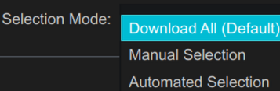

- **Download All (Default)** — keep everything that was downloaded.
- **Manual Selection** — a review dialog shows every downloaded image with checkboxes; only the checked ones survive, the rest are deleted (Cancel discards the entire crawl).
- **Automated Selection** — first a *duplicate-scan configuration* dialog (method/threshold), then a scan marks likely duplicates among the downloads, and a pruning dialog appears with duplicates pre-unchecked — accept to keep only the checked set. Best for boards where the same image recurs across pages.

---

## Requests

A raw HTTP client for API experiments and scripted downloads — two ordered lists that together form a small batch job.

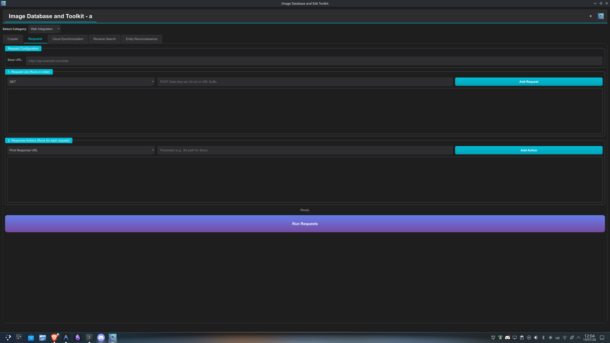

- **Base URL** — the prefix every request builds on.
- **Request Type** — `GET` or `POST` for each request you add:

    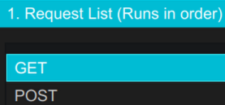

    - **GET** — the parameter field is appended to the Base URL as a suffix (path or query string).
    - **POST** — the parameter field is parsed as `key:val, k2:v2` pairs and sent as the POST body.
    - Add several requests; the **Request List runs in order**, top to bottom (right-click entries to manage them).
- **Response Actions** — executed **for each request's response**, also in order:

    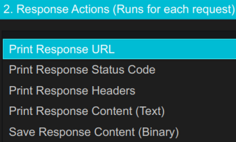

    - **Print Response URL / Status Code / Headers / Content (Text)** — write the corresponding part of the response into the log output (inspection/debugging).
    - **Save Response Content (Binary)** — write the raw response body to disk; the parameter is the file path. This is the action that turns the tab into a downloader.

!!! example
    Base URL `https://api.example.com`, requests `GET /image/1.png`, `GET /image/2.png`, actions *Print Response Status Code* + *Save Response Content (Binary)* → two files saved with their statuses logged.

---

## Cloud Synchronization

Backs up a local directory tree to a cloud drive.

### Cloud Provider

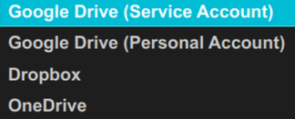

=== "Google Drive (Service Account)"
    Server-to-server auth; no browser login, works unattended. Shows the *Share Folder With* field because service-account uploads live in the service account's own storage — sharing the destination folder to your personal email is how you see the files in your own Drive UI.

    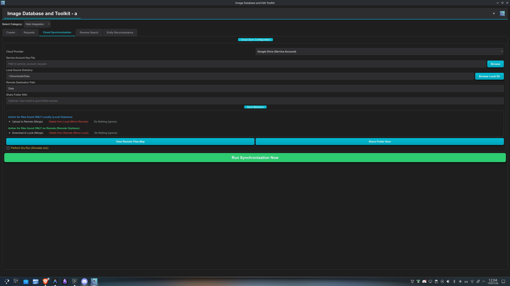

=== "Google Drive (Personal Account)"
    OAuth login as you; files land directly in your Drive.

    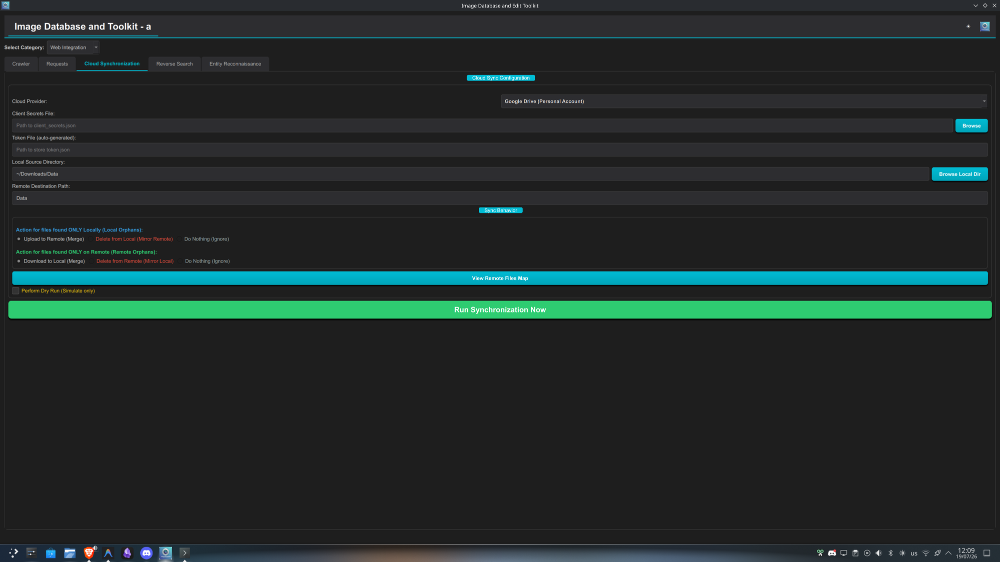

=== "Dropbox"
    Token-based client — a leaner form with just source/dest paths and sync behavior once the vault-stored token is in place.

    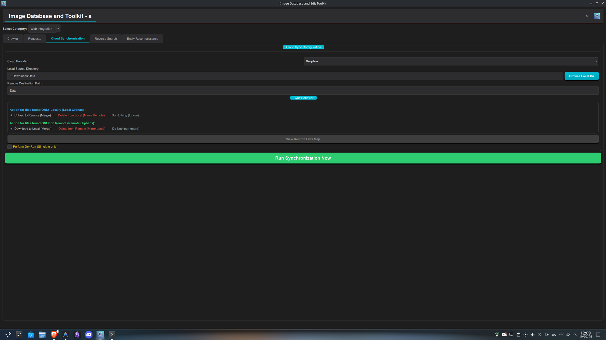

=== "OneDrive"
    Same lean form as Dropbox, using OneDrive's vault-managed provider credentials.

    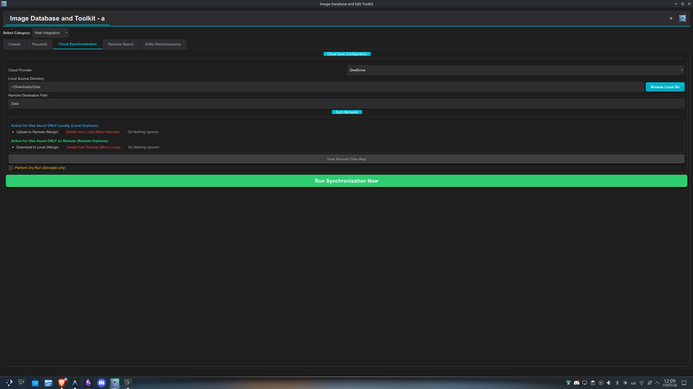

### Required files / keys

Which credentials are needed depends on the provider:

- *Service Account*: a **Service Account Key File** (`service_account_key.json` downloaded from Google Cloud Console; its contents are loaded via the vault).
- *Personal Account*: a **Client Secrets File** (`client_secrets.json`, the OAuth client you create in Google Cloud Console) plus a **Token File** — this one is **auto-generated**: on first sync a browser window asks you to authorize, and the resulting `token.json` is stored at the configured path and silently reused/refreshed afterwards. You never create the token yourself; delete it to force a re-login.
- *Dropbox*: an access **token** stored in the vault under `dropbox_token` (create an app in the Dropbox App Console to obtain one).
- *OneDrive*: its provider token/credentials, likewise vault-managed.

### Sync Behavior

Below the credentials: **Local Source Directory** (what to upload), **Remote Destination Path** (target folder on the drive), and two independent orphan-handling policies:

| Files found... | Merge (default) | Mirror | Ignore |
|---|---|---|---|
| **Only Locally** | Upload to Remote | :material-alert: Delete from Local | Do Nothing |
| **Only on Remote** | Download to Local | :material-alert: Delete from Remote | Do Nothing |

!!! danger "Mirror options are destructive"
    **Delete from Local (Mirror Remote)** and **Delete from Remote (Mirror Local)** are shown in red for a reason — they permanently remove files to force one side to match the other. Use **Perform Dry Run (Simulate only)** first to preview exactly what a sync would do before running it for real, especially with a Mirror policy selected.

**View Remote Files Map** inspects the remote folder structure (Google providers only, via **Share Folder Now**/related APIs); **Run Synchronization Now** executes the configured behavior.

---

## Reverse Search

Finds where an image (or images — the tab works on a gallery selection) appears, or what looks like it.

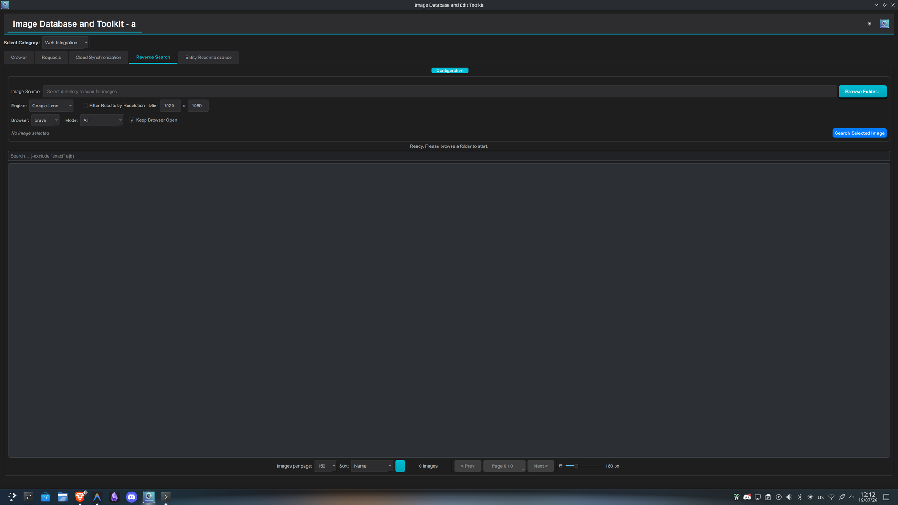

### Engine

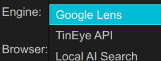

=== "Google Lens"
    Drives a real browser through Google Lens and scrapes the results. Engine-specific options: **Browser** (`brave`/`chrome`/`firefox`/`edge`), **Mode** (below), **Keep Browser Open** (leave the browser up after the search — useful for continuing manually), and a resolution filter for results.

=== "TinEye API"
    The commercial TinEye matching API; needs credentials via the `TINEYE_API_KEY` / `TINEYE_API_SECRET` environment variables or `backend/config/api_keys.yaml`. No browser involved.

    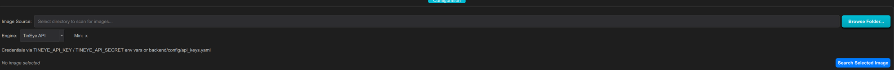

=== "Local AI Search"
    Fully offline CBIR: the query image is embedded with CLIP ViT-B/32 and matched against your own local index at `~/.image-toolkit/cbir_index/`. Its option is **Results (top-k)** — how many nearest neighbours to return. Nothing leaves your machine.

    

    !!! tip "The only fully private option"
        If you're reverse-searching anything sensitive, **Local AI Search** is the mode that guarantees no data leaves your machine — Google Lens and TinEye both send the image to a third-party service.

### Mode (Google Lens)

Selects which Lens result page gets scraped:

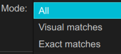

- **All** — the default mixed results page.
- **Visual matches** — similar-looking images (style/content matches, not necessarily the same picture).
- **Exact matches** — pages containing this exact image — the mode for finding an image's origin or checking where it has been reposted.

---

## Entity Reconnaissance

Local-first OSINT identity resolution: "who/what is in this image?", answered against **your own** reference dataset, with an auditable evidence trail. The scope selector governs privacy: **Local only (offline)** never touches the network (Strict Privacy Mode); **Web only** uses reverse-image discovery; **Local + Web** tries the local index first and falls back to the web.

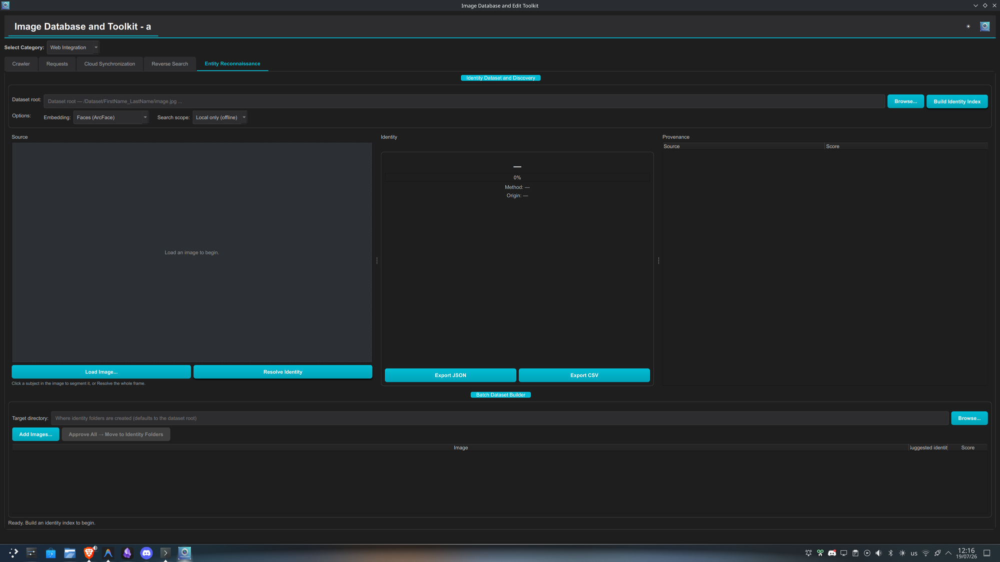

### Build Identity Index

Feeds the resolver. Point **Dataset root** at a directory organized as one folder per identity:

```
/Dataset/FirstName_LastName/photo1.jpg
/Dataset/FirstName_LastName/photo2.jpg
/Dataset/Other_Person/pic.png
```

**Build Identity Index** embeds every image and builds a fast HNSW nearest-neighbour index; the *folder name* is the identity label a match reports. Rebuild after adding identities or images.

### Embedding Options

The embedding model decides *what kind of subject* the index can recognize:

- **Faces (ArcFace)** — a face-recognition embedding; the right choice when your identities are real people photographed face-on. Ignores clothing/background.
- **Characters / objects (CLIP)** — a general visual-semantic embedding; the right choice for illustrated/anime characters, mascots, or objects, where "identity" means overall appearance rather than facial geometry.

!!! warning "Pick the embedding before building"
    The index is embedding-specific — match the option to your dataset *before* building, or the index will need to be rebuilt from scratch.

### Source vs. Identity vs. Provenance (the three panes)

- **Source** (left) — the query. *Load Image…*, then either **click a subject in the image** — a SAM2 segmenter cuts out exactly the clicked person/character, so group shots resolve one subject at a time — or press **Resolve Identity** to use the whole frame.
- **Identity** (center) — the verdict: the resolved name, a **confidence** bar, the **method** that produced the match (local index / web engine), and the **origin**. *Export JSON / Export CSV* save the full report.
- **Provenance** (right) — the evidence: a tree of every source that contributed to the identification with its score (double-click to open). This is what makes a resolution auditable instead of a black-box answer.

Below the panes, the **Batch Dataset Builder** turns resolution into dataset curation: add a pile of unsorted images, each gets a *suggested identity* + score row, and **Approve All → Move to Identity Folders** files them into `<target>/<FirstName_LastName>/` directories — growing the identity dataset with verified samples.
