# :material-map-marker-path: Typical Workflows

The category tutorials ([System Tools](system_tools.md), [Library Database](library_database.md), [Web Integration](web_integration.md), [Deep Learning](deep_learning.md), [Image Stitching](image_stitching.md), [Settings and Login](settings_and_login.md)) document every tab in isolation. This page instead walks through complete, goal-oriented tasks — several of which cross tab categories — from the **Main Window** through to a finished result, at the level of *every individual click*, every parameter you can tune beforehand, and every decision you're asked to make mid-run.

!!! info "Windows referenced in this app"
    - **Login Window** — the vault-unlock prompt shown once per session, before the Main Window ever appears. Every workflow below assumes you're already past it.
    - **Main Window** — the window with the **Select Category** dropdown and the tab strip; this is where every numbered step happens unless stated otherwise.
    - **Settings Window** — opened from the Main Window's menu; only referenced where a workflow depends on a setting living there.
    - **Auxiliary windows/dialogs** — file pickers, review dialogs, import wizards, etc. — pop up over the Main Window when a step opens one; each is captioned explicitly below.

!!! tip "How to read the annotated screenshots"
    Each screenshot has an **amber numbered badge** marking which step it illustrates, and a colored box/arrow pointing at the exact control.

    | Marking | Meaning |
    |---|---|
    | `1`, `2`, `3`… | A required step — do these in order. |
    | `3a` / `3b` / `3c` | Sub-steps of one numbered step, done in order (e.g. filling a field, then clicking a button that reads it). |
    | Separate lettered **paths** (`Path A` / `Path B`, or `11a`/`11b`/`11c` execution routes) | Alternative ways to reach the *same* goal — pick one, not all. |
    | :material-square-outline:{ style="color:#ff2d95" } Magenta box | The primary control for this step. |
    | :material-square-outline:{ style="color:#39ff14" } Green box | The control for an *alternate* path. |
    | :material-square-outline:{ style="color:#ffd700" } Gold box | A checkbox/toggle that changes behavior for everything after it, or a step that launches an external process (browser window, background worker) you may need to watch. |
    | :material-arrow-top-right:{ style="color:#ff2d95" } Arrow | Drag/assignment direction between two elements. |

    Every parameter table below uses the same four columns: **What it is** (the control), **Technical detail** (what actually happens under the hood), **Choose this when / avoid when** (the trade-off), and **Effect of changing it** (what you'll observe if you turn the knob).

---

## Workflow 1 — Download images via a complex multi-site crawl

Configure the **General Web Crawler** — not the simpler Image Board API mode — for a multi-page site with URL pagination and a multi-action scraping recipe. This is the workflow for sites that don't expose a public API: you describe *how a human would click through the gallery*, and the crawler replays it.

**Start from:** Main Window → **Select Category: Web Integration** → **Crawler** tab.

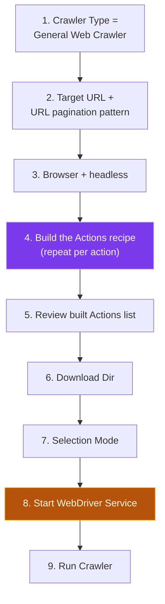
```mermaid
flowchart TD
    A["1. Crawler Type =\nGeneral Web Crawler"] --> B["2. Target URL +\nURL pagination pattern"]
    B --> C["3. Browser + headless"]
    C --> D["4. Build the Actions recipe\n(repeat per action)"]
    D --> E["5. Review built Actions list"]
    E --> F["6. Download Dir"]
    F --> G["7. Selection Mode"]
    G --> H["8. Start WebDriver Service"]
    H --> I["9. Run Crawler"]

    style D fill:#7c3aed,stroke:#c4b5fd,color:#f5f3ff
    style H fill:#b45309,stroke:#fbbf24,color:#fffbeb
```

### Step 1 — Pick the crawler type

Set **Crawler Type** to **General Web Crawler**. This switches the whole form to the Selenium-driven mode described below; the alternative, **Image Board Crawler**, talks to a board's REST API directly and has none of the URL-pattern/Actions machinery this workflow needs.

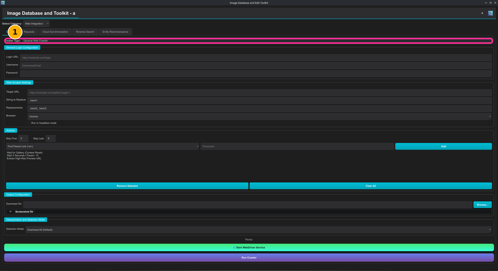

| What it is | Technical detail | Choose this when / avoid when | Effect of changing it |
|---|---|---|---|
| **Crawler Type** (dropdown) | General = launches a real Selenium `WebDriver` browser and executes your Actions program against the live DOM. Image Board = plain HTTP `GET` requests against a documented JSON API (Danbooru/Gelbooru/Sankaku), no browser. | Use **General** for arbitrary sites without a public API, JS-rendered galleries, or sites needing a logged-in session. Use **Image Board** instead when your target *is* one of the three supported boards — it's far faster and lighter since no browser process is spawned. | Switching types replaces the entire form below; settings aren't shared between the two modes. |

### Step 2 — Target URL and the pagination pattern

Fill in **Target URL** with the *first* page of the gallery, then set up **String to Replace** + **Replacements** to describe how the URL changes from page to page.

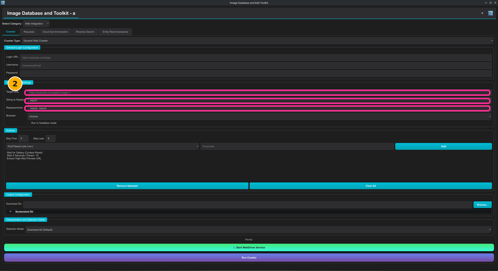

| What it is | Technical detail | Choose this when / avoid when | Effect of changing it |
|---|---|---|---|
| **Target URL** | The literal first URL the crawler navigates to and runs the Actions program against. | Always required. Point it at the exact page containing the gallery grid, not a homepage. | — |
| **String to Replace** | An exact substring of **Target URL** (e.g. `page=1`, or a path segment like `/chapter-1/`) that gets swapped out for each subsequent crawl. | Pick the smallest substring that uniquely identifies "which page" — a bare number like `1` can accidentally match other digits in the URL and mangle it. | If the substring doesn't appear in Target URL at all, the "replacement" pages are identical to the first — the crawler will silently re-scrape the same page N times. |
| **Replacements** | A comma-separated list of values, one per additional page (e.g. `page=2, page=3`). The crawler runs the *whole* page 1 flow once against Target URL unmodified, then once more per replacement with **String to Replace** substituted for each value in turn. | Leave both fields empty to crawl only Target URL — useful for single-page galleries or dry-running your Actions recipe before scaling to many pages. | More replacement values = more full page-visits = proportionally longer runtime; each is independent, so a bad value just yields zero results for that one page rather than aborting the run. |

!!! example "Worked pattern"
    Target URL `https://example.com/gallery?page=1`, String to Replace `page=1`, Replacements `page=2, page=3` → the crawler visits pages 1, 2, and 3 in turn, running the full Actions recipe against each.

### Step 3 — Browser and headless mode

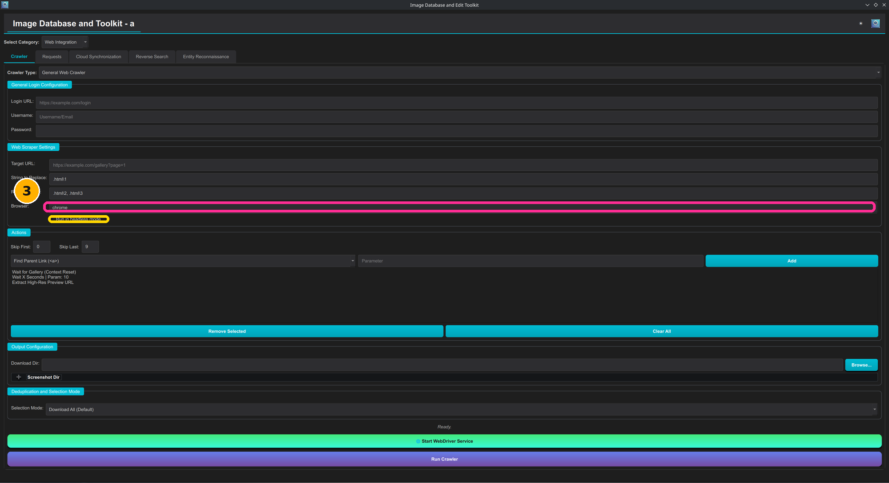

| What it is | Technical detail | Choose this when / avoid when | Effect of changing it |
|---|---|---|---|
| **Browser** (dropdown: `chrome`, `firefox`, `edge`, `brave`) | Selects which Selenium `WebDriver` binary launches. | Match whichever browser is already installed and, if the site does bot-detection, whichever one you've already used to log in manually (shared fingerprint/cookies where applicable). | Different engines render some sites' JavaScript slightly differently — if Actions fail to find elements on one browser, try another before assuming your recipe is wrong. |
| **Run in headless mode** (checkbox, gold) | Unchecked: a real, visible browser window opens and every action plays out on screen. Checked: the same browser runs with no window, driven purely over the automation protocol. | Leave **unchecked** the first time you build a new Actions recipe — watching it click through the page is the fastest way to debug a broken selector. Check it once the recipe is proven, for unattended/background runs. | Headless is faster and uses less RAM, but some sites detect and block headless browsers outright, and you lose the ability to solve a CAPTCHA or interactive check manually mid-run. |

!!! warning "Manual intervention point"
    With headless mode **off**, if the target site shows a CAPTCHA, cookie banner, or age gate, the crawl will stall until you personally interact with the visible browser window to dismiss it — the Actions program has no way to solve these itself.

### Step 4 — Build the Actions recipe

The **Actions** list is a small program, executed once per matched gallery element on every page. Each action is added one at a time: pick the action type from the dropdown, fill its **Parameter** field if it takes one, click **Add** — then repeat for the next action in your recipe. The list runs top-to-bottom.

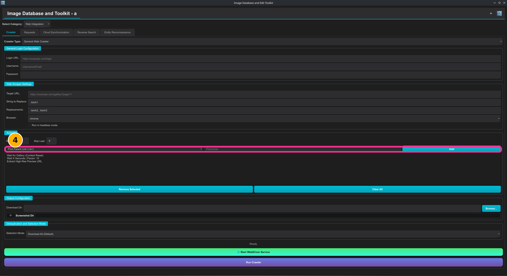

| What it is | Technical detail | Choose this when / avoid when | Effect of changing it |
|---|---|---|---|
| **Skip First / Skip Last** | Trims that many elements off the start/end of the matched-element list before the Actions program runs on the rest. | Use to drop known non-content tiles — e.g. a page always has 1 ad banner first and a "load more" tile last. | Too high a value silently drops real images; too low leaves junk elements that then fail later actions and get skipped anyway. |
| **Action type** (dropdown, 15 options) | See the full action reference in the [Web Integration tutorial](web_integration.md#actions-general-crawler) — each maps to one Selenium primitive (`find_element`, `click`, `WebDriverWait`, download-via-`requests`, etc.). | — | — |
| **Parameter** | Free-text argument some actions need (a CSS selector, a wait duration, an index, matched text). Actions that don't need one (e.g. *Download Image from Element*) ignore this field. | — | A malformed CSS selector or a Δ-seconds value that's too short for the page to load are the two most common recipe bugs. |
| **Add** | Appends the configured action to the list below. | — | — |

!!! example "A typical high-res gallery recipe, built as 8 separate Add clicks"
    4a. **Find Parent Link (`<a>`)** — step from the matched thumbnail up to its enclosing link.
    4b. **Open Link in New Tab** — follow it without losing the gallery page.
    4c. **Switch to Last Tab** — move the driver's focus to the tab just opened.
    4d. **Wait for Page Load** — let the full-view page finish rendering.
    4e. **Find `` Number 1 on Page**, Parameter `1` — target the main image element.
    4f. **Download Image from Element** — fetch it to Download Dir.
    4g. **Close Current Tab** — clean up.
    4h. **Wait for Gallery (Context Reset)** — return focus to the gallery tab and reset the element context for the next thumbnail.

### Step 5 — Review the built Actions list

Before running anything, re-read the accumulated list top-to-bottom — this *is* the program that executes per element, so an ordering mistake here (e.g. downloading before switching tabs) fails silently rather than erroring loudly.

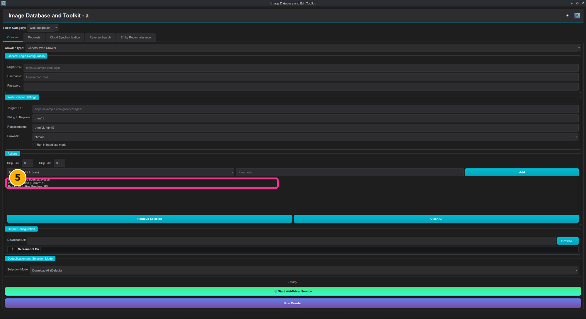

**Remove Selected** deletes one action; **Clear All** empties the list to start over.

### Step 6 — Set the Download Dir

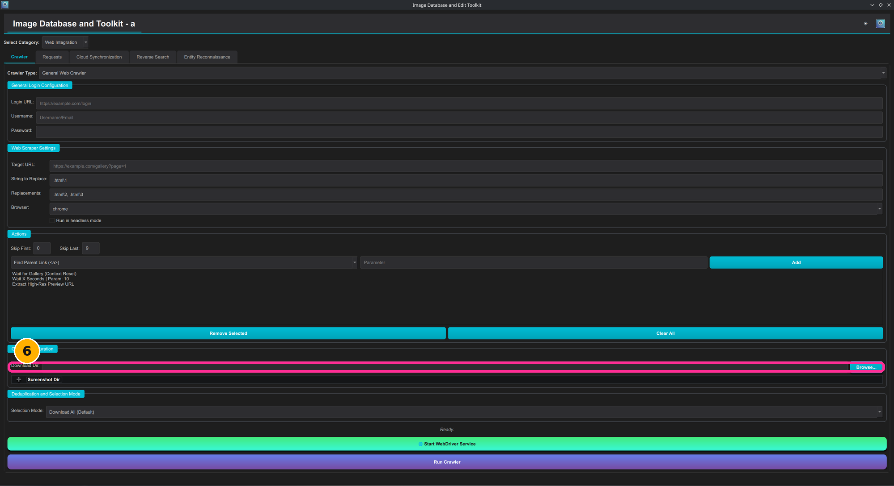

Every file the Actions program downloads lands here, flat (no per-page subfolders). **Screenshot Dir** (optional, collapsed by default) additionally saves a full-page screenshot per visited URL — useful for debugging a recipe after the fact, not required for a normal crawl.

### Step 7 — Choose a Selection Mode

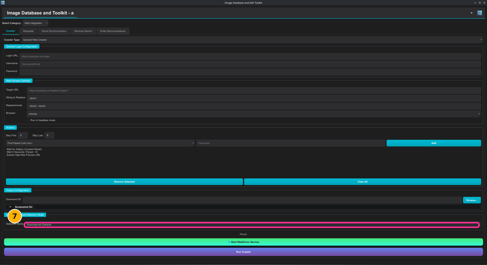

| What it is | Technical detail | Choose this when / avoid when | Effect of changing it |
|---|---|---|---|
| **Download All (Default)** | No post-processing; every successfully downloaded file is kept. | The site is known to have no duplicate reposts across pages. | Fastest; no review step. |
| **Manual Selection** | After the crawl finishes, a review dialog shows every downloaded image with checkboxes; unchecked ones are deleted, and **Cancel** discards the whole crawl. | Small crawls (tens of images) where you want final say. | Adds a mandatory manual review step — the crawl doesn't finish until you act on this dialog. |
| **Automated Selection** | Runs the [Similarity Finder](system_tools.md#similarity) engine over the downloads first (you configure method/threshold in a follow-up dialog), then presents a pruning dialog with likely duplicates pre-unchecked. | Boards where the same image recurs across paginated results (very common). | Adds compute time proportional to the number of downloaded images (perceptual hashing + clustering), plus one manual accept/reject dialog. |

### Step 8 — Start the WebDriver service

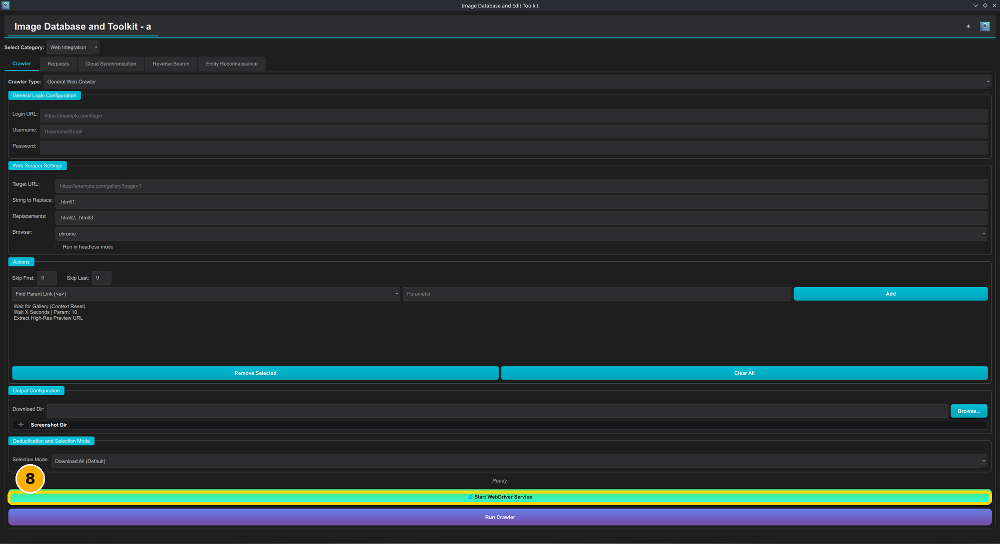

!!! warning "Manual intervention point"
    This spawns the actual browser process (visible unless headless is checked) and must complete *before* **Run Crawler** is enabled. If it fails, the most common causes are: the browser binary from Step 3 isn't installed, or a stale driver process from a previous run is still holding the port — check the log line under the button for the specific error.

### Step 9 — Run Crawler

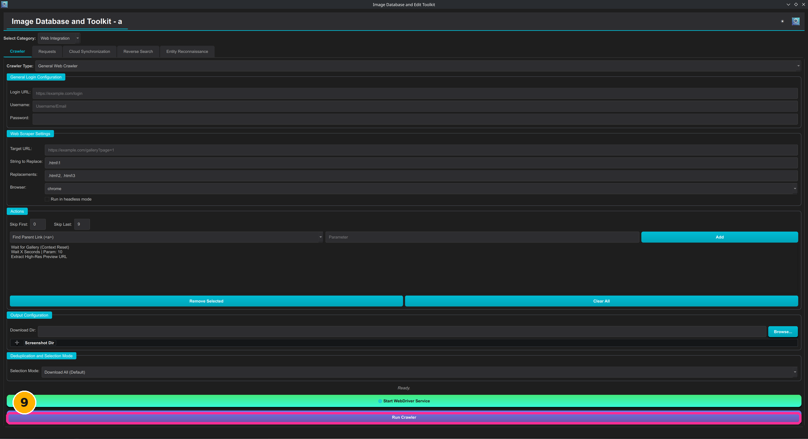

This is the terminal action: the crawler visits Target URL, then each **Replacements** page in turn, running the full **Actions** recipe (minus **Skip First**/**Skip Last** elements) on each, subject to **Selection Mode** post-processing. Progress and any per-element errors stream into the log area above the run buttons.

!!! info "Learn more"
    - The Actions engine is a thin wrapper over [Selenium WebDriver](https://www.selenium.dev/documentation/webdriver/) — its docs cover exactly what each primitive (element location, waits, tab switching) does and why timing-related actions (*Wait for Page Load*, *Wait X Seconds*) exist at all: browsers render asynchronously, and a script that reads the DOM before a page finishes loading gets stale/missing elements.
    - CSS selector syntax (used by *Find Element by CSS Selector*) is documented at [MDN: CSS selectors](https://developer.mozilla.org/en-US/docs/Web/CSS/CSS_selectors) — your browser's DevTools "Copy selector" feature on a right-clicked element is the fastest way to get a working one without hand-writing it.

---

## Workflow 2 — Stitch anime frames into a panorama

The full Anime Stitch Pipeline (ASP) journey: load frames, optionally let the app pick and order the best ones for you, tune the algorithmic stages, then execute via whichever of three avenues matches how much manual control you want. This is the most parameter-dense workflow in the app — every stage below is independently tunable, and the three execution avenues (fully automated / semi-automated / full HITL) are not mutually exclusive escalation steps but genuinely different amounts of hands-on involvement for different failure modes.

**Start from:** Main Window → **Select Category: Image Stitching** → **Stitch** tab.

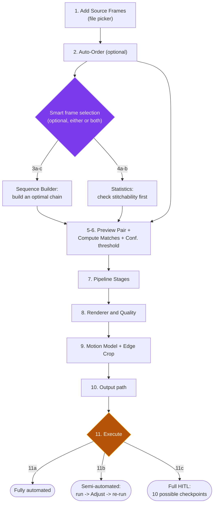
```mermaid
flowchart TD
    S1["1. Add Source Frames\n(file picker)"] --> S2["2. Auto-Order (optional)"]
    S2 --> Smart{"Smart frame selection\n(optional, either or both)"}
    Smart -->|3a-c| SB["Sequence Builder:\nbuild an optimal chain"]
    Smart -->|4a-b| ST["Statistics:\ncheck stitchability first"]
    SB --> S5
    ST --> S5
    S2 --> S5["5-6. Preview Pair +\nCompute Matches + Conf. threshold"]
    S5 --> S7["7. Pipeline Stages"]
    S7 --> S8["8. Renderer and Quality"]
    S8 --> S9["9. Motion Model + Edge Crop"]
    S9 --> S10["10. Output path"]
    S10 --> Exec{"11. Execute"}
    Exec -->|11a| AUTO(["Fully automated"])
    Exec -->|11b| SEMI(["Semi-automated:\nrun -> Adjust -> re-run"])
    Exec -->|11c| HITL(["Full HITL:\n10 possible checkpoints"])

    style Smart fill:#7c3aed,stroke:#c4b5fd,color:#f5f3ff
    style Exec fill:#b45309,stroke:#fbbf24,color:#fffbeb
```

### Step 1 — Load the source frames

Click **Add** in the **Source Frames** pane — this opens a standard file picker. Select every image file that corresponds to a frame you want in the panorama (multi-select with Ctrl/Shift-click), then confirm. **Order matters**: the list order becomes the stitching sequence (first = leftmost/topmost of the pan).

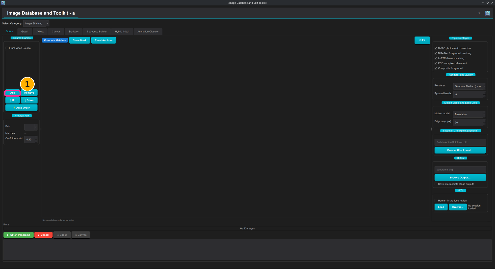

Alternative source: check **From Video Source** and point it at a video file with an **N** frame count (2–200) instead of picking individual images — PyAV decodes the video and extracts N frames, which then populate the same Source Frames list.

### Step 2 — Auto-Order (optional, fixes out-of-order additions)

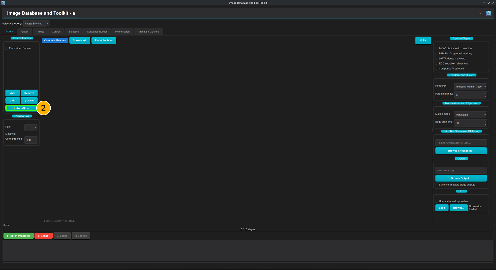

| What it is | Technical detail | Choose this when / avoid when | Effect of changing it |
|---|---|---|---|
| **⚡ Auto-Order** | Starting from the frame currently selected in the list, greedily scores every remaining frame's stitchability against the growing chain (ORB feature-inlier count + displacement quality) and reorders the list into the longest coherent sequence found. | Use whenever frames were added out of pan order (e.g. you multi-selected a folder and the OS returned them alphabetically, not temporally). Skip it if you already carefully ordered the list by hand — it will re-derive an order and may not match your intent for ambiguous cases. | A no-op if the list is already well-ordered; on a scrambled list it can turn an unstitchable mess into a working sequence, but it can also pick the wrong starting direction if the selected anchor frame has near-equal stitchability in both directions. |

### Step 3 — Smart frame selection, avenue A: build an optimal chain (Sequence Builder)

If you have a *pool* of candidate frames rather than a known-good sequence, switch to the **Sequence Builder** tab and let it discover the best chain instead of hand-ordering.

=== "3a — Set the source and thresholds"
    Point **Anchor image** at your starting frame and **Candidates dir** at the pool (or check **Use Stitch Frame List as Candidates** to reuse what Step 1 already loaded).

    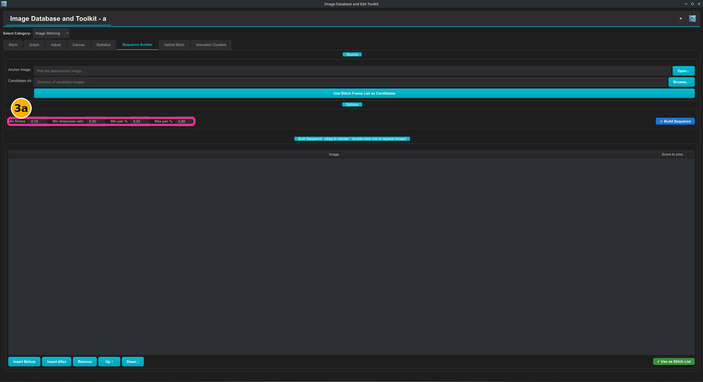

    | What it is | Technical detail | Choose this when / avoid when | Effect of changing it |
    |---|---|---|---|
    | **Min fitness** (0.01–0.99, default 0.15) | *fitness = ORB inlier ratio × displacement quality*, where displacement quality peaks around a ~30%-of-diagonal pan and falls to zero for near-duplicate or non-overlapping frame pairs. A candidate below this fitness is rejected as a chain extension. | Raise it when the pool contains many superficially-similar-but-wrong candidates (demands a genuinely strong geometric link). Lower it if a real pan is being rejected because of heavy compression noise suppressing the ORB inlier count. | Higher = shorter, more conservative chains with fewer wrong links; lower = longer chains that risk including a bad link. |
    | **Min sharpness ratio** (0–1, default 0.50) | Rejects a candidate whose Laplacian-variance sharpness is below this fraction of the anchor frame's sharpness. `0` disables the filter entirely. | Raise it on sources with intermittent motion-blur frames you want auto-excluded. Set to `0` if your whole source is uniformly soft (e.g. an upscaled low-res source) — otherwise everything gets rejected relative to one unusually sharp anchor. | Higher = more aggressive blur rejection, at the risk of rejecting real frames if the anchor happens to be atypically sharp. |
    | **Min pan %** (default 0.03) | Minimum camera translation, as a fraction of the frame diagonal, for a candidate to count as new content rather than a near-duplicate. | Raise it if visually-identical consecutive frames (a held cel) are sneaking into the chain as "new" content. | Higher = more aggressive near-duplicate rejection; too high starts rejecting genuinely small, valid pan steps. |
    | **Max pan %** (default 0.85) | Maximum translation before two frames are considered too far apart to overlap and stitch. | Lower it if the builder is linking frames with too little real overlap, producing weak/failing stitches downstream. | Lower = shorter jumps only (safer, more links needed to cover the same distance); higher = allows big single jumps at the risk of insufficient overlap for LoFTR to find matches. |

=== "3b — Build the chain"
    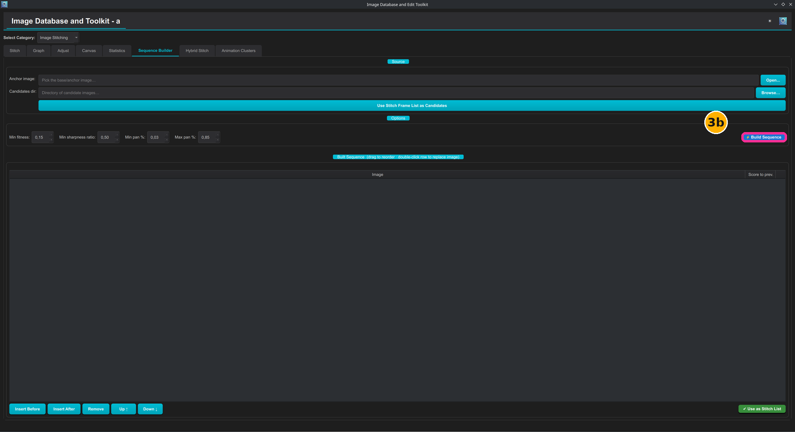

    **⚡ Build Sequence** greedily extends the chain outward from the anchor in both directions, applying the thresholds above at every candidate. The resulting **Built Sequence** table shows each frame with its *score to the previous frame* — drag to reorder, double-click a row to swap its image, or use **Insert Before/After** / **Remove** / **Up ↑** / **Down ↓** to hand-correct the result.

=== "3c — Hand it to Stitch"
    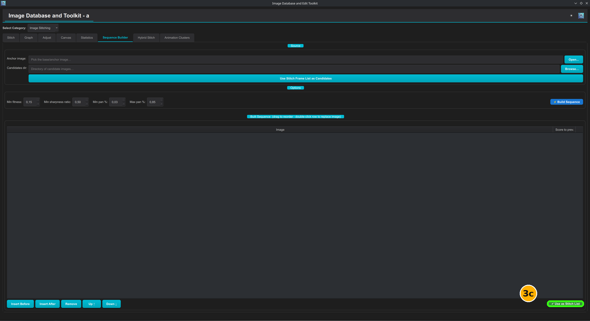

    **✔ Use as Stitch List** replaces whatever was in the Stitch tab's Source Frames (Step 1) with this discovered-and-ordered chain.

### Step 4 — Smart frame selection, avenue B: check stitchability first (Statistics)

Complementary to (or instead of) Sequence Builder: run a diagnostic pass over your candidate set *before* committing compute time to a full stitch attempt.

=== "4a — Point it at your frames"
    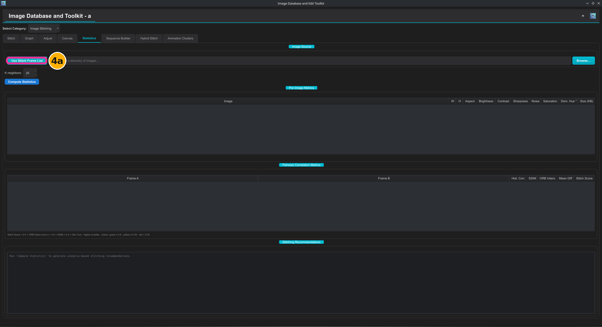

    **Use Stitch Frame List** reuses Step 1's list; the field beside it lets you point at any directory instead. **K neighbors** (1–100, default 20) additionally compares each frame against its K nearest neighbours (not just the next one in sequence) — raise it to catch periodic pose repetitions (e.g. a walk-cycle) that a purely-sequential comparison would miss, at proportionally higher compute cost.

=== "4b — Read the diagnostics"
    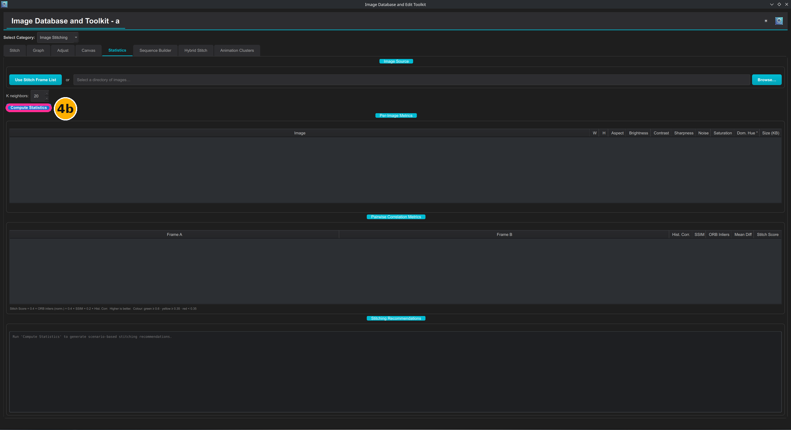

    **Per-Image Metrics** flags per-frame outliers (unusually dark/blurry/noisy frames — candidates to fix in Adjust, via Path B below, or drop entirely). **Pairwise Correlation Metrics** scores every pair with **Stitch Score** = `0.4 × normalized ORB inliers + 0.4 × SSIM + 0.2 × histogram correlation`, color-coded green (≥0.6, should stitch cleanly) / yellow (≥0.35, marginal) / red (<0.35, likely to fail) — this is the manual-triage step: drop or reorder frames whose neighboring-pair score is red *before* running the full pipeline, rather than discovering the failure after a multi-minute stitch attempt.

### Step 5 — Preview a pair and compute matches

Back on the **Stitch** tab: pick a pair from the **Pair** dropdown, then click **Compute Matches** to run LoFTR (see *Learn more* at the end of this workflow) on it and draw the correspondences in the center preview.

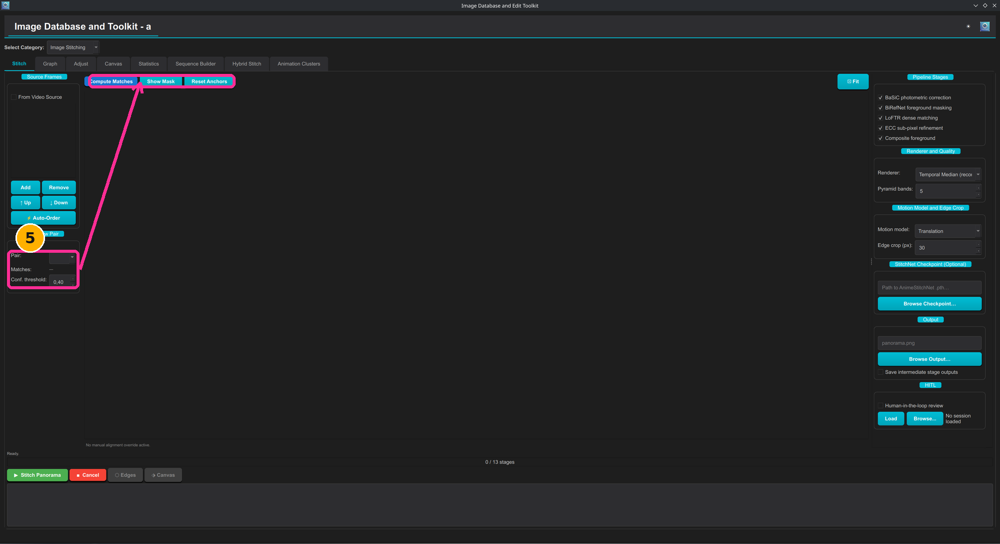

**Show Mask** overlays the BiRefNet foreground mask so you can see exactly what's being excluded from matching; the displayed anchors are **draggable** — dragging one manually overrides that pair's alignment (useful when LoFTR converges on a plausible-but-wrong solution in a low-texture region), and **Reset Anchors** discards the override.

### Step 6 — Conf. threshold

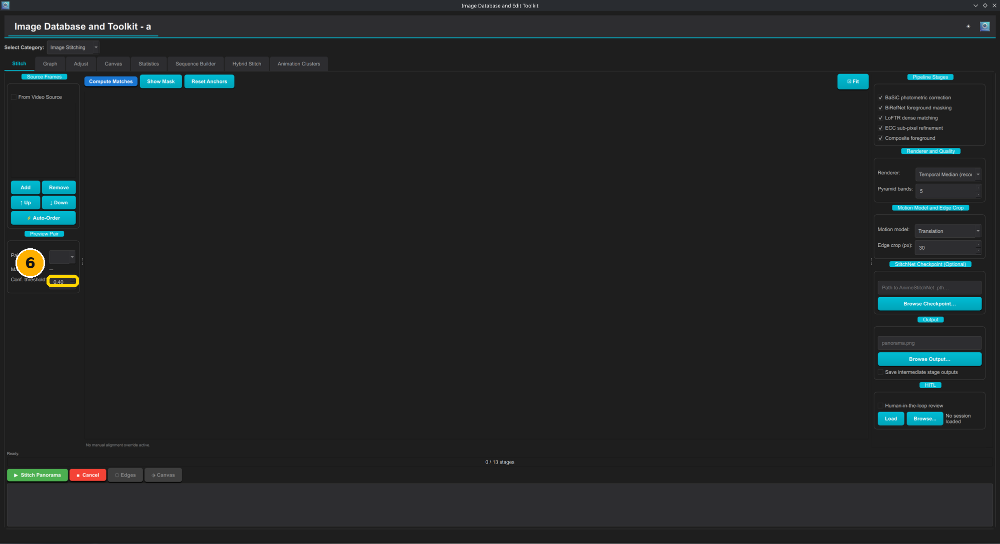

| What it is | Technical detail | Choose this when / avoid when | Effect of changing it |
|---|---|---|---|
| **Conf. threshold** (0.10–0.99, default 0.40) | A numeric gate on LoFTR's Mutual Nearest Neighbor (MNN) step: LoFTR downsamples both images' feature maps, applies a softmax to turn them into match probabilities, and keeps a pixel pair `(A, B)` only if *both* "A's best match is B" and "B's best match is A" clear this confidence threshold. It affects only what's *displayed*/eligible here — it doesn't change how many matches LoFTR internally computes. | Raise it to inspect only the rock-solid correspondences when judging whether a pair will actually stitch. Lower it if a pair you know overlaps is showing suspiciously few matches — a too-strict threshold can hide correct-but-lower-confidence matches. | A high threshold typically lowers the false-positive rate by blocking flat, ambiguous probability distributions — common in low-texture regions (sky, flat walls, solid-color cel fills) where many pixel pairs share similarly low confidence — from producing junk matches, at the cost of potentially discarding some correct matches too. |

### Step 7 — Pipeline Stages

Five independent toggles, all on by default. Changing these changes what the *actual stitch run* does, not just the preview.

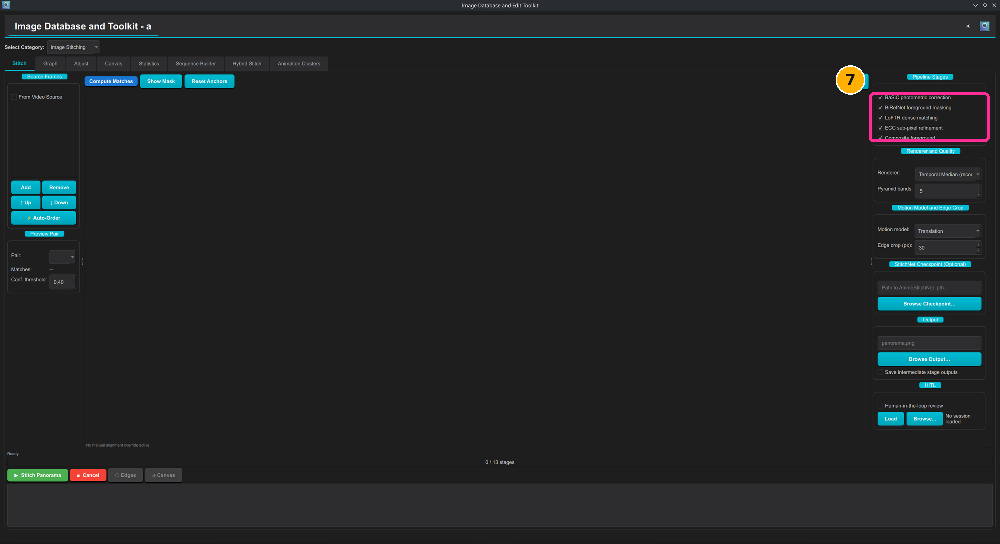

| What it is | Technical detail | Choose this when / avoid when | Effect of disabling |
|---|---|---|---|
| **BaSiC photometric correction** | Estimates and removes a smooth flat-field/dark-field illumination model per frame (background/shading correction, robust low-rank decomposition), *before* matching. | Keep on for broadcast sources with vignetting or brightness drift between frames. Turn off only if you've already color-graded frames identically and want to save the compute. | Off: brightness drift between frames can corrupt both alignment (LoFTR/ECC see it as structure) and blending (visible seams). |
| **BiRefNet foreground masking** | Runs a dichotomous-segmentation network to detect anime characters and excludes those pixels from LoFTR matching entirely. | Strongly recommended on: characters move independently frame-to-frame, and matching on them drags the background alignment along with the character's motion. Consider off only for backgrounds with no characters present at all (saves a full network forward-pass per frame). | Off: character motion can be misinterpreted as camera motion, producing a warped/misaligned background. |
| **LoFTR dense matching** | Subpixel-accurate learned dense correspondence (see *Learn more* below); unchecking falls back to classical template matching (normalized cross-correlation search). | Keep on for anime/limited-animation sources — LoFTR is specifically strong on the low-texture, flat-color regions common there. Template matching is faster but far more fragile on that content. | Off: alignment quality drops noticeably on flat/low-texture content; runtime drops since no network inference is needed. |
| **ECC sub-pixel refinement** | A final Enhanced Correlation Coefficient (see *Learn more* below) optimization pass after bundle adjustment, polishing each pairwise alignment to sub-pixel precision by maximizing a contrast/brightness-invariant correlation measure under the chosen [motion model](#step-9-motion-model-and-edge-crop). | Keep on when seam sharpness matters (it measurably reduces ghosting at overlaps). Skip for a quick low-stakes preview stitch. | Off: alignment stays at LoFTR's native precision (still good, just not sub-pixel-polished) — seams may show very slightly more ghosting. |
| **Composite foreground** | After the background is stitched with characters suppressed, pastes the character back in from the single best-scoring frame onto the final result. | Keep on whenever characters are present and you want them in the final panorama at all. Turn off for pure-background/establishing-shot pans with no characters. | Off: the panorama shows only the reconstructed background — any character is gone from the output entirely. |

### Step 8 — Renderer and Quality

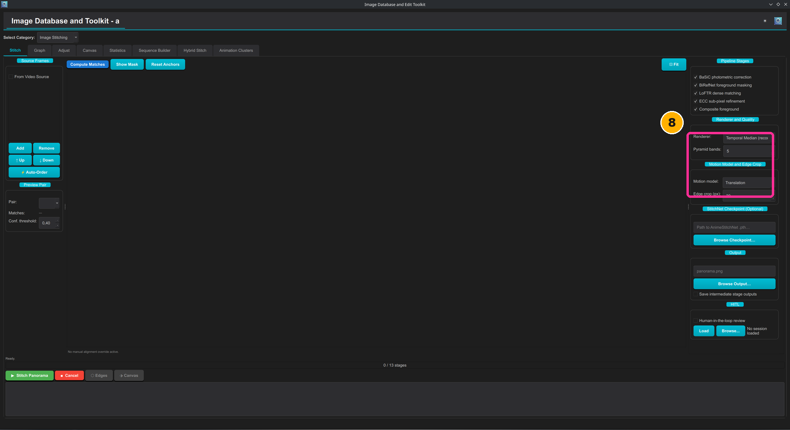

| What it is | Technical detail | Choose this when / avoid when | Effect of changing it |
|---|---|---|---|
| **Renderer: Temporal Median** (recommended) | Per output pixel, takes the *median* value across every frame that covers it — an Overmix-style estimator that's robust to outliers (compression artifacts, a moving foreground remnant that slipped past masking) because the median ignores minority-vote pixels entirely. | Default choice for most sources. | — |
| **Renderer: First-Valid Pixel** | Each output pixel is copied from whichever frame's coverage reaches it *first* in stitch order — no blending computation at all. | Fastest option, useful for a quick structural preview or when you've already verified frames are near-perfectly aligned. Avoid for final output — visible seams are likely wherever coverage boundaries fall on non-uniform content. | Near-zero blending cost, but seams are the most visible of the three renderers. |
| **Renderer: Sequential Laplacian Blend** | Multi-band blending via a Laplacian pyramid (see *Learn more* below): the overlap is decomposed into frequency bands, and each band is blended with a transition width matched to its frequency — low frequencies (broad tonal areas) blend over a wide zone, high frequencies (edges/texture) blend over a narrow one, avoiding both hard seams and blurred detail. | Choose when Temporal Median's seams are still visible — this is the "smoothest seams" option. Costs more compute than the other two, and needs enough frames to build a meaningful pyramid. | Best seam smoothness of the three; slowest. |
| **Pyramid bands** (1–8, default 5) — only meaningful with Sequential Laplacian Blend | Depth of the Laplacian pyramid decomposition — how many frequency sub-bands the blend is split across. | Raise it for higher-resolution sources where a shallow pyramid leaves visible banding at the transition zone; the default 5 suits typical 1080p-ish frame sizes. | More bands = smoother, more gradual transitions at proportionally more compute (each level roughly doubles the working memory/time for that stage). |

### Step 9 — Motion Model and Edge Crop

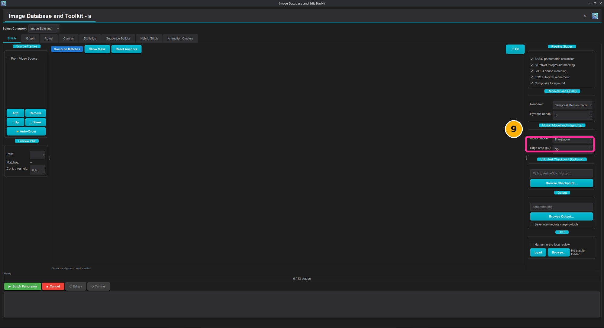

| What it is | Technical detail | Choose this when / avoid when | Effect of changing it |
|---|---|---|---|
| **Motion model: Translation** | A 2-degrees-of-freedom model (`dx`, `dy` only) fit between each frame pair. | The right default for pure horizontal/vertical camera pans — the overwhelmingly common anime case — because constraining the solve to 2 DOF makes it faster *and* more robust against being pulled into a spurious rotation/scale by a few bad matches. | Fewer free parameters = more robust fit on noisy matches, but cannot correct any actual rotation or scale drift between frames. |
| **Motion model: Affine 4-DOF** | Adds rotation and uniform scale to translation (a similarity transform: 4 free parameters — 2 translation, 1 rotation, 1 scale — no independent shear). | Use for panels shot with slight camera rotation or zoom drift. | More expressive fit at some robustness cost — with sparse/noisy matches, the extra 2 DOF can occasionally converge to a wrong rotation/scale that a Translation-only fit would have avoided by construction. |
| **Edge crop (px)** (default 30) | Strips this many pixels from each long edge of the *final* panorama — not per-frame, only the finished canvas. | Raise it if the border of the result still shows blend/alignment artefacts (they concentrate at the extreme edges where the fewest frames overlap). Lower it if you're losing real content at the boundary. | Purely a post-processing crop; larger values trade final canvas size for a cleaner border. |

### Step 10 — Output path and intermediate dumps

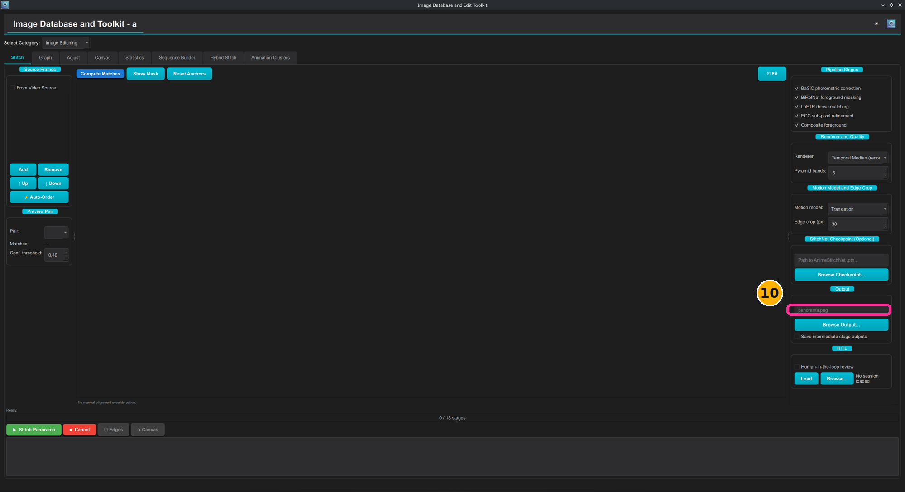

Set **Output path** to where the panorama file is written. Checking **Save intermediate stage outputs** additionally dumps every pipeline stage to `<output>_stages/` (normalized frames, background masks, edge-graph JSON, affine matrices, canvas images per post-processing step) — off by default because it multiplies disk usage and write time; turn it on specifically when you need to diagnose *where* a misalignment is being introduced, since it also unlocks the **⬡ Edges** / **⬗ Canvas** inspector buttons for the run.

### Step 11 — Execute: three avenues

=== "Path A — Fully automated"
    Leave every Pipeline Stage toggle at its Step 7 default, leave the HITL checkbox unchecked, and click **▶ Stitch Panorama**.

    

    The progress bar counts the 13 internal stages; the log streams per-stage detail; when it finishes, the **Stitch Result** box shows the output with a **Before/After** toggle and quality metrics. No manual intervention happens during the run — the fastest path, appropriate when your Statistics check (Step 4b) showed green/yellow scores throughout.

=== "Path B — Semi-automated: run, inspect, fix in Adjust, re-run"
    Run Path A once. If the result has a *localized* flaw traceable to one specific input frame (bad exposure, a color cast, a slight rotation), don't re-tune the whole pipeline — fix that one frame:

    1. Switch to the **Adjust** tab and **Open…** the offending frame.
    2. Apply a targeted correction — the table below covers every Adjust control and when it's the right tool:

    | What it is | Technical detail | Choose this when / avoid when |
    |---|---|---|
    | **90°/180° rotation, Flip H/V, Fine rotate** (−180°…180°, 0.1° steps) | Fine rotate applies a sub-degree affine rotation; the 90°/180° buttons are lossless axis-aligned rotations. | Fine rotate for a frame shot slightly off-level (visible tilted horizon); the 90°/180° buttons for frames captured in the wrong orientation entirely. |
    | **Crop to Aspect Ratio** (presets) | Center-crop applied *before* the other adjustments. | Use to normalize one frame's aspect ratio to match the rest of the sequence before it reaches the pipeline's frame-size assumptions. |
    | **Auto WB (Gray World)** | Assumes the scene's average color should be neutral gray and rescales channels to enforce that; **Temp**/**Tint** sliders are the manual equivalent. | The direct fix for the yellow/blue tint that appears when one frame was graded differently — exactly the kind of localized color-cast flaw this path exists for. |
    | **Brightness / Contrast / Gamma ×100 / Shadows / Highlights** | Standard tone-curve controls; Gamma is a power-law remap (100 = neutral, no ×). | Match one under/overexposed frame's tonal range to its neighbors before it drags the BaSiC correction's estimate off. |
    | **Saturation / Vibrance / Hue shift** | Vibrance is saturation-with-a-curve that spares already-saturated regions from further boosting (avoids clipping skin tones/existing vivid colors). | Vibrance over plain Saturation whenever the frame already has some strongly-colored content you don't want pushed into clipping. |
    | **Sharpen / Blur** | Unsharp-mask-style sharpen; simple blur. | Sharpen a frame Statistics flagged as unusually soft; blur is rarely useful pre-stitch — mostly for polishing the *finished* panorama afterward. |

    3. Click **→ Add to Stitch** — this applies your edits and swaps the corrected version back into the Stitch tab's Source Frames list, replacing the original.
    
    4. Return to **Stitch** and click **▶ Stitch Panorama** again.

    This loop (fix one frame → re-run the *whole* pipeline) is appropriate for a handful of flawed frames. If most of the sequence needs work, batch-fix in whatever bulk tool applies (e.g. [Codec/Format conversion](system_tools.md#convert)) instead of one-by-one in Adjust.

=== "Path C — Full Human-In-The-Loop (HITL)"
    Check **Human-in-the-loop review** (in the HITL group box between Output and the run controls), then click **▶ Stitch Panorama**.

    

    With this checked, the run **pauses at up to ten checkpoints**, each opening its own dialog. Nothing proceeds until you act on the open dialog — this is the slowest but most controllable path, appropriate for shots with heavy parallax, effects layers, or extreme style that the automatic pipeline mishandles. Every checkpoint's dialog has an Accept path (resume with your edits applied) and a Cancel path (abort the whole run):

    | Checkpoint | What you see | What you can do |
    |---|---|---|
    | **Video Frame Review** (only if using From Video Source) | Every frame the video extraction pulled, as a selection grid. | Uncheck frames you don't want in the pipeline at all before anything else runs. |
    | **Frame Selection Review** (stage 4) | The current frame list. | Exclude or reorder frames — your last chance to drop a bad frame before compute-heavy stages begin. |
    | **Segmentation Mask Review** (stage 4.5) | The BiRefNet-predicted foreground mask per frame. | Refine it two ways: type a **text prompt** to re-run Grounded-SAM2 segmentation from a description, or click positive/negative points directly on the frame to nudge the mask locally via the live SAM2 predictor — for characters BiRefNet mis-segmented. |
    | **Edge Graph Review** (stage 5) | The computed pairwise-alignment graph — which frames are matched to which. | **Add or remove edges**: toggle individual pairwise matches on/off before bundle adjustment runs — this is the direct fix for a spurious link between two visually-similar-but-unrelated frames that would otherwise warp the whole chain. |
    | **Canvas Layout Review** (stage 8) | The assembled canvas with each frame's placement. | Manually nudge individual frame positions before final rendering, correcting residual drift bundle adjustment didn't fully resolve. |
    | **Seam Boundary Review** | The computed seam boundaries between overlapping frames. | Edit exactly where each seam falls. |
    | **Seam Diagnostic Inspector** | Per-seam quality metrics. | Override specific seams flagged as problematic. |
    | **Seam Painter** (composite loop) | The blended overlap region. | Paint hard seam constraints with a brush to force the seam through a region you choose (e.g. routed around a character edge) — choosing **Recomposite** re-runs the blend with your painted mask and loops back to this same dialog for further iteration, or **Accept** to move on. |
    | **Render / Coverage Heatmap Review** (stage 9) | A heatmap of how many frames cover each output pixel. | Spot coverage gaps (holes no frame reached) before committing to final render; cancelling here aborts just the render, not the whole run. |
    | **Final Output Quality Rating** | The finished panorama. | Rate it and annotate specific regions — this feedback is stored for the pipeline's RLHF loop, improving future automated runs on similar content. |

    !!! warning "Manual intervention is the point of this path"
        Every row above is a real modal dialog — the run is genuinely blocked until you respond. Don't start a full-HITL run if you can't stay at the app for its duration; use **Save intermediate stage outputs** + **Load**/**Browse…** session recovery (documented in the [Image Stitching tutorial](image_stitching.md#stitch)) if you need to pause partway through and resume later.

!!! info "Learn more"
    - **LoFTR** (dense matching): [Sun et al., "LoFTR: Detector-Free Local Feature Matching with Transformers," CVPR 2021](https://arxiv.org/abs/2104.00680) — the paper's Figure 2 is the clearest illustration of the coarse-to-fine, dual-softmax matching this app's Conf. threshold gates.
    - **ECC** (sub-pixel refinement): [OpenCV's `findTransformECC` documentation](https://docs.opencv.org/4.x/dc/d6b/group__video__track.html) explains the enhanced correlation coefficient objective and why it's brightness/contrast-invariant where raw pixel-difference alignment isn't.
    - **ORB** (used by Auto-Order and Sequence Builder's fitness scoring): [OpenCV's ORB tutorial](https://docs.opencv.org/4.x/d1/d89/tutorial_py_orb.html).
    - **Laplacian pyramid blending**: [the classic multi-resolution blending technique on Wikipedia](https://en.wikipedia.org/wiki/Pyramid_%28image_processing%29#Blending) — the reference for why per-frequency-band blend widths avoid the seam-vs-blur trade-off a single flat blend can't escape.
    - **BiRefNet** (foreground masking): [Zheng et al., "Bilateral Reference for High-Resolution Dichotomous Image Segmentation," 2024](https://arxiv.org/abs/2401.03407).

---

## Workflow 3 — Set your desktop wallpaper

Two independent ways to change what's on screen: a direct one-shot assignment, or a graph-driven sequence that cycles automatically. Pick whichever fits — they don't need to be combined.

**Start from:** Main Window → **Select Category: System Tools** → **Wallpaper** tab.

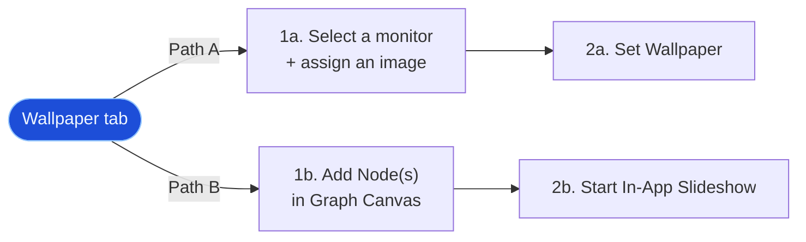
```mermaid
flowchart LR
    Start(["Wallpaper tab"]) -->|Path A| A1["1a. Select a monitor\n+ assign an image"]
    A1 --> A2["2a. Set Wallpaper"]
    Start -->|Path B| B1["1b. Add Node(s)\nin Graph Canvas"]
    B1 --> B2["2b. Start In-App Slideshow"]

    style Start fill:#1d4ed8,stroke:#93c5fd,color:#eff6ff
```

=== "Path A — System Display(s) (direct assignment)"

    1. On the **System Display(s)** subtab, first set **Background Type** — this determines what the rest of the steps do:

        | What it is | Choose this when |
        |---|---|
        | **Image** | A single static wallpaper per monitor — the simplest case, covered by the steps below. |
        | **Slideshow** | Cycling images automatically; adds Interval/Order/daemon controls layered on top of the same per-monitor assignment. |
        | **Smart Video** / **Smart Video Slideshow** | A video (or cycling videos) as an animated wallpaper. |
        | **Solid Color** | No image source at all — disables the gallery/scan directory entirely in favor of a flat color picker. |

    2. Click the monitor tile you want to change, then click a thumbnail in the gallery below to assign it — the arrow in the screenshot shows this assignment relationship.

        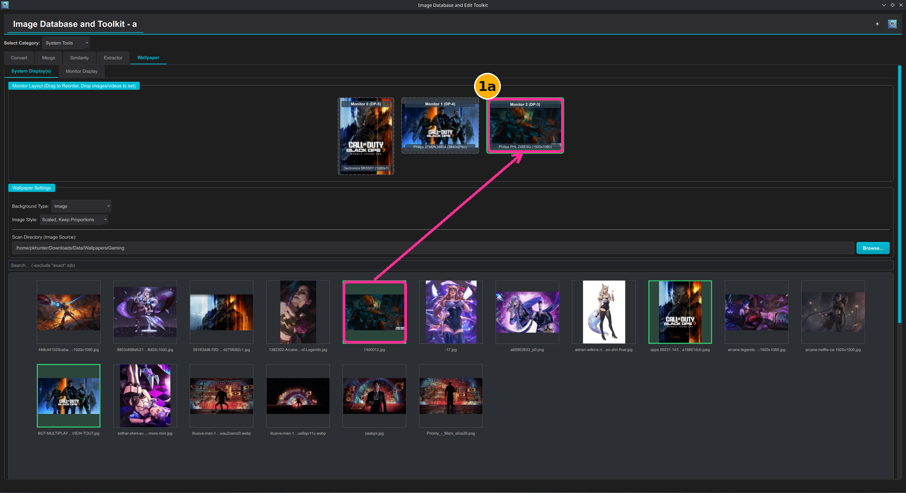

    3. Scroll down and click **Set Wallpaper** to apply it to the real desktop immediately.

        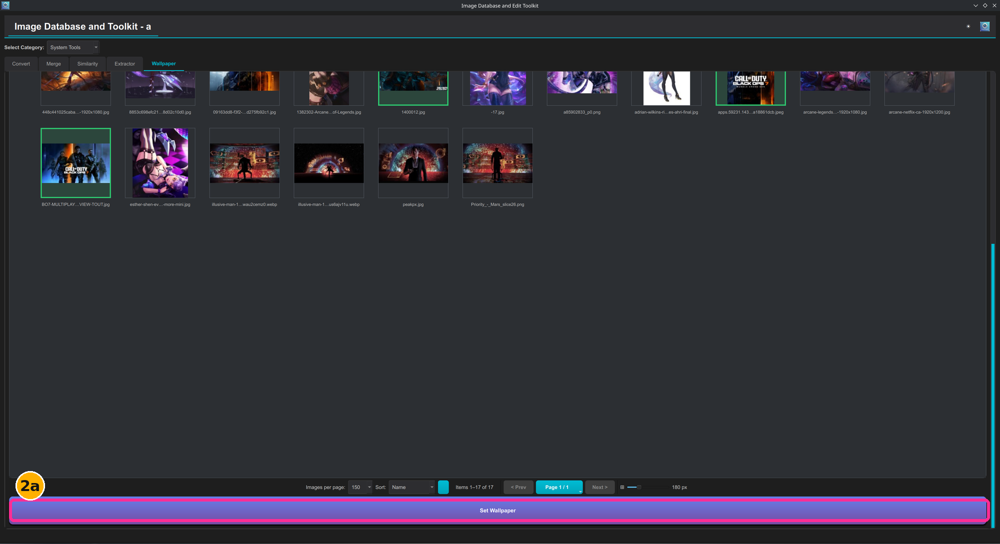

=== "Path B — Monitor Display (graph sequencer)"

    1. On the **Monitor Display** subtab, click **+ Add Node** for each wallpaper you want in the rotation (drag images from the gallery onto the canvas works too), then **→ Connect** each node to whichever should play next, and **★ Set Start** on the entry point.

        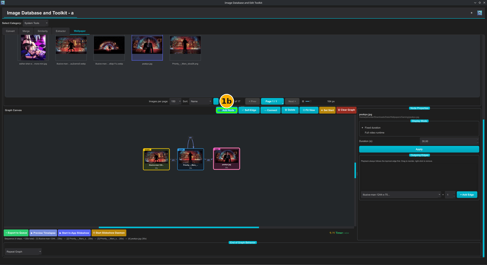

        | What it is | Technical detail | Choose this when / avoid when |
        |---|---|---|
        | **Self-Edge** | Connects a node to itself. | The node should repeat (loop) instead of immediately advancing — e.g. a long-running centerpiece video that should hold before cycling on. |
        | **Outgoing Edges priority** (per-node, edited via double-click) | Playback always follows the *topmost* outgoing edge first; each edge additionally carries a **×N repeat count**. | Build branching structures — e.g. "play the intro node once, then loop the main rotation forever" — by giving the intro node a single outgoing edge into the loop, and giving loop nodes edges back into each other. |
        | **End of Graph Behavior** | What happens when traversal reaches a node with no outgoing edges: `Repeat Graph`, `Solid Color`, `Stay on Last Wallpaper`, `Return to First Wallpaper`, or `Jump to Specific Wallpaper`. | `Repeat Graph` for an endless rotation; `Jump to Specific Wallpaper` to land on a specific "resting" wallpaper after a sequence finishes. |

    2. Click **▶ Start In-App Slideshow** to begin cycling through the graph while the app is open (**⏱ Start Slideshow Daemon** instead if you want it to keep running after you close the app — a detached background process, one per display).

        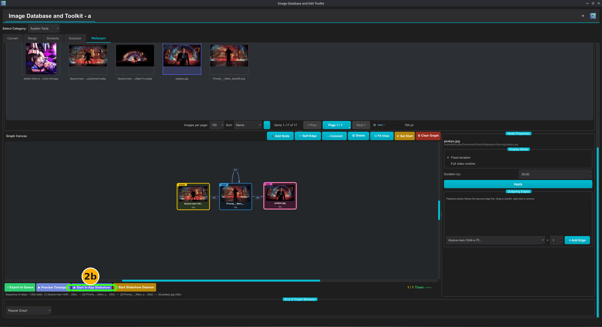

!!! note "Why two paths exist"
    System Display(s) is a flat "pick one image per monitor" model — quick, but static. Monitor Display trades that simplicity for a sequencer: each display gets its own graph, letting you build loops, branches, and timed transitions instead of a single fixed assignment.

!!! info "Learn more"
    Slideshow/daemon behavior and troubleshooting (stale PID files, log locations) are covered in the [Settings and Login tutorial's Reset State section](settings_and_login.md#reset-state) — **Reset Slideshow Daemon** is the fix if a graph-driven rotation gets stuck.

---

## Workflow 4 — Catalogue a folder into your library

Register a folder of images into the searchable index *and* create catalogue entries for the show(s) it contains, using the same source folder for both.

**Start from:** Main Window → **Select Category: Library Database** → **Scan and Tag** tab.

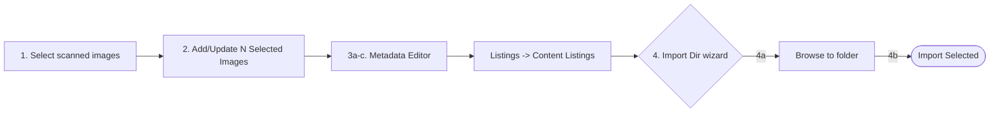
```mermaid
flowchart LR
    A["1. Select scanned images"] --> B["2. Add/Update N Selected Images"]
    B --> C["3a-c. Metadata Editor"]
    C --> D["Listings -> Content Listings"]
    D --> E{"4. Import Dir wizard"}
    E -->|4a| F["Browse to folder"]
    F -->|4b| G(["Import Selected"])
```

1. With **Scan Directory** already pointed at your folder, click thumbnails in the scan gallery to select the images you want indexed (a border marks each selection; Ctrl/Shift-click for multi-select).

    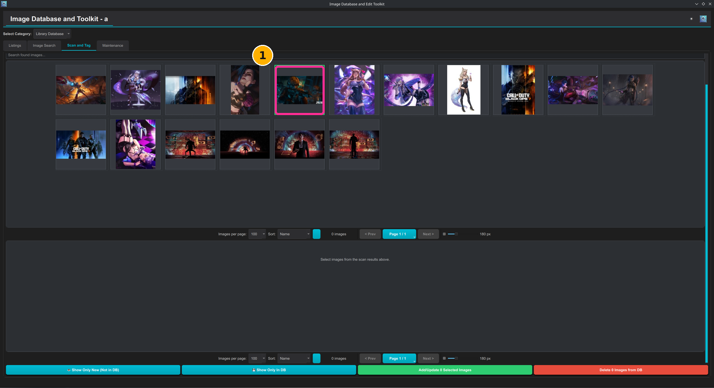

2. Click **Add/Update N Selected Images** — this opens the **Edit Metadata** auxiliary window instead of writing immediately.

    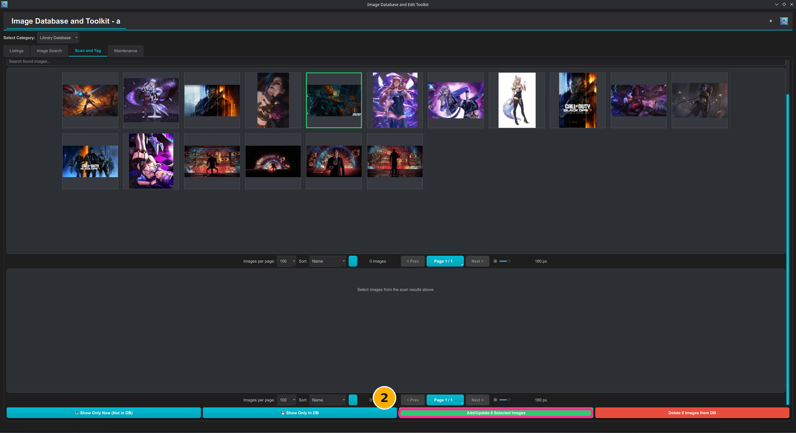

3. In the **Edit Metadata** window:

    3a. On **Batch / Overview**, set **Group**/**Subgroup** and check the **Tags** you want applied to every selected image. Toggle **Filter by Type** on if the tag list is long and you want to narrow it to specific tag types first.

    3b. Click **↓ Apply to All Image Tabs** to fan those values out to every selected image's own tab — without this click, the Batch tab's values are *not* automatically used; each image keeps whatever it had.

    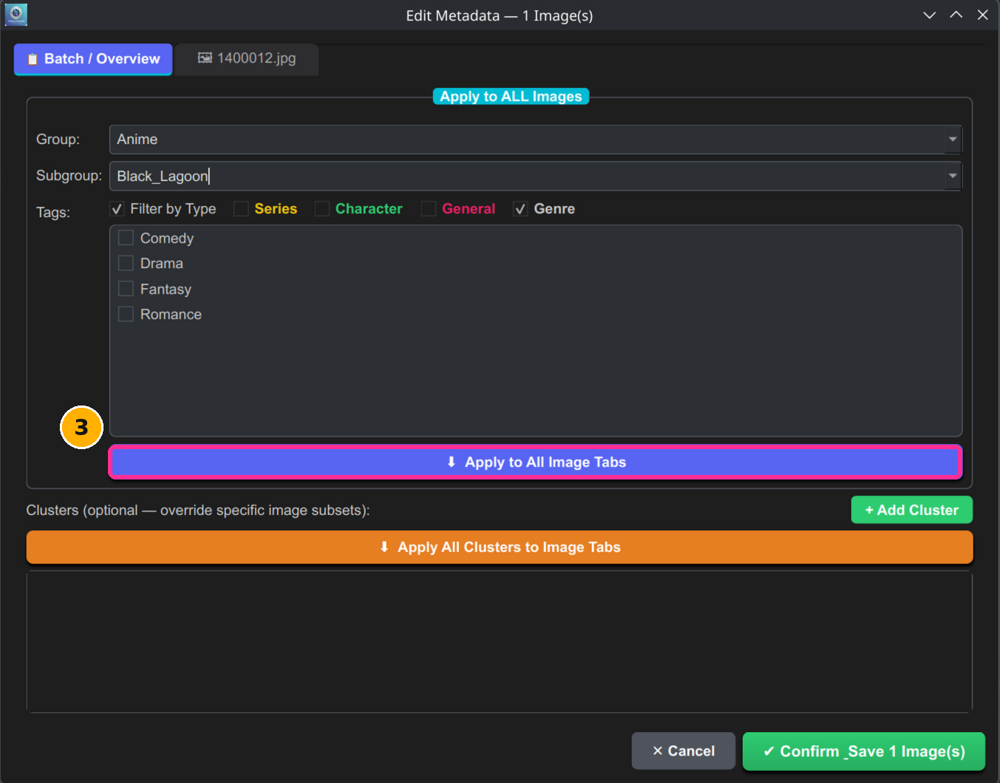

    3c. **Optional — Clusters**: if a *subset* of the selected images need different metadata than the rest (e.g. one episode belongs to a different subgroup), click **+ Add Cluster**, pick its member images, and give that cluster its own Group/Subgroup/Tags. Checking **Group pattern (sequential)** inside a cluster turns its Group/Subgroup into a template — `Episode{n}` (or a bare name with no `{n}`, which auto-appends the index) becomes `Episode1`, `Episode2`, … across the cluster's images in list order. Click **⬇ Apply All Clusters to Image Tabs** to write cluster values onto their member images, then **✔ Confirm & Save**.

    | What it is | Technical detail | Choose this when / avoid when |
    |---|---|---|
    | **Filter by Type toggle** | Hides/shows per-type checkboxes (`Artist`, `Series`, `Character`, `General`, `Meta`, …) that filter the tag list live. | Turn on once your tag vocabulary is large enough that scrolling to find one tag is slower than narrowing by type first. |
    | **Cluster + sequential pattern** | A named override applied on top of the Batch defaults for a chosen image subset; the pattern substitutes `{n}` with the 1-based position of each image *within that cluster*. | Fast path for tagging sequentially-numbered episode/page screenshots without editing each image's tab by hand. Overkill for a handful of images — just edit their tabs directly. |

4. Switch to **Listings → Content Listings** and click **📂 Import Dir** to also create a catalogue entry for the show(s) in that same folder:

    4a. In the **Import Listings from Video Directory** window, click **Browse..** and point it at the source folder.

    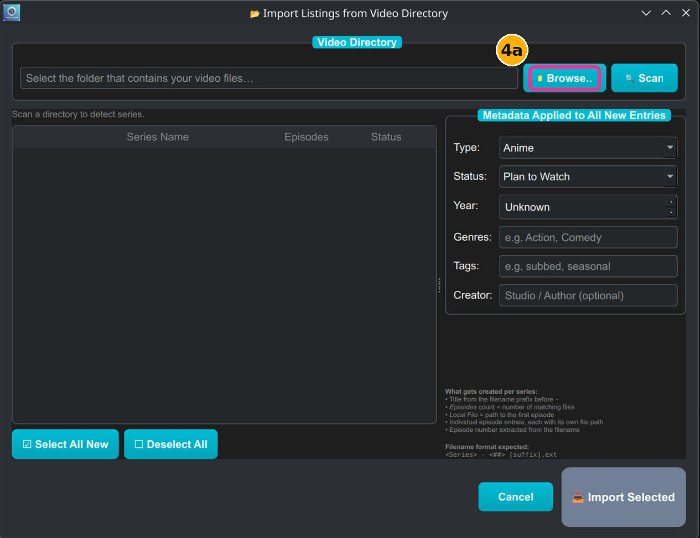

    4b. Review the detected series in the scan-results table, adjust the shared **Type**/**Status**/**Genres**/**Tags**/**Creator** metadata that will apply to every new entry, and click **Import Selected**.

    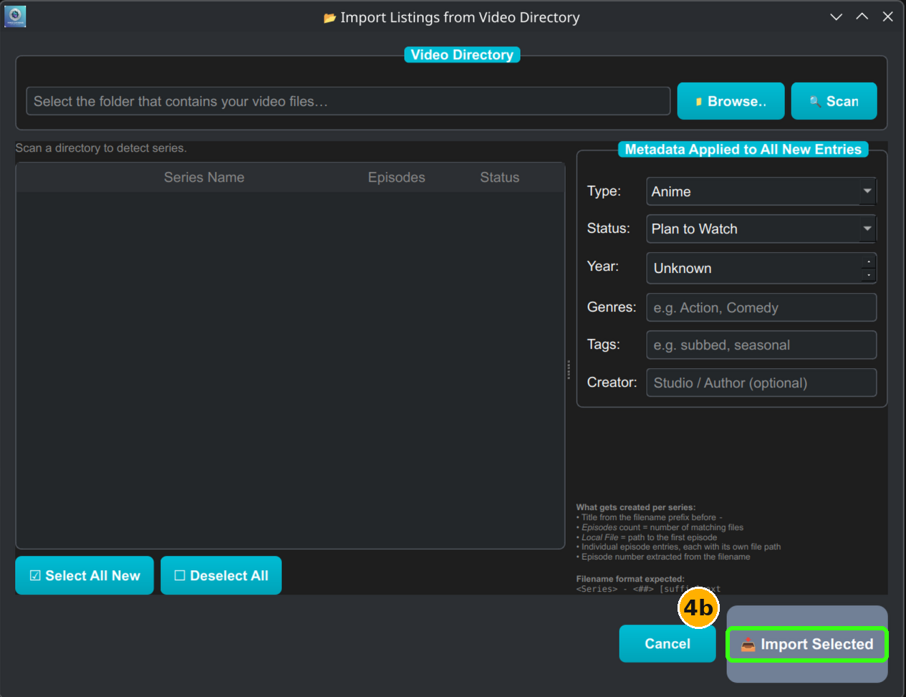

    !!! warning "Filename format requirement"
        The importer expects `<Series> - <##> [suffix].ext` — it parses the title from the prefix before the first ` - ` and the episode number from the digits after it. Files that don't follow this pattern won't group into a detected series at all; rename them first, or add that show manually instead.

!!! tip "Order matters here"
    Step 3's Group/Subgroup/Tags describe the *images* (for Image Search filtering); Step 4's Import Dir wizard creates the *show entries* (for the Listings catalogue). They read the same folder but populate different parts of the library — running both is what makes a folder fully searchable both by image metadata and by show.

!!! info "Learn more"
    The Group/Subgroup/Tag vocabulary this workflow writes into is managed centrally in [Maintenance](library_database.md#maintenance) — if you're about to catalogue a large, differently-organized batch for the first time, **Auto-Sync Groups and Subgroups from Source** there can bootstrap the whole hierarchy from your folder structure before you start this workflow, saving a lot of manual Group/Subgroup typing.

---

## Workflow 5 — Find and remove duplicate images

Scan a directory for duplicate/near-duplicate images and clear them out, choosing a detection method that matches the kind of duplication you're hunting, then a deletion granularity that matches what you found.

**Start from:** Main Window → **Select Category: System Tools** → **Similarity** tab.

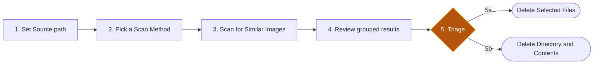
```mermaid
flowchart LR
    A["1. Set Source path"] --> B["2. Pick a Scan Method"]
    B --> C["3. Scan for Similar Images"]
    C --> D["4. Review grouped results"]
    D --> E{5. Triage}
    E -->|5a| F(["Delete Selected Files"])
    E -->|5b| G(["Delete Directory and Contents"])

    style E fill:#b45309,stroke:#fbbf24,color:#fffbeb
```

1. Set **Source path** to the directory to check (optionally **Target path** to compare against a *second* directory instead of within Source; **Include subdirectories** for recursion).

2. Pick a **Scan Method** — this is the single most consequential choice in this workflow, since it trades recall (catching more kinds of duplicates) against runtime:

    | What it is | Technical detail | Choose this when / avoid when |
    |---|---|---|
    | **Exact Match** | Content hash (xxHash64) — byte-identical files only. | Fastest possible pass; use first to clear obvious re-downloads/renames before running a slower method on what's left. Misses anything even slightly re-encoded. |
    | **Perceptual Hash** | pHash-style fingerprint from the low-frequency DCT coefficients of a downscaled grayscale image — small pixel/compression changes barely move the hash. | Catches resized, recompressed, or mildly color-edited duplicates cheaply. Misses crops and rotations, since those shift the DCT structure more than the hash tolerates. |
    | **ORB Feature Matching** | Local binary-descriptor feature matching, robust to moderate crop/rotation/edits. | The mid-tier default when you suspect cropped reposts, not just re-encodes. |
    | **SIFT Feature Matching** | Stronger, scale/rotation-invariant gradient-histogram features than ORB; higher recall on heavily transformed variants. | When ORB is under-catching known duplicates on a small set — SIFT trades speed for robustness, so reserve it for smaller batches. |
    | **SSIM** | Full structural-similarity comparison (luminance/contrast/structure windows) between every pair. | The most precise visual comparison available, and by far the most expensive — O(n²) full-image comparisons. Best on an already-small, pre-filtered set (e.g. run Perceptual Hash first, SSIM only on its flagged clusters). |
    | **Similarity Engine (tiered clusters)** — recommended default | Runs every tier automatically: exact hash → perceptual hashes → a VP-tree/HNSW approximate-nearest-neighbor index for fast candidate search → structural verification on the survivors, with results cached so a re-scan of the same directory is fast. | Use this unless you specifically know you only need one tier — it gets the coverage of the expensive methods at close to the cost of the cheap ones by only running expensive verification on candidates the cheap tiers already flagged as suspicious. |

    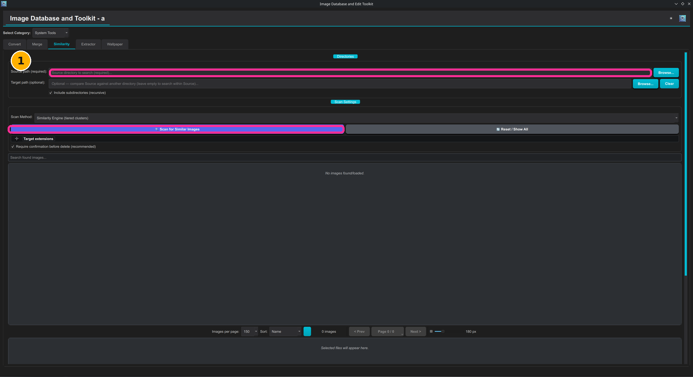

3. Click **⚡ Scan for Similar Images** and wait for it to finish — the results gallery filters down to the matched groups.

4. Review the grouped results: scroll through and inspect which copies within each group you want to keep before touching either delete button.

5. Triage what you found:

    === "5a — Remove specific files"
        Select the unwanted copies in the results gallery, then click **Delete Selected Files (N)**.

        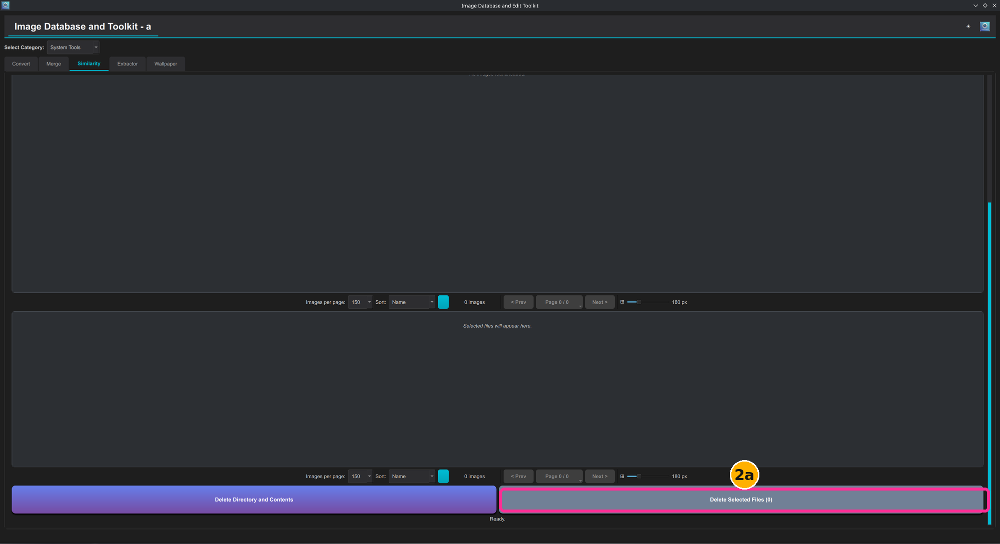

    === "5b — Wipe an entire duplicate folder"
        If a whole subfolder turned out to be nothing but duplicates of files elsewhere, select it and click **Delete Directory and Contents** instead — faster than selecting every file individually.

        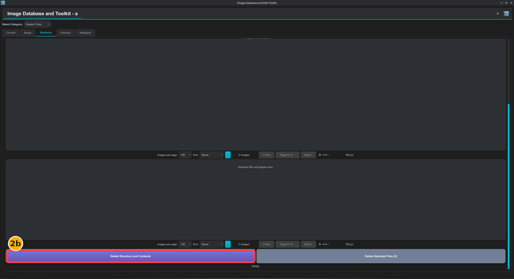

!!! danger "Keep confirmation on"
    Both delete actions are irreversible. **Require confirmation before delete (recommended)** is checked by default on this tab — leave it on unless you're certain.

!!! info "Learn more"
    - **Perceptual hashing** family (pHash/dHash/wHash): [phash.org](https://www.phash.org/) documents the DCT-based approach this app's pHash tier is modeled on.
    - **HNSW** (the approximate-nearest-neighbor index behind the tiered engine's fast candidate search): [Malkov & Yashunin, "Efficient and robust approximate nearest neighbor search using Hierarchical Navigable Small World graphs," 2016](https://arxiv.org/abs/1603.09320) — explains why it scales sub-linearly where a brute-force all-pairs comparison (what SSIM-alone does) doesn't.
    - **SSIM**: [Wang et al., "Image Quality Assessment: From Error Visibility to Structural Similarity," 2004](https://ece.uwaterloo.ca/~z70wang/publications/ssim.pdf) — the original paper, including why raw pixel-difference metrics correlate poorly with perceived similarity.

---

## Workflow 6 — Train and generate with a custom LoRA

Fine-tune a LoRA on your own character/style, then immediately use it to generate new images — the same **Output Name** and trigger word tie the two tabs together.

**Start from:** Main Window → **Select Category: Deep Learning** → **Training** tab.

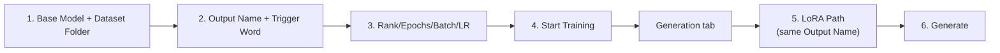
```mermaid
flowchart LR
    A["1. Base Model + Dataset Folder"] --> B["2. Output Name + Trigger Word"]
    B --> C["3. Rank/Epochs/Batch/LR"]
    C --> D["4. Start Training"]
    D --> E["Generation tab"]
    E --> F["5. LoRA Path\n(same Output Name)"]
    F --> G["6. Generate"]
```

1. With **Model Architecture: LoRA (Diffusion and GANs)** selected, set **Base Model** to whichever pretrained checkpoint's default style is *closest* to your target — the LoRA only has to learn the remaining difference, not the whole style from scratch — and point **Dataset Folder** at your training images.

2. Set **Output Name** (the filename stem your trained LoRA will be saved as) and **Trigger Word (Prompt)** — the caption used during training, which becomes the activation token you'll put in Generation prompts later. Pick something unique that won't collide with normal vocabulary the base model already understands.

    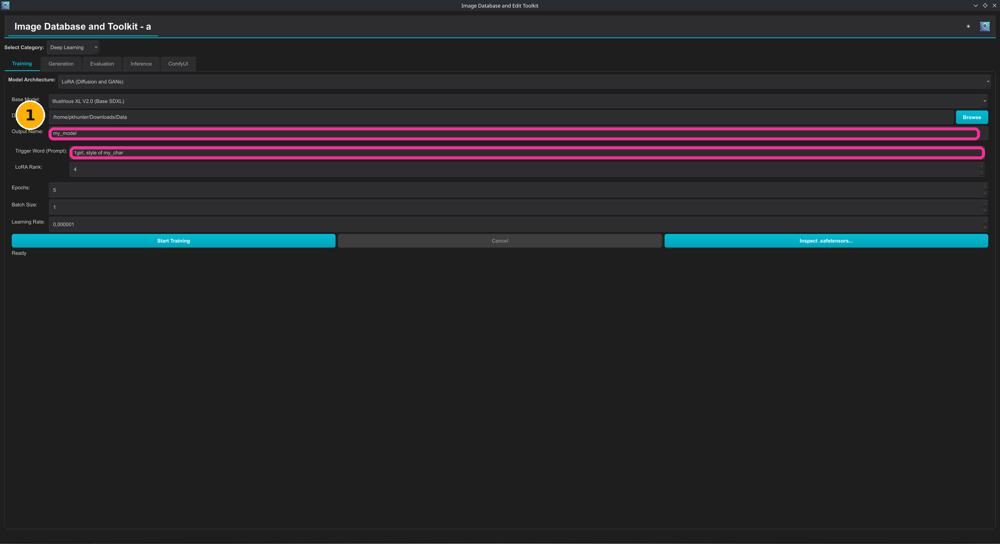

3. Tune the training hyperparameters:

    | What it is | Technical detail | Choose this when / avoid when | Effect of changing it |
    |---|---|---|---|
    | **LoRA Rank** (default 4) | LoRA freezes the base model's weights and injects a trainable low-rank decomposition `ΔW = B·A` (rank `r`) into the attention/linear layers instead of fine-tuning the full weight matrix — rank is the shared inner dimension of `B` and `A`. | 4–16 covers most single-character/style LoRAs. Raise it if the concept is visually complex (a detailed outfit, an intricate art style) and low ranks underfit; keep it low on small datasets, where a high rank has enough free parameters to just memorize the training images instead of generalizing. | Higher rank = more expressive capacity and a larger output file, at higher overfitting risk on small datasets. |
    | **Epochs** (1–100, default 5) | Full passes over the dataset. | Raise on a small, clean dataset that's still visibly underfit at 5 epochs. | More epochs = stronger learning, until the model starts memorizing individual training images rather than generalizing the concept (visible as the LoRA reproducing training-image compositions verbatim). |
    | **Batch Size** (1–32, default 1) | Images processed per optimizer step before a weight update. | Raise only if VRAM allows — batch 1 is the safe default for consumer GPUs training SDXL-class models. | Larger batches give a smoother (less noisy) gradient estimate per step, at proportionally higher VRAM use. |
    | **Learning Rate** (1e-6–1e-3, default 1e-4) | Optimizer step size. | 1e-4 is the standard LoRA starting point — change it only after a first run tells you whether you're under- or over-shooting. | Too high: the loss diverges or the LoRA "fries" (visible as color blowout/artifacting in generations). Too low: barely learns the concept even after many epochs. |

4. Click **Start Training** and wait for the run to finish — progress prints to the log beneath the form.

    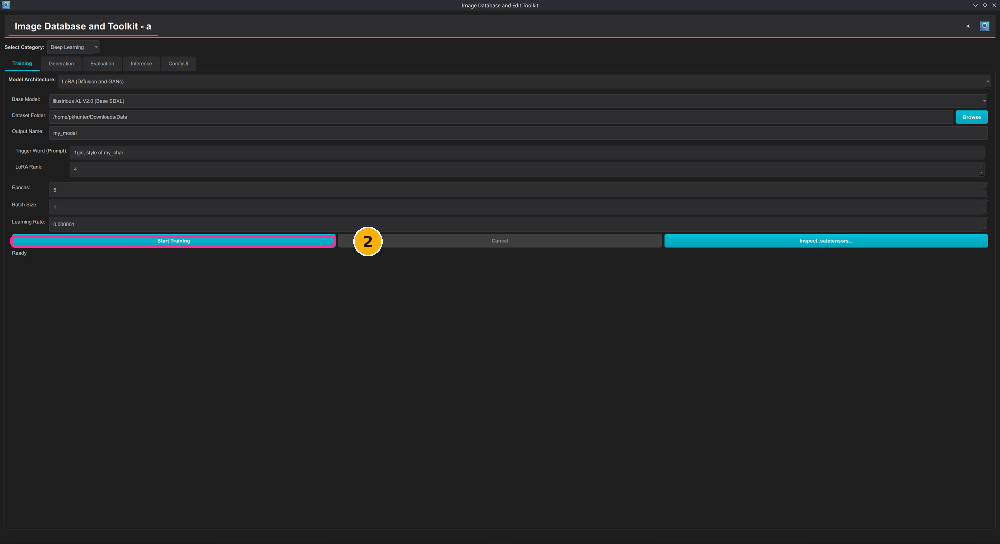

5. Switch to the **Generation** tab (same **Model Architecture: LoRA**, same **Select Model** base you trained against — mismatching the base here reintroduces exactly the domain gap the LoRA was trained to bridge *from*). Set **LoRA Path** to the **Output Name** from Step 2, and make sure **Prompt** includes the identical trigger word.

    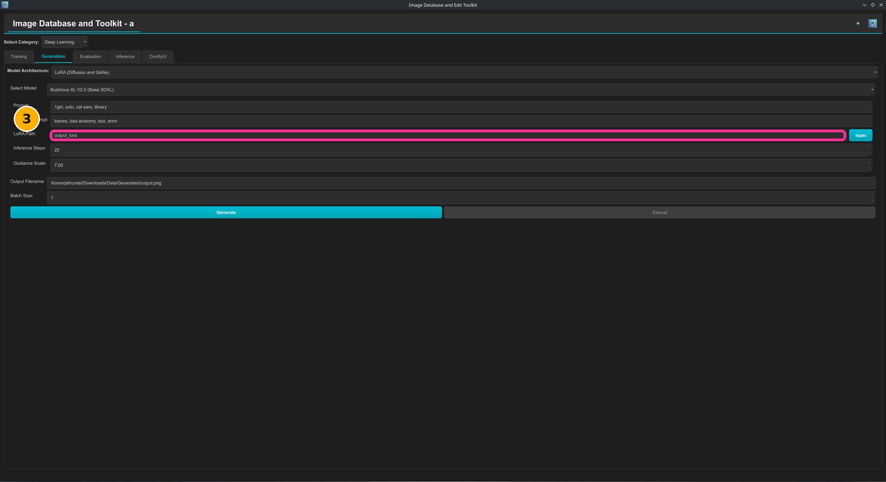

    | What it is | Technical detail | Choose this when / avoid when | Effect of changing it |
    |---|---|---|---|
    | **Inference Steps** (1–100, default 25) | Number of denoising steps the diffusion sampler takes along the reverse (noise → image) process. | 25–30 is a reasonable default; raise it if fine detail looks unresolved. | More steps = the sampler more finely integrates the denoising trajectory, typically cleaner results with sharply diminishing returns past ~30 — doubling steps rarely doubles visible quality. |
    | **Guidance Scale** (default 7.0) | Classifier-free guidance: the model runs both a prompt-conditioned and an unconditional prediction each step, and the output is `uncond + scale × (cond − uncond)`. | Low (~3–5) for more varied, "looser" interpretations of the prompt; high (~10+) when you need strict prompt adherence. | Too high overshoots into oversaturated colors and compositional artifacts — the model is being pushed harder toward the prompt-conditioned direction than the training distribution actually supports at that step count. |

6. Click **Generate**.

    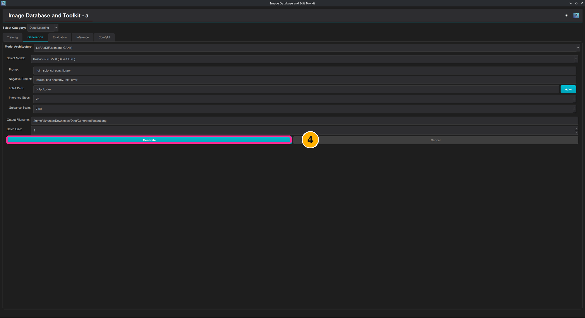

!!! tip "Trigger word must match exactly"
    The **Trigger Word (Prompt)** from Training and the token you put in Generation's **Prompt** must be the *same string*. A mismatch (typo, different casing/spacing) silently generates from the base model as if the LoRA weren't loaded at all — there's no error, just a result that looks like your LoRA had no effect.

!!! info "Learn more"
    - **LoRA**: [Hu et al., "LoRA: Low-Rank Adaptation of Large Language Models," 2021](https://arxiv.org/abs/2106.09685) — originally an LLM fine-tuning technique, now the standard lightweight adaptation method for diffusion models too; §4.1 of the paper is the clearest explanation of why constraining the update to a low-rank subspace is enough to learn a new concept without touching the frozen base weights.
    - **Classifier-free guidance**: [Ho & Salimans, "Classifier-Free Diffusion Guidance," 2022](https://arxiv.org/abs/2207.12598) — the technique behind the Guidance Scale slider.
    - The [Evaluation tab](deep_learning.md#evaluation) (FID/KID/Precision-Recall/Inception Score) is the quantitative way to judge whether a training run actually improved — useful once you're iterating on Rank/Epochs/Learning Rate rather than eyeballing single generations.
