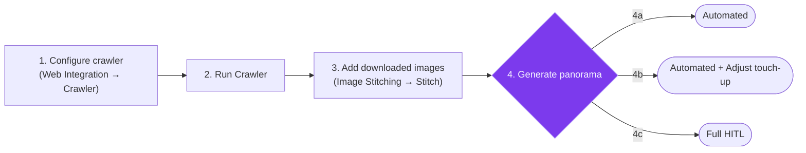
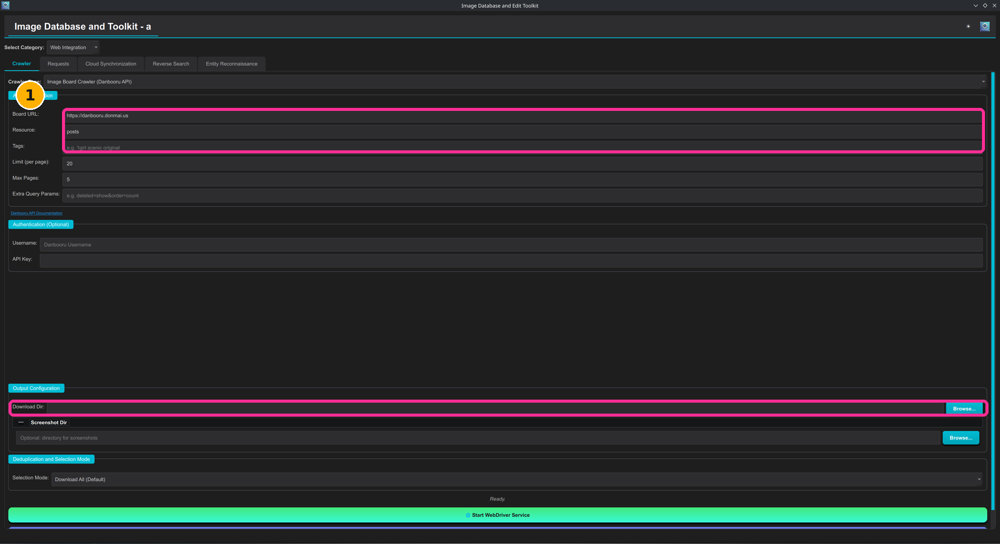
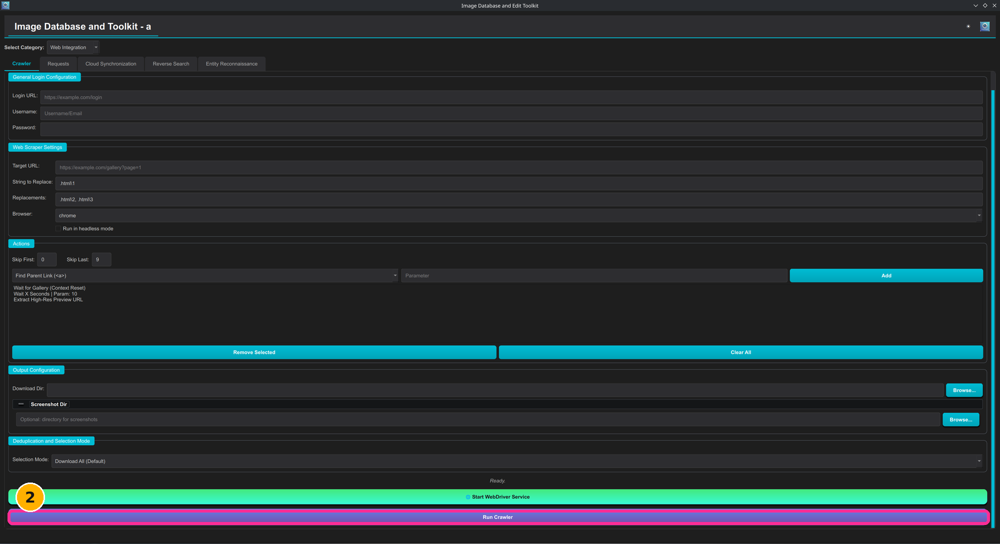
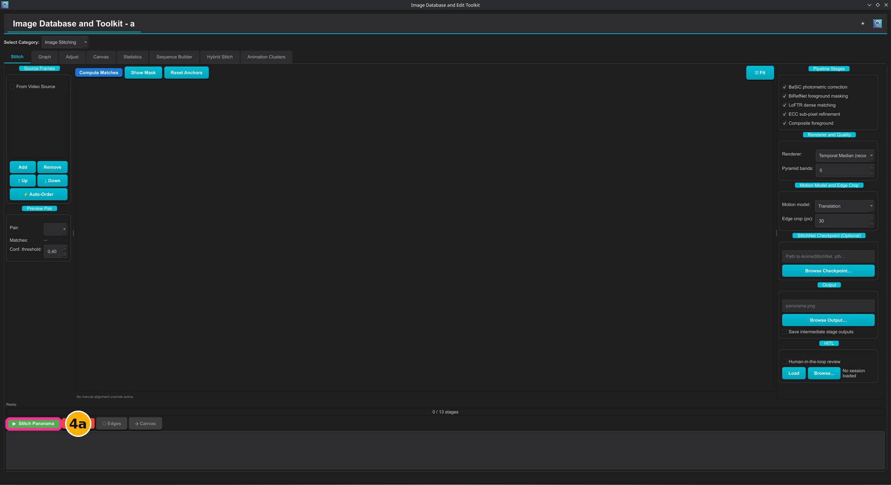
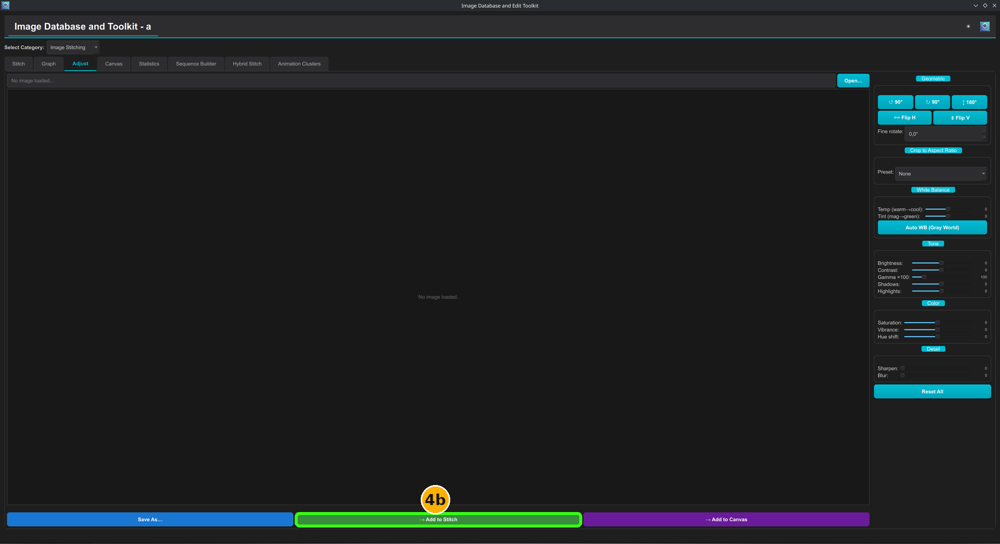
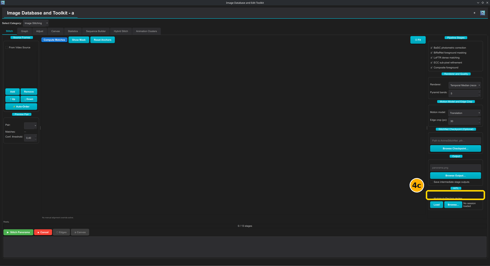
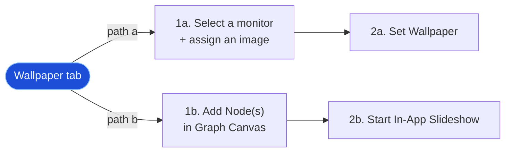
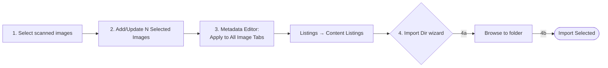
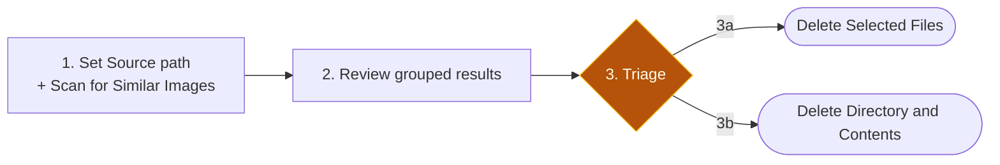
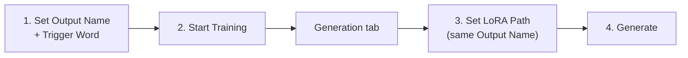

# :material-map-marker-path: Typical Workflows

The category tutorials ([System Tools](system_tools.md), [Library Database](library_database.md), [Web Integration](web_integration.md), [Deep Learning](deep_learning.md), [Image Stitching](image_stitching.md)) document every tab in isolation. This page instead walks through complete, goal-oriented tasks — several of which cross tab categories — from the **Main Window** through to a finished result.

!!! info "Windows referenced in this app"
    - **Login Window** — the vault-unlock prompt shown once per session, before the Main Window appears. Every workflow below assumes you're already past it.
    - **Main Window** — the window with the **Select Category** dropdown and the tab strip; this is where every step below happens unless stated otherwise.
    - **Settings Window** — opened from the Main Window's menu; only referenced where a workflow depends on a setting living there.
    - **Auxiliary windows/dialogs** — file pickers, the **Edit Metadata** editor, import wizards, etc. — pop up over the Main Window when a step opens one; each is captioned explicitly below.

!!! tip "How to read the annotated screenshots"
    Each screenshot below has an **amber numbered badge** marking which workflow step it illustrates, and a colored box/arrow pointing at the exact control to interact with.

    | Marking | Meaning |
    |---|---|
    | `1`, `2`, `3`… | A single required step — do these in order. |
    | `2a` / `2b` / `2c` | Alternative ways to accomplish the same step — pick one path, not all. |
    | :material-square-outline:{ style="color:#ff2d95" } Magenta box | The primary control for this step. |
    | :material-square-outline:{ style="color:#39ff14" } Green box | The control for an alternate path (the "b"/"c" option). |
    | :material-square-outline:{ style="color:#ffd700" } Gold box | A checkbox/toggle to set before proceeding. |
    | :material-arrow-top-right:{ style="color:#ff2d95" } Arrow | Drag/assignment direction between two elements. |

---

## Workflow 1 — Download images, then stitch a panorama

Crawl a set of images from an imageboard into a folder, then feed that folder straight into the automatic stitching pipeline — with three ways to finish depending on how much control you want.

**Start from:** Main Window → **Select Category: Web Integration** → **Crawler** tab.

1. Pick **Crawler Type: Image Board Crawler**, fill in **Board URL**/**Tags**, and set **Download Dir** to the folder you want the images saved into.

    

2. Scroll down and click **Run Crawler**. Wait for the crawl to finish (**Ready.** reappears in the status line).

    

3. Switch to **Select Category: Image Stitching** → **Stitch** tab. In **Source Frames**, click **Add** and select the images the crawler just downloaded — this opens a standard file picker.

    

4. Generate the panorama — three pathways depending on how much control you want:

    === "4a — Fully automated"
        Leave every **Pipeline Stage** at its default and click **▶ Stitch Panorama**. Fastest path; best for clean, well-overlapping frames.

        

    === "4b — Automated + manual touch-up"
        If the first automated run has a flawed frame (bad exposure, wrong crop), switch to the **Adjust** tab, fix that one frame, then click **→ Add to Stitch** to swap the corrected version back into the Stitch tab's frame list before re-running **▶ Stitch Panorama**.

        

    === "4c — Full HITL"
        For heavy parallax or effects layers the automatic pipeline can't handle cleanly, check **Human-in-the-loop review** in the **HITL** box before clicking **▶ Stitch Panorama** — the pipeline now pauses at each checkpoint (frame exclusion, edge-graph review, canvas nudging, coverage inspection) for your input instead of running straight through.

        

        !!! tip "Going fully manual"
            If even HITL checkpoints aren't enough control, the [Hybrid Stitch](image_stitching.md#hybrid-stitch) tab skips the automatic pipeline entirely and lets you align pairs by hand from the start.

---

## Workflow 2 — Set your desktop wallpaper

Two independent ways to change what's on screen: a direct one-shot assignment, or a graph-driven sequence that cycles automatically. Pick whichever fits — they don't need to be combined.

**Start from:** Main Window → **Select Category: System Tools** → **Wallpaper** tab.

=== "Path A — System Display(s) (direct assignment)"

    1. On the **System Display(s)** subtab, click the monitor tile you want to change, then click a thumbnail in the gallery below to assign it — an arrow in the screenshot shows this assignment relationship.

        

    2. Scroll down and click **Set Wallpaper** to apply it to the real desktop immediately.

        

=== "Path B — Monitor Display (graph sequencer)"

    1. On the **Monitor Display** subtab, click **+ Add Node** for each wallpaper you want in the rotation (drag images from the gallery onto the canvas works too), then use **→ Connect** and **★ Set Start** to wire up the order.

        

    2. Click **▶ Start In-App Slideshow** to begin cycling through the graph while the app is open (**⏱ Start Slideshow Daemon** instead if you want it to keep running after you close the app).

        

!!! note "Why two paths exist"
    System Display(s) is a flat "pick one image per monitor" model — quick, but it doesn't change over time. Monitor Display trades that simplicity for a sequencer: each display gets its own graph, letting you build loops, branches, and timed transitions instead of a static assignment.

---

## Workflow 3 — Catalogue a folder into your library

Register a folder of images into the searchable index *and* create catalogue entries for the show(s) it contains, using the same source folder for both.

**Start from:** Main Window → **Select Category: Library Database** → **Scan and Tag** tab.

1. With **Scan Directory** already pointed at your folder, click thumbnails in the scan gallery to select the images you want indexed (a green border marks the selection).

    

2. Click **Add/Update N Selected Images** — this opens the **Edit Metadata** auxiliary window instead of writing immediately.

    

3. In the **Edit Metadata** window's **Batch / Overview** tab, set **Group**/**Subgroup**/**Tags** once, then click **↓ Apply to All Image Tabs** to fan those values out to every selected image, and finish with **✔ Confirm & Save**.

    

4. Switch to **Listings → Content Listings** and click **📂 Import Dir** to also create a catalogue entry for the show(s) in that same folder:

    a. In the **Import Listings from Video Directory** window, click **Browse..** and point it at the source folder.

    

    b. Review the detected series, adjust the shared **Type**/**Status**/**Genres** metadata if needed, and click **Import Selected**.

    

!!! tip "Order matters here"
    Step 3's Group/Subgroup/Tags describe the *images* (for Image Search filtering); step 4's Import Dir wizard creates the *show entries* (for the Listings catalogue). They read the same folder but populate different parts of the library — running both is what makes a folder fully searchable both by image metadata and by show.

---

## Workflow 4 — Find and remove duplicate images

Scan a directory for duplicate/near-duplicate images and clear them out, with two different levels of destructiveness depending on what you find.

**Start from:** Main Window → **Select Category: System Tools** → **Similarity** tab.

1. Set **Source path** to the directory you want to check (leave **Scan Method** at the recommended **Similarity Engine (tiered clusters)**), then click **⚡ Scan for Similar Images**.

    

2. Once the scan finishes, the gallery below fills with the matched groups — scroll through and inspect which copies you want to keep.

3. Triage what you found:

    === "3a — Remove specific files"
        Select the unwanted copies in the results gallery, then click **Delete Selected Files (N)**.

        

    === "3b — Wipe an entire duplicate folder"
        If a whole subfolder turned out to be nothing but duplicates of files elsewhere, select it and click **Delete Directory and Contents** instead — faster than selecting every file individually.

        

!!! danger "Keep confirmation on"
    Both delete actions are irreversible. **Require confirmation before delete (recommended)** is checked by default on this tab — leave it on unless you're certain.

---

## Workflow 5 — Train and generate with a custom LoRA

Fine-tune a LoRA on your own character/style, then immediately use it to generate new images — the same **Output Name** and trigger word tie the two tabs together.

**Start from:** Main Window → **Select Category: Deep Learning** → **Training** tab.

1. With **Model Architecture: LoRA (Diffusion and GANs)** selected and **Dataset Folder** already pointed at your training images, set **Output Name** (the filename your trained LoRA will be saved as) and **Trigger Word (Prompt)** (the token you'll use later to activate it).

    

2. Click **Start Training** and wait for the run to finish — progress prints to the log beneath the form.

    

3. Switch to the **Generation** tab (same **Model Architecture: LoRA**, same **Select Model** base you trained against). Set **LoRA Path** to the **Output Name** from step 1, and make sure **Prompt** includes the same trigger word.

    

4. Click **Generate**.

    

!!! tip "Trigger word must match exactly"
    The **Trigger Word (Prompt)** from Training and the token you put in Generation's **Prompt** must be the same string — that's the only thing that actually activates the LoRA's learned concept. A mismatch (typo, different casing/spacing) silently generates from the base model as if the LoRA weren't loaded.
