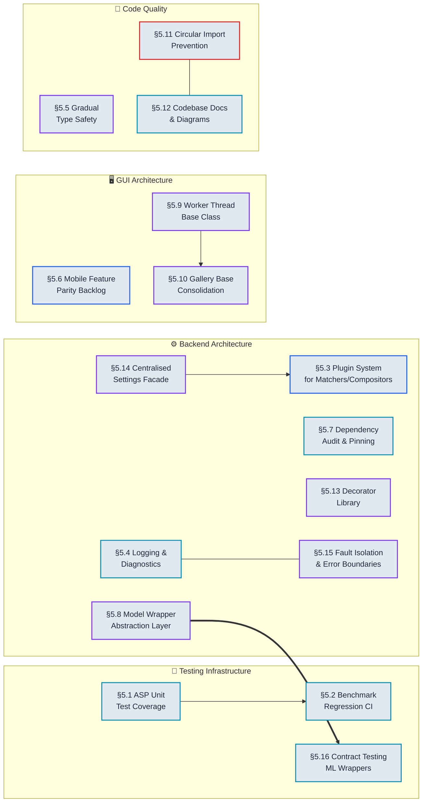

# Architecture & Infrastructure Roadmap — Quality, Reliability, and Maintainability

*Last updated: 2026-06-18. Added §5.5 (Gradual Static Type Safety), §5.8–§5.13 (model wrapper abstraction, worker lifecycle standardisation, gallery base class consolidation, circular import prevention, codebase documentation & diagrams, decorator library), and §5.14–§5.16 (centralised settings facade, fault isolation & error boundary protocol, contract testing for ML wrappers). ASP unit tests now at 827 (session 131). ASP benchmark corpus: 97 tests. Phase 2 architecture defined: direct video ingestion (PyAV `VideoIngestionStream`), multi-modal HITL with Grounded SAM-2. See `asp.md` for per-session tracking and Phase 2 Sprint specs.*

---

## Table of Contents

- [How to Use This Document](#how-to-use-this-document)
- [§5.1 ASP Pipeline Unit Test Coverage](#51-asp-pipeline-unit-test-coverage)
- [§5.2 Benchmark Regression CI](#52-benchmark-regression-ci)
- [§5.3 Plugin System for Matchers and Compositors](#53-plugin-system-for-matchers-and-compositors)
- [§5.4 Logging and Diagnostics](#54-logging-and-diagnostics)
- [§5.5 Gradual Static Type Safety Migration](#55-gradual-static-type-safety-migration)
- [§5.6 Mobile App Feature Parity Backlog](#56-mobile-app-feature-parity-backlog)
- [§5.7 Dependency Audit and Pinning](#57-dependency-audit-and-pinning)
- [§5.8 Model Wrapper Abstraction Layer](#58-model-wrapper-abstraction-layer-backendsrcmodels)
- [§5.9 Worker Thread Base Class & Lifecycle Standardisation](#59-worker-thread-base-class--lifecycle-standardisation-guisrchelpers)
- [§5.10 Gallery Base Class Consolidation](#510-gallery-base-class-consolidation-guisrcclasses)
- [§5.11 Circular Import Prevention & Module Boundary Documentation](#511-circular-import-prevention--module-boundary-documentation)
- [§5.12 Codebase Documentation & Diagrams](#512-codebase-documentation--diagrams)
- [§5.13 Decorator Library for Cross-Cutting Concerns](#513-decorator-library-for-cross-cutting-concerns-backendsrcutilsdecoratorspy)
- [§5.14 Centralised Settings Facade](#514-centralised-settings-facade-guisrcutilssettingspy--backendsrcanimconfigpy)
- [§5.15 Fault Isolation & Error Boundary Protocol](#515-fault-isolation--error-boundary-protocol)
- [§5.16 Contract Testing for ML Model Wrappers](#516-contract-testing-for-ml-model-wrappers-backendsrcmodels)
- [Effort × Impact Matrix](#effort--impact-matrix)
- [Anchor Index](#anchor-index)

---

## Implementation Timeline

> **Legend** — *Node fill:* ✅ complete (green) · 🔄 in-progress (amber) · ⬜ planned (light) — *Node border:* infrastructure (cyan) · new feature (blue) · augmentation (violet) · bugfix (red) — *Edges:* `==>` critical blocking dependency · `-->` sequential dependency · `---` complements



*Node fill encodes status (green = complete, amber = in-progress, light = planned). Node border encodes element type (cyan = infrastructure, blue = new feature, violet = augmentation, red = bugfix). Edge style encodes relationship (`==>` blocking dependency, `-->` sequential dependency, `---` complements). To update: change a node's `:::class` suffix when its status changes — e.g., `t_infra` → `c_infra` when shipped.*

---

## How to Use This Document

Each section describes an architectural debt or infrastructure gap, all viable implementation options with trade-offs, and a recommendation. Items tagged **[Quick Win]** take under a day. Items tagged **[Research]** require prototyping.

---

## 5.1 ASP Pipeline Unit Test Coverage

**Pain point:** `backend/test/animation/` tests end-to-end ASP runs but has limited unit tests for individual pipeline stages. Regressions in `bundle_adjust.py` or `compositing.py` are hard to catch without running the full benchmark.

### Options

**A — Unit tests for each stage in isolation**
Synthetic test cases: known translation pairs for bundle adjustment, known frame strips for composite, known match sets for outlier rejection. Each test runs in <1s.
- Coverage targets:
  - `bundle_adjust.py`: test with known inlier/outlier edge sets; verify residuals and rejected edges.
  - `compositing.py`: test seam DP with a hand-crafted cost array; verify path is minimum.
  - `matching.py`: test each matcher tier with synthetic frame pairs; verify inlier count thresholds.
  - `stage_11.py`: test feather blend with known gains; verify output pixel values.
- Pros: Fast. Catches regressions without running the full pipeline.
- Cons: Synthetic inputs may not cover real-world edge cases.

**B — Property-based testing with Hypothesis**
Generate random translation sequences with known properties (monotonic, bounded step ratio) and verify the pipeline produces valid output affines.
- Example property: "For any sequence of translations where each step is > 50px, the pipeline produces a valid panorama with no canvas overlaps."
- Reference: [Hypothesis + pytest guide](https://pytest-with-eric.com/pytest-advanced/hypothesis-testing-python/)
- Pros: Catches edge cases that hand-crafted tests miss. Especially useful for the outlier rejection heuristics.
- Cons: Hypothesis needs domain-specific strategies for image generation. Longer test runs.

**C — Benchmark diff testing (golden gate)**
Run the 22-test benchmark on every PR and fail if any metric regresses beyond a threshold:
- Sharpness regression > 5% → fail
- Ghosting increase > 10% → fail
- Success rate decrease → fail
- Runtime increase > 20% → warning
- Reference: [pytest-benchmark](https://github.com/ionelmc/pytest-benchmark); [benchmarking with CI](https://towardsdatascience.com/benchmarking-pytest-with-cicd-using-github-action-17af32b4a30b/)
- Pros: Catches integration-level quality regressions. Ground truth is the 22-test corpus.
- Cons: Slow (~20 min). Best run only on main branch merges, not every commit.

**D — Mutation testing**
Use `mutmut` or `cosmic-ray` to inject mutations into `bundle_adjust.py` and `compositing.py`. Verify that existing tests catch the mutations.
- Pros: Measures test quality, not just coverage.
- Cons: Very slow. High false-positive rate for numerical code.

**E — Snapshot testing for intermediate outputs**
Store the intermediate outputs of each stage (affine matrices, seam masks, gain-corrected frames) for the 22-test corpus as golden snapshots. Assert that new runs match within tolerance.
- Pros: Catches subtle numerical regressions in intermediate stages.
- Cons: Snapshots must be updated whenever a valid algorithm change is made. Large storage overhead for image snapshots.

**Recommendation:** A + C. Unit tests catch regressions early; the benchmark gate prevents quality regressions from reaching main.

---

## 5.2 Benchmark Regression CI

**Pain point:** The benchmark suite in `backend/benchmark/` exists with baseline comparison but is not wired into GitHub Actions for automatic regression detection.

### Options

**A — GitHub Actions workflow on push to main**
Run `python run_all.py --baseline results/baseline/` on every push to main. Fail the build if `time > baseline × 1.2` or `memory > baseline × 1.15`.
- Workflow structure:
  ```yaml
  name: benchmark-regression
  on: push:
    branches: [main]
  jobs:
    benchmark:
      runs-on: ubuntu-latest
      steps:
        - uses: actions/checkout@v4
        - run: python backend/benchmark/run_all.py --baseline baseline/
        - uses: actions/upload-artifact@v4
          with:
            path: benchmark/results/
  ```
- Pros: Automatic regression detection. Results stored as CI artifacts for trend analysis.
- Cons: Python benchmarks may be fast enough; ASP + Rust benchmarks are not (20 min+). Must split into fast/slow suites.

**B — Weekly scheduled run with email/Slack notification**
For expensive benchmarks (Rust criterion, full ASP), run weekly. Report a summary diff vs the previous week.
- Pros: Amortises the cost of expensive benchmarks. Avoids blocking every PR on a 20-minute run.
- Cons: Weekly cadence may miss regressions introduced mid-week.

**C — Pre-commit hook for lightweight checks**
A subset of fast benchmarks (phash speed, DB query latency, fast image load) runs locally on commit via pre-commit. Full suite is opt-in via `make benchmark`.
- Reference: [pre-commit framework](https://pre-commit.com/)
- Pros: Catches performance regressions before they reach CI. Zero CI cost for fast checks.
- Cons: Developers must install pre-commit hooks. Local machine performance varies, making thresholds unreliable.

**D — Performance tracking dashboard (Bencher / codspeed)**
Use a service like [Bencher](https://bencher.dev/) or [CodSpeed](https://codspeed.io/) to track benchmark trends over time. Visualise performance history as a graph.
- Pros: Long-term trend visibility. PR-level performance comparison.
- Cons: External service dependency. Data leaves the repository.

**Recommendation:** A for Python benchmarks (fast enough). B for full ASP + Rust benchmarks. C as a low-friction local guard.

---

## 5.3 Plugin System for Matchers and Compositors

**Pain point:** Matching and compositing stages have grown a large number of fallback tiers (TM, PC, ALIKED+LightGlue, RoMa, segment-guided). Adding new matchers requires editing `matching.py` directly.

### Options

**A — Matcher registry with priority list**
A `dict` mapping matcher name → callable. Pipeline tries matchers in priority order until one returns sufficient inliers. Adding a new matcher = registering it in the dict.
```python
MATCHER_REGISTRY: dict[str, MatcherCallable] = {
    "loftr": loftr_match,
    "lightglue": lightglue_match,
    "roma": roma_match,
    ...
}
```
- Pros: Simple. Minimal refactor. Adding a new matcher doesn't touch pipeline logic.
- Cons: No enforced interface. Each matcher callable may have a different return signature.

**B — Abstract `Matcher` base class with formal interface**
```python
class Matcher(ABC):
    @abstractmethod
    def match(self, frame_a: np.ndarray, frame_b: np.ndarray) -> list[MatchPair]: ...
    @abstractmethod
    def is_available(self) -> bool: ...  # checks GPU/model availability
```
- Pros: Formal interface prevents the current situation where each matcher has subtly different return types. `is_available()` enables runtime capability detection.
- Cons: Requires refactoring all existing matchers to subclass `Matcher`.

**C — Protocol-based duck typing (typing.Protocol)**
Define a `MatcherProtocol` using `typing.Protocol` instead of ABC. Matchers don't need to inherit from anything — they just need the right methods.
- Pros: Lighter-weight than ABC. Works with existing matchers without refactoring.
- Cons: No runtime enforcement of the interface. Type checker enforces it statically.

**D — External plugin discovery via entry_points**
Allow third-party packages to register matchers via setuptools `entry_points`:
```toml
[tool.poetry.plugins."image_toolkit.matchers"]
my_matcher = "my_package:MyMatcher"
```
- Pros: Third-party extensibility. Standard Python plugin pattern.
- Cons: Overkill for the current single-package codebase. Discovery adds startup overhead.

**E — Compositor registry (same pattern as matcher)**
Apply the same registry/interface pattern to compositing strategies (hard-partition, soft-feather, Poisson, ToonCrafter). The pipeline selects a compositor by name.
- Pros: Decouples compositing algorithm selection from pipeline logic. Enables A/B testing of compositors.
- Cons: Requires abstracting the current compositing code significantly.

**Recommendation:** B establishes the correct foundation. C is a pragmatic step if B's refactor scope is too large. E is a natural follow-on once B is in place for matchers.

---

## 5.4 Logging and Diagnostics

**Pain point:** Pipeline logs to stdout with `print()` statements. Diagnosing failures requires replaying the entire run. No structured log format for automated analysis.

### Options

**A — Python `logging` module with file handler [Quick Win]**
Replace all `print()` calls with `logging.getLogger(__name__).info/debug/warning`. Add a `RotatingFileHandler` saving per-run logs to `~/.config/image-toolkit/logs/run_{timestamp}.log`. Log level controlled by config.
- Pros: Standard Python practice. `getLogger(__name__)` gives per-module log namespacing. Rotating handler prevents unbounded disk use.
- Cons: Requires touching every file that currently uses `print()`. Must audit for sensitive data in log messages.

**B — Pipeline execution trace JSON**
At the end of each ASP run, dump a structured JSON summary to the output directory:
```json
{
  "run_id": "...",
  "timestamp": "...",
  "stages": [
    {"name": "bundle_adjust", "duration_s": 0.15, "outliers_rejected": 2},
    {"name": "composite", "duration_s": 24.5, "seam_cost": 0.003}
  ],
  "metrics": {"sharpness": 33.14, "ghosting": 22.17},
  "config": {...}
}
```
Already partially done by the benchmark runner — standardise and always enable.
- Pros: Machine-readable. Enables trend analysis and RLHF integration.
- Cons: Must define a stable schema. Schema versioning needed as new stages are added.

**C — GUI log panel**
A collapsible log panel in the main window showing the last N log lines in real-time during operations. Filterable by level (DEBUG/INFO/WARNING/ERROR).
- Implementation: A `QPlainTextEdit` in read-only mode with `appendPlainText`. Connect to the logging handler via a `QSignalHandler`.
- Pros: Replaces the cluttered console output with a polished in-app log.
- Cons: GUI thread must not block on log writes. Log handler must be thread-safe.

**D — Structured logging with structlog**
Use `structlog` for context-bound structured logging (key-value pairs rather than formatted strings). Each log event carries its pipeline stage, frame index, and metric values as structured data.
- Pros: Better for automated log parsing and aggregation.
- Cons: `structlog` dependency. Larger refactor than option A.

**E — Sentry integration for error tracking**
Send exception tracebacks and error-level log events to Sentry. Aggregates errors across sessions.
- Pros: Production-grade error tracking. Crash reports include context.
- Cons: External service. Privacy concern — images/paths may appear in tracebacks. Must redact sensitive data.

**F — OpenTelemetry structured traces + Apache Arrow / Parquet telemetry**
Instrument the ASP pipeline with the **OpenTelemetry** SDK: each pipeline stage runs as a span with `trace_id`/`span_id`, exporting to Jaeger (traces) or Prometheus (metrics). At the end of each run, serialise per-stage telemetry to **Apache Parquet** for downstream causal discovery analysis (`gcastle`/`causal-learn`).
- Pros: Vendor-neutral standard. Parquet emission feeds directly into Phase 4 (Causal Discovery) of the Visual Analytics roadmap. Span hierarchy exposes exact inter-stage latency distribution.
- Cons: OpenTelemetry SDK dependency (~5 MB). Parquet requires `pyarrow`. More setup than option B.
- See: [`moon/roadmaps/analytics_and_interpretability.md`](analytics_and_interpretability.md) — Phase 8 (Distributed Observability) and Phase 4 (Causal Discovery).

**G — Rerun.io spatial + temporal telemetry logger**
Integrate **rerun-sdk** as the primary diagnostic logger for CV-heavy stages. Logs `Transform3D`, `Points3D`, `Tensor`, and `Pinhole` archetypes with named timelines (`frame_index`, `gnc_optimization_step`). Embeds as a Wasm viewer in the React dashboard — no install required at client side.
- Pros: Spatial-first design matches ASP needs exactly. Temporal scrubbing replaces `print()`-based replay. `.rrd` files are archivable benchmark artifacts.
- Cons: rerun-sdk dependency. Adds ~50ms overhead per stage for log serialization. Not a replacement for standard text logging (A/D) — complementary.
- See: [`moon/roadmaps/analytics_and_interpretability.md`](analytics_and_interpretability.md) — Phase 3 (CV Diagnostics, §3.1).

**Recommendation:** A + B immediately. C as a quality-of-life follow-on. D if log analysis at scale is needed. F + G when building out the Visual Analytics dashboard (see analytics roadmap). Skip E unless the app becomes multi-user.

---

## 5.5 Gradual Static Type Safety Migration

**Pain point:** `pyproject.toml` lists `mypy>=1.18.2` as a dev dependency but the `[tool.mypy]` section is absent. Pyright is configured with `typeCheckingMode = "off"`. As a result neither type checker runs in CI, and the codebase accumulates type errors silently. Spot checks show: `backend/src/animation/pipeline.py` has 77 function definitions with ~72 return annotations (partial coverage); `gui/src/classes/abstract_class_two_galleries.py` has 79 function definitions with ~38 return annotations (~48% coverage). Worker `config` dictionaries are typed `Dict[str, Any]` throughout — all key accesses are unchecked. The cost of *fixing* the first type error in a fully-strict run of a 150-file codebase is prohibitive; the cost of not enforcing types is a growing silent bug surface.

Informed by: JetBrains 2025 survey (type hint adoption grew from 48% to 71% in Python projects 2022–2025); mypy maintainer guidance on per-module strictness escalation; and the Dropbox engineering blog's account of migrating 4M LOC to mypy over 5 years using per-package ignore files.

### Options

**A — `[tool.mypy]` baseline config with per-package ignore files [Recommended]**
Add to `pyproject.toml`:
```toml
[tool.mypy]
python_version = "3.11"
# Global baseline — permissive, catches only hard errors
ignore_missing_imports = true
warn_unused_ignores = true
warn_return_any = false
disallow_untyped_defs = false

# Strict opt-in per module as they are cleaned up
[[tool.mypy.overrides]]
module = ["backend.src.animation.bundle_adjust", "backend.src.animation.validation"]
disallow_untyped_defs = true
warn_return_any = true
```
Migration sequence:
1. **Week 1**: Enable baseline config (zero violations, just enables the tool). Run `mypy backend/src gui/src` in CI; failures are warnings-only.
2. **Week 2–N**: Enable `disallow_untyped_defs = true` for each module once it is annotated. Priority order: `constants/` → `core/` → `models/` → `animation/` → `gui/src/classes/` → `gui/src/helpers/`.
3. **End state**: All modules under strict coverage; `disallow_untyped_defs = true` globally.
- Pros: Zero upfront disruption. Each PR that adds annotations shrinks the un-strict surface. Directly enabled by §5.9D (`WorkerConfig` TypedDict) and §5.11D (`__all__` hygiene), which are already planned.
- Cons: Long tail — full strict coverage may take months. Requires discipline to avoid regressing annotated modules.

**B — Pyright `basic` mode (flip `typeCheckingMode` from `off` to `basic`)**
Change `pyproject.toml`:
```toml
[tool.pyright]
typeCheckingMode = "basic"
```
Pyright `basic` mode checks for name-not-found, attribute-not-found, type narrowing errors, and missing return types — all without requiring full annotations. It is already installed (configured but disabled). VS Code users with Pylance get immediate red squiggles.
- Pros: Zero annotation work required to flip from `off` to `basic`. Immediate IDE feedback for all developers. Fastest single-line change in this document.
- Cons: `basic` does not enforce annotation completeness. Will generate a large number of `reportUnknownVariableType` warnings on the `Dict[str, Any]` worker configs.

**C — `TypedDict` for all worker config dictionaries**
Each worker's `config: Dict[str, Any]` becomes a typed dict:
```python
class ConversionConfig(TypedDict, total=False):
    files_to_convert: List[str]
    input_path: str
    output_format: str
    output_path: str
    delete_original: bool
    use_multicore: bool
    aspect_ratio: Optional[str]
    aspect_ratio_mode: str
    aspect_ratio_w: Optional[int]
    aspect_ratio_h: Optional[int]
```
This is a prerequisite for §5.9D and provides the highest density of type-safety value per annotation written, since worker configs are the single largest source of unchecked `dict.get()` calls in the codebase.
- Workers affected: `ConversionWorker`, `DeletionWorker`, `MergeWorker`, `WallpaperWorker`, `StitchWorker` (13 `config.get()` calls in `StitchWorker` alone).
- Pros: Immediately catches `KeyError` and wrong-type access. Zero runtime overhead (`TypedDict` is erased at runtime).
- Cons: ~15 TypedDict definitions to write. Workers that build config dicts in tabs must also be updated.

**D — `ty` / `pyrefly` as faster drop-in alternative**
Astral's `ty` (2025) and Meta's `pyrefly` (2025) are Rust-based type checkers designed as faster mypy alternatives. Both support the same PEP 484/526/563 type annotation standard. `ty` in particular is designed for incremental adoption with explicit strictness gates per directory.
- Pros: 10–50× faster than mypy on large codebases. `uv` already in the toolchain (same Astral ecosystem). First-class support for `TypedDict`, `Protocol`, and `ParamSpec`.
- Cons: Both are newer tools with smaller community footprints. Some mypy plugins (e.g. `pydantic-mypy`) have no equivalent. Migration from mypy to `ty` requires re-tuning configuration.

**Recommendation:** B immediately — flipping Pyright from `off` to `basic` is a one-line change with zero annotation work and activates IDE feedback for all developers today. A + C in parallel over the following month. D once `ty`/`pyrefly` reach feature parity with the mypy plugins used here.

---

## 5.6 Mobile App Feature Parity Backlog

**Pain point:** Android app (`app/`) exists but its relationship to the desktop app's feature set is undocumented. No clear scope definition.

### Options

**A — Remote wallpaper control**
Set the desktop wallpaper from the phone via the REST API layer (§4.10B). Mobile app sends `POST /api/wallpaper/set` with an image ID from the database.
- Pros: Simple, useful, clearly scoped.
- Cons: Requires the REST API and LAN connectivity.

**B — Gallery browsing via web frontend**
Expose the desktop database as a read-only gallery browsable from any device on LAN via the React frontend served by Django.
- Pros: No native mobile code needed; works on any browser.
- Cons: Requires running the web frontend server.

**C — Push notifications for long operations**
When a long-running desktop operation completes (e.g., ASP batch job), send a push notification to the mobile app via Firebase Cloud Messaging (FCM).
- Pros: Good UX for overnight batch runs.
- Cons: FCM dependency. Google account required.

**D — Offline image viewer (local sync)**
Sync a subset of the desktop image library to the phone for offline viewing. Uses the existing Dropbox/GDrive sync infrastructure as transport.
- Pros: Useful for reviewing content on the go.
- Cons: Storage and bandwidth considerations. Sync conflict resolution.

**E — Remote stitch trigger**
Initiate an ASP pipeline run from the phone by selecting a frame group via the REST API. Status updates via WebSocket or polling.
- Pros: Enables remote processing of desktop's compute resources.
- Cons: High scope. Requires A + §4.10C + §2.7.

**Recommendation:** Define the mobile app's explicit scope before adding features. A + B are the most clearly scoped items. C for power users who run overnight batches.

---

## 5.7 Dependency Audit and Pinning

**Pain point:** `requirements.txt` / `pyproject.toml` may have unpinned transitive dependencies. Version drift between environments causes subtle failures.

### Options

**A — `uv lock` for reproducible installs [Quick Win]**
Use `uv lock` to generate a deterministic lockfile. Add `uv sync --frozen` to CI to ensure exact dependency versions.
- Pros: Zero new tooling — `uv` is already the package manager. Fully reproducible builds.
- Cons: Lockfile must be committed and kept updated.

**B — Dependabot or Renovate for automated dependency updates**
Configure Dependabot (GitHub-native) or Renovate (more configurable) to open PRs when dependencies have new versions.
- Pros: Proactive security patch application. Never miss a CVE fix.
- Cons: Renovate/Dependabot PRs require human review. Noisy for projects with many dependencies.

**C — `pip-audit` for CVE scanning in CI**
Run `pip-audit` (or `safety check`) on every CI run to detect known-vulnerable dependency versions.
- Pros: Catches security vulnerabilities automatically.
- Cons: False positives for dev-only or test dependencies. `pip-audit` requires internet access in CI.

**D — Cargo `cargo audit` for Rust dependencies**
Run `cargo audit` in CI to detect CVEs in Rust crate dependencies.
- Pros: Extends security scanning to the Rust extension.
- Cons: Requires `cargo-audit` in the CI environment.

**Recommendation:** A immediately (already using `uv`). C + D for security scanning. B for dependency freshness.

---

## 5.8 Model Wrapper Abstraction Layer (`backend/src/models/`)

**Pain point:** Every model wrapper (`LoFTRWrapper`, `ALIKEDLightGlueWrapper`, `RoMaWrapper`, `BiRefNetWrapper`, `BaSiCWrapper`, etc.) independently reimplements the same lifecycle boilerplate: CUDA device selection in `__init__`, a `torch.cuda.empty_cache()` + `gc.collect()` `unload()` body, a `logger = logging.getLogger(__name__)` line at module level, and a `# --- Relocated Nested Imports ---` comment block. Adding a new model requires copying this scaffolding by hand.

### Options

**A — `ModelWrapper` abstract base class [Recommended]**
Define `backend/src/models/base.py`:
```python
class ModelWrapper(ABC):
    def __init__(self, device: Optional[str] = None) -> None:
        self.device = device or ("cuda" if torch.cuda.is_available() else "cpu")
        self._model: Optional[torch.nn.Module] = None

    @abstractmethod
    def load(self) -> None:
        """Instantiate and move the model to self.device."""

    def unload(self) -> None:
        """Release VRAM/RAM. Subclasses may override to clean extra state."""
        if self._model is not None:
            self._model.cpu()
            del self._model
            self._model = None
        if torch.cuda.is_available():
            torch.cuda.empty_cache()
        gc.collect()

    @classmethod
    def is_available(cls) -> bool:
        """Return False if the optional dependency for this model is missing."""
        return True

    @property
    def loaded(self) -> bool:
        return self._model is not None
```
- All existing wrappers subclass `ModelWrapper`; their `__init__` calls `super().__init__(device)`. `unload()` is inherited or extended with `super().unload()`.
- `is_available()` replaces the current module-level `_KORNIA_OK`, `_ROMA_OK` etc. guard flags, enabling the pipeline to query capability at runtime.
- Pros: Single source of truth for lifecycle. Static analysis catches missing `load()` implementations. `loaded` property prevents `AttributeError` when wrappers are called before `load()`.
- Cons: Requires touching all wrapper files. Wrappers that store model state in multiple attributes (e.g. `BiRefNetWrapper` with `transform` + `model`) must adapt `unload()`.

**B — `@lazy_load` decorator**
A decorator that wraps any public method and calls `self.load()` the first time it is invoked if `self.loaded` is False:
```python
def lazy_load(method):
    @functools.wraps(method)
    def wrapper(self, *args, **kwargs):
        if not self.loaded:
            self.load()
        return method(self, *args, **kwargs)
    return wrapper
```
- Applied to `match()`, `get_mask()`, `fit()`, etc. Removes every `if self.matcher is None: self._load_model()` guard inside methods.
- Pros: Eliminates 5–10 lines of `if not loaded` branching per wrapper. Works orthogonally with option A.
- Cons: Implicit behaviour — loading happens as a side effect of the first call. Must be documented clearly.

**C — `ModelRegistry` singleton**
A global registry that tracks all loaded wrappers and provides a `ModelRegistry.unload_all()` method for memory pressure events:
```python
class ModelRegistry:
    _instances: List[ModelWrapper] = []

    @classmethod
    def register(cls, wrapper: ModelWrapper) -> None:
        cls._instances.append(wrapper)

    @classmethod
    def unload_all(cls) -> None:
        for w in cls._instances:
            if w.loaded:
                w.unload()
```
- Wired into `AnimeStitchPipeline` to bulk-unload after a pipeline run.
- Pros: Centralised VRAM management. The GUI can call `ModelRegistry.unload_all()` when switching tabs.
- Cons: Weak-reference handling needed to avoid keeping dead wrappers alive.

**D — Remove `# --- Relocated Nested Imports ---` blocks [Quick Win]**
These comment blocks were added when imports were moved from nested function scope to module scope to fix import ordering. The comments are now noise: they explain what was done, not why. Delete them across all wrapper files and consolidate the import section into standard PEP 8 order (stdlib → third-party → local). Apply via a single grep-and-edit pass.
- Effort: < 1 hour.

**Recommendation:** A + B immediately (they compose cleanly). C as a follow-on once A is in place. D as a standalone cleanup PR with zero functional risk.

---

## 5.9 Worker Thread Base Class & Lifecycle Standardisation (`gui/src/helpers/`)

**Pain point:** The worker layer in `gui/src/helpers/` is split between two Qt threading paradigms — `QThread` subclasses (`ConversionWorker`, `DeletionWorker`, `StitchWorker`) and `QRunnable`/`QObject` pairs (`SearchWorker` with `_SearchWorkerSignals`, `MergeWorker`) — with no shared base. Each worker independently declares `finished`, `error`, `progress` signals, a `stop()`/`cancel()` method, and a `run()` body, leading to inconsistent naming (`stop()` vs `cancel()`, `progress` vs `progress_update`) and copy-pasted cancellation idioms.

### Options

**A — `BaseQThreadWorker` abstract class**
```python
class BaseQThreadWorker(QThread):
    finished = Signal(object)   # subclasses narrow the type in their own Signal
    error    = Signal(str)
    progress = Signal(int)      # 0–100

    def __init__(self) -> None:
        super().__init__()
        self._cancelled = False

    def cancel(self) -> None:
        self._cancelled = True

    # alias so callers that use stop() still work
    stop = cancel

    @abstractmethod
    def _execute(self) -> None:
        """Subclasses put their logic here instead of overriding run()."""

    def run(self) -> None:
        try:
            self._execute()
        except Exception as exc:
            self.error.emit(str(exc))
```
- `run()` catches all exceptions and routes them to `error`, so subclasses don't repeat that try/except shell.
- `_execute()` is the new override point; the try/except, cancellation guard, and signal dispatch live in the base.
- Pros: Uniform `cancel()`/`stop()` API. Exception handling guaranteed for all workers. Easier to add cross-cutting behaviour (e.g. timing, logging) in one place.
- Cons: `finished` signal type varies per worker — subclasses must re-declare `finished` with the concrete type, which shadows the base. Python allows this but it is mildly awkward.

**B — `BaseQRunnableWorker` for lightweight tasks**
```python
class _WorkerSignals(QObject):
    finished = Signal(object)
    error    = Signal(str)
    progress = Signal(int)
    cancelled = Signal()

class BaseQRunnableWorker(QRunnable):
    def __init__(self) -> None:
        super().__init__()
        self.signals = _WorkerSignals()
        self._cancelled = False
        self.setAutoDelete(True)

    def cancel(self) -> None:
        self._cancelled = True

    @abstractmethod
    def _execute(self) -> None: ...

    @Slot()
    def run(self) -> None:
        try:
            if not self._cancelled:
                self._execute()
        except Exception as exc:
            self.signals.error.emit(str(exc))
```
- Used for `SearchWorker`, `ImageLoaderWorker`, `BatchImageLoaderWorker` — short tasks that don't need a dedicated `QThread`.
- Eliminates the per-worker `_WorkerSignals` subclass that currently pollutes every short-lived worker file.
- Pros: Unified signal namespace (`worker.signals.finished`). Single `_WorkerSignals` class reused everywhere.
- Cons: All callers of the old `worker.finished.connect(...)` must switch to `worker.signals.finished.connect(...)`.

**C — Progress reporting protocol [Quick Win]**
Standardise `progress` to always emit `(int, int)` — `(completed, total)` — instead of a 0–100 percentage. This lets the GUI compute both the percentage bar and the "N of M" label from a single signal, and removes the per-worker arithmetic for `int((idx/total) * 100)`.
- Pros: Richer information per signal. The receiving slot can display "12 / 47 files" without extra state.
- Cons: All existing progress slot handlers must be updated to unpack the tuple.

**D — Standardise `config` dict keys [Quick Win]**
Workers receive configuration as `dict[str, Any]`. The same conceptual parameter has different keys across workers (`"input_path"` vs `"target_path"`, `"delete_original"` vs `"send_to_trash"`). Define a `WorkerConfig` dataclass (or `TypedDict`) per worker so the GUI passes a typed object and the worker accesses attributes rather than dict keys, getting IDE autocompletion and `KeyError`-proof access.

**Recommendation:** A + B form a clean pair — heavy `QThread` workers use A, lightweight `QRunnable` workers use B. C + D are fast wins that can be done independently.

---

## 5.10 Gallery Base Class Consolidation (`gui/src/classes/`)

**Pain point:** `AbstractClassTwoGalleries` and `AbstractClassSingleGallery` share ~80 lines of identical `__init__` state (`thumbnail_size`, `padding_width`, `approx_item_width`, `_current_cols`, `thread_pool`, `_active_workers`, `_resize_timer`, `_load_thumbnail_size()`) but have no common parent class below `QWidget`. The `MetaAbstractClassGallery` metaclass injection pattern is non-standard — it injects free functions as methods rather than using normal inheritance, making the class hierarchy opaque to IDEs and type checkers.

### Options

**A — `AbstractGalleryBase` shared parent class [Recommended]**
Extract the shared init state and common helper methods into a new `AbstractGalleryBase(QWidget, metaclass=MetaAbstractClassGallery)`:
```
AbstractGalleryBase (QWidget)
├── AbstractClassSingleGallery   — one gallery panel
└── AbstractClassTwoGalleries    — found + selected panels
```
`AbstractGalleryBase.__init__` sets `thumbnail_size`, `padding_width`, `approx_item_width`, `thread_pool`, `_active_workers`, `_resize_timer`. Both subclasses call `super().__init__()` and add only their own panel-count-specific state.
- Pros: Eliminates ~80 lines of duplicated init. Clear lineage visible in `__mro__`. IDE "go to definition" works for all shared helpers.
- Cons: Moderate refactor. Must ensure `super().__init__()` chains correctly through multiple inheritance with `QWidget` and `ABCMeta`.

**B — Replace metaclass injection with regular class methods**
Move the injected functions (`common_create_pagination_ui`, `common_reflow_layout`, etc.) from `MetaAbstractClassGallery.__new__` into `AbstractGalleryBase` as normal methods. The metaclass is reduced to just the `ABCMeta` + `type(QObject)` combination (still needed to satisfy Qt's metaclass requirement).
- Why: Metaclass injection is valid Python but it bypasses the MRO, making IDE navigation fail (`Ctrl+Click` on `self.common_reflow_layout()` goes nowhere). The `if method_name not in dct` guard prevents subclasses from overriding, which is unnecessary — normal method inheritance already handles that.
- Pros: Full IDE support. mypy can type-check the injected methods. Subclasses can naturally override specific helpers.
- Cons: Breaks any hypothetical external class that uses `MetaAbstractClassGallery` expecting the injection — unlikely given the codebase.

**C — Document the metaclass pattern [Quick Win]**
Before any refactor, add an extended module-level docstring to `meta_abstract_class_gallery.py` explaining *why* the metaclass injection pattern was chosen (ABCMeta + Qt metaclass conflict), what each injected method does, and how to add a new injectable. This costs nothing and immediately reduces confusion for new developers reading the file.

**D — `_load_thumbnail_size` extraction [Quick Win]**
Both `AbstractClassSingleGallery` and `AbstractClassTwoGalleries` call `self._load_thumbnail_size(default=180)` but this method is currently defined identically in both files. Extract it to `AbstractGalleryBase` (or to `gui/src/utils/` as a standalone function) and delete both copies.

**Recommendation:** C + D immediately (zero risk). A + B as a single refactor sprint.

---

## 5.11 Circular Import Prevention & Module Boundary Documentation

**Pain point:** The project has no documented import rules. As the codebase grows (currently 150+ Python files across `gui/src/`, `backend/src/`, `tasks/`, `api/`), accidental circular imports become increasingly likely. The current architecture has one known dangerous pattern: GUI helpers import `backend.src.*` at module level (e.g. `from backend.src.animation import AnimeStitchPipeline` in `stitch_worker.py`), which pulls in PyTorch and heavy model weights during GUI startup even when the stitch tab is never opened.

### Options

**A — Enforce layered import rules via `import-linter` [Recommended]**
Define import contracts in `pyproject.toml`:
```toml
[tool.importlinter]
root_packages = ["backend", "gui"]

[[tool.importlinter.contracts]]
name = "GUI must not import from gui internals at module level in helpers"
type = "layers"
layers = ["gui.src.windows", "gui.src.tabs", "gui.src.helpers", "gui.src.classes", "gui.src.components", "gui.src.utils"]
```
A separate contract forbids `gui.*` from importing `backend.src.models.*` at module scope (only inside `run()` or `_execute()`).
- Pros: CI-enforced. `import-linter` integrates with pre-commit. Violations shown as import-graph diffs.
- Cons: `import-linter` is an additional dev dependency. Initial setup requires mapping the actual import graph first.

**B — TYPE_CHECKING guards for heavy imports**
Heavy backend imports in GUI helpers that are only needed for type annotations should be gated:
```python
from __future__ import annotations
from typing import TYPE_CHECKING
if TYPE_CHECKING:
    from backend.src.animation import AnimeStitchPipeline
```
- Runtime imports of `AnimeStitchPipeline` (and other heavy models) move inside `_execute()` / `run()`.
- Pros: Deferred import means PyTorch is not loaded until the worker actually runs. Reduces GUI cold-start time by ~2–4 s on CPU-only machines.
- Cons: Loses autocomplete/type inference at call sites unless stubs are present.

**C — Module-level dependency diagram [Quick Win]**
Generate a dependency graph using `pydeps` or `pipdeptree` and commit the output as `docs/module_graph.svg`. Update it in CI on merges to `main`. Visible bottlenecks (nodes with 20+ dependents) become obvious candidates for decoupling.
```bash
pydeps backend/src --max-bacon 3 --show-deps -o docs/backend_deps.svg
pydeps gui/src     --max-bacon 3 --show-deps -o docs/gui_deps.svg
```
- Effort: < 2 hours to generate; CI integration < 1 hour.

**D — `__all__` hygiene pass [Quick Win]**
Every public module in `backend/src/` and `gui/src/` should define `__all__`. Currently most `__init__.py` files use bare re-exports without `__all__`, meaning `from module import *` would leak private helpers. A single pass to add `__all__ = [...]` to every `__init__.py` also serves as living documentation of the public API surface.

**Recommendation:** B immediately (zero new deps, runtime benefit). C + D as a single documentation PR. A once C reveals the actual graph.

---

## 5.12 Codebase Documentation & Diagrams

**Pain point:** `backend/src/models/` wrapper files have good module-level docstrings explaining the ML model, but function-level docstrings are sparse or absent. `gui/src/classes/` has class-level docstrings but no parameter documentation. New developers cannot understand the tab→worker→backend call chain without reading multiple files. There is no auto-generated API reference.

### Options

**A — NumPy-style docstring standard for all public functions**
Adopt the NumPy docstring convention for all public methods across `backend/src/` and `gui/src/`:
```python
def fit(self, images: List[np.ndarray], luma_only: bool = True) -> Tuple[...]:
    """
    Estimate flat-field, dark-field, and per-frame dimming baselines.

    Parameters
    ----------
    images : list of np.ndarray
        BGR uint8 arrays, all the same spatial size.
    luma_only : bool, default True
        Correct only the Y′ channel.

    Returns
    -------
    flat_field : np.ndarray, shape (H, W, 3), float32
    dark_field : np.ndarray, shape (H, W, 3), float32
    baselines  : np.ndarray, shape (N,), float32
    """
```
- Priority order: (1) all public methods in `backend/src/models/`, (2) all public methods in `backend/src/animation/`, (3) all abstract methods in `gui/src/classes/`.
- The existing `basic_wrapper.py` already uses this style consistently — apply it everywhere.

**B — Mermaid class diagrams in module docstrings**
Add a `.. mermaid::` (or plain fenced Mermaid block) at the top of key `__init__.py` files showing the class hierarchy:
```
backend/src/models/__init__.py:
  ModelWrapper (ABC)
  ├── BaSiCWrapper
  ├── BiRefNetWrapper
  ├── LoFTRWrapper
  ├── ALIKEDLightGlueWrapper
  └── RoMaWrapper
```
And the GUI hierarchy:
```
gui/src/classes/__init__.py:
  QWidget
  └── AbstractGalleryBase (metaclass=MetaAbstractClassGallery)
      ├── AbstractClassSingleGallery
      └── AbstractClassTwoGalleries
```
- Mermaid renders in GitHub, VS Code Preview, and Sphinx/pdoc. Zero new tooling if the project is already on GitHub.
- Effort: 2–3 hours for the three most important diagrams.

**C — Tab→Worker→Backend call chain document**
A single `docs/architecture_overview.md` (committed to the repo, not just `moon/`) that explains:
1. How a user action in a tab (e.g. "Start Conversion") flows to a worker (`ConversionWorker`) and then to backend logic (`ImageFormatConverter`).
2. The three threading contexts: Qt main thread (UI events), `QThread` workers (heavy I/O), `QThreadPool` runnables (short tasks).
3. Signal/slot contract: what each worker emits, what the tab connects to it.
- Audience: developers joining the project who need a mental model before reading code.
- Effort: 1 day.

**D — Sphinx auto-docs with pdoc fallback**
Generate HTML API docs from docstrings using `pdoc` (simpler than Sphinx for a project without RST files):
```bash
pdoc backend/src gui/src --output-dir docs/api/
```
Wire into CI to regenerate on every merge to `main` and host via GitHub Pages.
- Pros: Always up-to-date reference. Links between classes are clickable.
- Cons: Requires installing `pdoc`. Docstrings must be good before this is useful (dependency on A).

**E — Live Meta-Graph dashboard (beyond static diagrams)**
Rather than static Mermaid diagrams, generate a live, GPU-rendered force-directed graph of the codebase using **SCIP** semantic indexing + **Cosmograph** (cosmos.gl). Rust backend parses SCIP indices into Apache Arrow RecordBatches; TypeScript frontend renders 1M+ node graphs at 60fps with DuckDB-WASM SQL filtering. Supports Software Cartography (LSI+MDS semantic layout), DSM architecture compliance views, and dynamic execution trace overlays.
- This is a full-scope project defined in detail in [`moon/roadmaps/analytics_and_interpretability.md`](analytics_and_interpretability.md) — Phase 1 (Interactive Meta-Graph), covering SCIP indexing, Cosmograph rendering, SBEB edge bundling, Dependency Structure Matrix, and CPG-based semantic code analysis.
- Recommendation for §5.12: Options A+B cover immediate documentation needs; Option E is Phase 1 of the analytics roadmap and should be tracked there.

**Recommendation:** A + B immediately; they have zero infrastructure cost. C as a onboarding-focused one-pager. D once A is done and there is something worth generating docs from. E tracked separately in the analytics roadmap.

---

## 5.13 Decorator Library for Cross-Cutting Concerns (`backend/src/utils/decorators.py`)

**Pain point:** Several patterns recur identically across many files but are not extracted as reusable utilities: (1) "call `self.load()` if not already loaded" appears in every wrapper method body; (2) "emit `self.error.emit(str(e))` on exception" appears in every worker `run()`; (3) "validate that this path exists before doing anything" appears in every file-operation entry point; (4) "log entry + exit with timing" is not applied anywhere but was requested in §5.4.

### Options

**A — `@lazy_load` — automatic model loading on first use**
*(See §5.8B for the design.)* Eliminates the `if self._model is None: self.load()` guard from every wrapper method. Can be applied as `@lazy_load` to `match()`, `get_mask()`, `fit()`, etc.:
```python
@lazy_load
def match(self, img_a: np.ndarray, img_b: np.ndarray) -> ...:
    ...
```

**B — `@require_path(*param_names)` — early path validation**
```python
def require_path(*param_names):
    def decorator(fn):
        @functools.wraps(fn)
        def wrapper(*args, **kwargs):
            bound = inspect.signature(fn).bind(*args, **kwargs)
            bound.apply_defaults()
            for name in param_names:
                p = bound.arguments.get(name)
                if p and not os.path.exists(p):
                    raise FileNotFoundError(f"{name}={p!r} does not exist")
            return fn(*args, **kwargs)
        return wrapper
    return decorator
```
Applies to any backend entry point that receives a file path. Replaces the manual `if not os.path.exists(target_path): self.error.emit(...)` blocks in workers.

**C — `@log_call(level=logging.DEBUG)` — entry/exit timing [Quick Win]**
```python
def log_call(level=logging.DEBUG):
    def decorator(fn):
        _log = logging.getLogger(fn.__module__)
        @functools.wraps(fn)
        def wrapper(*args, **kwargs):
            _log.log(level, "→ %s", fn.__qualname__)
            t0 = time.monotonic()
            result = fn(*args, **kwargs)
            _log.log(level, "← %s (%.3fs)", fn.__qualname__, time.monotonic() - t0)
            return result
        return wrapper
    return decorator
```
Applied selectively to pipeline stages and model `load()`/`unload()` calls. Provides timing data compatible with §5.4B's JSON trace format without instrumenting every function body.

**D — `@worker_method` — standardised exception-to-signal routing**
For QThread workers that always want exceptions routed to `self.error.emit(str(e))`:
```python
def worker_method(fn):
    @functools.wraps(fn)
    def wrapper(self, *args, **kwargs):
        try:
            return fn(self, *args, **kwargs)
        except Exception as exc:
            self.error.emit(str(exc))
    return wrapper
```
Applied to `run()` in every `QThread` worker. Pairs with §5.9A's `BaseQThreadWorker` (which provides the same guarantee at the class level — choose one or the other, not both).

**E — `backend/src/utils/decorators.py` module**
All the above decorators live in a single module. Keeps them discoverable and importable via one path. No circular import risk since `decorators.py` only imports stdlib (`functools`, `inspect`, `os`, `time`, `logging`).

**Recommendation:** E is the structure decision — do it first. Then A + C (highest leverage). B + D as follow-ons.

---

## 5.14 Centralised Settings Facade (`gui/src/utils/settings.py` + `backend/src/animation/config.py`)

**Pain point:** Application configuration is split across at least three independent mechanisms with no unified access point:
1. **GUI persistent state** — `QSettings("ImageToolkit", "ImageToolkit")` is called with hardcoded organisation/application strings in 20+ locations across `abstract_class_two_galleries.py`, `abstract_class_single_gallery.py`, `splitter_persistence.py`, `listings_common.py`, `main_window.py`, and `settings_window.py`. Any typo in the string creates a silently-separate settings namespace.
2. **Backend ASP flags** — 132+ `os.environ.get("ASP_*", default)` calls scattered across `pipeline.py`, `compositing.py`, `frame_selection.py`, etc. The `config.py` module (§1.8A `load_asp_config`) exists but is not universally used — modules still read `os.environ` directly.
3. **Application-level constants** — `backend/src/constants/` has 8 modules (`app.py`, `paths.py`, `system.py`, etc.) that mix runtime-changeable values with true compile-time constants.

The consequence: there is no single place to enumerate "what settings does this application have", change a settings key, or add validation. Discovered via grep: 20 independent `QSettings("ImageToolkit", "ImageToolkit")` constructor calls, all of which would silently break if the organisation name changed.

Informed by: Dynaconf's layered configuration pattern (env var → file → default); Django's `django.conf.settings` singleton design; the Twelve-Factor App principle of externalising all configuration.

### Options

**A — `AppSettings` singleton facade for GUI [Recommended]**
Create `gui/src/utils/settings.py`:
```python
from PySide6.QtCore import QSettings

_ORG  = "ImageToolkit"
_APP  = "ImageToolkit"

class AppSettings:
    """Single access point for all QSettings keys.

    Usage:
        from gui.src.utils.settings import app_settings
        app_settings.thumbnail_size          # read
        app_settings.thumbnail_size = 200    # write
    """
    _instance: Optional["AppSettings"] = None

    def __new__(cls) -> "AppSettings":
        if cls._instance is None:
            cls._instance = super().__new__(cls)
            cls._instance._q = QSettings(_ORG, _APP)
        return cls._instance

    # --- typed properties, one per logical setting ---
    @property
    def thumbnail_size(self) -> int:
        return int(self._q.value("gallery/thumbnail_size", 180))

    @thumbnail_size.setter
    def thumbnail_size(self, v: int) -> None:
        self._q.setValue("gallery/thumbnail_size", v)

    # ... (one property per key)

app_settings = AppSettings()
```
- All 20+ call sites replace `QSettings("ImageToolkit", "ImageToolkit").value("key", default)` with `app_settings.key`.
- Pros: One place to list all settings keys (living documentation). Typed access (no `int(settings.value(...))` casts at call sites). Renaming a key is a one-file change. Trivially mockable in tests.
- Cons: Requires touching all 20 call sites. Properties must be added for every new setting.

**B — Merge backend `os.environ.get()` calls into `load_asp_config()` [Recommended]**
`backend/src/animation/config.py`'s `load_asp_config()` already reads `asp_config.toml` and writes env vars via `os.environ.setdefault`. Extend the contract: every module that currently reads `os.environ.get("ASP_*", default)` at module level should instead call `load_asp_config()` once at startup (already done in `AnimeStitchPipeline.__init__`) and then read from `os.environ` with the guarantee that defaults have been set. Add a module-level assertion `assert "ASP_HOLD_THRESHOLD" in os.environ, "load_asp_config() must be called before importing pipeline modules"` — or better, provide a `get_asp(key, default)` function in `config.py` that is always safe to call.
- Pros: Eliminates the risk of a module reading an env var before `load_asp_config()` runs. `config.py` remains the single source of defaults.
- Cons: Requires auditing 132 `os.environ.get()` call sites.

**C — Merge GUI and backend configuration into a single `AppConfig` dataclass**
Define a top-level `backend/src/config.py` (or `config/app_config.py`) with a `AppConfig` dataclass containing both GUI persistence keys and ASP tuning parameters. On startup, populate it from: (1) `asp_config.toml`, (2) `QSettings`, (3) environment variables (highest priority). Pass the instance down to any component that needs it.
- Inspired by: Hydra's `DictConfig` pattern; Django's `LazySettings` singleton.
- Pros: Single `AppConfig` object is the complete application configuration. Fully introspectable: `print(app_config)` lists all values. Enables a "Show current config" debug screen.
- Cons: Creates a cross-cutting dependency between `gui/` and `backend/`. The PySide6 `QSettings` backend (platform-specific file) and the `tomllib` backend have incompatible persistence models.

**D — Validate QSettings keys at load time [Quick Win]**
Define a `SETTINGS_SCHEMA: dict[str, type]` mapping every valid QSettings key to its expected type. Run `_validate_settings(schema)` on app startup that logs a warning for any persisted key not in the schema (stale keys from old versions) and re-applies defaults for any missing key. Zero behaviour change; catches silent regressions from settings key renames.

**Recommendation:** A + B are independent and composable — do both. D as a zero-risk Quick Win. C is architecturally ideal but the GUI/backend coupling cost is high; defer until §5.11 (import boundaries) is resolved.

---

## 5.15 Fault Isolation & Error Boundary Protocol

**Pain point:** Errors propagate differently across the three execution contexts (Qt main thread, `QThread` workers, `QRunnable` tasks) with no uniform contract. Specific failures observed in the codebase:
- `ConversionWorker._convert_single_file()` uses `print(f"Error creating directory: {e}")` and `print(f"Error removing original file: {e}")` instead of logging, and silently returns `False` — the GUI never shows a per-file error.
- `DeletionWorker` has a bare `except Exception: pass` in the `send2trash` loop body, swallowing all trash errors silently.
- `AnimeStitchPipeline` raises bare `RuntimeError` and `ValueError` with no custom exception hierarchy, making it impossible for the GUI to distinguish "expected quality failure" (trigger retry) from "unexpected crash" (show stack trace to user).
- Pipeline stage failures within `_ProgressPipeline` fall through to the outer `except Exception as e: self.error.emit(str(e))` which sends the raw exception string to a `QMessageBox`, giving users an opaque message like `"list index out of range"`.

Informed by: React's Error Boundary pattern (2016; isolate crash to subtree, not whole app); Michael Nygard's *Release It!* (2nd ed., 2018) circuit-breaker and bulkhead patterns; Netflix Hystrix/resilience4j principles applied to local application layers; Clean Architecture's rule that domain exceptions should not expose infrastructure details.

### Options

**A — Custom exception hierarchy for `backend/src/` [Recommended]**
Define `backend/src/exceptions.py`:
```python
class ImageToolkitError(Exception):
    """Base for all application-defined exceptions."""

# --- Pipeline exceptions (expected failures, should show user-friendly message) ---
class PipelineError(ImageToolkitError):
    """Raised when the ASP pipeline cannot produce a valid output."""
class InsufficientMatchesError(PipelineError):
    """Fewer than MIN_INLIERS correspondences found between frame pair."""
class AlignmentFailedError(PipelineError):
    """Bundle adjustment or ECC refinement diverged."""
class CanvasError(PipelineError):
    """Canvas construction failed (e.g., degenerate affines)."""

# --- Resource exceptions (infrastructure failures) ---
class ModelLoadError(ImageToolkitError):
    """Model weights could not be loaded (missing file, VRAM OOM)."""
class DatabaseError(ImageToolkitError):
    """PostgreSQL / pgvector operation failed."""

# --- Configuration exceptions ---
class ConfigError(ImageToolkitError):
    """ASP config key is invalid or out of range."""
```
Workers catch `PipelineError` → show friendly message. Workers catch `ImageToolkitError` → log + show generic error. Workers let `Exception` propagate → log stack trace + show "unexpected error" with copy-to-clipboard.
- Pros: GUI can give context-appropriate responses (retry prompt for `AlignmentFailedError`, "check GPU memory" for `ModelLoadError`). Searchable exception types in logs. Directly enables §5.4A's structured logging.
- Cons: Requires touching all `raise RuntimeError(...)` call sites in `animation/`.

**B — Error boundary wrapper for `QThread._execute()` bodies**
Extend §5.9A's `BaseQThreadWorker` with a three-tier exception handler:
```python
def run(self) -> None:
    try:
        self._execute()
    except PipelineError as e:
        logger.warning("Pipeline failure: %s", e)
        self.error.emit(str(e))          # user-friendly
    except ImageToolkitError as e:
        logger.error("Application error: %s", e, exc_info=True)
        self.error.emit(f"Error: {e}")
    except Exception as e:
        logger.critical("Unexpected error in %s: %s", type(self).__name__, e, exc_info=True)
        self.error.emit(f"Unexpected error — check the log for details.")
```
- Pros: Every worker benefits immediately from the three-tier handling once §5.9A's base class is in place. The stack trace is always logged at `CRITICAL` level even when the GUI only shows a one-liner.
- Cons: Depends on A (needs the exception hierarchy to be meaningful).

**C — Eliminate bare `except: pass` and silent `print()` error handling [Quick Win]**
A grep-and-fix pass:
```bash
grep -rn "except Exception:\s*pass\|except.*:\s*pass\|print.*Error\|print.*error" \
     backend/src/ gui/src/ --include="*.py"
```
Each hit becomes either a `logger.warning(...)` (if the failure is expected and non-fatal) or a `logger.error(..., exc_info=True)` (if it should never happen). This costs nothing architecturally and eliminates the most dangerous silent failure modes today.
- Current confirmed instances: `DeletionWorker` (bare `pass`), `ConversionWorker` (3× `print(f"Error...")`).
- Effort: < 2 hours.

**D — Per-stage error context in pipeline trace JSON**
Extend §5.4B's pipeline trace format with a `"failures"` array, one entry per stage that raised an exception before being caught:
```json
{
  "failures": [
    {"stage": "bundle_adjust", "exception_type": "AlignmentFailedError",
     "message": "...", "fallback_used": "SCANS"}
  ]
}
```
This makes the difference between "pipeline succeeded via fallback" and "pipeline succeeded cleanly" visible in the trace without requiring a debugger.

**Recommendation:** C immediately (Quick Win, zero dependencies). A + B as a single sprint once §5.9A is in place. D once A + §5.4B are done.

---

## 5.16 Contract Testing for ML Model Wrappers (`backend/src/models/`)

**Pain point:** The 827-test suite covers pipeline logic (`bundle_adjust.py`, `compositing.py`, `validation.py`, `frame_selection.py`, etc.) extensively but has **zero tests for the model wrapper layer** (`backend/src/models/`). The wrappers (`LoFTRWrapper`, `ALIKEDLightGlueWrapper`, `BiRefNetWrapper`, `RoMaWrapper`, `BaSiCWrapper`, `EfficientLoFTRWrapper`, `JamMaWrapper`) are the highest-risk files in the codebase: they wrap third-party PyTorch models whose APIs change across versions, and a silent interface break (wrong tensor shape, changed output key name, removed method) will only surface when the full pipeline is run on real images.

Informed by: Ploomber's ML testing taxonomy (2024) — "Code tests", "Data tests", "Model tests" are three independent concerns; Google's ML Test Score rubric (2016, Sculley et al.) which assigns points for "testing the model's input and output shapes explicitly"; Made With ML / Anyscale MLOps guide (2024) which separates *behavioral tests* (expected outputs) from *infrastructure tests* (model loads, inputs accepted, outputs shaped correctly).

### Options

**A — Interface contract tests (no GPU required) [Recommended]**
Write one test class per wrapper that exercises the public interface with a tiny synthetic input and verifies the output shape and type — without loading real model weights. Use `unittest.mock.patch` to replace the heavy `kornia.feature.LoFTR(...)` constructor with a lightweight stub that returns the correct output format:
```python
class TestLoFTRWrapperContract:
    def test_match_returns_three_arrays(self, monkeypatch):
        """match() must return (pts1, pts2, conf) as float32 numpy arrays."""
        mock_matcher = Mock()
        mock_matcher.return_value = {"keypoints0": torch.zeros(1, 10, 2),
                                     "keypoints1": torch.zeros(1, 10, 2),
                                     "confidence":  torch.ones(1, 10)}
        monkeypatch.setattr("kornia.feature.LoFTR", lambda **kw: mock_matcher)
        wrapper = LoFTRWrapper(device="cpu")
        h, w = 64, 64
        img = np.zeros((h, w, 3), dtype=np.uint8)
        pts1, pts2, conf = wrapper.match(img, img)
        assert pts1.dtype == np.float32
        assert pts1.shape[1] == 2
        assert pts2.shape == pts1.shape
        assert conf.shape[0] == pts1.shape[0]
```
- Covers: output shape, dtype, that `unload()` does not raise, that `is_available()` returns `bool`.
- Pros: Runs in <1s per test (no GPU). Immediately catches API breaks when `kornia` or `transformers` updates. Composed with §5.8A's `ModelWrapper` ABC to test `loaded` property transitions.
- Cons: Mock-based tests can drift from reality if the mock is not kept up to date. Must be reviewed when upgrading model dependencies.

**B — Smoke tests with real weights on CI (GPU-gated)**
A separate `pytest` marker `@pytest.mark.gpu` for tests that require a real CUDA device and real model weights. Run only on the weekly CI schedule (§5.2B), not on every PR.
```python
@pytest.mark.gpu
class TestBiRefNetWrapperSmoke:
    def test_get_mask_shape(self, birefnet_fixture):
        wrapper = BiRefNetWrapper(device="cuda")
        img = np.zeros((256, 256, 3), dtype=np.uint8)
        mask = wrapper.get_mask(img)
        assert mask.shape == (256, 256)
        assert mask.dtype == np.uint8
        assert set(np.unique(mask)).issubset({0, 255})
```
- Pros: Catches real weight incompatibilities. The fixture loads weights once and reuses across tests.
- Cons: Requires a GPU runner in CI. Model weights must be cached between runs or downloaded fresh (~5 min per model).

**C — `ModelWrapper` interface test mixin (composes with §5.8A)**
Once the `ModelWrapper` ABC (§5.8A) is in place, write a single `ModelWrapperContractMixin` test mixin that any wrapper test class can inherit:
```python
class ModelWrapperContractMixin:
    """Verify that a class correctly implements the ModelWrapper ABC."""
    wrapper_class: type  # set by subclass
    dummy_input: dict    # set by subclass

    def test_loaded_initially_false(self):
        w = self.wrapper_class.__new__(self.wrapper_class)
        assert not w.loaded

    def test_unload_is_idempotent(self, wrapper):
        wrapper.unload()
        wrapper.unload()  # must not raise

    def test_is_available_returns_bool(self):
        assert isinstance(self.wrapper_class.is_available(), bool)
```
- Each wrapper's test class inherits the mixin and sets `wrapper_class` + `dummy_input`. The mixin tests run automatically against every new wrapper without any code duplication.
- Pros: Adding a new wrapper automatically gets full contract coverage for free.
- Cons: Depends on §5.8A being implemented first.

**D — Tensor shape regression tests using `torchtest` [Quick Win]**
`torchtest` (GitHub: `suriyadeepan/torchtest`) provides pytest-friendly assertions for PyTorch model I/O:
```python
def test_birefnet_output_shape():
    from torchtest import assert_vars_change
    # test that forward pass produces mask-shaped output
```
Lightweight. Zero mocking needed for shape-only tests if model weights are small enough to load on CPU.
- Pros: Readymade assertions for gradient flow, output shape, NaN detection.
- Cons: `torchtest` is unmaintained (last commit 2021). Shape-only tests using plain `assert` are equally readable.

**Recommendation:** A immediately — contract tests are quick to write and run with no GPU. C once §5.8A is done (the mixin then covers every wrapper for free). B on the weekly GPU runner once C is in place. Skip D (A covers the same ground with stdlib tools).

---

## Effort × Impact Matrix

*Effort* — **Low**: < 1 day · **Medium**: 1 day – 1 week · **High**: 1 – 2 weeks · **Very High**: 2+ weeks
*Impact* — **Low**: marginal · **Medium**: developer QoL or reliability improvement · **High**: correctness, security, or significant maintainability gain · **Very High**: eliminates a systemic failure mode or enables new capability

| **Effort ↓ / Impact →** | Low | Medium | High | Very High |
|---|---|---|---|---|
| **Low (<1d)** | §5.8D remove relocated-import comments · §5.10C metaclass docstring · §5.10D `_load_thumbnail_size` extraction · §5.11C module graph · §5.11D `__all__` hygiene · §5.13C `@log_call` decorator · §5.14D QSettings key validation · §5.15C eliminate bare `except: pass` | §5.4A `logging` module adoption · §5.5B Pyright `basic` mode · §5.7A `uv lock` · §5.7C+D pip-audit + cargo-audit · §5.9C progress tuple · §5.9D `WorkerConfig` typed dicts | §5.1A per-stage unit tests (most stages) · §5.11B TYPE_CHECKING guards (deferred heavy imports) · §5.16A wrapper contract tests (mock-based) | — |
| **Medium (1d–1w)** | — | §5.4B pipeline trace JSON · §5.5A mypy baseline + per-module opt-in · §5.5C TypedDict worker configs · §5.6A remote wallpaper API · §5.6B gallery web view · §5.12C tab→worker→backend doc · §5.13A `@lazy_load` + §5.13E `decorators.py` module · §5.14A `AppSettings` GUI facade · §5.14B merge backend `os.environ` into `load_asp_config` | §5.2A+B benchmark regression CI · §5.8A `ModelWrapper` ABC + §5.8B `@lazy_load` · §5.9A `BaseQThreadWorker` + §5.9B `BaseQRunnableWorker` · §5.12A NumPy docstrings · §5.12B Mermaid diagrams · §5.15A custom exception hierarchy · §5.15B error boundary in `BaseQThreadWorker` | §5.16C `ModelWrapperContractMixin` (after §5.8A) |
| **High (1–2w)** | — | §5.3C Protocol-based duck typing | §5.3B abstract Matcher base class + §5.3E Compositor registry · §5.10A `AbstractGalleryBase` + §5.10B replace metaclass injection · §5.15D per-stage error context in trace JSON | §5.16B GPU smoke tests on weekly CI (after §5.2B) |
| **Very High (2w+)** | — | — | §5.1C benchmark golden-gate diff (CI integration) · §5.11A `import-linter` enforcement · §5.12D Sphinx/pdoc auto-docs · §5.5A full strict mypy coverage (end state) | — |

---

## Anchor Index

| Section | Anchor |
|---------|--------|
| 5.1 Unit Test Coverage | [#51-asp-pipeline-unit-test-coverage](#51-asp-pipeline-unit-test-coverage) |
| 5.2 Benchmark Regression CI | [#52-benchmark-regression-ci](#52-benchmark-regression-ci) |
| 5.3 Plugin System | [#53-plugin-system-for-matchers-and-compositors](#53-plugin-system-for-matchers-and-compositors) |
| 5.4 Logging and Diagnostics | [#54-logging-and-diagnostics](#54-logging-and-diagnostics) |
| 5.6 Mobile App Backlog | [#56-mobile-app-feature-parity-backlog](#56-mobile-app-feature-parity-backlog) |
| 5.7 Dependency Audit | [#57-dependency-audit-and-pinning](#57-dependency-audit-and-pinning) |
| 5.8 Model Wrapper Abstraction Layer | [#58-model-wrapper-abstraction-layer-backendsrcmodels](#58-model-wrapper-abstraction-layer-backendsrcmodels) |
| 5.9 Worker Thread Base Class | [#59-worker-thread-base-class--lifecycle-standardisation-guisrchelpers](#59-worker-thread-base-class--lifecycle-standardisation-guisrchelpers) |
| 5.10 Gallery Base Class Consolidation | [#510-gallery-base-class-consolidation-guisrcclasses](#510-gallery-base-class-consolidation-guisrcclasses) |
| 5.11 Circular Import Prevention | [#511-circular-import-prevention--module-boundary-documentation](#511-circular-import-prevention--module-boundary-documentation) |
| 5.12 Codebase Documentation & Diagrams | [#512-codebase-documentation--diagrams](#512-codebase-documentation--diagrams) |
| 5.13 Decorator Library | [#513-decorator-library-for-cross-cutting-concerns-backendsrcutilsdecoratorspy](#513-decorator-library-for-cross-cutting-concerns-backendsrcutilsdecoratorspy) |
| 5.14 Centralised Settings Facade | [#514-centralised-settings-facade-guisrcutilssettingspy--backendsrcanimconfigpy](#514-centralised-settings-facade-guisrcutilssettingspy--backendsrcanimconfigpy) |
| 5.15 Fault Isolation & Error Boundary Protocol | [#515-fault-isolation--error-boundary-protocol](#515-fault-isolation--error-boundary-protocol) |
| 5.16 Contract Testing for ML Wrappers | [#516-contract-testing-for-ml-model-wrappers-backendsrcmodels](#516-contract-testing-for-ml-model-wrappers-backendsrcmodels) |
