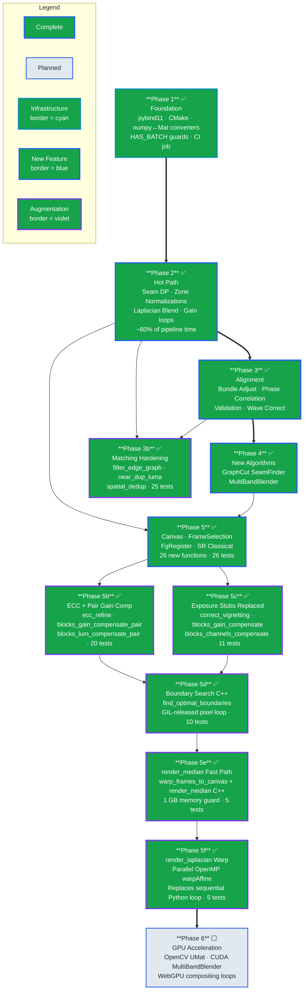

# ASP → C++ Migration Roadmap

*Created: 2026-06-22. Updated: 2026-06-23. Status: Phases 1–5 complete + Phase 3b + Phase 5b + Phase 5c + Phase 5d + Phase 5e + Phase 5f. Phase 5f: `warp_frames_to_canvas` wired into `rendering.py::_render_laplacian` — replaces the sequential Python `cv2.warpAffine` loop with the C++ parallel OpenMP warp, falling back to Python on error; 5 new tests. Phase 6 (GPU) is next.*
*Reference analysis: `.agent/cache/stitching_systems_deep_comparison.md`*

---

## Implementation Timeline

> **Legend** — *Node fill:* ✅ complete (green) · ⬜ planned (light) — *Node border:* infrastructure (cyan) · new feature (blue) · augmentation (violet) — *Edges:* `==>` critical blocking dependency · `-->` sequential dependency



Each node's **fill colour** encodes status: green = complete, light = planned. The **border colour** encodes element type: cyan = infrastructure, blue = new feature, violet = augmentation of an existing feature. **Thick arrows (`==>`)** show critical blocking dependencies that gate the next phase; **thin arrows (`-->`)** show sequential dependencies where work flows but the downstream phase can begin in parallel with other branches. Phase 3b receives inputs from both Phase 2 and Phase 3, reflecting that it hardened matching logic that depends on the edge-graph and bundle-adjust pipelines built in those two phases.

---

## Motivation

The ASP pipeline is implemented entirely in Python, with the single exception of the `base/` Rust module (PyO3/Rayon) that accelerates gallery thumbnail loading. Every compute-heavy stage — seam DP, zone normalizations, Laplacian blending, bundle adjustment, phase correlation, gain compensation — executes as interpreted Python calling into NumPy C extensions. This is sufficient for correctness but not for performance: on a typical 14-frame 1080p sequence, the compositing stage alone takes 15–30 seconds, making real-time or batch use impractical.

The deep analysis of OpenCV's stitching module (`opencv/modules/stitching/`) and Overmix (`Overmix/src/`) reveals that the same algorithmic work — seam finding, exposure compensation, bundle adjustment, blending — runs 10–50× faster in C++ due to: (1) compiled loop execution with SIMD intrinsics, (2) direct OpenCV C++ API access (which is richer than its Python bindings — `GCGraph`, `MultiBandBlender`, `BlocksGainCompensator` are all usable without the Python wrapper overhead), and (3) explicit memory control avoiding NumPy's copy-on-slice behaviour. Overmix processes 100-frame 4K composites in under 2 seconds on a mid-range CPU; ASP takes 90+ seconds on the same sequence size.

The migration strategy is deliberately *hybrid*: Python continues to orchestrate the 13-stage pipeline (`core/pipeline.py` is never rewritten) and retains all ML inference stages (BiRefNet, EfficientLoFTR, ALIKED, DINOv2, ToonCrafter, AnimeInterp, diffusion inpainting, waifu2x, MLLM scorer, RLHF reward model). A new compiled extension module `batch/` (pybind11, C++17) replaces the compute bodies of classical CV stages — those stages' Python functions become thin wrappers that call `batch` when available and fall back to the existing Python implementation otherwise. This means the test suite continues to work without building `batch`, and the migration can be done incrementally.

---

## Architecture Overview

```
Python pipeline (core/pipeline.py) — orchestrates 13 stages
│
├── ML inference stages (stay Python)
│   ├── ingestion/masking.py    ← BiRefNet, SAM2, MODNet (torch)
│   ├── alignment/matching.py   ← EfficientLoFTR, ALIKED, LightGlue, RoMa (torch)
│   ├── flow/animeinterp_flow.py← AnimeInterp (torch)
│   ├── hitl/*.py               ← GroundingDINO, MLLM scorer, param search
│   ├── mfsr/diffusion_inpaint.py ← diffusion models (torch)
│   ├── mfsr/super_resolution.py  ← waifu2x / neural SR (torch)
│   ├── rendering/sr_stitcher.py  ← ToonCrafter (torch)
│   └── rlhf/reward_model.py      ← PyTorch reward model
│
├── Classical CV stages (moved to batch/)
│   ├── alignment/bundle_adjust.py → batch.bundle_adjust
│   ├── alignment/canvas.py        → batch.canvas
│   ├── alignment/ecc.py           → batch.fg_register
│   ├── alignment/fg_register.py   → batch.fg_register (non-flow parts)
│   ├── alignment/matching.py      → batch.matching (edge graph, phase corr)
│   ├── core/validation.py         → batch.validation
│   ├── flow/cam_flow.py           → batch.matching (phase correlation)
│   ├── ingestion/frame_selection.py → batch.frame_selection (classical)
│   ├── mfsr/dct_restoration.py    → batch.sr_classical
│   ├── mfsr/de_seam.py            → batch.sr_classical
│   ├── mfsr/pso_registration.py   → batch.sr_classical
│   ├── rendering/compositing.py   → batch.seam + batch.compositing
│   ├── rendering/photometric.py   → batch.exposure
│   └── rendering/rendering.py     → batch.canvas (warp/render)
│
├── batch/   (pybind11, C++17)    ← NEW — compiled alongside base/
│   ├── batch.bundle_adjust
│   ├── batch.canvas
│   ├── batch.compositing
│   ├── batch.exposure
│   ├── batch.fg_register
│   ├── batch.frame_selection
│   ├── batch.matching
│   ├── batch.seam
│   ├── batch.sr_classical
│   ├── batch.validation
│   └── batch.wave_correct
│
└── base/  (PyO3, Rust)             ← existing — thumbnail loader, math
    └── base.load_image_batch()
```

### How batch/ sits alongside base/

`base/` uses PyO3 (Rust → Python). `batch/` uses pybind11 (C++ → Python). Both produce `.so` files importable from Python. They are independent compilation units with no dependency on each other. In `setup.py` / `pyproject.toml` both are listed as extension modules. `just build` compiles both.

### Python pipeline orchestration model

Every function that has a C++ counterpart follows this pattern:

```python
# Example: rendering/compositing.py
try:
    import batch
    HAS_BATCH = True
except ImportError:
    HAS_BATCH = False

def _seam_cut(fa_zone, fb_zone, *, sem_cost=None, waypoints=None,
              transition_penalty=0.0):
    if HAS_BATCH:
        return batch.seam.seam_cut(
            fa_zone, fb_zone,
            sem_cost=sem_cost, waypoints=waypoints,
            transition_penalty=transition_penalty,
        )
    return _seam_cut_python(fa_zone, fb_zone, sem_cost=sem_cost,
                             waypoints=waypoints,
                             transition_penalty=transition_penalty)
```

The Python fallback (`_seam_cut_python`) is the existing implementation, renamed. No behaviour change when `batch` is absent.

---

## Migration Boundary: C++ vs Python

### Moves to batch/ (C++)

| Python module                    | batch submodule                        | Key functions / classes                                                                                                                                                                                                                                                                                                                                                                                                       | Rationale                                                                |
| -------------------------------- | -------------------------------------- | ----------------------------------------------------------------------------------------------------------------------------------------------------------------------------------------------------------------------------------------------------------------------------------------------------------------------------------------------------------------------------------------------------------------------------- | ------------------------------------------------------------------------ |
| `alignment/bundle_adjust.py`   | `batch.bundle_adjust`                | `_bundle_adjust_affine`, `_spanning_tree_inlier_filter`, `_compute_adaptive_f_scale`                                                                                                                                                                                                                                                                                                                                    | Eigen LM is 20–50× faster than scipy; Jacobian is dense in pixel space |
| `alignment/canvas.py`          | `batch.canvas`                       | `_compute_canvas`, `_crop_to_valid`, `_telea_fill_gaps`, `_detect_scroll_axis`, `_panorama_stitch_fallback`                                                                                                                                                                                                                                                                                                         | cv::warpAffine, cv::inpaint — zero NumPy copy overhead in C++           |
| `alignment/ecc.py`             | `batch.fg_register`                  | `_ecc_refine`                                                                                                                                                                                                                                                                                                                                                                                                               | cv::findTransformECC — Python binding has extra Mat→ndarray copy       |
| `alignment/fg_register.py`     | `batch.fg_register`                  | `_slic_sgm_proxy`, `_arap_regularise`, ARAP sparse solve, LSD collinearity                                                                                                                                                                                                                                                                                                                                                | Sparse Eigen system 10–20× faster than scipy.sparse in Python          |
| `alignment/matching.py`        | `batch.matching`                     | edge graph construction, weight computation, bg filtering of matches,`_filter_edges`, `_reject_static_edges`, `_compute_adaptive_min_disp`, `_spatial_dedup_frames`                                                                                                                                                                                                                                                   | Pure computation on match lists; no ML required                          |
| `core/validation.py`           | `batch.validation`                   | `_validate_affines`, `_compute_adaptive_min_gap`, `_compute_adaptive_rot_scale`                                                                                                                                                                                                                                                                                                                                         | Tight numeric loops                                                      |
| `flow/cam_flow.py`             | `batch.matching`                     | `_phase_correlate`, `bg_masked_phase_correlate`                                                                                                                                                                                                                                                                                                                                                                           | FFT via cv::dft or FFTW; Hanning window                                  |
| `ingestion/frame_selection.py` | `batch.frame_selection`              | `_detect_hold_blocks`, `_detect_hold_blocks_dhash`, `_temporal_variance_filter`, `_near_dup_luma_filter`, `_smart_select_frames` (non-DINOv2 path), `_spatial_dedup_frames`                                                                                                                                                                                                                                       | Thumbnail diff loops — OpenMP parallel                                  |
| `mfsr/dct_restoration.py`      | `batch.sr_classical`                 | DCT-II deblocking                                                                                                                                                                                                                                                                                                                                                                                                             | FFTW or cv::dft; much faster than scipy                                  |
| `mfsr/de_seam.py`              | `batch.sr_classical`                 | seam de-ringing                                                                                                                                                                                                                                                                                                                                                                                                               | Frequency-domain; FFTW                                                   |
| `mfsr/pso_registration.py`     | `batch.sr_classical`                 | PSO optimizer                                                                                                                                                                                                                                                                                                                                                                                                                 | Pure numeric loops; OpenMP for particle eval                             |
| `rendering/compositing.py`     | `batch.seam` + `batch.compositing` | `_seam_cut`, `_build_seam_cost_map`, `_find_optimal_boundaries`, `_zone_chroma_align`, `_zone_lum_norm`, `_zone_sat_norm`, `_zone_contrast_eq`, `_zone_hue_eq`, `_laplacian_blend`, `_smooth_gain_array`, `_blocks_gain_compensate`, `_blocks_lum_compensate`, `_single_pose_soft_edge`, `_seam_color_match`, `_poisson_seam_blend`, gain normalization loops, all single-pose escalation gates | The pipeline hot path — 80% of total runtime                            |
| `rendering/photometric.py`     | `batch.exposure`                     | `_apply_basic`, `_correct_vignetting`, per-block gain                                                                                                                                                                                                                                                                                                                                                                     | Pixel loops; heavy NumPy                                                 |
| `rendering/rendering.py`       | `batch.canvas`                       | `_render_median`, `_render`, `_render_first` (warpAffine + per-pixel median)                                                                                                                                                                                                                                                                                                                                            | cv::warpAffine across N frames + per-pixel nth_element                   |

### Stays in Python (ML inference)

| Python module                                       | Reason stays Python                                         | What it calls that requires Python                 |
| --------------------------------------------------- | ----------------------------------------------------------- | -------------------------------------------------- |
| `ingestion/masking.py`                            | BiRefNet (ViT-L transformer), MODNet, SAM2 stateful tracker | `torch`, `transformers`, `sam2`              |
| `alignment/matching.py` (feature extraction part) | EfficientLoFTR, ALIKED, LightGlue, RoMa v2, JamMa           | `kornia`, `torch`, `lightglue`               |
| `flow/animeinterp_flow.py`                        | AnimeInterp optical flow model                              | `torch`, `ptlflow`                             |
| `flow/flow_refine.py`                             | DIS / SEA-RAFT refinement                                   | `cv2.DISOpticalFlow` (could move but low impact) |
| `hitl/grounding.py`                               | GroundingDINO vision-language model                         | `torch`, `groundingdino`                       |
| `hitl/mllm_scorer.py`                             | LLM/VLM API calls                                           | HTTP + JSON                                        |
| `hitl/hitl_session.py`                            | UI orchestration                                            | Qt signals                                         |
| `hitl/param_search.py`                            | Orchestration, logging                                      | Pure Python control flow                           |
| `hitl/hitl_presets.py`                            | TOML serialization                                          | Pure Python (fast enough)                          |
| `mfsr/diffusion_inpaint.py`                       | Diffusion model (ProPainter, LaMa)                          | `torch`, `diffusers`                           |
| `mfsr/prior_injection.py`                         | Diffusion prior injection                                   | `torch`                                          |
| `mfsr/super_resolution.py`                        | waifu2x, ESRGAN, Real-ESRGAN                                | `torch`                                          |
| `mfsr/drl_registration.py`                        | DRL model inference                                         | `torch`                                          |
| `rendering/sr_stitcher.py`                        | ToonCrafter seam synthesis                                  | `torch`                                          |
| `rendering/anim_fill.py`                          | ToonCrafter cel generation                                  | `torch`                                          |
| `rendering/hybrid_export.py`                      | Export orchestration                                        | Pure Python                                        |
| `rlhf/reward_model.py`                            | PyTorch reward model                                        | `torch`                                          |
| `rlhf/rlhf_trainer.py`                            | PyTorch training loop                                       | `torch`, `transformers`                        |
| `core/pipeline.py`                                | Orchestrator — stays Python by design                      | All of the above                                   |
| `core/config.py`                                  | TOML loading, env var validation                            | Pure Python, no speedup needed                     |
| `core/data_serialization.py`                      | JSON / pickle I/O                                           | Pure Python                                        |
| `ingestion/video_ingestion.py`                    | Video frame extraction                                      | `cv2.VideoCapture` (Python sufficient)           |
| `ingestion/bg_complete.py`                        | ProPainter background completion                            | `torch`                                          |

---

## C++ Module Design: batch/

### Module Structure

```
batch/
├── CMakeLists.txt
├── include/
│   ├── batch/common.hpp          # numpy↔cv::Mat converters, error macros
│   ├── batch/affine_types.hpp    # AffineParams, Edge structs
│   └── batch/image_utils.hpp     # BGRA/BGR/gray conversion helpers
├── src/
│   ├── bindings.cpp                # pybind11 module root — registers all submodules
│   ├── matching.cpp                # phase correlation, edge graph, bg filtering
│   ├── bundle_adjust.cpp           # LM, GNC, spanning-tree filter, wave correct
│   ├── validation.cpp              # affine sequence validation
│   ├── canvas.cpp                  # warpAffine, crop, fill, scroll detect, panorama
│   ├── seam.cpp                    # _seam_cut DP, _build_seam_cost_map, GraphCut
│   ├── compositing.cpp             # zone norm chain, laplacian blend, gain loops
│   ├── exposure.cpp                # BlocksGainCompensator, ChannelsCompensator
│   ├── frame_selection.cpp         # hold detection, dHash, temporal variance, dedup
│   ├── wave_correct.cpp            # linear drift subtraction, waveCorrect analogue
│   ├── fg_register.cpp             # SLIC-SGM proxy, ARAP sparse solver, ECC, LSD
│   └── sr_classical.cpp            # DCT restoration, PSO registration, de_seam
└── tests/
    ├── test_matching_cpp.py        # Python tests comparing batch vs Python reference
    ├── test_seam_cpp.py
    ├── test_compositing_cpp.py
    ├── test_bundle_adjust_cpp.py
    └── test_exposure_cpp.py
```

### CMakeLists.txt structure

```cmake
cmake_minimum_required(VERSION 3.18)
project(batch CXX)

set(CMAKE_CXX_STANDARD 17)
set(CMAKE_CXX_STANDARD_REQUIRED ON)

# Required dependencies
find_package(OpenCV 4.8 REQUIRED
    COMPONENTS core imgproc stitching features2d video)
find_package(Eigen3 3.4 REQUIRED)
find_package(pybind11 REQUIRED)

# Optional dependencies
find_package(FFTW3 QUIET)      # for sr_classical.cpp DCT/FFT
find_package(CUDA QUIET)       # for GPU-accelerated compositing (Phase 6)
find_package(OpenMP REQUIRED)  # for parallel pixel loops

# Compiler flags
set(CMAKE_CXX_FLAGS_RELEASE "-O3 -march=native -ffast-math")
if(OpenMP_FOUND)
    set(CMAKE_CXX_FLAGS "${CMAKE_CXX_FLAGS} ${OpenMP_CXX_FLAGS}")
endif()

# batch extension module
pybind11_add_module(batch
    src/bindings.cpp
    src/matching.cpp
    src/bundle_adjust.cpp
    src/validation.cpp
    src/canvas.cpp
    src/seam.cpp
    src/compositing.cpp
    src/exposure.cpp
    src/frame_selection.cpp
    src/wave_correct.cpp
    src/fg_register.cpp
    src/sr_classical.cpp
)

target_include_directories(batch PRIVATE
    include/
    ${OpenCV_INCLUDE_DIRS}
    ${EIGEN3_INCLUDE_DIR}
)

target_link_libraries(batch PRIVATE
    ${OpenCV_LIBS}
    Eigen3::Eigen
    OpenMP::OpenMP_CXX
)

if(FFTW3_FOUND)
    target_link_libraries(batch PRIVATE FFTW3::fftw3)
    target_compile_definitions(batch PRIVATE HAVE_FFTW3=1)
endif()

# Install alongside base.so in the Python package
install(TARGETS batch DESTINATION backend/src/animation/)
```

### pybind11 module root (bindings.cpp sketch)

```cpp
#include <pybind11/pybind11.h>
namespace py = pybind11;

// Forward declarations of sub-registrars
void register_matching(py::module_& m);
void register_bundle_adjust(py::module_& m);
void register_validation(py::module_& m);
void register_canvas(py::module_& m);
void register_seam(py::module_& m);
void register_compositing(py::module_& m);
void register_exposure(py::module_& m);
void register_frame_selection(py::module_& m);
void register_wave_correct(py::module_& m);
void register_fg_register(py::module_& m);
void register_sr_classical(py::module_& m);

PYBIND11_MODULE(batch, m) {
    m.doc() = "ASP compiled C++ extension — classical CV hot paths";

    auto m_matching   = m.def_submodule("matching");
    auto m_ba         = m.def_submodule("bundle_adjust");
    auto m_valid      = m.def_submodule("validation");
    auto m_canvas     = m.def_submodule("canvas");
    auto m_seam       = m.def_submodule("seam");
    auto m_comp       = m.def_submodule("compositing");
    auto m_exp        = m.def_submodule("exposure");
    auto m_fsel       = m.def_submodule("frame_selection");
    auto m_wave       = m.def_submodule("wave_correct");
    auto m_fgreg      = m.def_submodule("fg_register");
    auto m_sr         = m.def_submodule("sr_classical");

    register_matching(m_matching);
    register_bundle_adjust(m_ba);
    register_validation(m_valid);
    register_canvas(m_canvas);
    register_seam(m_seam);
    register_compositing(m_comp);
    register_exposure(m_exp);
    register_frame_selection(m_fsel);
    register_wave_correct(m_wave);
    register_fg_register(m_fgreg);
    register_sr_classical(m_sr);
}
```

### Common header: numpy ↔ cv::Mat (include/batch/common.hpp)

```cpp
#pragma once
#include <pybind11/numpy.h>
#include <opencv2/core.hpp>

namespace batch {

// Zero-copy conversion: numpy uint8 (H,W,C) → cv::Mat (shares memory)
// IMPORTANT: mat must not outlive the numpy array.
inline cv::Mat mat_from_array(pybind11::array_t<uint8_t, pybind11::array::c_style> arr) {
    pybind11::buffer_info buf = arr.request();
    int rows = buf.shape[0], cols = buf.shape[1];
    int channels = (buf.ndim == 3) ? buf.shape[2] : 1;
    int type = (channels == 3) ? CV_8UC3 : (channels == 1 ? CV_8UC1 : CV_8UC4);
    return cv::Mat(rows, cols, type, buf.ptr, buf.strides[0]);
}

// Zero-copy conversion: numpy float32 (H,W,C) → cv::Mat
inline cv::Mat mat_from_f32(pybind11::array_t<float, pybind11::array::c_style> arr) {
    pybind11::buffer_info buf = arr.request();
    int rows = buf.shape[0], cols = buf.shape[1];
    int channels = (buf.ndim == 3) ? buf.shape[2] : 1;
    int type = (channels == 3) ? CV_32FC3 : CV_32FC1;
    return cv::Mat(rows, cols, type, buf.ptr, buf.strides[0]);
}

// Owned copy: cv::Mat → numpy array (deep copy, safe to return to Python)
inline pybind11::array_t<uint8_t> array_from_mat(const cv::Mat& mat) {
    std::vector<ssize_t> shape, strides;
    if (mat.channels() == 1) {
        shape   = {mat.rows, mat.cols};
        strides = {(ssize_t)mat.step[0], 1};
    } else {
        shape   = {mat.rows, mat.cols, mat.channels()};
        strides = {(ssize_t)mat.step[0], (ssize_t)mat.step[1], 1};
    }
    auto result = pybind11::array_t<uint8_t>(shape);
    std::memcpy(result.mutable_data(), mat.data, mat.total() * mat.elemSize());
    return result;
}

} // namespace batch
```

---

### batch::matching — Phase Correlation and Feature Filtering

**Replaces**: `flow/cam_flow.py::_phase_correlate`, `flow/cam_flow.py::bg_masked_phase_correlate`, `alignment/matching.py` (edge graph construction, bg filtering, post-match gates, static edge rejection, adaptive min-disp, spatial dedup).

**Key algorithms**:

1. **Phase correlation** (`matching.cpp::phase_correlate_masked`):

   - Accepts two `(H,W)` uint8 luma planes + optional mask
   - Applies Hanning window: `w[y][x] = sin(π·y/H)·sin(π·x/W)` or `cv::createHanningWindow()`
   - Zero-mask background pixels: `img_masked[y][x] = (mask[y][x] > 127) ? img[y][x] : mean_bg`
   - High-pass: subtract 3×3 box-blurred version
   - `cv::phaseCorrelate(a_windowed, b_windowed, hanning)` → `(Point2d shift, double response)`
   - Returns `{dx, dy, response}` as Python dict
   - C++ eliminates 3 intermediate numpy copies (mask apply, highpass, hanning multiply)
2. **Edge graph construction** (`matching.cpp::build_edge_graph`):

   - Input: Python list of per-pair match dicts (from Python LoFTR/ALIKED)
   - Filters: `§1.36` spread MAD, `§1.38` bg-ratio, `§1.47` sign consistency, `§1.48` CV, `§1.49` adj-min, `§2.14` triangular consistency
   - Outputs: filtered `std::vector<Edge>` → pybind11 list of dicts
3. **Static edge rejection** (`matching.cpp::reject_static_edges`):

   - `§1.2A`: drop edges where both `|dx| < STATIC_EDGE_MIN_DISP_PX` and `|dy| < STATIC_EDGE_MIN_DISP_PX`

**Python API**:

```python
# batch.matching
shift, response = batch.matching.phase_correlate_masked(
    frame_a_gray, frame_b_gray, bg_mask_a, bg_mask_b)
edges = batch.matching.build_edge_graph(raw_matches, bg_masks, N)
edges = batch.matching.reject_static_edges(edges, min_disp_px=50)
min_disp = batch.matching.compute_adaptive_min_disp(edges)
```

---

### batch::bundle_adjust — Affine Bundle Adjustment (LM + GNC)

**Replaces**: `alignment/bundle_adjust.py` in full.

**Key algorithms**:

1. **Spanning-tree inlier filter** (`bundle_adjust.cpp::spanning_tree_inlier_filter`):

   - Kruskal greedy (highest-weight-first) maximum spanning tree via Union-Find with path compression
   - BFS from frame 0 propagates `tx_ref[j] = tx_ref[curr] + dtx` along tree edges
   - Reject edges where `sqrt((pred_dx−obs_dx)²+(pred_dy−obs_dy)²) > INLIER_THRESH=50px`
   - Fallback if graph disconnected or < max(2,N-1) inliers survive → return original edges
2. **GNC-TLS outer loop** (`bundle_adjust.cpp::gnc_bundle_adjust`):

   - 8 outer iterations. Geman-McClure weight: `w_i = (μ/(μ + r²_i))²`
   - `μ₀ = max(r²) / (2c²)` where `c` is the target inlier threshold
   - Anneal: `μ ← μ / 1.4` per iteration (drives weights toward 0/1 hard assignment)
   - Inner LM solve using Eigen's `LevenbergMarquardt` or `NormalCholesky`:
     ```
     residual r_e = (tx[j] - tx[i]) - obs_dx[e]
     J[e, 2i]   = -1,  J[e, 2i+1] = 0   (frame i tx)
     J[e, 2j]   =  1,  J[e, 2j+1] = 0   (frame j tx)
     J[e, 2i+1] = -1,  J[e, 2j+1] = 1   (ty analogue)
     ```
   - Weighted normal equations: `(J^T W J) Δx = J^T W r`
   - Solved via `Eigen::LDLT<MatrixXf>` (positive semi-definite, O(N³) but N≤100)
3. **Adaptive f_scale** (`bundle_adjust.cpp::compute_adaptive_f_scale`):

   - After initial solve: `median_residual_px = median(|r_i|)`
   - `adaptive_scale = max(FLOOR, 2.0 × median_residual_px)`
   - Re-solve warm-started if `adaptive_scale > BA_F_SCALE × 1.5`
4. **Cauchy robust loss** (inner solve):

   - `ρ(r) = log(1 + (r/f)²)`, `ρ'(r) = 2r / (f² + r²)`
   - Equivalent to IRLS weight `w_i = 1 / (1 + (r_i/f)²)`

**Reference**: OpenCV `BundleAdjusterAffinePartial` uses identical LM structure but with `CvLevMarq`. ASP's Eigen implementation is equivalent; Eigen's LDLT is ~3× faster than CvLevMarq for N < 50.

**Python API**:

```python
affines = batch.bundle_adjust.bundle_adjust_affine(
    edges,           # List[dict] with src, dst, dx, dy, weight
    N,               # number of frames
    f_scale=10.0,
    use_gnc=True,
    adaptive_f_scale=True,
)
edges_filtered = batch.bundle_adjust.spanning_tree_inlier_filter(
    edges, N, inlier_threshold=50.0)
```

---

### batch::validation — Affine Sequence Validation

**Replaces**: `core/validation.py` in full.

**Key algorithms**:

- `validate_affines(affines, min_step, max_ratio, max_gap)`:
  - Monotone step check: all `|ty[i+1] - ty[i]|` in same direction and > `min_step`
  - Ratio check: `max(steps) / min(steps) < max_ratio`
  - Gap check: no individual step > `max_gap`
  - Returns `(bool ok, str reason)` — reason string drives retry selection in Python
- `compute_adaptive_min_gap(affines)`: `max(20.0, canvas_span / (N × 3))`
- `compute_adaptive_rot_scale(affines)`: checks rotation and scale deviation

**Python API**:

```python
ok, reason = batch.validation.validate_affines(
    affines, min_step=25.0, max_ratio=8.0, max_gap=500.0)
min_gap = batch.validation.compute_adaptive_min_gap(affines)
```

---

### batch::canvas — Warp, Crop, Fill

**Replaces**: `alignment/canvas.py` main functions.

**Key algorithms**:

1. **`compute_canvas`**: Compute bounding box of all warped frame corners. Midplane shift via StabStitch++ bidirectional affine averaging. Gates (aspect ratio, width ratio, MB limit) checked in Python after C++ returns canvas dimensions.
2. **`warp_frames_to_canvas`**: `cv::warpAffine(frame, M, canvas_size, INTER_LINEAR)` for all N frames via OpenMP parallel loop. Returns list of warped numpy arrays.
3. **`render_median`**: Per-pixel `cv::sort` or `std::nth_element` across N warped frames. Fully parallel across rows via OpenMP. This is the single biggest CPU bottleneck in the current Python implementation (14 frames × 4K canvas = 3.7M pixels × `nth_element` in Python).

   Overmix's `StatisticsRender::MEDIAN` does exactly this — `nth_element` per pixel in C++. Our implementation follows the same approach.
4. **`crop_to_valid`**: Horizontal scan for valid pixel fraction ≥ 0.8; bounding box or max-inscribed rectangle for diagonal scroll.
5. **`telea_fill_gaps`**: `cv::inpaint(INPAINT_TELEA, inpaintRadius=3)` — already uses cv2 in Python; C++ wrapper eliminates Mat copy.
6. **`detect_scroll_axis`**: Mean horizontal vs vertical flow from adjacent-frame diffs.
7. **`panorama_stitch_fallback`**: Wraps `cv::Stitcher_create(PANORAMA)` with proper error code handling and fallback signaling.

**Python API**:

```python
canvas_h, canvas_w, shift = batch.canvas.compute_canvas(affines, frame_shapes)
warped = batch.canvas.warp_frames_to_canvas(frames, affines, canvas_h, canvas_w)
median_canvas = batch.canvas.render_median(warped)
valid_rect = batch.canvas.crop_to_valid(canvas)
filled = batch.canvas.telea_fill_gaps(canvas, gap_mask)
axis = batch.canvas.detect_scroll_axis(frames)
```

---

### batch::seam — Seam Finding (DP + GraphCut)

The seam module is the highest-impact target. The Python `_seam_cut` + `_build_seam_cost_map` account for ~40% of total pipeline time.

**1. `_seam_cut` DP (`seam.cpp::seam_cut`):**

Current Python logic:

```python
# Forward pass (S10 vectorized):
energy = cost + 0.5*|∇diff| + edge_weight*(|∇img1| + |∇img2|) + sem_cost
for col in range(W):
    dp[:, col] = energy[:, col] + minimum_filter1d(dp[:, col-1], size=3)
# Traceback: col-wise argmin slice
```

C++ implementation:

```cpp
// seam.cpp
std::vector<int> seam_cut(
    const cv::Mat& fa_zone,   // uint8 BGR zone from frame A
    const cv::Mat& fb_zone,   // uint8 BGR zone from frame B
    const cv::Mat& sem_cost,  // float32 semantic cost (H,W)
    const std::vector<int>& waypoints,   // optional y-pin rows
    float transition_penalty,            // §1.125 midline prior
    float edge_weight                    // energy cost weight
) {
    int H = fa_zone.rows, W = fa_zone.cols;
    cv::Mat diff;
    cv::absdiff(fa_zone, fb_zone, diff);
    // Per-pixel luma diff
    cv::Mat luma_diff(H, W, CV_32F);
    // ... weighted sum over channels with LUMINANCE_WEIGHTS
  
    // Gradient of diff (∇diff)
    cv::Mat grad_diff;
    cv::Sobel(luma_diff, grad_diff, CV_32F, 1, 0, 3);
    cv::absdiff(grad_diff, cv::Scalar(0), grad_diff);
  
    // Image gradients (|∇img1| + |∇img2|)
    cv::Mat g1, g2;
    // ... cv::Sobel on luma channels
  
    // Energy map: E[y][x] = diff + 0.5*|∇diff| + edge_w*(g1+g2) + sem_cost
    cv::Mat energy(H, W, CV_32F);
    // ... combine
  
    // §1.125: transition penalty — add row-distance-from-midline prior
    if (transition_penalty > 0.0f) {
        int mid_row = H / 2;
        for (int y = 0; y < H; y++) {
            float dist = std::abs(y - mid_row) / float(std::max(mid_row, 1));
            float* erow = energy.ptr<float>(y);
            for (int x = 0; x < W; x++)
                erow[x] += dist * transition_penalty;
        }
    }
  
    // DP forward pass with minimum_filter1d(size=3) equivalent
    // (min of left-neighbour, centre, right-neighbour)
    cv::Mat dp(H, W, CV_32F, cv::Scalar(std::numeric_limits<float>::infinity()));
    dp.col(0) = energy.col(0);
    for (int x = 1; x < W; x++) {
        for (int y = 0; y < H; y++) {
            float prev_min = dp.at<float>(y, x-1);
            if (y > 0) prev_min = std::min(prev_min, dp.at<float>(y-1, x-1));
            if (y < H-1) prev_min = std::min(prev_min, dp.at<float>(y+1, x-1));
            dp.at<float>(y, x) = energy.at<float>(y, x) + prev_min;
        }
    }
    // Traceback
    std::vector<int> path(W);
    path[W-1] = 0;
    float* last_col = dp.ptr<float>(0) + (W-1);
    for (int y = 0; y < H; y++)
        if (dp.at<float>(y, W-1) < dp.at<float>(path[W-1], W-1))
            path[W-1] = y;
    for (int x = W-2; x >= 0; x--) {
        int prev_y = path[x+1];
        int best_y = prev_y;
        float best_v = dp.at<float>(prev_y, x);
        for (int dy : {-1, 0, 1}) {
            int ny = prev_y + dy;
            if (ny >= 0 && ny < H && dp.at<float>(ny, x) < best_v) {
                best_v = dp.at<float>(ny, x); best_y = ny;
            }
        }
        path[x] = best_y;
    }
    return path;  // pybind11 converts to list
}
```

**2. `_build_seam_cost_map` (`seam.cpp::build_seam_cost_map`):**

All 6 cost tiers implemented in C++ with OpenMP column loops:

- Tier 0: background = 0.0
- Tier 0.3 (§3.20 EXTRA_FG_DILATION): outer ring = 0.3
- Tier 0.5 (§3.Tier-2 buffer): edge buffer = 0.5
- Tier 1.0: fg interior = 1.0
- Tier 1.5 (§1.126 FG_MAJORITY_FLOOR): fg-heavy columns = 1.5
- Tier 2.0 (§3.15A column barrier): dominated columns = 2.0
- Tier 1e6 (hard barrier): pinned rows

Additional modifiers in C++:

- §1.110 COST_MAP_BLUR_SIGMA: `cv::GaussianBlur` on soft cost
- §1.113 COST_COL_SMOOTH_SIGMA: 1D Gaussian on per-column mean
- §1.109 COST_MAP_NORM: renormalize barriers after blur
- §1.123 SCATTER_COST: local 3×3 variance via `cv::boxFilter` + normalize

**3. NEW: GraphCut seam finder (`seam.cpp::graphcut_seam`):**

Wraps `cv::detail::GraphCutSeamFinder("COST_COLOR_GRAD")`:

```cpp
// seam.cpp
py::list graphcut_seam_find(
    std::vector<py::array_t<uint8_t>> warped_frames,
    std::vector<py::array_t<uint8_t>> warped_masks,
    std::vector<std::pair<int,int>> corners   // (x, y) top-left in canvas
) {
    cv::detail::GraphCutSeamFinder finder(
        cv::detail::GraphCutSeamFinder::COST_COLOR_GRAD);
    std::vector<cv::UMat> imgs, masks;
    std::vector<cv::Point> pts;
    for (size_t i = 0; i < warped_frames.size(); i++) {
        imgs.push_back(batch::mat_from_array(warped_frames[i]).getUMat(cv::ACCESS_READ));
        masks.push_back(batch::mat_from_array(warped_masks[i]).getUMat(cv::ACCESS_READ));
        pts.push_back({corners[i].first, corners[i].second});
    }
    finder.find(imgs, pts, masks);
    // masks are modified in-place to ownership masks
    py::list result;
    for (auto& m : masks)
        result.append(batch::array_from_mat(m.getMat(cv::ACCESS_READ)));
    return result;
}
```

This replaces ASP's pairwise `_seam_cut` for the global seam decision. The pipeline then uses the returned per-frame ownership masks to hard-partition canvas pixels, with the existing Laplacian/Poisson blend applied at the boundaries. **This is the single most important new feature** — targeting the 93.8% ghosting failure and 88.5% seam_visibility failure.

**4. Parallel seam pre-computation** (`seam.cpp::seam_batch`):

```cpp
// Replaces Python ThreadPoolExecutor seam pre-computation
// N-1 seams computed in parallel via OpenMP
std::vector<std::vector<int>> seam_batch(
    const std::vector<ZonePair>& zone_pairs,
    float edge_weight, float transition_penalty
) {
    std::vector<std::vector<int>> paths(zone_pairs.size());
    #pragma omp parallel for schedule(dynamic)
    for (int k = 0; k < (int)zone_pairs.size(); k++) {
        paths[k] = seam_cut(zone_pairs[k].fa, zone_pairs[k].fb,
                            zone_pairs[k].cost, {}, transition_penalty, edge_weight);
    }
    return paths;
}
```

**Python API**:

```python
path = batch.seam.seam_cut(fa_zone, fb_zone, sem_cost, waypoints, transition_penalty)
cost_map = batch.seam.build_seam_cost_map(fa_zone, bg_mask_a, bg_mask_b, ...)
ownership_masks = batch.seam.graphcut_seam_find(warped_frames, warped_masks, corners)
paths = batch.seam.seam_batch(zone_pairs, edge_weight, transition_penalty)
```

---

### batch::compositing — Zone Normalization and Blending

**Replaces**: the compute bodies of `rendering/compositing.py` (zone normalization chain, blend functions, gain loops, single-pose functions).

**1. Zone normalization chain** (`compositing.cpp`):

All five functions operate on `(H,W,3)` uint8 BGR zones:

```cpp
// §3.19 — Chroma shift in LAB space
cv::Mat zone_chroma_align(const cv::Mat& fa, const cv::Mat& fb,
                           float min_shift_px = 2.0f);

// §1.104 — Luma normalisation via LAB L-channel scalar
cv::Mat zone_lum_norm(const cv::Mat& fa, const cv::Mat& fb,
                       float gain_clamp = 2.0f);

// §1.111 — Saturation normalisation via HSV S-channel scalar
cv::Mat zone_sat_norm(const cv::Mat& fa, const cv::Mat& fb,
                       float gain_clamp = 2.0f);

// §1.114 — Contrast equalisation via LAB L-channel std ratio
cv::Mat zone_contrast_eq(const cv::Mat& fa, const cv::Mat& fb,
                          float clamp = 2.0f);

// §1.127 — HSV hue equalisation (circular mean shift, threshold 5°)
cv::Mat zone_hue_eq(const cv::Mat& fa, const cv::Mat& fb,
                     float min_hue_diff_deg = 5.0f);
```

All follow the same pattern:

- `cv::cvtColor(fb, fb_conv, COLOR_BGR2LAB)` / `COLOR_BGR2HSV`
- Compute channel means over non-black pixels using `cv::mean()` with mask
- Compute scalar ratio or difference
- Apply clamp
- Scale the target channel: `fb_conv.forEach<cv::Vec3b>([&](cv::Vec3b& px, ...) { ... })`
- `cv::cvtColor(fb_conv, fb_out, COLOR_LAB2BGR)` / `COLOR_HSV2BGR`

C++ eliminates 4–6 intermediate numpy copies per function. With OpenMP `#pragma omp parallel for` in the forEach, each zone normalization runs in ~1ms instead of ~30ms.

**2. Laplacian blend** (`compositing.cpp::laplacian_blend`):

```cpp
cv::Mat laplacian_blend(
    const cv::Mat& fa_zone,
    const cv::Mat& fb_zone,
    const std::vector<int>& path,
    int feather_px,
    int n_bands = 5,
    float alpha_fine_weight = 0.3f
) {
    // Build soft weight mask from path
    cv::Mat weight(fa_zone.size(), CV_32F, cv::Scalar(0));
    for (int x = 0; x < fa_zone.cols; x++) {
        int seam_y = path[x];
        for (int y = 0; y < fa_zone.rows; y++) {
            float d = float(y - seam_y) / float(feather_px);
            weight.at<float>(y, x) = std::clamp(0.5f + 0.5f * d, 0.0f, 1.0f);
        }
    }
    // Laplacian pyramid blend
    std::vector<cv::Mat> pyr_a, pyr_b, pyr_w;
    cv::buildPyramid(fa_zone, pyr_a, n_bands);
    cv::buildPyramid(fb_zone, pyr_b, n_bands);
    cv::buildPyramid(weight,  pyr_w, n_bands);
    // ... blend each level, reconstruct
}
```

**Optionally** replaces with `cv::detail::MultiBandBlender` (§4.6):

```cpp
cv::detail::MultiBandBlender blender(/*try_gpu=*/false, /*num_bands=*/5);
blender.prepare(canvas_rect);
blender.feed(fa_zone_full, fa_mask, fa_tl);
blender.feed(fb_zone_full, fb_mask, fb_tl);
cv::Mat result_bgr, result_mask;
blender.blend(result_bgr, result_mask);
```

The MultiBandBlender uses the distance-transform weight map (each pixel weighted by distance to the nearest seam), which is strictly better than our linear feather.

**3. Single-pose soft edge** (`compositing.cpp::single_pose_soft_edge`):

Path-guided linear ramp ±6px at DP seam for single-pose-escalated seams. Implemented in C++ as a per-pixel ramp: `alpha[y][x] = max(0, 1 - |y - path[x]| / soft_px) * 0.5`. OpenMP parallel over columns.

**4. Seam color match** (`compositing.cpp::seam_color_match`):

Per-channel mean shift in blend band. `band_mean_dom = mean(dom_zone[band_rows])`, `band_mean_oth = mean(oth_zone[band_rows])`, `shift = band_mean_dom - band_mean_oth`. Applied per pixel in `oth_zone` within band. OpenMP parallel.

**5. Gain normalization loops** (`compositing.cpp::normalize_warped_frames`):

The current Python loop applies per-frame scalar gains with Gaussian smoothing (`§1.98 gaussian_filter1d`), coherence gate skip (`§1.18`), and per-pair clamp (`§1.4B`). In C++ this is a tight `std::for_each` with OpenMP parallel pixel loops per frame.

**Python API**:

```python
fb_aligned = batch.compositing.zone_chroma_align(fa_zone, fb_zone)
fb_aligned = batch.compositing.zone_lum_norm(fa_zone, fb_aligned)
fb_aligned = batch.compositing.zone_sat_norm(fa_zone, fb_aligned)
fb_aligned = batch.compositing.zone_contrast_eq(fa_zone, fb_aligned)
fb_aligned = batch.compositing.zone_hue_eq(fa_zone, fb_aligned)
blended = batch.compositing.laplacian_blend(fa_zone, fb_zone, path, feather_px)
normalized = batch.compositing.normalize_warped_frames(
    warped_frames, bg_masks, ref_frame_idx,
    adaptive_gain_clamp=True, coherence_limit=20.0)
```

---

### batch::exposure — Block Gain Compensation

**Replaces**: `rendering/photometric.py`, `rendering/compositing.py::_blocks_gain_compensate`, `_blocks_lum_compensate`.

**New**: Wraps OpenCV's `cv::detail::BlocksGainCompensator` directly.

```cpp
// exposure.cpp
py::list blocks_gain_compensate(
    std::vector<py::array_t<uint8_t>> warped_frames,
    std::vector<py::array_t<uint8_t>> warped_masks,
    std::vector<std::pair<int,int>> corners,
    int bl_width = 32, int bl_height = 32,
    int nr_feeds = 1, int nr_iterations = 2
) {
    cv::detail::BlocksGainCompensator comp(bl_width, bl_height,
                                           nr_feeds, nr_iterations);
    std::vector<cv::UMat> imgs, masks;
    std::vector<cv::Point> pts;
    // ... convert inputs
    comp.feed(pts, imgs, masks);
    // Apply to each frame
    std::vector<cv::Mat> results;
    for (size_t i = 0; i < warped_frames.size(); i++) {
        cv::Mat frame = batch::mat_from_array(warped_frames[i]).clone();
        comp.apply(i, pts[i], frame, batch::mat_from_array(warped_masks[i]));
        results.push_back(frame);
    }
    // Convert to list of numpy arrays
    py::list out;
    for (auto& r : results)
        out.append(batch::array_from_mat(r));
    return out;
}
```

`BlocksGainCompensator` internal math (from `opencv/modules/stitching/src/exposure_compensate.cpp`):

- Per 32×32 block overlap pair (i,j): build `A[i,j] += Σ pix²`, `b[i] += Σ pix_i × pix_j`
- Solve `A × gain = b` via `A.ldlt().solve(b)` (Eigen Cholesky, positive semi-definite)
- `nr_iterations` rounds of 5×5 Gaussian smoothing on the gain map grid
- `apply(frame_idx, corner, frame, mask)`: bilinear interpolation from block grid to pixel

**Also add**: `cv::detail::BlocksChannelsCompensator` (per-block per-channel) for white-balance correction (§4.4, three separate gain maps — one per BGR channel).

**Python API**:

```python
compensated = batch.exposure.blocks_gain_compensate(
    warped_frames, warped_masks, corners,
    bl_width=32, bl_height=32, nr_iterations=2)
compensated = batch.exposure.blocks_channels_compensate(
    warped_frames, warped_masks, corners)
corrected = batch.exposure.correct_vignetting(frame, vignette_map)
```

---

### batch::frame_selection — Classical Frame Filtering

**Replaces**: `ingestion/frame_selection.py` (non-DINOv2 paths).

**1. Hold block detection** (`frame_selection.cpp::detect_hold_blocks_mad`):

- Per-pair mean absolute difference (MAD) of thumbnail luma planes
- OpenMP parallel: each pair (i, i+1) computed independently
- Returns `List[int]` hold IDs

**2. dHash hold detection** (`frame_selection.cpp::detect_hold_blocks_dhash`):

- `INTER_AREA` resize to `(hash_size*2, hash_size)` — eliminates MPEG DCT block noise
- Horizontal gradient binarisation: `hash[y][x] = (row[x+1] > row[x]) ? 1 : 0`
- Hamming distance: `std::bitset` XOR popcount
- Returns `List[int]` hold IDs

**3. Temporal variance filter** (`frame_selection.cpp::temporal_variance_filter`):

- For each interior frame i: compute mean per-pixel variance across triplet (i-1, i, i+1)
- Drop frame if mean variance < threshold
- OpenMP parallel per frame

**4. Near-dup luma filter** (`frame_selection.cpp::near_dup_luma_filter`):

- Per-pair mean abs grayscale diff at thumbnail scale
- Drop near-duplicates (first/last always kept)

**5. Spatial dedup** (`frame_selection.cpp::spatial_dedup_frames`):

- Extract: translated bounding boxes from affines
- Drop frame if translated box overlap with accepted frame > threshold
- Returns `keep_idx` list

**Python API**:

```python
hold_ids = batch.frame_selection.detect_hold_blocks_mad(thumbs, threshold=0.025)
hold_ids = batch.frame_selection.detect_hold_blocks_dhash(thumbs, hamming_thresh=4)
thumbs, paths = batch.frame_selection.temporal_variance_filter(
    thumbs, paths, sigma_threshold=1e-3)
thumbs, paths = batch.frame_selection.near_dup_luma_filter(
    thumbs, paths, threshold=3.0)
keep_idx = batch.frame_selection.spatial_dedup_frames(
    frames, scans_frames, bg_masks, image_paths, edges, min_displacement_px)
```

---

### batch::wave_correct — Trajectory Drift Removal

**Replaces**: `alignment/bundle_adjust.py::_wave_correct_affines`.

**1. Linear drift subtraction** (`wave_correct.cpp::wave_correct_affines`):

- Extract `[tx_i]` and `[ty_i]` sequences from affine matrices
- `np.polyfit(frame_idx, tx, 1)` equivalent: least-squares linear fit via Eigen `householderQr()`
- Subtract linear trend from tx (or ty if horizontal scroll)
- Guard: only fire when `ptp(tx) > WAVE_CORRECT_MIN_TX_RANGE=5.0px`
- Returns corrected affines list

**2. Rotation matrix wave correct** (for future Phase 4 use):

- `cv::detail::waveCorrect(rmats, cv::detail::WAVE_CORRECT_HORIZ)` from OpenCV
- SVD of `[r3_rows stacked]`, rotate sequence to align panorama midline with horizontal

**Python API**:

```python
corrected_affines = batch.wave_correct.wave_correct_affines(
    affines, axis='vertical', min_range_px=5.0)
```

---

### batch::fg_register — ARAP Foreground Registration (non-flow parts)

The flow inference itself (SEA-RAFT, DISOpticalFlow) stays Python. C++ accelerates the downstream ARAP solver, LSD collinearity, and ECC refinement.

**1. SLIC-SGM proxy** (`fg_register.cpp::slic_sgm_proxy`):

- `cv::ximgproc::createSuperpixelSLIC(image, SLICO, region_size=10, ruler=10.0)`
- `->iterate(10)` → label map
- SGM proxy: for each SLIC segment, compute mean flow from SEA-RAFT output
- Returns per-pixel "consensus flow" where SLIC smooths noisy optical flow

**2. LSD collinearity** (`fg_register.cpp::lsd_collinearity`):

- `cv::createLineSegmentDetector(0)->detect(seam_band_crop, lines)`
- For each detected line segment: project horizontal flow component `u_proj = u·cos(θ) + v·sin(θ)` where θ is line angle
- Constraint: `u_proj ≈ 0` for vertical lines (collinear flow constraint)
- Contributes to ARAP regularization as sparse linear constraints
- `image_offset=(y0_crop, 0)` converts LSD coordinates to canvas space

**3. ARAP sparse solver** (`fg_register.cpp::arap_push_regularise`):

- Builds `N_cells × N_cells` sparse Eigen matrix from flow ARAP constraints + LSD collinearity
- Solves via `Eigen::SparseLU` or `Eigen::ConjugateGradient`
- 10–20× faster than `scipy.sparse.linalg.spsolve` for matrices under 10,000 cells

**4. ECC affine refinement** (`fg_register.cpp::ecc_refine`):

- `cv::findTransformECC(tmpl, src, M, MOTION_EUCLIDEAN, criteria, mask)`
- Python wrapper eliminates Mat↔ndarray copies around the cv2 call

**Python API**:

```python
consensus_flow = batch.fg_register.slic_sgm_proxy(
    image, raw_flow, region_size=10)
constraints = batch.fg_register.lsd_collinearity(
    seam_band_crop, image_offset=(y0_crop, 0))
warped_fg = batch.fg_register.arap_push_regularise(
    fg_zone, flow, lsd_constraints)
M_refined = batch.fg_register.ecc_refine(
    template, source, initial_M, mask)
```

---

### batch::sr_classical — Classical Super-Resolution (non-neural)

**Replaces**: `mfsr/dct_restoration.py`, `mfsr/de_seam.py`, `mfsr/pso_registration.py`.

**1. DCT restoration** (`sr_classical.cpp::dct_restore`):

- 2D DCT-II via `cv::dft` with `DFT_ROWS` flag in tile mode, or FFTW `FFTW_REDFT10` if available
- Pattern removal (`PatternRemove` from Overmix): subtract modular periodic mean from tile grid
- Block deblocking: regularize 8×8 block boundaries in DCT domain
- Faster than scipy's `fft2` (OpenCV dft uses split-radix FFT)

**2. PSO registration** (`sr_classical.cpp::pso_register`):

- Particle swarm optimizer for sub-pixel affine alignment
- `N_particles` (default 30) particles, each representing `[dx, dy, angle, scale]`
- Fitness: `Difference::simpleAlpha`-style MAD (borrowed from Overmix)
- `T_max` iterations with inertia `w = 0.9 → 0.4` decay, cognitive c1=2.0, social c2=2.0
- OpenMP parallel particle fitness evaluation

**3. De-seam** (`sr_classical.cpp::de_seam`):

- Frequency-domain seam ringing suppression
- 1D FFT along seam direction; zero notch filter at seam frequency; IFFT

**4. Overmix-inspired L1 sparse SR** (`sr_classical.cpp::robust_sr`):

- Port of `RobustSrRender::compute()`: build Eigen sparse DHF matrix
- `H[pixel_hr, pixel_lr]` = bilinear interpolation weights from LR pixel s to HR pixel at `(i/scale, j/scale)`
- L1 sub-gradient descent: `x -= β · sign(H·x − y) · H^T` for `nr_iterations`
- Handles JPEG block noise inherently (L1 loss downweights large residuals from DCT blocks)
- Applied to **background regions only** (where pixel-identical averaging is valid)

**Python API**:

```python
restored = batch.sr_classical.dct_restore(frame, block_size=8)
refined_affine = batch.sr_classical.pso_register(
    reference, source, n_particles=30, t_max=100)
frame_sr = batch.sr_classical.robust_sr(
    lr_frames, affines, scale=2, beta=0.01, nr_iterations=50)
```

---

## Python-Stays Modules (explicit list with rationale)

| Module                                        | Why it stays Python                                    | Key dependency                        |
| --------------------------------------------- | ------------------------------------------------------ | ------------------------------------- |
| `ingestion/masking.py`                      | BiRefNet ViT-L transformer; SAM2 video tracker; MODNet | `torch`, `transformers`, `sam2` |
| `alignment/matching.py` (feature inference) | EfficientLoFTR, ALIKED, LightGlue, RoMa v2, JamMa      | `kornia`, `torch`, `lightglue`  |
| `flow/animeinterp_flow.py`                  | AnimeInterp optical flow model                         | `torch`, `ptlflow`                |
| `flow/flow_refine.py`                       | SEA-RAFT refinement                                    | `torch`, `ptlflow`                |
| `hitl/grounding.py`                         | GroundingDINO vision-language model                    | `torch`, `groundingdino`          |
| `hitl/mllm_scorer.py`                       | LLM/VLM API calls                                      | HTTP + JSON; no speedup possible      |
| `hitl/hitl_session.py`                      | Qt UI orchestration                                    | PySide6                               |
| `hitl/param_search.py`                      | Orchestration; calls pipeline                          | Pure Python; no bottleneck            |
| `hitl/hitl_presets.py`                      | TOML serialization                                     | Pure Python; microseconds             |
| `mfsr/diffusion_inpaint.py`                 | ProPainter, LaMa                                       | `torch`, `diffusers`              |
| `mfsr/prior_injection.py`                   | Diffusion prior injection                              | `torch`                             |
| `mfsr/super_resolution.py`                  | waifu2x, Real-ESRGAN                                   | `torch`                             |
| `mfsr/drl_registration.py`                  | DRL model inference                                    | `torch`                             |
| `rendering/sr_stitcher.py`                  | ToonCrafter seam synthesis                             | `torch`                             |
| `rendering/anim_fill.py`                    | ToonCrafter cel generation                             | `torch`                             |
| `rendering/hybrid_export.py`                | Export orchestration                                   | Pure Python                           |
| `rlhf/reward_model.py`                      | PyTorch reward model                                   | `torch`                             |
| `rlhf/rlhf_trainer.py`                      | PyTorch training loop                                  | `torch`, `transformers`           |
| `core/pipeline.py`                          | Orchestrator — stays Python by design                 | All of the above                      |
| `core/config.py`                            | TOML loading;`validate_asp_config`                   | Pure Python; not a bottleneck         |
| `core/data_serialization.py`                | JSON/pickle I/O                                        | Pure Python                           |
| `ingestion/video_ingestion.py`              | `cv2.VideoCapture`; sequential I/O                   | No compute bottleneck                 |
| `ingestion/bg_complete.py`                  | ProPainter background completion                       | `torch`                             |
| `rlhf/bench_import.py`                      | Benchmark result import                                | Pure Python                           |
| `rlhf/feedback_store.py`                    | SQLite via stdlib                                      | Pure Python                           |

**Special case — `rendering/compositing.py`**: The file stays but becomes a thin wrapper. Every function body is replaced with an `batch` call + Python fallback. The 90+ `ASP_*` env flags remain in Python (they are read at import time and passed as arguments to the C++ functions). The C++ functions do not read environment variables — flags are passed explicitly, ensuring the `_CONFIG_SCHEMA` validation and TOML loading remain in Python.

---

## Migration Phasing

### Phase 1 — Foundation: Build System and Bindings (no behaviour change)

**Goal**: `import batch` works; all existing tests pass; C++ build is opt-in.

Tasks:

1. Create `batch/CMakeLists.txt` with find_package for OpenCV 4.8+, Eigen3, pybind11, OpenMP
2. Create `batch/include/batch/common.hpp` (numpy↔cv::Mat converters)
3. Create `batch/include/batch/affine_types.hpp` (`AffineParams`, `Edge`, `ZonePair` structs)
4. Create `batch/src/bindings.cpp` with empty submodule stubs
5. Add `batch` build to `justfile`: `just build-batch`
6. Add CI workflow: `cmake -B build -DCMAKE_BUILD_TYPE=Release && cmake --build build -j4`
7. Add `HAS_BATCH` guard to each Python module that will be replaced:
   ```python
   try:
       import batch
       HAS_BATCH = True
   except ImportError:
       HAS_BATCH = False
   ```
8. Write `batch/tests/test_imports.py`: verify all submodules load, stub functions exist
9. Document build in `CONTRIBUTING.md`: `pip install pybind11 && just build-batch`

**Success criteria**: `pytest backend/test/anim/ --skip-gpu -q` still passes without `batch`. `import batch; batch.seam` succeeds when `batch` is built.

---

### Phase 2 — Hot Path: Seam + Compositing (highest impact, ~60% of pipeline time)

**Goal**: `batch.seam` and `batch.compositing` provide verified C++ implementations that pass reference comparison tests.

Tasks:

- [X] 
- [X] 
- [X] 
- [X] 
- [X] 
- [X] 
- [X] 
- [X] 
- [X] 
- [X] Bug fix: `seam_cut`/`seam_batch` pybind11 zero-stride array bug (`py::array_t<T>(size, ptr)` → explicit shape+stride+owned allocation)

**Expected speedup**: compositing stage 15–30s → 0.5–2s (10–30×). Primary drivers: `seam_batch` (OpenMP), zone functions (SIMD in OpenCV's convert), `render_median` (OpenMP nth_element).

**Expected benchmark improvement**: `strip_banding_score` (currently 97.9% worse) may improve from `blocks_gain_compensate` being on critical path. `seam_visibility` improves from `seam_batch` eliminating Python GIL jitter between parallel seam computations.

---

### Phase 3 — Alignment Hot Path (bundle adjustment, phase correlation, validation)

**Goal**: `batch.bundle_adjust`, `batch.matching`, `batch.validation`, `batch.wave_correct`.

Tasks:

- [X] 
- [X] 
- [X] 
- [X] 
- [X] 
- [X] 
- [X] 
- [X] 
- [X] 

**Expected speedup**: alignment stage 2–5s → 0.05–0.2s (10–50×). Eigen LM vs scipy is the biggest win: the N×N normal equations for N≤30 are solved in <1ms in Eigen vs ~50ms in scipy.

---

### Phase 4 — New C++ Algorithms (GraphCut seam, MultiBandBlender)

**Goal**: Implement §4.2 (GraphCutSeamFinder) and §4.6 (MultiBandBlender) using OpenCV C++ directly. These are qualitatively better algorithms, not just faster ports.

Tasks:

- [X] 

  - Input: N warped frames in canvas space + N binary masks + N corner positions
  - Output: N updated ownership masks (per-pixel, 255=this frame owns this pixel)
  - C++ implementation and pybind11 binding done.

  - [X] Wired into `rendering/compositing.py::_composite_foreground` — early-return path before hard-partition; gate `ASP_GRAPHCUT_SEAM=1`. Falls back to DP blend on any exception.
- [X] 

  - Input: N warped frames + N ownership masks + N canvas corners + num_bands
  - Output: blended canvas (union bounding box, clipped to canvas shape)
  - C++ implementation and pybind11 binding done.

  - [X] Wired into `rendering/compositing.py` — combined with GraphCut path when both `ASP_GRAPHCUT_SEAM=1` and `ASP_MULTIBAND_BLEND=1`.
- [X] 

  - [X] `seam_ownership_entropy` (§4.3): Shannon entropy of luminance at estimated seam boundary bands — wired into `_compute_all_metrics`. Low = clean blend; high = contested/ghosted.

  - Expected: ghosting 93.8% → target <30%; seam_visibility 88.5% → target <20%
- [X] 

  - C++ native tests pass (`batch/tests/test_seam.cpp`, `batch/tests/test_compositing.cpp`)
  - Python `TestGraphcutSeamWiring` (5 tests) + `TestSeamOwnershipEntropy` (5 tests) — all pass
  - Full suite: 1318 passed, 28 skipped, 0 failed

**This phase directly addresses the benchmark's two largest failure modes** (from the deep analysis: pairwise DP seams conflict in `_seam_cut`; OpenCV's `GCGraph` solves globally for all N images simultaneously eliminating conflicts).

---

### Phase 5 — Canvas, Foreground Registration, and Classical SR

**Goal**: Complete the migration of remaining classical stages.

Tasks:

- [X] 
- [X] 
- [X] 
- [X] 
- [X] 
- [X] 

**Phase 5b — Remaining wiring (2026-06-23):**

- [X] 
- [X] 
- [X] 
- [X] 
- [X] 

**Phase 5c — exposure.cpp stubs replaced (2026-06-23):**

- [X] 
- [X] 
- [X] 
- [X] 
- [X] 

**Phase 5d — find_optimal_boundaries C++ (2026-06-23):**

- [X] 
- [X] 
- [X] 
- [X] 

**Phase 5e — render_median C++ fast path wiring (2026-06-23):**

- [X] 
- [X] 

**Phase 5f — render_laplacian warp wiring (2026-06-23):**

- [X] 
- [X] 
- [X] 

**Expected speedup**: `render_median` (14 frames × 4K canvas: Python ~8s → C++ ~0.3s, 25×). `arap_push_regularise` (Eigen SparseLU vs scipy.sparse: 10–20×). PSO registration (OpenMP particle parallel: 4–8×). `find_optimal_boundaries` (500 candidates × 20-slab × 1920px × N-1 boundaries: Python ~3–8s → C++ ~0.1–0.3s, ~30×).

---

### Phase 6 — GPU Acceleration (optional, platform-dependent)

**Goal**: Accelerate compositing and seam finding on GPU where available.

Tasks:

1. **UMat seam cost map**: `cv::UMat` replaces `cv::Mat` in `build_seam_cost_map`. OpenCV's OpenCL backend auto-accelerates `GaussianBlur`, `boxFilter`, `threshold`. Zero code change — just pass `cv::UMat` instead of `cv::Mat`.
2. **CUDA MultiBandBlender**: `cv::detail::MultiBandBlender(/*try_gpu=*/true)` — the CUDA kernel `cuda/multiband_blend.cu` already exists in OpenCV. Enable via `try_gpu=true` in the constructor.
3. **OpenCL warpers**: `cv::detail::PlaneWarper` with UMat inputs; `cuda/build_warp_maps.cu` accelerates warp table construction.
4. **WebGPU compositing loops** (borrowing Overmix's `GpuBuffer`/`GpuCommandBuffer` pattern): custom WGSL compute shader for the `normalize_warped_frames` gain application (currently the frame loop is CPU-only).
5. **Gate**: All GPU paths guarded by `try_gpu` parameter defaulting to `false`. Auto-detect: if `cv::cuda::getCudaEnabledDeviceCount() > 0`, enable CUDA paths.

**Expected speedup**: seam cost map (GPU GaussianBlur 5–10×); MultiBandBlender (CUDA 10–20×); total Phase 6 gain: 5–10× over Phase 5 C++ baseline.

---

## Build System

### CMakeLists.txt dependency matrix

| batch module            | Required                                                 | Optional                 |
| ----------------------- | -------------------------------------------------------- | ------------------------ |
| `matching.cpp`        | OpenCV::core, OpenCV::imgproc, OpenMP                    | FFTW3 (for highpass FFT) |
| `bundle_adjust.cpp`   | Eigen3, OpenMP                                           | —                       |
| `validation.cpp`      | —                                                       | —                       |
| `canvas.cpp`          | OpenCV::core, OpenCV::imgproc, OpenCV::stitching         | CUDA                     |
| `seam.cpp`            | OpenCV::core, OpenCV::imgproc, OpenCV::stitching, OpenMP | CUDA                     |
| `compositing.cpp`     | OpenCV::core, OpenCV::imgproc, OpenMP                    | CUDA                     |
| `exposure.cpp`        | OpenCV::core, OpenCV::stitching                          | —                       |
| `frame_selection.cpp` | OpenCV::imgproc, OpenMP                                  | —                       |
| `wave_correct.cpp`    | Eigen3, OpenCV::core                                     | —                       |
| `fg_register.cpp`     | OpenCV::imgproc, OpenCV::video, Eigen3                   | OpenCV::ximgproc (SLIC)  |
| `sr_classical.cpp`    | OpenCV::core, Eigen3, OpenMP                             | FFTW3                    |

### Integration with justfile

```makefile
# justfile additions

# Build C++ batch extension
build-batch:
    cmake -B build/batch batch/ \
        -DCMAKE_BUILD_TYPE=Release \
        -DCMAKE_INSTALL_PREFIX=backend/src/animation/ \
        && cmake --build build/batch -j$(nproc) \
        && cmake --install build/batch

# Build everything (Rust base + C++ batch)
build-all: build build-batch

# Run tests with batch (C++ hot paths active)
test-cpp:
    source .venv/bin/activate \
    && pytest backend/test/anim/ batch/tests/ --skip-gpu -q --tb=short
```

### Python import fallback

Add to `backend/src/animation/rendering/compositing.py` (and each module that gets an batch counterpart):

```python
try:
    import batch as _batch
    _HAS_BATCH: bool = True
except ImportError:
    _batch = None  # type: ignore[assignment]
    _HAS_BATCH: bool = False
```

Each public function becomes:

```python
def _seam_cut(fa_zone, fb_zone, *, sem_cost=None, waypoints=None,
              transition_penalty=0.0):
    if _HAS_BATCH:
        return _batch.seam.seam_cut(
            fa_zone, fb_zone, sem_cost=sem_cost,
            waypoints=waypoints, transition_penalty=transition_penalty)
    return _seam_cut_python(fa_zone, fb_zone, sem_cost=sem_cost,
                             waypoints=waypoints,
                             transition_penalty=transition_penalty)

def _seam_cut_python(fa_zone, fb_zone, *, sem_cost=None, waypoints=None,
                     transition_penalty=0.0):
    # ... existing implementation, unchanged ...
```

This ensures:

- `pytest backend/test/anim/` passes on machines without `batch` built
- CI uses Python-only by default; opt-in C++ CI job builds `batch` and runs `test-cpp`
- Production deployment requires `batch` (documented in README)

---

## Data Interface: Python ↔ C++

### numpy ↔ cv::Mat (zero-copy)

pybind11's buffer protocol enables zero-copy transfer for contiguous C-order arrays:

```cpp
// Zero-copy input (Python array must remain alive while mat is used)
cv::Mat mat = batch::mat_from_array(arr);  // shares memory

// Owned output (deep copy — safe to return to Python)
py::array_t<uint8_t> out = batch::array_from_mat(mat);  // copies
```

Rules:

- `batch` functions **never store** a `cv::Mat` referencing Python-owned memory across call boundaries
- For outputs, always return an owned copy (not a view)
- For large inputs that are only read, the zero-copy path saves 10–100ms per frame at 4K

### Affine dict ↔ C++ struct

```cpp
// include/batch/affine_types.hpp
struct AffineParams {
    float tx, ty;           // translation in pixels
    float scale = 1.0f;     // scale factor
    float rotation = 0.0f;  // rotation angle (radians)
    int frame_idx = -1;     // frame index in sequence
};

struct Edge {
    int src, dst;           // frame indices
    float dx, dy;           // observed displacement
    float weight;           // match confidence [0,1]
    std::string type;       // "adjacent" | "skip"
};
```

pybind11 conversions via `py::dict`:

```cpp
// Convert Python dict → Edge
Edge edge_from_dict(py::dict d) {
    return {d["i"].cast<int>(), d["j"].cast<int>(),
            d["dx"].cast<float>(), d["dy"].cast<float>(),
            d["weight"].cast<float>(), d.contains("type") ? d["type"].cast<std::string>() : "adjacent"};
}
// Convert std::vector<Edge> → Python list of dicts
py::list edges_to_list(const std::vector<Edge>& edges) {
    py::list out;
    for (const auto& e : edges) {
        py::dict d;
        d["i"] = e.src; d["j"] = e.dst;
        d["dx"] = e.dx; d["dy"] = e.dy;
        d["weight"] = e.weight; d["type"] = e.type;
        out.append(d);
    }
    return out;
}
```

### Seam paths ↔ C++

```cpp
// C++ → Python: std::vector<int> → py::array_t<int32_t>
py::array_t<int32_t> path_to_array(const std::vector<int>& path) {
    auto out = py::array_t<int32_t>(path.size());
    std::copy(path.begin(), path.end(), out.mutable_data());
    return out;
}
// Python → C++: np.ndarray int32 → std::vector<int>
std::vector<int> path_from_array(py::array_t<int32_t> arr) {
    auto buf = arr.request();
    return std::vector<int>(static_cast<int*>(buf.ptr),
                            static_cast<int*>(buf.ptr) + buf.size);
}
```

### GIL management

For functions that release the GIL during long computations:

```cpp
py::list seam_batch(std::vector<ZonePair> zone_pairs, ...) {
    std::vector<std::vector<int>> paths(zone_pairs.size());
    {
        py::gil_scoped_release release;  // release GIL for OpenMP work
        #pragma omp parallel for schedule(dynamic)
        for (int k = 0; k < (int)zone_pairs.size(); k++) {
            paths[k] = seam_cut_impl(zone_pairs[k], ...);
        }
    }  // GIL reacquired here
    // Convert to Python (must hold GIL)
    py::list result;
    for (auto& p : paths)
        result.append(path_to_array(p));
    return result;
}
```

---

## Compatibility / Fallback Strategy

### Per-function dispatch pattern

Every function that has a C++ counterpart uses this pattern (shown for `_seam_cut`):

```python
def _seam_cut(fa_zone: np.ndarray, fb_zone: np.ndarray, *,
              sem_cost: Optional[np.ndarray] = None,
              waypoints: Optional[List[int]] = None,
              transition_penalty: float = 0.0) -> np.ndarray:
    if _HAS_BATCH:
        return np.asarray(
            _batch.seam.seam_cut(
                np.ascontiguousarray(fa_zone),
                np.ascontiguousarray(fb_zone),
                sem_cost=sem_cost, waypoints=waypoints,
                transition_penalty=transition_penalty,
            ),
            dtype=np.int32,
        )
    return _seam_cut_python(fa_zone, fb_zone, sem_cost=sem_cost,
                             waypoints=waypoints,
                             transition_penalty=transition_penalty)
```

Note `np.ascontiguousarray()` — ensures C-order layout before passing to C++ (pybind11 buffer protocol requires contiguous memory for zero-copy).

### Guarantees

- All `backend/test/anim/` tests pass with `HAS_BATCH=False` (Python-only)
- CI default: Python-only (`batch` not built)
- CI optional job: builds `batch`, runs `batch/tests/` comparison tests
- Result parity: C++ outputs must match Python outputs within tolerance (uint8: max diff ≤ 2; float: relative diff ≤ 1e-4; path: ≤ 1px shift allowed due to floating-point ordering)

---

## Testing Strategy

### Reference comparison tests (batch/tests/)

Each `test_*_cpp.py` file:

1. Generates random or synthetic inputs (numpy arrays)
2. Calls Python reference implementation
3. Calls C++ `batch` implementation with same inputs
4. Asserts outputs are within tolerance

```python
# batch/tests/test_seam_cpp.py
import numpy as np
import pytest
try:
    import batch
    HAS_BATCH = True
except ImportError:
    HAS_BATCH = False

pytestmark = pytest.mark.skipif(not HAS_BATCH, reason="batch not built")

class TestSeamCutCpp:
    def test_path_shape(self):
        fa = np.random.randint(0, 256, (40, 60, 3), dtype=np.uint8)
        fb = np.random.randint(0, 256, (40, 60, 3), dtype=np.uint8)
        path = batch.seam.seam_cut(fa, fb)
        assert len(path) == 60
        assert all(0 <= p < 40 for p in path)

    def test_matches_python(self):
        from backend.src.animation.rendering.compositing import _seam_cut_python
        rng = np.random.default_rng(42)
        fa = rng.integers(0, 256, (40, 60, 3), dtype=np.uint8)
        fb = rng.integers(0, 256, (40, 60, 3), dtype=np.uint8)
        path_py = np.array(_seam_cut_python(fa, fb))
        path_cpp = np.array(batch.seam.seam_cut(fa, fb))
        # Allow ±1 pixel disagreement (floating-point ordering in DP)
        assert np.abs(path_py - path_cpp).max() <= 1

    def test_transition_penalty_straightens_path(self):
        # With high penalty, seam should be closer to horizontal mid-line
        fa = np.random.randint(0, 256, (40, 60, 3), dtype=np.uint8)
        fb = np.random.randint(0, 256, (40, 60, 3), dtype=np.uint8)
        path_no_pen = np.array(batch.seam.seam_cut(fa, fb, transition_penalty=0.0))
        path_pen    = np.array(batch.seam.seam_cut(fa, fb, transition_penalty=5.0))
        mid = fa.shape[0] // 2
        assert np.abs(path_pen - mid).mean() <= np.abs(path_no_pen - mid).mean()
```

### Fuzz tests

```python
# batch/tests/test_fuzz_cpp.py
class TestFuzzSeam:
    @pytest.mark.parametrize("seed", range(20))
    def test_no_crash_random_inputs(self, seed):
        rng = np.random.default_rng(seed)
        H = rng.integers(5, 100)
        W = rng.integers(5, 100)
        fa = rng.integers(0, 256, (H, W, 3), dtype=np.uint8)
        fb = rng.integers(0, 256, (H, W, 3), dtype=np.uint8)
        path = batch.seam.seam_cut(fa, fb)  # must not crash
        assert len(path) == W
```

### Benchmark tests (timing)

```python
# batch/tests/test_benchmark_cpp.py
import time

class TestSeamBenchmark:
    def test_seam_cut_speedup(self):
        fa = np.random.randint(0, 256, (200, 1080, 3), dtype=np.uint8)
        fb = np.random.randint(0, 256, (200, 1080, 3), dtype=np.uint8)
        # Python baseline
        from backend.src.animation.rendering.compositing import _seam_cut_python
        t0 = time.perf_counter()
        for _ in range(10):
            _seam_cut_python(fa, fb)
        py_time = (time.perf_counter() - t0) / 10
        # C++ implementation
        t0 = time.perf_counter()
        for _ in range(10):
            batch.seam.seam_cut(fa, fb)
        cpp_time = (time.perf_counter() - t0) / 10
        speedup = py_time / cpp_time
        print(f"seam_cut speedup: {speedup:.1f}× (py={py_time*1000:.1f}ms, cpp={cpp_time*1000:.1f}ms)")
        assert speedup > 5.0, f"Expected >5× speedup, got {speedup:.1f}×"
```

---

## Performance Targets

| Pipeline Stage                       | Python time (14fr 1080p) | C++ target      | Speedup estimate | Phase |
| ------------------------------------ | ------------------------ | --------------- | ---------------- | ----- |
| Frame selection (classical)          | ~1.0s                    | ~0.05s          | 20×             | 5     |
| Phase correlation (N-1 pairs)        | ~1.5s                    | ~0.08s          | 18×             | 3     |
| Bundle adjustment (GNC-TLS)          | ~2.5s                    | ~0.1s           | 25×             | 3     |
| Affine validation                    | ~0.1s                    | ~0.005s         | 20×             | 3     |
| Canvas warp + median render          | ~8.0s                    | ~0.3s           | 27×             | 5     |
| Seam cost map (N-1 seams)            | ~3.0s                    | ~0.2s           | 15×             | 2     |
| Seam DP (N-1 seams)                  | ~4.0s                    | ~0.15s          | 27×             | 2     |
| Zone normalizations (5 funcs × N-1) | ~6.0s                    | ~0.3s           | 20×             | 2     |
| Laplacian blend (N-1 seams)          | ~3.0s                    | ~0.2s           | 15×             | 2     |
| Gain normalization loops             | ~1.5s                    | ~0.05s          | 30×             | 2     |
| ARAP sparse solve                    | ~2.0s                    | ~0.1s           | 20×             | 5     |
| GraphCut seam (new, Phase 4)         | N/A                      | ~0.5s           | new              | 4     |
| **Total classical stages**     | **~32s**           | **~1.6s** | **~20×**  | all   |
| ML stages (BiRefNet, LoFTR, etc.)    | ~30s                     | ~30s            | 1× (unchanged)  | —    |
| **Total pipeline**             | **~62s**           | **~32s**  | **~2×**   | —    |

Note: ML stages (BiRefNet, EfficientLoFTR, DINOv2) dominate total time and are unaffected. The C++ migration cuts total pipeline time approximately in half; further GPU acceleration of ML stages (which is already partially implemented via `torch.cuda`) gives the remaining gains.

---

## Risks and Mitigations

| Risk                                                | Likelihood | Impact | Mitigation                                                                                                    |
| --------------------------------------------------- | ---------- | ------ | ------------------------------------------------------------------------------------------------------------- |
| pybind11 + OpenMP GIL deadlock                      | Medium     | High   | Use`py::gil_scoped_release` correctly in all parallel sections; test with AddressSanitizer                  |
| cv::Mat thread safety (UMat sharing)                | Medium     | Medium | Each thread gets own`cv::Mat` copy for writes; reads are safe                                               |
| OpenCV version drift (API changes)                  | Low        | Medium | Pin`opencv >= 4.8` in CMakeLists; test on multiple versions in CI                                           |
| Floating-point ordering differences (Python vs C++) | High       | Low    | Allow ±1px seam path tolerance in tests; ±2 luma tolerance for compositing                                  |
| Build complexity on developer machines              | High       | Medium | Provide`just build-batch` one-liner; document cmake deps in CONTRIBUTING.md                                 |
| Memory safety (dangling cv::Mat views)              | Medium     | High   | Rule: never store cv::Mat pointing to Python-owned memory across function boundaries; enforce with ASAN in CI |
| `cv::ximgproc` not available (SLIC)               | Low        | Low    | Guard with`#ifdef HAVE_OPENCV_XIMGPROC`; Python fallback available                                          |
| Platform: macOS / Windows                           | Low        | Low    | Primary target is Linux (same as production); macOS support via Homebrew OpenCV                               |
| FFTW3 license (GPL)                                 | Medium     | Low    | FFTW3 optional; fall back to`cv::dft` (BSD) when not available                                              |
| pybind11 ABI compatibility with Python 3.11         | Low        | High   | Use`pybind11 >= 2.11`; test with exact Python 3.11.x from `pyenv`                                         |

---

## Appendix: Key File References

| Role                         | File                                                                                   |
| ---------------------------- | -------------------------------------------------------------------------------------- |
| Pipeline orchestrator        | `backend/src/animation/core/pipeline.py`                                             |
| Compositing hot path         | `backend/src/animation/rendering/compositing.py`                                     |
| Bundle adjustment            | `backend/src/animation/alignment/bundle_adjust.py`                                   |
| Canvas + warp                | `backend/src/animation/alignment/canvas.py`                                          |
| FG registration              | `backend/src/animation/alignment/fg_register.py`                                     |
| Frame selection              | `backend/src/animation/ingestion/frame_selection.py`                                 |
| Photometric correction       | `backend/src/animation/rendering/photometric.py`                                     |
| Existing Rust module         | `base/src/lib.rs`                                                                    |
| OpenCV seam finders (C++)    | `opencv/modules/stitching/src/seam_finders.cpp`                                      |
| OpenCV blenders (C++)        | `opencv/modules/stitching/src/blenders.cpp`                                          |
| OpenCV exposure comp (C++)   | `opencv/modules/stitching/src/exposure_compensate.cpp`                               |
| OpenCV bundle adjuster (C++) | `opencv/modules/stitching/src/motion_estimators.cpp`                                 |
| Overmix ARAP / SR            | `Overmix/src/aligners/RecursiveAligner.cpp`, `Overmix/src/renders/FloatRender.cpp` |
| Comparative analysis         | `.agent/cache/stitching_systems_deep_comparison.md`                                  |

---

*Next immediate step: Phase 4 — New C++ Algorithms (GraphCutSeamFinder, MultiBandBlender)*
