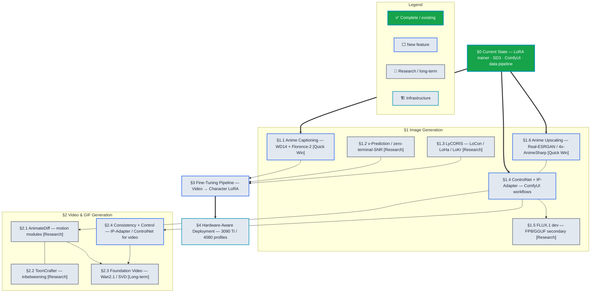

# Content Generation Roadmap — Anime Image & Video

*Created 2026-06-03. Research basis: **[`reports/Image_Generation_Research.md`](../../reports/Image_Generation_Research.md)** (merges all 5 prior generation reports). Scope: local anime image generation, character fine-tuning, and video/GIF generation on RTX 3090 Ti (24 GB) and RTX 4080 (16/12 GB).*

---

## Table of Contents

- [How to Use This Document](#how-to-use-this-document)
- [0. Current State](#0-current-state-what-already-exists)
- [1. Image Generation](#1-image-generation)
- [2. Video & GIF Generation](#2-video--gif-generation)
- [3. Fine-Tuning Pipeline (4K video → character LoRA)](#3-fine-tuning-pipeline-4k-video--character-lora)
- [4. Hardware-Aware Deployment](#4-hardware-aware-deployment)
- [Phased Execution Sequence](#phased-execution-sequence)
- [Effort × Impact Matrix](#effort--impact-matrix)

---

## Implementation Timeline

> **Legend** — *Node fill:* ✅ complete (green) · ⬜ planned (light) — *Node border:* new feature (blue) · augmentation (violet) · research (grey) · infrastructure (cyan) — *Edges:* `==>` critical blocking dependency · `-->` sequential dependency · `-.->` alternative approach · `---` complements

*Reading guide: follow `==>` arrows (thick) for must-have blockers — the §0 current-state infrastructure is the root. Thin `-->` arrows show feature dependencies within phases. Dashed `-.->` marks alternative approaches. Lines without arrowheads (`---`) mark complementary features that share code or benefit from co-deployment.*

---

## How to Use This Document

Each section: current state in the codebase → pain point → options with trade-offs → recommendation. Tags: **[Quick Win]** (<1 day), **[Research]** (prototype first), **[Long-term]** (depends on external data/infra). Phased execution sequence is summarised at the end and mirrored into the [Master Roadmap](../ROADMAP.md).

---

## 0. Current State (what already exists)

The repository already ships a substantial generation stack — this roadmap **extends** it, it is not greenfield.

| Component | Location | State |
|---|---|---|
| **LoRA trainer** | `backend/src/models/lora_diffusion.py` (`LoRATuner`) | SDXL dual-encoder; default base `OnomaAIResearch/Illustrious-XL-v2.0`; SDXL micro-conditioning. Working. |
| **DreamBooth / full FT** | `backend/src/models/full_finetune.py` | Present. |
| **SD3.5 generation** | `backend/src/models/sd3_wrapper.py` (`SD3Wrapper`) | Text-to-image; ControlNet TODO. |
| **ComfyUI integration** | `backend/src/models/comfy_manager.py`, `gui/.../comfy_generate_tab.py` | Server lifecycle + browser launch. |
| **GAN / R3GAN** | `gan.py`, `gan_wrapper.py`, R3GAN tabs | Present. |
| **Data pipeline** | `backend/src/models/data/` — `video_frame_extractor.py`, `captioner.py`, `lora_dataset.py`, `augmentations.py` | Frame extraction, captioning, dataset, augmentation. |
| **GUI tabs** | `gui/src/tabs/models/{gen,train}/` — LoRA train, SD3 gen, ComfyUI gen, GAN/R3GAN | Present. |
| **Training diagnostics** | `backend/src/models/hooks/`, `modules/`, `subnets/` | Hooks present. |

**Gap analysis vs. consolidated research:** the base-model default is right (Illustrious-XL), the trainer is SDXL-aware, the data pipeline exists. Missing: anime-native captioning (WD14/Florence-2), LyCORIS variants, v-prediction/zero-terminal-SNR support, IP-Adapter/ControlNet wiring in the gen tabs, FLUX support, and the entire video-generation capability (AnimateDiff/ToonCrafter).

---

## 1. Image Generation

### 1.1 Anime-native captioning (WD14 + Florence-2) [Quick Win]

**Current:** `captioner.py` exists but captioning quality drives LoRA fidelity.

**Pain point:** Anime LoRAs need booru-tag captions (the base models' native vocabulary), not generic VLM prose. WD14/WD-v3 taggers produce booru tags; Florence-2 adds natural-language context.

**Options.** **A** WD14 ONNX tagger as primary, confidence-thresholded (reuses the §3.6 auto-tagger from `new_features.md`). **B** Florence-2 for caption augmentation. **C** trigger-token + curated-tag schema per character.

**Recommendation:** A+C now (booru tags + trigger token), B as augmentation. Shared with the Auto-Tagger feature — implement once, use in both tagging and training.

### 1.2 v-Prediction / zero-terminal-SNR support [Research]

**Pain point:** NoobAI-vpred and Illustrious-vpred bases use v-prediction + zero-terminal-SNR, which fixes brightness/contrast bias and improves anime's flat saturated palettes and dark scenes. `LoRATuner` must match the base's objective (eps vs v-pred) or output degrades.

**Recommendation:** Detect the base's prediction type and switch the training/sampling objective accordingly. Add v-pred + ztSNR to `LoRATuner` and the SD3/SDXL samplers.

### 1.3 LyCORIS variants (LoCon / LoHa / LoKr) [Research]

**Pain point:** Standard LoRA captures the character but not the conv-layer style; LoCon (`dim 16 / conv 8`) is preferred for style-bound characters, LoHa/LoKr for tiny datasets.

**Recommendation:** Integrate the `lycoris` library into `LoRATuner` as selectable algorithms; expose in the LoRA train tab.

### 1.4 ControlNet + IP-Adapter in generation tabs

**Pain point:** Pose/composition control (ControlNet OpenPose/depth/lineart) and character/style reference (IP-Adapter) are the two highest-leverage controllability features, currently TODO in `sd3_wrapper` and absent from the SDXL gen path.

**Options.** **A** Route control through ComfyUI workflows (the gen tab already launches ComfyUI) — fastest, most flexible. **B** Native diffusers ControlNet/IP-Adapter pipelines in the wrappers — tighter GUI integration, more code.

**Recommendation:** A first (ship a curated set of ComfyUI workflow JSONs: txt2img, pose-control, reference-transfer, upscale), B for the native SDXL gen tab later.

### 1.5 FLUX.1 [dev] secondary support [Research]

**Pain point:** FLUX is the quality king for prompt adherence/text but a poor *primary* anime base (VRAM-heavy, slow to train, thin anime ecosystem). Worth supporting as a secondary model for stylised realism.

**Recommendation:** Add a FLUX wrapper with FP8/GGUF Q8 quantisation for 16 GB; rectified-flow sampler; keep it clearly secondary in the UI.

### 1.6 Anime upscaling stage [Quick Win]

**Pain point:** Generated images and stitched panoramas both want anime-aware SR.

**Recommendation:** Shared `Real-ESRGAN anime_6B` / `4x-AnimeSharp` tiled upscaler module, reused by both the generation tabs and the ASP super-resolution stage (`animation/super_res.py` already exists — unify).

---

## 2. Video & GIF Generation

### 2.1 AnimateDiff motion modules [Research]

**Pain point:** No video generation today. AnimateDiff is the mature, controllable path — a motion module dropped into any SDXL/Illustrious anime checkpoint plus the user's trained character LoRA produces short clips/GIFs without retraining the base.

**Options.** **A** Via ComfyUI (AnimateDiff-Evolved nodes) — minimal new code, leverages existing ComfyUI integration. **B** Native diffusers `AnimateDiffPipeline` — GUI-integrated, more code/VRAM management.

**Recommendation:** A first (curated AnimateDiff workflow JSONs + motion-LoRA presets for pan/zoom). Add context-window/prompt-travel presets for longer clips on 16 GB.

### 2.2 ToonCrafter inbetweening [Research]

**Pain point:** Generative inbetweening between two anime key-frames (large motion gap), and the dual-use ghost-fill for the ASP composite (occlusion completion).

**Recommendation:** ToonCrafter wrapper (shared with ASP `animation/anim_fill.py`); GIF-from-two-keyframes tab feature. Cross-links the generation and stitching pipelines.

### 2.3 Foundation video models (Wan2.1 / SVD) [Long-term]

**Pain point:** Longer, more coherent clips than AnimateDiff need DiT-class foundation models (Wan2.1, SVD), at 24 GB+ or with offloading.

**Recommendation:** 3090 Ti-only feature behind a VRAM gate; Wan2.1 via `diffusion-pipe`; defer until AnimateDiff path is solid.

### 2.4 Consistency & control (IP-Adapter / ControlNet for video)

**Recommendation:** Reuse §1.4 control infrastructure across frames — IP-Adapter for character consistency, ControlNet (OpenPose/depth) for kinematic control, both inside the AnimateDiff ComfyUI workflows.

---

## 3. Fine-Tuning Pipeline (4K video → character LoRA)

This is the flagship cross-cutting capability — it reuses Image-Toolkit's FFmpeg extraction, similarity/dedup, and database.

**Current:** `video_frame_extractor.py`, `lora_dataset.py`, `augmentations.py`, `LoRATuner`, `full_finetune.py` all exist.

**Gaps / steps:**
1. **Scene-aware extraction** — PySceneDetect integration on top of `video_frame_extractor` (deinterlaced, full-res, exact-PTS).
2. **Curation & dedup** — reuse `SimilarityFinder` (phash/SSIM) to drop blur/dupes; pose/expression balancing.
3. **Captioning** — §1.1 WD14 + Florence-2 + trigger-token schema.
4. **Per-GPU training configs** — TOML presets: `illustrious_character_4080_16gb.toml`, `noobai_vpred_3090ti_24gb.toml`.
5. **Diagnostics** — loss/grad-norm curves, periodic validation-image sampling, weight-norm viz (extend `hooks/`).
6. **DeepSpeed ZeRO-2** for full-checkpoint FT on the 3090 Ti.

**Recommendation:** Wire these into a single "Train Character LoRA from Video" guided flow in the LoRA train tab — the concrete user-facing feature that distinguishes Image-Toolkit (it already has the video + database halves).

---

## 4. Hardware-Aware Deployment

| GPU | Profile | Capabilities |
|---|---|---|
| **RTX 3090 Ti (24 GB)** | Full-fidelity desktop | Full 1024² batch 2–4 LoRA; DreamBooth; full-FT (ZeRO-2); Wan2.1; AnimateDiff long clips. |
| **RTX 4080 (16 GB)** | Constrained desktop | 1024² batch 1–2 + grad-checkpoint LoRA; FLUX FP8/GGUF; AnimateDiff with context windows. |
| **RTX 4080 mobile (12 GB)** | Constrained laptop | 1024² batch 1 + grad-checkpoint; fp8 everything; short AnimateDiff only. |

Env managed via `uv`. VRAM gating in the UI (disable features that won't fit the detected GPU).

---

## Phased Execution Sequence

| Phase | Items | Effort |
|---|---|---|
| **CG-1 (Quick Wins)** | 1.1 WD14+Florence-2 captioning · 1.6 shared anime upscaler · 1.4A ComfyUI control workflows | days |
| **CG-2 (Core)** | 3.x video→LoRA guided flow · 1.3 LyCORIS · 2.1A AnimateDiff via ComfyUI | 1–2 wk/item |
| **CG-3 (Quality)** | 1.2 v-pred/ztSNR · 2.2 ToonCrafter inbetween · 1.4B native ControlNet/IP-Adapter | 1–2 wk/item |
| **CG-4 (Advanced)** | 1.5 FLUX secondary · 2.3 Wan2.1/SVD foundation video · DeepSpeed full-FT | research |

Dependencies: CG-1 captioning unblocks CG-2 training quality; CG-1 upscaler shared with ASP; 2.2 ToonCrafter shared with ASP ghost-fill (`animation/anim_fill.py`). The video→LoRA flow (3.x) is the highest-value differentiator and should lead CG-2.

---

## Effort × Impact Matrix

*Effort* — **Low**: < 1 day · **Medium**: 1 day – 1 week · **High**: 1 – 2 weeks · **Very High**: 2+ weeks or research prototype
*Impact* — **Low**: marginal · **Medium**: noticeable quality/UX improvement · **High**: major capability unlock · **Very High**: differentiating feature unavailable in comparable tools

| **Effort ↓ / Impact →** | Low | Medium | High | Very High |
|---|---|---|---|---|
| **Low (<1d)** | — | §1.6 shared anime upscaler (unifies gen + ASP upscale path) | §1.1 WD14+Florence-2 captioning · §1.4A ComfyUI control workflows (curated JSONs) | — |
| **Medium (1d–1w)** | — | §1.5 FLUX.1 FP8 secondary support | §1.2 v-pred/zero-terminal-SNR · §1.3 LyCORIS (LoCon/LoHa/LoKr) · §2.1A AnimateDiff via ComfyUI · §2.2 ToonCrafter inbetweening | §3.x Video→LoRA guided flow (scene extract + curate + caption + train) |
| **High (1–2w)** | — | §2.3 Wan2.1/SVD foundation video (3090 Ti only) | §1.4B native ControlNet/IP-Adapter in SDXL gen tab | §2.4 IP-Adapter + ControlNet video consistency |
| **Very High (2w+)** | — | — | §3.6 DeepSpeed ZeRO-2 full-checkpoint FT | §3.x full video→LoRA pipeline (end-to-end trained character from 4K source) |
