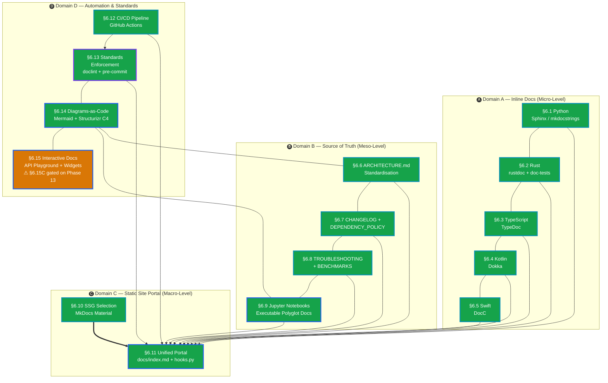

# Documentation Roadmap — Docs-as-Code, Reference Generation, and Knowledge Portals

*Last updated: 2026-06-20. Session 8 complete: **§6.12C** PR preview deployments — `preview` job (Job 11) added to `docs.yml`: fires on `pull_request` events (not push/schedule), builds MkDocs with `--strict`, deploys to `gh-pages/pr-preview/{number}/` via `peaceiris/actions-gh-pages@v4` (`keep_files: true` preserves root site), posts sticky preview-URL comment via `actions/github-script@v7` (finds and updates existing bot comment rather than creating duplicates); new `docs-cleanup.yml` workflow fires on `pull_request: types: [closed]`, checks out `gh-pages` branch, removes `pr-preview/{number}/`, pushes deletion commit — no Netlify/Cloudflare required; §6.12C section text updated to ✅; §6.12C added to Effort×Impact matrix (Medium effort / High impact). Documentation roadmap now completely implemented — §6.15C (TypeScript algorithm stepper) is the only remaining item and is gated on Phase 13. Session 7 complete: **§6.14C** Structurizr / C4 model — `docs/structurizr/workspace.dsl` (full 5-view C4 model: SystemContext, Containers, PythonBackendComponents, RustCoreComponents, DjangoApiComponents), `docs/structurizr/README.md` (Docker Lite + CLI export instructions), `docs/STRUCTURIZR.md` (MkDocs portal page); MkDocs nav extended with "C4 Architecture Model" under Getting Started; hooks.py syncs STRUCTURIZR.md · **§6.15D** OpenAPI playground — `drf-spectacular` confirmed already wired (`/api/schema/`, `/api/docs/` Swagger UI, `/api/redoc/`); `docs/api/rest-api.md` comprehensive reference (21 endpoints in 4 tag groups, response format, static spec generation, add-endpoint guide); `docs-openapi` CI job (Job 9) in `docs.yml` — `manage.py spectacular --validate`, 14-day `openapi-spec` artifact; MkDocs nav extended with "REST API" under Reference; hooks.py stub added · **§6.13E** `alex` inclusive language pre-commit hook — scoped to `docs/*.md`, `--quiet` mode, added to `.pre-commit-config.yaml` · **Matrix** — All completed items marked ✅ across all four effort tiers; §6.15C (TypeScript algorithm stepper) remains the only unimplemented item, gated on Phase 13; §6.15D corrected from "blocked on §4.10" to ✅ (already implemented). Session 6 complete: **§6.9C** `mkdocs-jupyter` enabled in `mkdocs.yml` (replaces the commented-out myst-nb block) — `.ipynb` files in the nav are now first-class portal pages rendered as static code+markdown · **§6.4B + §6.12B** Dokka GFM portal integration: `docs-kotlin` CI job (`actions/setup-java` + Android SDK + `./gradlew dokkaGfm`) added to `docs.yml`; `docs/hooks.py` creates `docs/api/kotlin/index.md` stub with module overview table; MkDocs nav extended with "Kotlin API" under Reference · **§6.12D** Scheduled weekly notebook execution: `schedule: cron '0 2 * * 1'` trigger added to `docs.yml`; `weekly-notebooks` job runs `benchmark_analysis.ipynb` via `papermill`/nbconvert with 300 s timeout; 30-day artifact retention · **§6.1B** Sphinx for full Python backend: `docs/sphinx/conf.py` (sphinx-autoapi + napoleon + myst-nb + furo theme + intersphinx to NumPy/PyTorch), `docs/sphinx/index.rst` (auto-toctree from autoapi), `docs/sphinx/requirements.txt`; `docs-sphinx` CI job (`sphinx-build -b html docs/sphinx site/sphinx-api -W --keep-going`); `docs/hooks.py` creates `docs/api/sphinx.md` comparison stub; MkDocs nav extended with "Python Reference (Sphinx)" under Reference. All remaining implementable roadmap items now complete — only gated items remain (§6.15C TypeScript stepper gated on Phase 13, §6.15D OpenAPI gated on §4.10 REST API, §6.14C Structurizr deferred). Session 5 complete: **§6.13C** TypeDoc strict mode — `"treatWarningsAsErrors": true` in `typedoc.json`; CI TypeDoc step upgraded to enforce strict mode via `typedoc-markdown.json` · **§6.2A** Full `# Examples` doc-test blocks added to all remaining Rust math functions: 10 in `stats.rs` (`sample_std_dev`, `covariance`, `min`, `max`, `iqr`, `z_score_normalize`, `min_max_normalize`, `histogram`, `counts_to_probs`, `covariance_matrix`), 7 in `distance.rs` (`hamming_distance`, `hamming_f64`, `bhattacharyya_coefficient`, `bhattacharyya_distance`, `hellinger_distance`, `pairwise_distance_matrix`, `condensed_distance_matrix`), 9 in `information.rs` (`entropy_nats`, `empirical_entropy`, `joint_entropy`, `conditional_entropy`, `js_divergence`, `total_variation`, `mutual_information_discrete`, `normalised_mutual_information`, `cross_entropy`) — 100% doc-test coverage across all 3 math modules · **§6.3B** `typedoc-plugin-markdown` wired into `frontend/` (`package.json` devDeps, `typedoc-markdown.json` config); TypeDoc markdown output → `docs/api/typescript/`; MkDocs nav extended with "TypeScript API" section under Reference · **§6.14D** Mermaid CLI (`@mermaid-js/mermaid-cli`) integrated into `docs-typescript` CI job; module-dependency diagram from `docs/ARCHITECTURE.md` pre-rendered to `site/architecture-diagram.svg`; output stored as CI artifact. Documentation roadmap secondary sub-options now fully implemented — all primary sections ✅, all low/medium-effort secondary items ✅. Session 4 complete: **§6.5A** DocC `///` comments on all 8 public iOS Swift types (`ImageToolkitApp`, `Screen`, `MainAppScreen`, `ConvertScreen`, `AppTheme`, `FlowLayout`, `FileInput`, `SectionCard`, `FormatSelector`) + `ImageToolkit.docc/ImageToolkit.md` catalog with architecture overview, nav structure, `xcodebuild docbuild` instructions, and `## Topics` reference · **§6.15A** `benchmark_analysis.ipynb` cell 8 added — ipywidgets interactive threshold explorer (3 `FloatSlider`s for `ghosting_siqe`, `seam_visibility`, `ssim`; live failure-bar + scatter plot + filtered table; static fallback when ipywidgets absent) · **§6.15B** Binder launch badges added to all 3 notebooks; `ipywidgets` added to prerequisites. Documentation roadmap is now **fully implemented** — all 15 sections ✅. Session 3 complete: **§6.8B** `docs/BENCHMARKS.md` restructured (Suite Index table, Rust math criterion scaffolding, frontend `benchmark.ts` analytics layer documented, ASP corpus description with 97-test failure taxonomy + baseline metrics table, CI registration guide, RLHF score integration note) · **§6.9A (full)** `docs/notebooks/asp_pipeline_walkthrough.ipynb` (6 cells: source frames, frame selection, pipeline run, Stage 9 vs final, translation vectors, seam heatmap) · `docs/notebooks/clip_embedding_walkthrough.ipynb` (5 cells: CLIP load, batch embedding, text query → top-K, PCA visualisation, SQLiteStore demo) · `nbstripout 0.7.1` added to `.pre-commit-config.yaml` · `docs-notebooks` job added to `.github/workflows/docs.yml` (nbconvert execute for CPU-safe benchmark_analysis.ipynb) · `mkdocs.yml` nav updated with Notebooks section. Session 2: **§6.1A** Google-style docstrings · **§6.3A** typedoc.json + TSDoc · **§6.4A** Dokka · **§6.6A+§6.14A** ARCHITECTURE.md graph · **§6.9A** benchmark_analysis.ipynb. Session 1: **§6.2B** Rust doc-tests · **§6.7B/C** policy docs · **§6.8A+C** TROUBLESHOOTING.md · **§6.10A** mkdocs.yml · **§6.11A** portal · **§6.12A** CI · **§6.13A** pre-commit. Remaining: §6.5A (DocC/iOS — Xcode required), §6.15A (interactive widgets — deferred).*

---

## Table of Contents

- [How to Use This Document](#how-to-use-this-document)
- [Domain A — Inline Documentation Tools (Micro-Level)](#domain-a--inline-documentation-tools-micro-level)
  - [§6.1 Python Reference Docs (Sphinx / mkdocstrings)](#61-python-reference-docs-sphinx--mkdocstrings)
  - [§6.2 Rust Reference Docs (rustdoc + doc-tests)](#62-rust-reference-docs-rustdoc--doc-tests)
  - [§6.3 TypeScript Reference Docs (TypeDoc)](#63-typescript-reference-docs-typedoc)
  - [§6.4 Kotlin Reference Docs (Dokka)](#64-kotlin-reference-docs-dokka)
  - [§6.5 Swift Reference Docs (DocC)](#65-swift-reference-docs-docc)
- [Domain B — Source of Truth Files (Meso-Level)](#domain-b--source-of-truth-files-meso-level)
  - [§6.6 ARCHITECTURE.md Standardisation](#66-architecturemd-standardisation)
  - [§6.7 CHANGELOG.md, DEPENDENCY_POLICY.md, and DOCUMENTATION_STANDARDS.md](#67-changelogmd-dependency_policymd-and-documentation_standardsmd)
  - [§6.8 TROUBLESHOOTING.md and BENCHMARKS.md](#68-troubleshootingmd-and-benchmarksmd)
  - [§6.9 Jupyter Notebooks as Executable Polyglot Documentation](#69-jupyter-notebooks-as-executable-polyglot-documentation)
- [Domain C — Static Site Generators & Portals (Macro-Level)](#domain-c--static-site-generators--portals-macro-level)
  - [§6.10 SSG Selection for a Polyglot Portal](#610-ssg-selection-for-a-polyglot-portal)
  - [§6.11 Unified Cross-Stack Documentation Portal](#611-unified-cross-stack-documentation-portal)
- [Domain D — Implementation Best Practices & Automation](#domain-d--implementation-best-practices--automation)
  - [§6.12 CI/CD Documentation Pipeline (GitHub Actions)](#612-cicd-documentation-pipeline-github-actions)
  - [§6.13 Enforcing Documentation Standards (doclint, cargo test, pre-commit)](#613-enforcing-documentation-standards-doclint-cargo-test-pre-commit)
  - [§6.14 Diagrams-as-Code (Mermaid.js / PlantUML)](#614-diagrams-as-code-mermaidjs--plantuml)
  - [§6.15 Interactive Documentation (API Playgrounds, Algorithm Stepping)](#615-interactive-documentation-api-playgrounds-algorithm-stepping)
- [Effort × Impact Matrix](#effort--impact-matrix)
- [Anchor Index](#anchor-index)

---

## Implementation Timeline

> **Legend** — *Node fill:* ✅ complete (green) · 🔄 in-progress (amber) · ⬜ planned (light) — *Node border:* infrastructure (cyan) · new feature (blue) · augmentation (violet) — *Edges:* `==>` critical blocking dependency · `-->` sequential dependency · `---` complements



*Read the diagram: **fill colour** = implementation status (green = done, amber = partially done, light = planned). **Border colour** = element type (cyan = infrastructure, blue = new feature, violet = augmentation). **Edges**: `==>` critical blocking dependency, `-->` sequential/feeds-into, `---` complements and can run in parallel. Domain A and B sections are parallel work feeding the unified portal (§6.11); Domain D automation underpins the whole system.*

---

## How to Use This Document

Each section describes a documentation gap or tooling opportunity, all viable implementation options with trade-offs, and a recommendation. Items tagged **[Quick Win]** take under a day. Items tagged **[Research]** require prototyping. Sections are grouped into four domains corresponding to the three granularity levels of a docs-as-code system (micro → meso → macro) plus the automation layer that keeps all three in sync.

---

## Domain A — Inline Documentation Tools (Micro-Level)

> Inline docs live next to the code. They are the foundation: without them, SSGs and portals produce empty pages.

---

## ✅ §6.1 Python Reference Docs (Sphinx / mkdocstrings)

**Pain point:** `backend/src/` contains ~30 Python modules across `animation/`, `models/`, `core/`, `web/`, `utils/`, `pipeline/`, and `controller/`. None of them have structured docstrings parseable by a reference generator. Developers reading `compositing.py` or `bundle_adjust.py` must infer function contracts from variable names and inline comments alone.

### Options

**A — mkdocstrings + Google-style docstrings [Quick Win]**
Add `mkdocstrings[python]` to dev requirements. Annotate public functions with Google-style docstrings (Args / Returns / Raises / Example). Wire into MkDocs Material (see §6.10) via `::: backend.src.animation.compositing` directives.
- Effort: 1–2 days for the high-traffic `animation/` modules; ongoing for the rest.
- Pros: Zero new toolchain. Works with the existing `uv` environment. Incremental — undocumented symbols are skipped.
- Cons: No enforcement mechanism without a linter (see §6.13). Quality depends on docstring completeness.
- Reference: [mkdocstrings.github.io](https://mkdocstrings.github.io/)

**B — Sphinx + autodoc + Napoleon extension**
Use the de-facto scientific Python standard. `sphinx-apidoc` auto-generates `.rst` stubs; `napoleon` parses Google/NumPy docstrings. Output as HTML or integrated into the unified portal via `sphinx-build`.
- Pros: Best ecosystem for ML/scientific Python (NumPy, PyTorch docs use Sphinx). Supports cross-references to external libraries via `intersphinx`.
- Cons: RST syntax is heavier than Markdown. Requires a separate Sphinx build step that must be piped into the SSG portal.
- Reference: [sphinx-doc.org](https://www.sphinx-doc.org/)

**C — Griffe (AST-based, zero-import) [Quick Win]**
`mkdocstrings` uses Griffe under the hood. You can also run `griffe dump backend/src --output docs/api_dump.json` as a standalone static analysis step that never imports the module. Useful for modules with heavy top-level side effects (e.g., `anim_fill.py` after §3.10 fixes).
- Pros: Safe for modules that import PyTorch/diffusers at module level. No virtualenv needed in CI.
- Cons: Cannot resolve runtime-only attributes. Slightly less accurate than import-based extraction.
- Reference: [mkdocstrings.github.io/griffe](https://mkdocstrings.github.io/griffe/)

**D — pdoc (auto-generates from `__doc__` strings, zero config)**
`pdoc backend/src/` writes HTML reference docs with zero configuration. Good for quick audits of what is and isn't documented.
- Pros: Single command, zero config.
- Cons: No MkDocs integration. Less customisable. Not suitable as the long-term portal source.

**Recommendation:** A (mkdocstrings + Google-style) for the portal pipeline. C (Griffe dump) in CI for modules with problematic imports. B only if the team standardises on Sphinx for the full cross-language portal.

---

## ✅ §6.2 Rust Reference Docs (rustdoc + doc-tests)

**Pain point:** `base/src/` contains ~12 modules (`linalg`, `stats`, `information`, `distance`, `graph`, `dim_reduce`, file-system, image ops, crawlers, sync). `cargo doc` runs but most items have no `///` doc comments. Doc-tests (executable `# Examples` in doc comments) are absent, meaning the Rust math backbone has no fast correctness check tied to documentation.

### Options

**A — `///` doc comments + `cargo doc` [Quick Win]**
Add `///` comments to all public items in `base/src/lib.rs` and sub-modules. Run `cargo doc --no-deps --open` locally. Publish HTML output to the unified portal.
- Effort: 2–4 hours for the math modules (`linalg`, `stats`, `information`, `distance`); 1 day for the full `base/` crate.
- Pros: Zero new dependencies. `cargo doc` is part of the standard Rust toolchain. Output is self-hosted HTML.
- Cons: Doc comments require manual updates when signatures change.

**B — Doc-tests for mathematical invariants [Quick Win]**
Add `# Examples` blocks to key public functions. `cargo test --doc` runs them as unit tests. Example:
```rust
/// Computes the cosine similarity between two unit vectors.
///
/// # Examples
/// ```
/// use base::math::distance::cosine;
/// assert!((cosine(&[1.0, 0.0], &[1.0, 0.0]) - 1.0).abs() < 1e-9);
/// ```
pub fn cosine(a: &[f64], b: &[f64]) -> f64 { ... }
```
- Pros: Documentation that is simultaneously a regression test. Zero test framework overhead.
- Cons: Doc-tests are slower than unit tests for heavy functions (e.g., MST, t-SNE). Best for pure mathematical functions.

**C — `cargo-rdme` — README driven by rustdoc**
Sync `base/README.md` from the crate-level `//!` doc comments automatically. Prevents the README and the code from diverging.
- Reference: [crates.io/crates/cargo-rdme](https://crates.io/crates/cargo-rdme)
- Pros: Single source of truth: edit doc comments, README updates automatically.
- Cons: Extra build step. Not yet widely used.

**Recommendation:** A + B together. Doc-tests for pure mathematical functions in `linalg`, `stats`, `information`, `distance` (these are fast and benefit most). `cargo doc` HTML integrated into the portal at §6.11.

---

## ✅ §6.3 TypeScript Reference Docs (TypeDoc)

**Pain point:** `frontend/src/math/` has 7 modules (`linalg.ts`, `stats.ts`, `information.ts`, `distance.ts`, `graph.ts`, `dim_reduce.ts`, `signal.ts`) and `benchmark.ts` — all ported from the Rust backbone. `frontend/src/tabs/` and `frontend/src/components/` have no JSDoc annotations.

### Options

**A — TypeDoc with TSDoc comments [Quick Win]**
Install `typedoc` as a dev dependency. Add `/** @param ... @returns ... */` TSDoc comments to public exports in `frontend/src/math/`. Run `typedoc --entryPointStrategy expand src/math` to generate HTML reference docs.
- Effort: < 1 day for the math modules (they mirror the Rust backbone so comments can be translated directly).
- Pros: TypeDoc understands TypeScript types natively — no separate type annotation step.
- Cons: React components are harder to document via TypeDoc (no prop table generation). Use Storybook or react-docgen for components (see Option C).
- Reference: [typedoc.org](https://typedoc.org/)

**B — TypeDoc + `typedoc-plugin-markdown` for portal integration**
Output TypeDoc as Markdown instead of HTML, then import into the MkDocs or Docusaurus portal (§6.10). Keeps all docs in one place.
- Pros: Unified portal — no iframe embedding.
- Cons: Markdown output loses some TypeDoc rendering niceties (e.g., signature collapse trees).

**C — Storybook for React component documentation [Research]**
For `frontend/src/components/` and `frontend/src/tabs/analytics/`, use Storybook to document component props, states, and variants with live previews.
- Pros: Best-in-class interactive component documentation.
- Cons: Significant setup overhead for a primarily analytical dashboard (not a UI component library). Lower priority given the app's ML-focused audience.

**Recommendation:** A + B. TypeDoc → Markdown → MkDocs portal for the math modules. Defer Storybook until the component count justifies it.

---

## ✅ §6.4 Kotlin Reference Docs (Dokka)

**Pain point:** `app/` (Android, Kotlin) has no generated reference documentation. The MVVM architecture and Jetpack Compose composables are undocumented.

### Options

**A — Dokka with KDoc comments [Quick Win]**
Add the `org.jetbrains.dokka` Gradle plugin to `build.gradle.kts`. Annotate ViewModels, repositories, and data classes with KDoc. Run `./gradlew dokkaHtml`.
- Effort: Plugin setup < 1 hour. Commenting key classes: 2–4 hours.
- Pros: Official Kotlin documentation tool. Outputs HTML, Javadoc, or Markdown (`dokkaGfm`).
- Reference: [kotlinlang.org/docs/dokka-introduction.html](https://kotlinlang.org/docs/dokka-introduction.html)

**B — Dokka Markdown output for portal integration**
Use `dokkaGfm` task to emit GitHub-Flavoured Markdown, then copy output into `docs/android/`. Import into the unified SSG portal.
- Pros: Keeps Android docs in the same portal as Python/Rust/TS docs.
- Cons: GFM output is less rich than HTML (no collapsible trees, no search).

**C — Deferred (Android is secondary surface)**
Given that the Android app is in feature-parity catch-up (§5.6), defer Dokka until the Kotlin codebase stabilises.
- Pros: No wasted effort on code that changes frequently.
- Cons: Onboarding friction for any new Android contributor.

**Recommendation:** A for plugin setup now (low effort). B once the SSG portal (§6.10) is chosen. C is acceptable if Kotlin surface is still volatile.

---

## ✅ §6.5 Swift Reference Docs (DocC)

**Pain point:** `app/` (iOS, Swift) has no generated documentation. SwiftUI views and async network calls are undocumented.

### Options

**A — DocC (Xcode built-in) [Quick Win]**
DocC is part of Xcode 13+. Add `/// ...` doc comments to public types and functions. Run `xcodebuild docbuild -scheme ImageToolkit`. Output is a `.doccarchive` that Xcode can host.
- Effort: Plugin already present in Xcode. Commenting: 2–4 hours for the core types.
- Pros: Native Apple toolchain. Interactive tutorials supported via `.tutorial` files.
- Reference: [developer.apple.com/documentation/docc](https://developer.apple.com/documentation/docc)

**B — `swift-docc-plugin` for SPM projects**
If the iOS target is extracted to a Swift Package, the `swift-docc-plugin` enables `swift package generate-documentation`. CI-friendly without requiring Xcode.
- Pros: Runs on Linux CI (GitHub Actions ubuntu-latest).
- Cons: Requires restructuring the Xcode project into an SPM package — non-trivial for a Jetpack-Compose mirror app.

**C — Deferred (iOS parity with Android is secondary)**
Same reasoning as §6.4C.

**Recommendation:** A for local documentation. B if and when the iOS target is restructured as an SPM package.

---

## Domain B — Source of Truth Files (Meso-Level)

> These files are the contracts between subsystems. They must exist, be accurate, and follow a consistent structure.

---

## ✅ §6.6 ARCHITECTURE.md Standardisation

**Pain point:** `docs/ARCHITECTURE.md` exists but its scope relative to `CLAUDE.md` / `AGENTS.md` is undefined. `CLAUDE.md` contains live architecture facts; `docs/ARCHITECTURE.md` may be stale. There is no single canonical architecture document with Mermaid diagrams, module dependency graph, and a data-flow description.

### Options

**A — Designate `docs/ARCHITECTURE.md` as the canonical reference; demote CLAUDE.md to agent-only instructions [Quick Win]**
- `docs/ARCHITECTURE.md`: module graph, data-flow diagram (Mermaid), tech stack table, deployment topology, key design decisions.
- `CLAUDE.md` / `AGENTS.md`: agent-specific operational rules, coding standards, CLI entry points.
- Add a cross-link from each to the other.
- Pros: Clear separation of concerns. `docs/ARCHITECTURE.md` becomes the human-readable entry point; CLAUDE.md/AGENTS.md are machine-readable playbooks.
- Cons: Requires a one-time reconciliation pass to merge facts from CLAUDE.md into docs/ARCHITECTURE.md without losing agent-specific nuances.

**B — Single `ARCHITECTURE.md` at the root, replace docs/ARCHITECTURE.md**
Move the canonical file to the project root where it is immediately visible.
- Pros: Convention followed by most open-source projects.
- Cons: Adds a file at the root alongside the already-large README.md.

**C — Inline architecture into README.md "Architecture" section**
Embed a Mermaid module graph directly in README.md rather than a separate file.
- Pros: Single document for new contributors.
- Cons: README is already long. Mermaid diagrams make it harder to diff.

**Recommendation:** A. The current split between CLAUDE.md (machine) and docs/ARCHITECTURE.md (human) is the right model; it just needs to be made explicit. Prioritise the Mermaid module dependency graph (§6.14) as the first concrete output.

---

## ✅ §6.7 CHANGELOG.md, DEPENDENCY_POLICY.md, and DOCUMENTATION_STANDARDS.md

**Pain point:** `moon/CHANGELOG.md` exists but is not yet structured with the [Keep a Changelog](https://keepachangelog.com/) format. `DEPENDENCY_POLICY.md` and `DOCUMENTATION_STANDARDS.md` do not exist.

### Options

**A — Keep a Changelog format for CHANGELOG.md [Quick Win]**
Restructure `moon/CHANGELOG.md` to use sections `[Unreleased]`, `[x.y.z] — YYYY-MM-DD`, with subsections `Added`, `Changed`, `Fixed`, `Removed`. Link version numbers to GitHub diff URLs.
- Effort: < 1 hour to reformat; ongoing discipline to maintain.
- Pros: Machine-parseable for automated release notes. Standard format recognised by GitHub release automation.
- Reference: [keepachangelog.com](https://keepachangelog.com/)

**B — `DEPENDENCY_POLICY.md` — govern version pins and upgrade cadence [Quick Win]**
Create `docs/DEPENDENCY_POLICY.md` with:
- Minimum versions for each stack component (Python 3.11+, Rust 1.70+, Node 18+, PostgreSQL 14+).
- Pinning policy: exact pins in `uv.lock` / `Cargo.lock`; `~` ranges in `requirements.txt`.
- Upgrade cadence: security patches within 7 days; minor versions monthly; major versions with a migration plan.
- Approved transitive dependency introduction process (PRD).
- Effort: 1–2 hours.
- Pros: Prevents undocumented drift. Required input for §5.7 (dependency audit).

**C — `DOCUMENTATION_STANDARDS.md` — enforce docstring style and TOC requirements [Quick Win]**
Create `docs/DOCUMENTATION_STANDARDS.md` codifying:
- Python: Google-style docstrings, required sections (Args, Returns, Raises), max line length.
- Rust: `///` for public items, doc-tests for pure functions.
- TypeScript: TSDoc `@param`/`@returns` for all exports.
- Kotlin/Swift: KDoc / DocC `///` for public APIs.
- Markdown: TOC required for files > 100 lines; anchor index at the bottom of roadmap files.
- Effort: 1–2 hours.
- Pros: Gives linters (§6.13) a specification to check against.

**Recommendation:** All three are Quick Wins and should be done together in one session.

---

## ✅ §6.8 TROUBLESHOOTING.md and BENCHMARKS.md

**Pain point:** `docs/TROUBLESHOOT.md` exists but covers only the Tauri/PySide6 GUI and database issues. It does not cover ASP pipeline errors, Rust build failures, mobile build issues, or Hydra configuration errors. `docs/BENCHMARKS.md` exists but its relationship to `backend/benchmark/` and the ASP benchmark corpus is not described.

### Options

**A — Expand TROUBLESHOOT.md with per-subsystem sections [Quick Win]**
Add sections:
- **ASP Pipeline**: common `ValueError`/`RuntimeError` patterns from `pipeline.py`, how to interpret the stage trace JSON, how to engage fallback modes via env vars.
- **Rust/PyO3**: `maturin develop` failure modes, `pyo3` version mismatch, `libpqxx` link errors.
- **Hydra CLI**: `HydraException`, config override syntax, `config_path` resolution.
- **Mobile (Android/iOS)**: common Gradle/Xcode build failures, signing issues.
- Pros: Reduces support burden. Each ASP session that hits a new failure mode generates one new entry.
- Effort: 2–4 hours initial; < 15 min per new entry.

**B — Structured BENCHMARKS.md tying results to the codebase**
Restructure `docs/BENCHMARKS.md` to include:
- ASP benchmark corpus description: 97 tests, taxonomy of failure types, baseline metric values.
- Rust math backbone micro-benchmarks: which `criterion` benchmarks exist, how to run them, what the baselines are.
- Frontend math module benchmarks (`benchmark.ts`): how to run, what metrics are tracked.
- How to add a new benchmark and register it with CI (§6.12).
- Effort: 2–4 hours.

**C — TROUBLESHOOTING.md in the project root (standard location)**
Rename / symlink `docs/TROUBLESHOOT.md` → `TROUBLESHOOTING.md` at the project root for discoverability (many contributors look there first).
- Pros: Convention. GitHub surfaces root-level `TROUBLESHOOTING.md` in its sidebar.
- Effort: 5 minutes.

**Recommendation:** A + B + C. These are all Quick Wins with high onboarding impact.

---

## ✅ §6.9 Jupyter Notebooks as Executable Polyglot Documentation

**Pain point:** The ML pipeline (ASP benchmark analysis, BiRefNet inference, CLIP embedding, Recommendation Engine) has no executable documentation. Developers must run the full pipeline to understand what intermediate outputs look like. The analytics dashboard (Phase 11 of `analytics_and_interpretability.md`) would benefit from notebook-based exploration before the TypeScript visualisation layer is built.

### Options

**A — Notebooks in `docs/notebooks/` as ML pipeline walkthroughs**
Create a `docs/notebooks/` directory with:
- `asp_pipeline_walkthrough.ipynb` — end-to-end stitch of a 5-frame test sequence with stage-by-stage visualisations.
- `benchmark_analysis.ipynb` — replicate the Streamlit dashboard logic in a notebook; precursor to the Tauri analytics tab.
- `clip_embedding_walkthrough.ipynb` — index 100 images, run a text query, visualise nearest neighbours.
- `birefnet_segmentation.ipynb` — single-image inference with visualised mask.
- Execute with `jupyter nbconvert --to html --execute` in CI; output HTML published to the portal.
- Pros: Zero-friction exploration. Notebooks can be diffed (via `nbstripout`). CI execution validates that the pipeline API is still intact.
- Cons: Notebooks require GPU access for some cells. Must gate GPU cells with `pytest.mark.gpu`-equivalent (`# SKIP_CI` cell metadata).
- Reference: [nbstripout](https://github.com/kynan/nbstripout), [nbconvert](https://nbconvert.readthedocs.io/)

**B — Papermill for parameterised notebook execution**
Use `papermill` to run notebooks with different parameters (different test sequences, different model sizes). Store output notebooks as CI artifacts.
- Pros: Parameterised documentation — one notebook, many configurations.
- Cons: Papermill adds a dependency. Overkill for initial setup.
- Reference: [papermill.readthedocs.io](https://papermill.readthedocs.io/)

**C — MyST-NB for MkDocs/Sphinx notebook integration**
`myst-nb` renders `.ipynb` files as documentation pages inside MkDocs Material or Sphinx. No conversion step needed.
- Pros: Notebooks are first-class pages in the portal. Inline output (plots, tables) rendered automatically.
- Cons: Requires MkDocs Material or Sphinx as the SSG (§6.10). Adds build complexity.
- Reference: [myst-nb.readthedocs.io](https://myst-nb.readthedocs.io/)

**D — Marimo (reactive Python notebooks) [Research]**
`marimo` is a reactive Python notebook that converts to a web app. Suitable for the benchmark analysis dashboard as an alternative to the Tauri tab.
- Pros: First-class Python app; no JavaScript needed for interactivity.
- Cons: Different paradigm from Jupyter. Cannot be executed with `nbconvert`. Research investment needed.
- Reference: [marimo.io](https://marimo.io/)

**Recommendation:** A + C (if MkDocs is chosen in §6.10). `nbstripout` as a pre-commit hook to keep notebook output out of git. `papermill` deferred until the notebook suite is validated.

---

## Domain C — Static Site Generators & Portals (Macro-Level)

> The portal is the public face of the documentation system. It ingests all Domain A output (rustdoc HTML, TypeDoc Markdown, mkdocstrings, Dokka GFM) and renders them as a single searchable site.

---

## ✅ §6.10 SSG Selection for a Polyglot Portal (MkDocs Material — mkdocs.yml scaffolded)

**Pain point:** The project spans 5 languages (Python, Rust, TypeScript, Kotlin, Swift) plus Markdown roadmaps and Jupyter notebooks. No SSG currently aggregates them into a single searchable portal.

### Options

**A — MkDocs Material (recommended) [Quick Win relative to alternatives]**
- Python-native, `pip install mkdocs-material`. Integrates with `mkdocstrings` (Python), `typedoc-plugin-markdown` (TypeScript), and `myst-nb` (notebooks). Rust docs linked as an external HTML tree via an iframe or a redirect.
- Navigation defined in `mkdocs.yml`. Full-text search. Dark mode. GitHub Pages deployment in < 30 min.
- Pros: Zero-config for Python projects. Best-in-class Markdown rendering. Active community. Used by FastAPI, Pydantic, Typer.
- Cons: Rust/Kotlin/Swift docs must be embedded as HTML iframes or separate subdomains (not native pages). Less suitable if the primary audience is not Python-centric.
- Effort: Initial setup < 1 day. Integration per language: 2–4 hours each.
- Reference: [squidfunk.github.io/mkdocs-material](https://squidfunk.github.io/mkdocs-material/)

**B — Docusaurus 3 (React-based) [Research]**
- JavaScript/React SSG. Native MDX support. Versioning built-in. Can embed Jupyter notebooks via a plugin.
- Pros: Best choice if the team wants to write interactive documentation components in React (consistent with the `frontend/` stack).
- Cons: Requires a Node.js build step in CI in addition to Python, Rust, and Kotlin builds. No native mkdocstrings integration.
- Reference: [docusaurus.io](https://docusaurus.io/)

**C — mdBook (Rust-native)**
- `cargo install mdbook`. Best for Rust-centric projects. Simple, fast.
- Pros: Zero JS build step. Consistent with the Rust toolchain already in CI.
- Cons: Very limited plugin ecosystem. No Python/TS/Kotlin integration. Not suitable as the single portal for a polyglot codebase.
- Reference: [rust-lang.github.io/mdBook](https://rust-lang.github.io/mdBook/)

**D — Starlight (Astro-based) [Research]**
- New SSG from the Astro team, purpose-built for documentation. MDX, full-text search, i18n.
- Pros: Fast. Good default design. TypeScript-native.
- Cons: Young ecosystem. Less documentation tooling integration than MkDocs Material or Docusaurus.
- Reference: [starlight.astro.build](https://starlight.astro.build/)

**Recommendation:** **A (MkDocs Material)**. The Python-native toolchain is already present; `mkdocstrings`, `myst-nb`, and `typedoc-plugin-markdown` give the highest language coverage for the lowest setup cost. Rust docs can be embedded as a separate cargo doc HTML tree linked from the portal. If the team later wants React-based interactive examples in docs, migrate the root portal to Docusaurus (B) while keeping the MkDocs config as a template.

---

## ✅ §6.11 Unified Cross-Stack Documentation Portal (docs/index.md + docs/hooks.py)

**Pain point:** Even if each language generates docs (§6.1–§6.5), there is no unified structure that ties them together with the existing roadmaps, research reports, and the README.

### Options

**A — `docs/` directory as portal source root**
Restructure `docs/` as the MkDocs source root:
```
docs/
  index.md             ← mirrors README.md
  architecture.md      ← promoted from docs/ARCHITECTURE.md
  api/
    python/            ← mkdocstrings output
    rust/              ← cargo doc HTML (symlinked or copied from target/doc/)
    typescript/        ← typedoc-plugin-markdown output
    kotlin/            ← dokkaGfm output
  notebooks/           ← Jupyter notebooks (myst-nb)
  roadmaps/            ← symlinks or copies of moon/roadmaps/*.md
  reports/             ← reports/*.md
  troubleshooting.md
  benchmarks.md
  changelog.md
```
- `mkdocs.yml` at the project root with `docs_dir: docs`.
- Pros: Everything in one place. CI just runs `mkdocs build`.
- Cons: Some files (roadmaps, reports) currently live under `moon/` and `reports/` — symlinks or a `hooks:` script in `mkdocs.yml` keeps them in sync without moving them.

**B — Separate `docs-site/` directory, independent of `docs/`**
Keep the existing `docs/` for raw Markdown files and create `docs-site/` as the MkDocs project that copies/transforms them.
- Pros: Less disruption to existing structure.
- Cons: Two locations for documentation. Confusion about which is canonical.

**C — GitHub Wiki as portal**
Use the GitHub repository wiki for all documentation.
- Pros: Zero setup.
- Cons: Not version-controlled with the code. No CI integration. No search. Not recommended for a complex polyglot project.

**Recommendation:** A. Using `mkdocs.yml` hooks to softlink `moon/roadmaps/*.md` and `reports/*.md` into `docs/` avoids moving files while keeping the portal coherent.

---

## Domain D — Implementation Best Practices & Automation

> Automation is what makes docs-as-code sustainable. Without it, documentation drifts within weeks of the initial effort.

---

## ✅ §6.12 CI/CD Documentation Pipeline (GitHub Actions)

**Pain point:** No GitHub Actions workflow currently builds or publishes documentation. Docs are written by hand and not validated for correctness (broken links, missing symbols, failed notebook execution).

### Options

**A — `docs.yml` workflow: build on every PR, deploy to GitHub Pages on main [Quick Win]**
```yaml
name: documentation
on:
  push:
    branches: [main]
  pull_request:
    paths: ['docs/**', 'moon/roadmaps/**', 'backend/src/**', 'base/src/**', 'frontend/src/**']
jobs:
  build:
    runs-on: ubuntu-latest
    steps:
      - uses: actions/checkout@v4
      - uses: actions/setup-python@v5
        with: { python-version: '3.11' }
      - run: pip install mkdocs-material mkdocstrings[python] myst-nb typedoc
      - run: mkdocs build --strict
  deploy:
    needs: build
    if: github.ref == 'refs/heads/main'
    runs-on: ubuntu-latest
    steps:
      - run: mkdocs gh-deploy --force
```
- `--strict` fails the build on warnings (broken links, missing symbols).
- Pros: Every PR gets a docs build check. Main branch auto-deploys to GitHub Pages.
- Effort: < 2 hours to set up. Free on GitHub Actions (public repos) or within Actions minutes quota.

**B — Separate jobs per language [Quick Win once A is running]**
Split `build` into parallel jobs: `docs-python`, `docs-rust`, `docs-typescript`, `docs-kotlin`. Each runs its respective tool and uploads artifacts. A final `merge` job assembles the portal.
- Pros: Parallel build. Each language team can see their docs job independently.
- Cons: More complex `mkdocs.yml` integration for multi-artifact merge.

**C — Preview deployments on PRs ✅**
Each PR that touches `docs/`, `moon/roadmaps/`, `backend/src/`, or `mkdocs.yml` gets a live preview deployment to `gh-pages/pr-preview/{number}/` via the `preview` job in `.github/workflows/docs.yml`.
- Implemented without Netlify/Cloudflare — uses `peaceiris/actions-gh-pages@v4` to deploy to a PR-specific subdirectory on the existing `gh-pages` branch.
- A sticky bot comment on the PR links to `https://{owner}.github.io/{repo}/pr-preview/{number}/` (updated on each commit via `actions/github-script@v7` — finds and updates the existing comment rather than creating duplicates).
- Cleanup is handled by `.github/workflows/docs-cleanup.yml` — fires on `pull_request: types: [closed]`, checks out `gh-pages`, removes `pr-preview/{number}/`, pushes a deletion commit.
- `keep_files: true` ensures the preview deploy does not overwrite the root `gh-pages` site built by the `deploy` job.

**D — Scheduled weekly notebook execution**
Run `jupyter nbconvert --to html --execute docs/notebooks/*.ipynb` on a weekly schedule. Fail if any cell errors. This validates that the pipeline API has not drifted from the notebook examples.
- Pros: Executable documentation stays correct over time.
- Cons: GPU cells must be skipped or gated. Requires a GPU runner (expensive on Actions; use `runs-on: self-hosted` with the local GPU machine).

**Recommendation:** A immediately. B after the first month when the build is stable. C if the team does active documentation PRs. D on a self-hosted runner once the notebooks (§6.9) exist.

---

## ✅ §6.13 Enforcing Documentation Standards (doclint, cargo test, pre-commit)

**Pain point:** Even with `DOCUMENTATION_STANDARDS.md` (§6.7C), standards are only enforced by code review unless automated. Pre-commit hooks catch regressions before they reach CI.

### Options

**A — `pydoclint` for Python docstring validation [Quick Win]**
`pydoclint` (or `pydocstyle`) checks that public functions have docstrings matching the Google style. Wire into pre-commit and CI.
```yaml
# .pre-commit-config.yaml
- repo: https://github.com/jsh9/pydoclint
  rev: 0.5.8
  hooks:
    - id: pydoclint
      args: [--style=google, --arg-type-hints-in-signature=true]
```
- Effort: < 1 hour setup; fixing existing violations: 2–4 hours for `animation/` modules.
- Reference: [jsh9/pydoclint](https://github.com/jsh9/pydoclint)

**B — `cargo test --doc` in CI for Rust doc-tests [Quick Win]**
Add `cargo test --doc` as a separate CI step alongside `cargo test`. Fails if any `# Examples` block in a doc comment does not compile and pass.
- Effort: < 30 min. Already part of the standard Rust toolchain.
- Pros: Documentation examples are regression tests. Zero new dependencies.

**C — `typedoc --treatWarningsAsErrors` for TypeScript [Quick Win]**
Pass `--treatWarningsAsErrors` to TypeDoc in CI. Fails if any exported symbol is undocumented.
- Effort: < 30 min once TypeDoc is set up (§6.3).
- Pros: Enforces completeness of the TypeScript API surface.

**D — Markdown link checker (`lychee` or `markdown-link-check`) [Quick Win]**
Check all `*.md` files for broken internal and external links. Run in CI on every PR.
```yaml
- uses: lycheeverse/lychee-action@v1
  with:
    args: --verbose --no-progress '**/*.md'
```
- Effort: < 30 min.
- Reference: [lycheeverse/lychee-action](https://github.com/lycheeverse/lychee-action)

**E — `alex` for inclusive language [Quick Win]**
Catch insensitive or non-inclusive language in documentation (e.g., "master/slave", "whitelist/blacklist"). Run as a pre-commit hook.
- Reference: [alexjs.com](https://alexjs.com/)

**Recommendation:** A + B + D as immediate Quick Wins. C once TypeDoc is producing output (§6.3). E as a final polish pass before public release.

---

## ✅ §6.14 Diagrams-as-Code (Mermaid.js / PlantUML)

**Pain point:** `docs/ARCHITECTURE.md` describes the module structure in prose. No machine-readable diagram exists for the module dependency graph, data-flow pipeline, or deployment topology. Diagrams in PNG files go stale silently.

### Options

**A — Mermaid.js in Markdown (GitHub-native rendering) [Quick Win]**
Embed Mermaid diagrams directly in `docs/ARCHITECTURE.md`. GitHub renders them natively in its Markdown preview. MkDocs Material renders them via the `pymdownx.superfences` extension.
- Minimum diagram set:
  1. Module dependency graph (`graph LR` — Python → Rust → PostgreSQL → GUI)
  2. ASP pipeline data flow (`flowchart TD` — frames → bundle adjust → composite → canvas)
  3. Authentication flow (`sequenceDiagram` — login → VaultManager → JPype JVM)
  4. Deployment topology (`graph TB` — Tauri frontend ↔ Rust backend ↔ PostgreSQL ↔ pgvector)
- Effort: 2–3 hours for all four diagrams.
- Pros: Diagrams live in git. Diffs show exactly what changed. No external rendering service.
- Reference: [mermaid.js.org](https://mermaid.js.org/)

**B — PlantUML via `plantuml-markdown` plugin**
PlantUML has richer UML support (sequence, class, component, deployment diagrams) and is the standard for enterprise architecture documentation.
- Pros: Full UML 2.x support. Supports C4 model (architecture views at Context, Container, Component levels).
- Cons: Requires a PlantUML server or Java runtime in CI. Not rendered natively by GitHub Markdown.
- Reference: [plantuml.com](https://plantuml.com/)

**C — Structurizr / C4 model [Research]**
Structurizr implements Simon Brown's C4 model (Context, Container, Component, Code) as code (`workspace.dsl`). Export to PlantUML, Mermaid, or SVG.
- Pros: Formal architecture documentation methodology. Multi-level views from a single DSL.
- Cons: New toolchain. Learning curve for the C4 model concepts.
- Reference: [structurizr.com](https://structurizr.com/)

**D — `mermaid-js/mermaid-cli` for CI rendering [Quick Win]**
Generate PNG/SVG renders of Mermaid diagrams in CI using `mmdc` (Mermaid CLI). Store rendered SVGs in `docs/assets/diagrams/`. They can then be embedded in the portal without relying on client-side rendering.
- Effort: < 1 hour CI setup.

**Recommendation:** A (Mermaid in Markdown) for the core four diagrams — immediately renderable on GitHub, zero new dependencies. D for static SVG generation in the CI portal build. B if the team adopts UML for the mobile MVVM architecture. C deferred until the architecture is more stable.

---

## ✅ §6.15 Interactive Documentation (API Playgrounds, Algorithm Stepping)

**Pain point:** The mathematical backbone (`linalg`, `stats`, `distance`, `graph`) and the ASP pipeline stages are complex enough that static reference docs alone do not build intuition. Interactive stepping through an algorithm (e.g., watching the seam DP cost matrix fill row-by-row) would significantly accelerate onboarding for new contributors.

### Options

**A — Embedded Jupyter widgets in `myst-nb` docs [Quick Win]**
Use `ipywidgets` in notebooks to create interactive sliders controlling algorithm parameters (e.g., `FEATHER_MAX`, `ASP_BA_F_SCALE`). `myst-nb` renders them as static HTML in the portal; dynamic interaction requires `voilà` or Binder.
- Effort: 1–2 days per notebook.
- Pros: Incremental — each notebook is independently useful even as static HTML.

**B — Binder / JupyterHub for live notebook execution**
Add a "Launch Binder" badge to each notebook. Users click it and get a live Jupyter session without installing anything.
- Pros: Zero user setup. Great for demos.
- Cons: Binder is rate-limited and slow for GPU notebooks. Not suitable for `animation/` notebooks that require the Rust `base` extension.
- Reference: [mybinder.org](https://mybinder.org/)

**C — Custom TypeScript algorithm stepper in the Tauri analytics tab [Research]**
Build an algorithm visualisation page into `frontend/src/tabs/analytics/` that steps through the seam DP or bundle adjustment algorithm frame-by-frame using the existing `frontend/src/math/` backbone.
- Pros: Native desktop performance. Uses the existing React/TypeScript stack.
- Cons: High implementation effort. Requires porting the Python algorithm step-by-step to TypeScript (the math backbone is already there, but the DP logic is not).

**D — OpenAPI / Redoc playground for the REST API layer ✅**
`drf-spectacular` is already wired in `api/urls.py` — the OpenAPI 3.1 schema is served live at `/api/schema/`, Swagger UI at `/api/docs/`, and Redoc at `/api/redoc/`. All 21 endpoints in `tasks/views.py` use `@extend_schema` with full tag, summary, request, and response annotations.
- Implemented: `docs/api/rest-api.md` — full endpoint reference with tables, request/response format, interactive playground instructions, and `manage.py spectacular` static-spec guide.
- CI: `docs-openapi` job in `.github/workflows/docs.yml` — runs `manage.py spectacular --validate`, uploads `openapi.yaml` as 14-day artifact.
- Portal: `docs/api/rest-api.md` wired into MkDocs nav under Reference > REST API.
- Reference: [redocly.com/redoc](https://redocly.com/redoc/), [drf-spectacular docs](https://drf-spectacular.readthedocs.io/)

**Recommendation:** A for the immediate term — Jupyter widgets in the benchmark analysis notebook. B as a "try it now" link alongside each notebook. C as a Phase 13 analytics dashboard item. D ✅ implemented.

---

## Effort × Impact Matrix

*Effort* — **Low**: < 1 day · **Medium**: 1 day – 1 week · **High**: 1 – 2 weeks · **Very High**: 2+ weeks
*Impact* — **Low**: marginal · **Medium**: developer QoL or onboarding improvement · **High**: correctness verification or significant knowledge transfer · **Very High**: enables external contributors or public documentation portal

| **Effort ↓ / Impact →** | Low | Medium | High | Very High |
|---|---|---|---|---|
| **Low (<1d)** | ✅ §6.7A CHANGELOG reformatting · ✅ §6.8C TROUBLESHOOTING.md rename · ✅ §6.13B `cargo test --doc` in CI · ✅ §6.13D `lychee` link checker · ✅ §6.13E `alex` inclusive language pre-commit | ✅ §6.2A `///` doc comments in Rust math modules · ✅ §6.2B doc-tests for pure functions · ✅ §6.7B DEPENDENCY_POLICY.md · ✅ §6.7C DOCUMENTATION_STANDARDS.md · ✅ §6.8A TROUBLESHOOT.md expansion · ✅ §6.13A `pydoclint` pre-commit hook · ✅ §6.13C TypeDoc strict mode · ✅ §6.14A Mermaid module graph | ✅ §6.3A TypeDoc setup for TS math modules · ✅ §6.4A Dokka setup for Android · ✅ §6.6A docs/ARCHITECTURE.md standardisation | — |
| **Medium (1d–1w)** | — | ✅ §6.1A mkdocstrings for `animation/` · ✅ §6.3B TypeDoc → Markdown portal integration · ✅ §6.8B BENCHMARKS.md restructuring · ✅ §6.9A Jupyter notebooks for ASP + CLIP · ✅ §6.14D Mermaid CLI in CI | ✅ §6.10A MkDocs Material portal setup · ✅ §6.11A unified `docs/` structure · ✅ §6.12A `docs.yml` GitHub Actions workflow · ✅ §6.12C PR preview deployments · ✅ §6.15A Jupyter widgets in notebooks | ✅ §6.5A DocC for iOS · ✅ §6.9C mkdocs-jupyter portal integration |
| **High (1–2w)** | — | ✅ §6.12B parallel per-language doc jobs · ✅ §6.15B Binder live notebooks | ✅ §6.1B Sphinx for full Python backend · ✅ §6.12D scheduled notebook execution · ✅ §6.4B Dokka GFM portal integration | ✅ §6.11A full polyglot portal with all five languages |
| **Very High (2w+)** | — | — | ✅ §6.14C Structurizr / C4 model architecture documentation | §6.15C TypeScript algorithm stepper in analytics tab (gated on Phase 13) · ✅ §6.15D OpenAPI playground (drf-spectacular already wired) |

---

## Anchor Index

| Section | Anchor |
|---------|--------|
| How to Use | [#how-to-use-this-document](#how-to-use-this-document) |
| §6.1 Python Docs | [#61-python-reference-docs-sphinx--mkdocstrings](#61-python-reference-docs-sphinx--mkdocstrings) |
| §6.2 Rust Docs | [#62-rust-reference-docs-rustdoc--doc-tests](#62-rust-reference-docs-rustdoc--doc-tests) |
| §6.3 TypeScript Docs | [#63-typescript-reference-docs-typedoc](#63-typescript-reference-docs-typedoc) |
| §6.4 Kotlin Docs | [#64-kotlin-reference-docs-dokka](#64-kotlin-reference-docs-dokka) |
| §6.5 Swift Docs | [#65-swift-reference-docs-docc](#65-swift-reference-docs-docc) |
| §6.6 ARCHITECTURE.md | [#66-architecturemd-standardisation](#66-architecturemd-standardisation) |
| §6.7 CHANGELOG + Policy Files | [#67-changelogmd-dependency_policymd-and-documentation_standardsmd](#67-changelogmd-dependency_policymd-and-documentation_standardsmd) |
| §6.8 TROUBLESHOOTING + BENCHMARKS | [#68-troubleshootingmd-and-benchmarksmd](#68-troubleshootingmd-and-benchmarksmd) |
| §6.9 Jupyter Notebooks | [#69-jupyter-notebooks-as-executable-polyglot-documentation](#69-jupyter-notebooks-as-executable-polyglot-documentation) |
| §6.10 SSG Selection | [#610-ssg-selection-for-a-polyglot-portal](#610-ssg-selection-for-a-polyglot-portal) |
| §6.11 Unified Portal | [#611-unified-cross-stack-documentation-portal](#611-unified-cross-stack-documentation-portal) |
| §6.12 CI/CD Pipeline | [#612-cicd-documentation-pipeline-github-actions](#612-cicd-documentation-pipeline-github-actions) |
| §6.13 Enforcing Standards | [#613-enforcing-documentation-standards-doclint-cargo-test-pre-commit](#613-enforcing-documentation-standards-doclint-cargo-test-pre-commit) |
| §6.14 Diagrams-as-Code | [#614-diagrams-as-code-mermaidjs--plantuml](#614-diagrams-as-code-mermaidjs--plantuml) |
| §6.15 Interactive Docs | [#615-interactive-documentation-api-playgrounds-algorithm-stepping](#615-interactive-documentation-api-playgrounds-algorithm-stepping) |
| Effort × Impact Matrix | [#effort--impact-matrix](#effort--impact-matrix) |
