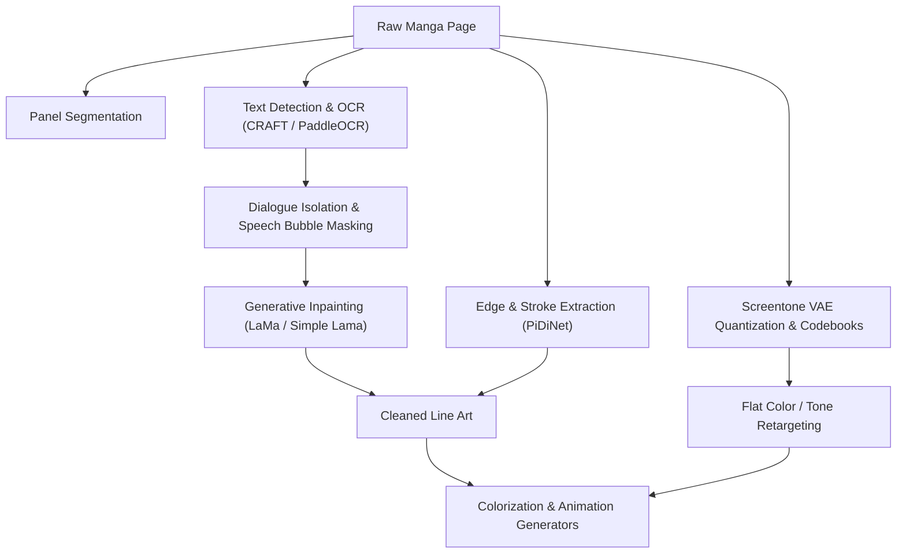

# HITL Deep Learning for Manga Colorization and Animation: A Unified Research Report

## **1. Introduction**
The automation of the manga and webtoon colorization and animation pipeline occupies a highly specialized and technically demanding intersection of computer vision, generative artificial intelligence, and human-computer interaction. Historically, the colorization and translation of static, black-and-white line art into animated cel-sequences has been an exceptionally labor-intensive and capital-heavy endeavor. Professional production environments have relied on colorists and animators to manually execute storyboard adaptation, keyframing, masking, flatting, shading, and in-betweening. 

Manga-specific abstractions—such as stylized non-linear physics, extreme geometric deviations, bitonal screentones for volumetric shading, and overlapping panels—present severe domain gaps that baffle conventional optical flow algorithms and natural-image neural networks. The advent of Latent Diffusion Models (LDMs) and Diffusion Transformers (DiTs) has fundamentally altered this landscape, enabling sophisticated reference-guided colorization and temporal video synthesis. These systems ingest raw black-and-white line art, extract stylistic parameters and color identities from reference illustrations (such as volume covers), and apply them to target page sequences.

However, zero-shot, unguided generative models remain prone to visual hallucinations, color bleeding, and temporal flickering. To meet professional broadcast and publishing standards, the industry has pivoted toward Human-in-the-Loop (HITL) workflows. These hybrid systems integrate interactive canvas interfaces and programmatic video editor timelines with reinforcement learning frameworks, specifically Direct Preference Optimization (DPO). By capturing page-by-page and frame-by-frame user preferences, the generative backends are continuously aligned with the artist's specific stylistic intent.

---

## **2. Pre-Processing and Semantic Extraction**
Manga pages are unstructured canvases containing overlapping layouts, speech bubbles, sound effects (onomatopoeia), and intricate screentones. Robust pre-processing pipelines are required to isolate structural lines, remove dialogue, and manage print artifacts before feeding raw artwork into deep learning generators.



### **2.1 Text Detection, Segmentation, and Inpainting**
Speech bubbles and floating text must be programmatically isolated and removed. If text is left in the target canvas, diffusion models will attempt to colorize the character glyphs as structural line art, producing severe visual hallucinations and noise.
* **OCR and Text Segmentation:** Pipelines deploy Optical Character Recognition (OCR) systems and specialized bounding-box detectors, including CRAFT, PaddleOCR, and Comic Text Detector. These models locate horizontal text, vertical Japanese typography, and complex furigana (ruby characters).
* **Mask Expansion:** Text bounding masks are programmatically expanded by a specified pixel radius to capture surrounding JPEG compression artifacts.
* **Inpainting:** The masked dialogue areas are filled using inpainting networks, such as Large Mask Inpainting (LaMa) or Simple Lama Inpainting. These models reconstruct the obscured backgrounds and restore interrupted structural lines, producing a clean line art canvas.
* **OCR Extraction:** Specialized text readers (e.g., Manga OCR, Mokuro) extract text to render it dynamically on an HTML/CSS or canvas-based overlay. This separates content from aesthetics, letting the system colorize line art independently and re-composite the text layer dynamically.

### **2.2 Line Art Extraction and Screentone Management**
To represent shading in black-and-white print, manga artists use screentones—dense arrays of dot and line patterns. When downsampled or processed by standard convolutional layers, these high-frequency textures trigger severe moiré patterns, aliasing, and visual contamination.
* **Edge Detection:** Sketch extraction networks like PiDiNet (Pixel Difference Networks) and Informative-Drawing are trained to isolate clean, continuous outline vectors. These models preserve stroke weight, brush style, and line thickness while discarding screentone noise.
* **Screentone Quantization:** Screentone Variational Autoencoders (VAEs) map bitonal screentone patterns into a discrete, quantized latent representation (codebook). This translates the high-frequency halftone dots into a translation-invariant space, enabling the colorizer to replace screentone vectors with smooth continuous fills or custom flat shading without visual distortion.

---

## **3. Deep Learning Architectures for Reference-Guided Colorization**
Reference-guided colorization maps chromatic properties from a colored reference asset (e.g., a character reference sheet or volume cover) onto target line art. This requires resolving spatial misalignment and maintaining strict identity (ID) consistency across varying poses, angles, and lighting conditions.

### **3.1 Latent Diffusion Models and Dual-Branch U-Net Frameworks**
Contemporary reference-guided colorization relies on Latent Diffusion Models (LDMs) that operate in compressed latent spaces (e.g., using a VAE to compress $512 \times 512$ pixel data into $64 \times 64$ latents). The denoising process is guided by a dual-conditioning mechanism:
* **Global Semantic Conditioning:** Text prompts and stylistic instructions are encoded using CLIP or T5 text encoders, providing high-level semantic context.
* **Chromatic Conditioning:** A secondary Reference U-Net processes the colored reference image, extracting color identity embeddings that are injected into the primary Denoising U-Net via cross-attention layers.

### **3.2 MangaNinja: Patch Shuffling and Point-Driven Control**
To prevent diffusion networks from performing generic style transfers, MangaNinja introduces progressive patch shuffling and point-driven control.
* **Progressive Patch Shuffling:** During training, the reference image is split into structural patches and randomly shuffled. This disrupts spatial configurations, forcing the cross-attention layers to learn local semantic correspondences (e.g., matching hair texture to hair lines) rather than relying on global spatial alignment.
* **Tri-loss Objective:** The patch-alignment process is reinforced by a three-part loss function utilizing Patch-Alignment Loss (PAL) and InfoNCE contrastive objectives. This mathematically separates authentic reference patches from synthetic descriptors, preventing spurious color leakage.
* **Point-Driven Control:** For edge cases where automated alignment fails, MangaNinja supports manual coordinate anchoring. Users define coordinate matrices where corresponding point pairs on the reference and target share identical integer values.
* **PointNet Processing:** A PointNet architecture processes these sparse coordinate matrices. By applying shared Multilayer Perceptrons (MLPs) and symmetric max-pooling functions, PointNet extracts permutation-invariant spatial embeddings. These embeddings guide the Denoising U-Net to anchor specific colors to exact pixel coordinates.

### **3.3 ColorFlow: Retrieval-Augmented Sequence Colorization**
Manga production is sequential. ColorFlow is designed for frame-to-frame and page-to-page identity consistency, operating on a three-stage framework:
1. **Retrieval-Augmented Pipeline (RAP):** Drawing inspiration from Retrieval-Augmented Generation (RAG), RAP dynamically extracts matching colored patches from a reference pool. It utilizes CLIP to map images into a shared embedding space, calculating cosine similarity (the normalized dot product of feature vectors) to retrieve the most semantically relevant reference patches:
   $$\text{Similarity}(u, v) = \frac{u \cdot v}{\|u\| \|v\|}$$
2. **In-Context Colorization Pipeline (ICP):** ICP routes the retrieved reference patches to a dual-branch U-Net. Self-attention layers within the U-Net map the retrieved colors directly to the target line art boundaries.
3. **Guided Super-Resolution Pipeline (GSRP):** Latent space compression can degrade crisp lines and cross-hatching. GSRP merges the original high-resolution line art with the low-resolution colored latents, performing targeted upsampling to restore crisp details.

The table below illustrates ColorFlow's performance against legacy baseline models across standard perceptual metrics:

| Model | CLIP-IS ↑ | FID ↓ | PSNR ↑ | SSIM ↑ |
| :--- | :--- | :--- | :--- | :--- |
| **MC-v2** | 0.8396 | - | - | - |
| **ACDO** | 0.9516 | - | - | - |
| **EBMC** | 0.9474 | - | - | - |
| **ColorFlow (w/ RAP & GSRP)** | **0.9326** | **15.98** | **24.48** | **0.9448** |

### **3.4 MangaDiT: Hierarchical Attention in Diffusion Transformers**
MangaDiT uses a Diffusion Transformer (DiT) backbone to support global self-attention across image tokens, resolving the region-level consistency issues that U-Nets encounter under extreme pose variations.
* **Hierarchical Attention Mechanism:** MangaDiT extracts token sequences for the noisy image ($x_t$), text prompt ($c$), line art ($y$), and reference image ($r$), shaping them into spatial feature maps of dimension $H \times W \times C$.
* **Coarse Semantics:** The architecture applies max pooling with randomly selected kernel sizes (e.g., $k \times k$) to these maps. The pooled features are upsampled back via nearest-neighbor interpolation and projected into context-aware query ($Q_c$) and key ($K_c$) matrices.
* **Scaled Dot-Product Attention:** Standard token-wise attention is calculated as:
   $$\text{Attention}(Q, K, V) = \text{softmax}\left(\frac{Q K^T}{\sqrt{d_k}}\right) V$$
   Where $d_k$ is the scaling factor of the keys to prevent gradient vanishing.
* **Context-Aware Attention:** Broad semantic relations are calculated using the pooled representations:
   $$\text{ContextAttention}(Q_c, K_c, V) = \text{softmax}\left(\frac{Q_c K_c^T}{\sqrt{d_k}}\right) V$$
* **Hierarchical Blending:** The final attention block blends both mechanisms using a timestep-dependent weighting strategy ($\alpha_t$):
   $$\text{HierarchicalAttention} = (1 - \alpha_t) \cdot \text{Attention}(Q, K, V) + \alpha_t \cdot \text{ContextAttention}(Q_c, K_c, V)$$
   This allows the model to rely on coarse semantic matching during early noisy steps, shifting toward fine-grained token matching as the image resolves.

### **3.5 SketchDeco and InstanceAnimator**
* **SketchDeco:** A training-free latent composition framework. It uses diffusion inversion (via DPM-Solver++) to map region segmentation masks to exact color palettes, utilizing customized self-attention layers to blend local regions without altering global generative priors.
* **InstanceAnimator:** A multi-instance sketch video colorization model. It leverages adaptive decoupled control to inject foreground and background semantics independently, preventing color bleeding in scenes with multiple characters.

| Colorization Framework | Primary Innovation | Mechanism for Alignment / Controllability |
| :--- | :--- | :--- |
| **ColorFlow** | Retrieval-Augmented Sequence Colorization | Dual-branch U-Net; contextual patch extraction from reference pools. |
| **MangaNinja** | Point-Driven Fine-Grained Control | Patch shuffling module; user-defined spatial coordinate matrices processed by PointNet. |
| **SketchDeco** | Training-Free Latent Composition | Diffusion inversion (DPM-Solver++); custom self-attention for region masks. |
| **InstanceAnimator** | Multi-Instance Separation | Adaptive decoupled control; injects background and foreground semantics independently. |

---

## **4. Generative Animation: Synthesizing Video from Still Panels**
Once static manga panels are colorized, they are animated to generate fluid video sequences. Traditional frame interpolation methods (e.g., optical flow) fail when handling non-linear character movements, dramatic camera pans, and dis-occlusions. The industry has therefore adopted generative keyframing via video diffusion models.

### **4.1 Diffusion Transformers (DiT) and Flow Matching**
Modern animation pipelines use Diffusion Transformers (DiT), such as Wan2.1 and CogVideoX, to capture spatio-temporal dependencies over long trajectories.
* **Spatio-Temporal Causal VAE:** Models like Wan2.1 utilize a 3D spatio-temporal causal VAE (Wan-VAE) to achieve compression while preserving temporal causality. This allows the model to encode and decode unlimited-length videos without historical frame loss.
* **Flow Matching:** The generation process is guided by Flow Matching. The system takes the colorized manga panel as an initial Image-to-Video (I2V) condition. A CLIP image encoder extracts features from the panel, injecting them into the DiT blocks via cross-attention. Concurrently, text prompts detailing the desired movement (processed by a T5 text encoder) are integrated into the generative path.

### **4.2 ToonComposer: Unified Post-Keyframing and Spatial Low-Rank Adapters**
ToonComposer unifies in-betweening and colorization into a single generative post-keyframing stage, converting a single colored reference frame and a sparse sequence of line-art sketches into a smooth animation.
* **Spatial Low-Rank Adapter (SLRA):** Foundational DiT models have strong temporal priors from natural videos, but applying them directly to 2D animations causes visual degradation. The SLRA adapts the spatial appearance of the DiT to the animation domain while leaving its native temporal reasoning untouched.
* **Token Sequences and RoPE:** Sketch tokens are appended to the DiT sequence and mapped using Rotary Positional Embeddings (RoPE), enabling precise motion control across long sequences using only sparse inputs.

### **4.3 Live2D and Automated AI Rigging**
For VTuber assets, dialogue sequences, and idle animations, full-scale video diffusion is computationally expensive and prone to artifacts. Animation pipelines integrate automated rigging tools such as AniForge, Sloyd, and GoEnhance.
* **Automated Bone Mapping:** These tools segment 2D character images into depth-aware layers, generate skeletal hierarchies, and perform automatic weight painting.
* **Deformation Controllers:** Guided by text prompts, reference video clips, or real-time audio inputs (using root-mean-square [RMS] volume for lip-sync), the rigging engine deforms the segmented layers to simulate eye blinks, breathing, and 3D rotations without modifying the original line art.

---

## **5. Datasets and Evaluation Benchmarks**
The training of generative colorization and animation models requires high-quality, domain-specific data and rigorous quantitative evaluation metrics.

### **5.1 The Sakuga-42M Dataset**
Sakuga-42M is the foundational dataset for anime video diffusion. It contains 42 million keyframes extracted from 1.2 million video clips.
* **Temporal Curation:** Automated pipelines deploy PySceneDetect for shot segmentation. To accommodate the unique timing of traditional animation (animating "on twos" [12 fps] or "on threes" [8 fps]), the pipeline uses Structural Similarity Index (SSIM) filters to discard redundant adjacent frames, reducing data volume by 45%.
* **Annotations:** Clips are annotated using BLIP-v2 and LLMs to include tags on artistic styles (raster vs. cel-animation), frame-rate parameters, and dynamic motion scores.

### **5.2 Quantitative Evaluation Metrics**
Models are benchmarked against specialized test suites (e.g., PKBench, ColorFlow-Bench) evaluating:
* **Fréchet Video Distance (FVD):** Measures the temporal coherence and structural realism of generated videos by comparing feature distributions against real animations.
* **Learned Perceptual Image Patch Similarity (LPIPS):** Evaluates human-perceived visual distortion and details.
* **Mean Squared Color Error (MSCE):** Quantifies color accuracy relative to the reference palette.

| Model | Fréchet Video Distance (FVD) ↓ | Structural Similarity (SSIM) ↑ | Primary Use Case |
| :--- | :--- | :--- | :--- |
| **ToonCrafter** | 268.02 | 0.5278 | Pure generative in-betweening and frame interpolation. |
| **AniDoc** | 256.33 | 0.7536 | Single-reference dense sketch colorization. |
| **ToonComposer** | 302.15 (Generative) / 46.80 (SLRA) | 0.8360 | Unified sparse post-keyframing via Spatial Low-Rank Adaptation. |
| **TimeColor** | 239.11 | 0.7712 | Variable-count multi-reference temporal colorization. |

---

## **6. Human-in-the-Loop Workflows and Programmatic Tooling**
Fully automated generation pipelines are prone to localized errors (e.g., color leakage or geometry warping). HITL workflows provide frontend user interfaces that interface directly with PyTorch backends, allowing artists to guide and correct the generative process.

### **6.1 Visual Programming (ComfyUI Workflows)**
Node-based visual programming interfaces like ComfyUI serve as the standard for configuring generative pipelines. Manga colorization pipelines (such as Sketch2Manga or AniDoc nodes) connect several functional models:
* **ControlNet:** ControlNet locks the structural boundaries of the line art. It extracts edge maps and injects them into the decoding layers of the diffusion model, ensuring the output conforms to the original artist's strokes.
* **IP-Adapter:** Acts as an image prompt adapter. It extracts visual features from reference sheets and injects them into cross-attention layers, providing the model with a style guide.
* **Guidance Parameters:** Sampling nodes allow users to tune the visual weights, balancing `guidance_scale_ref` (adherence to the reference image) against `guidance_scale_point` (adherence to manual points).

### **6.2 Interactive Canvas Editors and Multiply Blend Modes**
Canvas editors built on Fabric.js, CamanJS, or Gradio's ImageEditor use REST APIs or WebSockets to execute real-time editing. To preserve the crispness of the original line art, these editors rely on specific layer hierarchies:
1. **Top Layer (Original Line Art):** Set to the **"Multiply" blend mode**. The mathematical formula for Multiply blending is:
   $$\text{Color}_{\text{Result}} = \frac{\text{Color}_{\text{LineArt}} \times \text{Color}_{\text{Generated}}}{255}$$
   Since absolute white is 255, multiplying any underlying color by white leaves it unchanged. Since absolute black is 0, multiplying by black yields black. This property preserves anti-aliased ink lines above the color layer.
2. **Middle Layer (Generated Color):** The raw color output from the diffusion model.
3. **Interactive Masking Layer:** A binary canvas where the user paints masks over corrupted regions.

```
+-------------------------------------------------------+
|  Top Layer: Original Line Art (Multiply Blend Mode)   |
+-------------------------------------------------------+
|  Middle Layer: Generated Color Output (Raw Diffusion) |
+-------------------------------------------------------+
|  Bottom Layer: User Masking Canvas (Inpainting Area)  |
+-------------------------------------------------------+
```

When an error is masked, the frontend sends the mask coordinates to the backend. The backend triggers an inpainting diffusion model to regenerate the masked region, blending it back into the latent space. To optimize editing efficiency, the editor calculates variance across generation passes using MC-Dropout or Bayesian Active Learning by Disagreement (BALD), automatically highlighting high-uncertainty pixels for manual review.

---

## **7. Iterative Alignment via DPO and Reinforcement Learning**
To ensure the generative models learn from human corrections, systems capture human selections and canvas edits as pairwise preference signals to fine-tune the networks.

### **7.1 The Transition to Direct Preference Optimization (DPO)**
Early alignment methods used Reinforcement Learning from Human Feedback (RLHF), modeling denoising as a Markov Decision Process (MDP) and updating weights via Proximal Policy Optimization (PPO). These methods (e.g., DDPO) suffered from high GPU memory overhead, high gradient variance, and the need to maintain an active reward model.

Direct Preference Optimization (DPO) bypasses the reward model. DPO maps human preferences directly to policy updates using a simple classification objective. If the model generates two potential outputs ($y_w$, the preferred image, and $y_l$, the rejected image), the Diffusion-DPO loss function updates the model's weights to make the preferred trajectory more likely while penalizing the rejected one. The loss is constrained by a Kullback-Leibler (KL) divergence penalty ($\beta$) against the original frozen reference model ($\pi_{\text{ref}}$) to prevent catastrophic forgetting:
$$\mathcal{L}_{\text{DPO}}(\theta; \theta_{\text{ref}}) = -\mathbb{E}_{(x, y_w, y_l)} \left[ \log \sigma \left( \beta \log \frac{\pi_\theta(y_w | x)}{\pi_{\theta_{\text{ref}}}(y_w | x)} - \beta \log \frac{\pi_\theta(y_l | x)}{\pi_{\theta_{\text{ref}}}(y_l | x)} \right) \right]$$
Where:
* $\sigma$ is the sigmoid function.
* $x$ represents the conditioning signals (line art and reference).
* $\pi_\theta$ represents the active policy model.

### **7.2 Advanced DPO Frameworks: Curriculum DPO, DSPO, and LocalDPO**
* **Curriculum DPO:** Rankings preference pairs by visual difficulty. Early epochs train on "easy" pairs with obvious aesthetic differences, while later epochs introduce "hard" pairs with subtle rendering differences. This mitigates visual inconsistency and accelerates convergence.
* **Direct Score Preference Optimization (DSPO):** Aligns the preference loss with the original score-matching pretraining objectives of diffusion models. SDPO (Importance-Sampled DPO) addresses timestep-dependent instability by managing the high gradient variance inherent to early noisy steps.
* **LocalDPO and Region-Aware DPO:** Global DPO can degrade overall model performance if it penalizes an entire video clip for a single localized artifact. In LocalDPO, the artist paints a bounding box over the error. The loss optimizes preference learning strictly within that spatial boundary, preserving the global coherence of the rest of the clip.
* **Self-DPO:** The system automatically generates synthetic negative samples by adding noise or blur to known good frames, generating preference training pairs without manual human labeling.

### **7.3 Implementing Feedback via LoRA Adaptation**
Full-parameter DPO fine-tuning is computationally expensive. Studio pipelines use Low-Rank Adaptation (LoRA) to freeze the original model weights ($W_0$) and inject trainable rank decomposition matrices ($A$ and $B$) into attention blocks:
$$W = W_0 + \Delta W = W_0 + \frac{\alpha}{r} (A \cdot B)$$
By keeping the rank ($r$) low, LoRA reduces trainable parameters by up to 10,000 times. As artists correct frames, the system updates the lightweight LoRA module using the Diffusion-DPO loss. Over time, the LoRA adapts to the specific visual style of the property without altering the foundational model.

---

## **8. Client-Side Timeline and WebGPU Architecture**
Frictionless interaction is critical for HITL workflows. Traditional video editors cannot interface with PyTorch backends, prompting the development of custom programmatic editors.

### **8.1 Remotion and React-Based Timelines**
Remotion is a programmatic video rendering framework that uses React, TypeScript, and CSS to define timelines.
* **Timeline Splicing:** Timelines track active frame counts using hooks like `useCurrentFrame()` and `useVideoConfig()`.
* **API Splicing:** When an artist edits a frame in the UI, the frontend sends a REST or WebSocket command to the PyTorch backend. Once corrected, the backend sends the revised frame back. Remotion's composition timeline hot-reloads and splices this single frame in real-time, bypassing full video re-renders.

### **8.2 WebGPU and ONNX Runtime Web**
To eliminate network latency, pipelines run inference directly in the user's browser using ONNX Runtime Web via WebGPU.
* **Hardware Access:** WebGPU grants the web application direct access to local GPU hardware, executing compute shaders and half-precision (FP16) arithmetic.
* **Zero-Latency Inference:** Running lightweight inpainting and colorization models locally in the browser reduces network round-trip latents from several seconds to milliseconds.

---

## **9. Conclusion**
The deep learning pipeline for reference-guided manga colorization and animation represents a major transition in digital media production. Through Diffusion Transformers (DiTs), flow matching, retrieval-augmented style patches, and point-driven coordinate conditioning, systems can automate style transfer and temporal synthesis. 

However, fully automated workflows remain insufficient for professional production. Successful deployment relies on Human-in-the-Loop workflows. By integrating visual nodes (ComfyUI) and programmatic canvas and video timelines (Remotion) with Direct Preference Optimization (DPO), human feedback is channeled to refine the model's output. By updating low-rank adapters (LoRAs) and processing local corrections via WebGPU browser inference, these pipelines act as controlled assistants, allowing creators to accelerate the manga-to-anime pipeline while maintaining artistic integrity.

---

## **Works Cited**
1. FlatMagic: Improving Flat Colorization through AI-driven Design for Digital Comic Professionals | Request PDF - ResearchGate, [https://www.researchgate.net/publication/360331242_FlatMagic_Improving_Flat_Colorization_through_AI-driven_Design_for_Digital_Comic_Professionals](https://www.researchgate.net/publication/360331242_FlatMagic_Improving_Flat_Colorization_through_AI-driven_Design_for_Digital_Comic_Professionals)
2. The artificial cartoonist: key characteristics of ai-assisted sequential storytelling, [https://revistas.ulusofona.pt/index.php/ijfma/article/view/10681/6290](https://revistas.ulusofona.pt/index.php/ijfma/article/view/10681/6290)
3. cGAN-based Manga Colorization Using a Single Training Image - arXiv, [https://arxiv.org/abs/1706.06918](https://arxiv.org/abs/1706.06918)
4. arXiv:2412.11815v1 [cs.CV] 16 Dec 2024, [https://arxiv.org/pdf/2412.11815](https://arxiv.org/pdf/2412.11815)
5. MangaNinja: Line Art Colorization with Precise Reference Following, [https://www.themoonlight.io/en/review/manganinja-line-art-colorization-with-precise-reference-following](https://www.themoonlight.io/en/review/manganinja-line-art-colorization-with-precise-reference-following)
6. Image Referenced Sketch Colorization Based on Animation Creation Workflow - arXiv, [https://arxiv.org/html/2502.19937v1](https://arxiv.org/html/2502.19937v1)
7. MangaNinja: Line Art Colorization with Precise Reference Following - arXiv, [https://arxiv.org/html/2501.08332v1](https://arxiv.org/html/2501.08332v1)
8. Diffusion Model Alignment Using Direct Preference Optimization, [https://cvpr.thecvf.com/virtual/2024/poster/31416](https://cvpr.thecvf.com/virtual/2024/poster/31416)
9. Closing the Domain Gap in Manga Colorization via Aligned Paired Dataset, [https://openaccess.thecvf.com/content/WACV2025/papers/Golyadkin_Closing_the_Domain_Gap_in_Manga_Colorization_via_Aligned_Paired_WACV_2025_paper.pdf](https://openaccess.thecvf.com/content/WACV2025/papers/Golyadkin_Closing_the_Domain_Gap_in_Manga_Colorization_via_Aligned_Paired_WACV_2025_paper.pdf)
10. Closing the Domain Gap in Manga Colorization via Aligned Paired Dataset - WACV 2025 Open Access Repository, [https://openaccess.thecvf.com/content/WACV2025/html/Golyadkin_Closing_the_Domain_Gap_in_Manga_Colorization_via_Aligned_Paired_WACV_2025_paper.html](https://openaccess.thecvf.com/content/WACV2025/html/Golyadkin_Closing_the_Domain_Gap_in_Manga_Colorization_via_Aligned_Paired_WACV_2025_paper.html)
11. Supplementary Materials for Closing the Domain Gap in Manga Colorization via Aligned Paired Dataset - CVF Open Access, [https://openaccess.thecvf.com/content/WACV2025/supplemental/Golyadkin_Closing_the_Domain_WACV_2025_supplemental.pdf](https://openaccess.thecvf.com/content/WACV2025/supplemental/Golyadkin_Closing_the_Domain_WACV_2025_supplemental.pdf)
12. Region-Wise Correspondence Prediction between Manga Line Art Images - arXiv, [https://arxiv.org/html/2509.09501v1](https://arxiv.org/html/2509.09501v1)
13. Not all Synthetic Datasets are Created Equal - Parallel Domain, [https://paralleldomain.com/resources/not-all-synthetic-datasets-are-created-equal](https://paralleldomain.com/resources/not-all-synthetic-datasets-are-created-equal)
14. Domain Adaptation of Synthetic Driving Datasets for Real-World Autonomous Driving - arXiv, [https://arxiv.org/abs/2302.04149](https://arxiv.org/abs/2302.04149)
15. pcleaner-cli · PyPI, [https://pypi.org/project/pcleaner-cli/](https://pypi.org/project/pcleaner-cli/)
16. mokuro/README.md at master - GitHub, [https://github.com/kha-white/mokuro/blob/master/README.md](https://github.com/kha-white/mokuro/blob/master/README.md)
17. Mokuro: Read Japanese manga with selectable text inside a browser, [https://community.wanikani.com/t/mokuro-read-japanese-manga-with-selectable-text-inside-a-browser/60907](https://community.wanikani.com/t/mokuro-read-japanese-manga-with-selectable-text-inside-a-browser/60907)
18. MangaDiT: Reference-Guided Line Art Colorization with Hierarchical Attention in Diffusion Transformers - arXiv, [https://arxiv.org/pdf/2508.09709](https://arxiv.org/pdf/2508.09709)
19. MangaNinja: Line Art Colorization with Precise Reference Following, [https://cvpr.thecvf.com/virtual/2025/poster/34511](https://cvpr.thecvf.com/virtual/2025/poster/34511)
20. MangaNinja: Line Art Colorization with Precise Reference Following - CVF Open Access, [https://openaccess.thecvf.com/content/CVPR2025/papers/Liu_MangaNinja_Line_Art_Colorization_with_Precise_Reference_Following_CVPR_2025_paper.pdf](https://openaccess.thecvf.com/content/CVPR2025/papers/Liu_MangaNinja_Line_Art_Colorization_with_Precise_Reference_Following_CVPR_2025_paper.pdf)
21. ali-vilab/MangaNinjia: Official implementation of "MangaNinja: Line Art Colorization with Precise Reference Following" - GitHub, [https://github.com/ali-vilab/MangaNinjia](https://github.com/ali-vilab/MangaNinjia)
22. The PointNet embedding n p d p-dimensional samples of a superpoint - ResearchGate, [https://www.researchgate.net/figure/The-PointNet-embedding-n-p-d-p-dimensional-samples-of-a-superpoint-to-a-d-z-dimensional_fig2_321325284](https://www.researchgate.net/figure/The-PointNet-embedding-n-p-d-p-dimensional-samples-of-a-superpoint-to-a-d-z-dimensional_fig2_321325284)
23. Code Point Net from Scratch in Pytorch - Medium, [https://medium.com/@itberrios6/point-net-from-scratch-78935690e496](https://medium.com/@itberrios6/point-net-from-scratch-78935690e496)
24. PointNet implementation explained visually - DataScienceUB, [https://datascienceub.medium.com/pointnet-implementation-explained-visually-c7e300139698](https://datascienceub.medium.com/pointnet-implementation-explained-visually-c7e300139698)
25. MangaNinja: Line Art Colorization with Precise Reference Following - Zhiheng Liu, [https://johanan528.github.io/MangaNinjia/](https://johanan528.github.io/MangaNinjia/)
26. Retrieval-Augmented Image Sequence Colorization - Junhao Zhuang, [https://zhuang2002.github.io/ColorFlow/](https://zhuang2002.github.io/ColorFlow/)
27. Building Vision-Language Retrieval Systems with CLIP - Medium, [https://medium.com/@zoey.ziyuan/building-vision-language-retrieval-systems-with-clip-blip-31ec93dc0b14](https://medium.com/@zoey.ziyuan/building-vision-language-retrieval-systems-with-clip-blip-31ec93dc0b14)
28. How to Build Semantic Image Search with OpenAI CLIP, [https://docs.ultralytics.com/guides/similarity-search](https://docs.ultralytics.com/guides/similarity-search)
29. Text-to-Image and Image-to-Image Search Using CLIP | Pinecone, [https://www.pinecone.io/learn/clip-image-search/](https://www.pinecone.io/learn/clip-image-search/)
30. Improved Video VAE for Latent Video Diffusion Model, [https://cvpr.thecvf.com/virtual/2025/poster/33447](https://cvpr.thecvf.com/virtual/2025/poster/33447)
31. What are the pros and cons of using a VAE to provide a latent space - Reddit, [https://www.reddit.com/r/MachineLearning/comments/1g0jpzq/d_what_are_the_pros_and_cons_of_using_a_vae_to/](https://www.reddit.com/r/MachineLearning/comments/1g0jpzq/d_what_are_the_pros_and_cons_of_using_a_vae_to/)
32. REED-VAE: RE-Encode Decode Training for Iterative Image Editing - arXiv, [https://arxiv.org/html/2504.18989v1](https://arxiv.org/html/2504.18989v1)
33. MangaDiT: Reference-Guided Line Art Colorization with Hierarchical Attention - arXiv, [https://arxiv.org/abs/2508.09709](https://arxiv.org/abs/2508.09709)
34. Official implementation of MangaDiT - GitHub, [https://github.com/CyberAgentAILab/MangaDiT](https://github.com/CyberAgentAILab/MangaDiT)
35. The Math Behind Multi-Head Attention in Transformers - Medium, [https://medium.com/data-science/the-math-behind-multi-head-attention-in-transformers-c26cba15f625](https://medium.com/data-science/the-math-behind-multi-head-attention-in-transformers-c26cba15f625)
36. Add Color to Line Art Illustration - ComfyUI Workflow, [https://comfy.org/workflows/templates-color_illustration-926bb8ebaa04/](https://comfy.org/workflows/templates-color_illustration-926bb8ebaa04/)
37. A collection of awesome custom nodes for ComfyUI - GitHub, [https://github.com/jalberty2018/awesome-comfyui](https://github.com/jalberty2018/awesome-comfyui)
38. ComfyUI-AniDoc - GitHub, [https://github.com/LucipherDev/ComfyUI-AniDoc](https://github.com/LucipherDev/ComfyUI-AniDoc)
39. Sketch2Manga - ComfyUI Node - Floyo, [https://www.floyo.ai/all-comfyui-nodes/sketch2manga-dmmaze](https://www.floyo.ai/all-comfyui-nodes/sketch2manga-dmmaze)
40. Apply screentone to drawings with diffusion models - GitHub, [https://github.com/dmMaze/sketch2manga/](https://github.com/dmMaze/sketch2manga/)
41. ColorizeDiffusion v2: Enhancing Reference-based Sketch Colorization - arXiv, [https://arxiv.org/html/2504.06895v1](https://arxiv.org/html/2504.06895v1)
42. Using ControlNet in ComfyUI for Precise Controlled Image Generation, [https://comfyui-wiki.com/en/tutorial/advanced/how-to-install-and-use-controlnet-models-in-comfyui](https://comfyui-wiki.com/en/tutorial/advanced/how-to-install-and-use-controlnet-models-in-comfyui)
43. ComfyUI - ControlNet, part I: The AIO Aux preprocessor - YouTube, [https://www.youtube.com/watch?v=22jZR6x_tTo](https://www.youtube.com/watch?v=22jZR6x_tTo)
44. MangaNinjiaSampler - RunComfy, [https://www.runcomfy.com/comfyui-nodes/ComfyUI_MangaNinjia/manga-ninjia-sampler](https://www.runcomfy.com/comfyui-nodes/ComfyUI_MangaNinjia/manga-ninjia-sampler)
45. Gradio Sketch in 2 Minutes - YouTube, [https://www.youtube.com/watch?v=fNssP2f40lU](https://www.youtube.com/watch?v=fNssP2f40lU)
46. Creating an Image Editor Using CamanJS - Envato Tuts+, [https://code.tutsplus.com/creating-an-image-editor-using-camanjs-layers-blend-modes-and-events--cms-30252t](https://code.tutsplus.com/creating-an-image-editor-using-camanjs-layers-blend-modes-and-events--cms-30252t)
47. blend_modes package - Pythonhosted.org, [https://pythonhosted.org/blend_modes/blend_modes.html](https://pythonhosted.org/blend_modes/blend_modes.html)
48. A Simple and Effective RL Method for Text-to-Image Fine-tuning - arXiv, [https://arxiv.org/html/2503.00897v7](https://arxiv.org/html/2503.00897v7)
49. Uncertainty Driven Active Learning for Image Segmentation - arXiv, [https://arxiv.org/html/2403.14002v1](https://arxiv.org/html/2403.14002v1)
50. Breaking the Barrier: Selective Uncertainty-Based Active Learning - ResearchGate, [https://www.researchgate.net/publication/379819004_Breaking_the_Barrier_Selective_Uncertainty-Based_Active_Learning_for_Medical_Image_Segmentation](https://www.researchgate.net/publication/379819004_Breaking_the_Barrier_Selective_Uncertainty-Based_Active_Learning_for_Medical_Image_Segmentation)
51. Finetune Stable Diffusion Models with DDPO via TRL - Hugging Face, [https://huggingface.co/blog/trl-ddpo](https://huggingface.co/blog/trl-ddpo)
52. Efficient Diffusion Models: A Comprehensive Survey - IEEE, [https://www.computer.org/csdl/journal/tp/2025/09/11002717/26GmRnP6FFe](https://www.computer.org/csdl/journal/tp/2025/09/11002717/26GmRnP6FFe)
53. Using Human Feedback to Fine-tune Diffusion Models - arXiv, [https://arxiv.org/html/2311.13231v3](https://arxiv.org/html/2311.13231v3)
54. SDPO: Importance-Sampled Direct Preference Optimization - ResearchGate, [https://www.researchgate.net/publication/392167287_SDPO_Importance-Sampled_Direct_Preference_Optimization_for_Stable_Diffusion_Training](https://www.researchgate.net/publication/392167287_SDPO_Importance-Sampled_Direct_Preference_Optimization_for_Stable_Diffusion_Training)
55. D3PO: Preference-Based Alignment of Discrete Diffusion Models - arXiv, [https://arxiv.org/html/2503.08295v1](https://arxiv.org/html/2503.08295v1)
56. Curriculum Direct Preference Optimization for Diffusion Models - CVF Open Access, [http://openaccess.thecvf.com/content/CVPR2025/papers/Croitoru_Curriculum_Direct_Preference_Optimization_for_Diffusion_and_Consistency_Models_CVPR_2025_paper.pdf](http://openaccess.thecvf.com/content/CVPR2025/papers/Croitoru_Curriculum_Direct_Preference_Optimization_for_Diffusion_and_Consistency_Models_CVPR_2025_paper.pdf)
57. D-Fusion: Direct Preference Optimization for Aligning Diffusion Models - OpenReview, [https://openreview.net/forum?id=WVlEwFiDGH](https://openreview.net/forum?id=WVlEwFiDGH)
58. DSPO: Direct Score Preference Optimization - OpenReview, [https://openreview.net/forum?id=xyfb9HHvMe](https://openreview.net/forum?id=xyfb9HHvMe)
59. Fine-Tuning Diffusion Generative Models via Rich Preference Optimization - arXiv, [https://arxiv.org/html/2503.11720v4](https://arxiv.org/html/2503.11720v4)
60. LoRA-Adapted Diffusion Methods - Emergent Mind, [https://www.emergentmind.com/topics/lora-adapted-diffusion-approach](https://www.emergentmind.com/topics/lora-adapted-diffusion-approach)
61. Comic Text Detector - GitHub, [https://github.com/zyddnys/manga-image-translator](https://github.com/zyddnys/manga-image-translator)
62. Remotion: Create Videos Programmatically with React - YUV.AI Blog, [https://yuv.ai/blog/remotion](https://yuv.ai/blog/remotion)
63. ONNX Runtime Web unleashes generative AI in the browser using WebGPU, [https://opensource.microsoft.com/blog/2024/02/29/onnx-runtime-web-unleashes-generative-ai-in-the-browser-using-webgpu/](https://opensource.microsoft.com/blog/2024/02/29/onnx-runtime-web-unleashes-generative-ai-in-the-browser-using-webgpu/)
