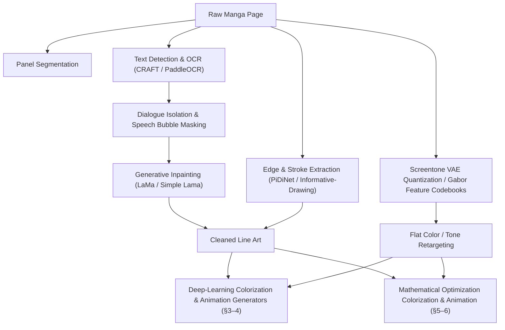

# Manga Colorization and Animation: Deep Learning and Mathematical Optimization — A Unified Research Report

## **1. Introduction**

The automation of the manga and webtoon colorization and animation pipeline occupies a highly specialized and technically demanding intersection of computer vision, generative artificial intelligence, mathematical optimization, and human-computer interaction. Historically, the colorization and translation of static, black-and-white line art into animated cel-sequences has been an exceptionally labor-intensive and capital-heavy endeavor. Professional production environments have relied on colorists and animators to manually execute storyboard adaptation, keyframing, masking, flatting, shading, and in-betweening.

The global anime and manga industry has experienced exponential expansion, evolving into a market valued at over $30 billion, placing immense strain on these traditional production pipelines. Two broad technical paradigms have emerged to relieve this bottleneck, and this report treats them as complementary rather than competing:

1. **Deep-learning generative pipelines** — Latent Diffusion Models (LDMs) and Diffusion Transformers (DiTs) that ingest raw black-and-white line art, extract stylistic parameters and color identities from reference illustrations, and apply them to target page or frame sequences.
2. **Mathematical optimization pipelines** — energy minimization, graph matching, optimal transport, and mesh deformation algorithms that provide deterministic, closed-form, or convex-optimization guarantees over color propagation, structural correspondence, and pose deformation.

Manga-specific abstractions — stylized non-linear physics, extreme geometric deviations, bitonal screentones for volumetric shading, and overlapping panels — present severe domain gaps that baffle both conventional optical flow algorithms and natural-image neural networks. Zero-shot, unguided generative models remain prone to visual hallucinations, color bleeding, and temporal flickering; high-profile studios such as WIT Studio and Toei Animation have faced public backlash — and been forced to publicly apologize and replace broadcasted sequences — after audiences detected the temporal flickering, structural melting, and inconsistent line weights characteristic of unconstrained generative models.

Beyond visual artifacts, purely generative deep learning introduces legal exposure. Under Article 30-4 of the Japanese Copyright Law, the unauthorized use of copyrighted works for model training is permitted under a "non-enjoyment purpose," but this exception is voided if the training unreasonably prejudices the interests of the copyright owner. Major publishers (Shueisha, Kodansha) and organizations like the Content Overseas Distribution Association (CODA) have aggressively mobilized against the scraping of proprietary character sheets and manga panels. Mathematical optimization algorithms — which operate directly on user-provided inputs (a single reference sheet, a set of scribbles, a sparse sketch sequence) rather than on massive pre-trained datasets — are comparatively insulated from this liability while still providing pixel-perfect, deterministic control.

Consequently, the industry has pivoted toward **Human-in-the-Loop (HITL)** workflows that hybridize both paradigms: interactive canvas interfaces and programmatic video editor timelines, backed by either deterministic optimization solvers or reinforcement-learning-aligned generative backends (via Direct Preference Optimization), so that page-by-page and frame-by-frame user preferences continuously steer the output toward the artist's intent.

---

## **2. Pre-Processing and Semantic Extraction**

Manga pages are unstructured canvases containing overlapping layouts, speech bubbles, sound effects (onomatopoeia), and intricate screentones. Robust pre-processing pipelines are required to isolate structural lines, remove dialogue, and manage print artifacts before any colorization or animation stage — generative or mathematical — can operate correctly.



### **2.1 Text Detection, Segmentation, and Inpainting**

Speech bubbles and floating text must be programmatically isolated and removed. If text is left in the target canvas, both diffusion models and optimization solvers will attempt to colorize the character glyphs as structural line art, producing severe visual hallucinations or spurious boundary halting.

* **OCR and Text Segmentation:** Pipelines deploy OCR systems and specialized bounding-box detectors, including CRAFT, PaddleOCR, and Comic Text Detector (`zyddnys/manga-image-translator`). These models locate horizontal text, vertical Japanese typography, and complex furigana (ruby characters).
* **Mask Expansion:** Text bounding masks are programmatically expanded by a specified pixel radius to capture surrounding JPEG compression artifacts.
* **Inpainting:** The masked dialogue areas are filled using inpainting networks such as Large Mask Inpainting (LaMa) or Simple Lama Inpainting. LaMa formulates the reconstruction of the occluded background as an optimization problem constrained by the Fourier representations of the surrounding unmasked regions, calculating a smooth structural continuation that perfectly restores the underlying manga canvas.
* **OCR Extraction:** Specialized text readers (e.g., Manga OCR, Mokuro) extract text to render it dynamically on an HTML/CSS or canvas-based overlay, separating content from aesthetics so the system can colorize line art independently and re-composite the text layer dynamically.

### **2.2 Line Art Extraction and Screentone Management**

To represent shading in black-and-white print, manga artists use screentones — dense arrays of dot and line patterns. When downsampled or processed by standard convolutional layers, these high-frequency textures trigger severe moiré patterns, aliasing, and visual contamination; when fed directly into intensity-based mathematical optimization, they also artificially maximize local intensity variance and break the smoothness assumptions those solvers depend on (see §5.2).

* **Edge Detection:** Sketch extraction networks like PiDiNet (Pixel Difference Networks) and Informative-Drawing are trained to isolate clean, continuous outline vectors, preserving stroke weight and brush style while discarding screentone noise.
* **Screentone Quantization (deep-learning path):** Screentone Variational Autoencoders (VAEs) map bitonal screentone patterns into a discrete, quantized latent codebook, translating high-frequency halftone dots into a translation-invariant space so the colorizer can replace screentone vectors with smooth continuous fills.
* **Gabor Texture Features (mathematical-optimization path):** Gabor wavelet filters measure local spatial frequencies and orientations, generating a statistical texture signature $T(x,y)$ for every pixel that represents the structural rhythm of the screentone rather than its raw intensity — the foundation for pattern-continuity color propagation (§5.2).

---

## **3. Deep Learning Architectures for Reference-Guided Colorization**

Reference-guided colorization maps chromatic properties from a colored reference asset (e.g., a character reference sheet or volume cover) onto target line art. This requires resolving spatial misalignment and maintaining strict identity (ID) consistency across varying poses, angles, and lighting conditions.

### **3.1 Latent Diffusion Models and Dual-Branch U-Net Frameworks**

Contemporary reference-guided colorization relies on Latent Diffusion Models (LDMs) that operate in compressed latent spaces (e.g., a VAE compressing $512 \times 512$ pixel data into $64 \times 64$ latents). The denoising process is guided by a dual-conditioning mechanism:

* **Global Semantic Conditioning:** Text prompts and stylistic instructions are encoded using CLIP or T5 text encoders, providing high-level semantic context.
* **Chromatic Conditioning:** A secondary Reference U-Net processes the colored reference image, extracting color identity embeddings that are injected into the primary Denoising U-Net via cross-attention layers.

### **3.2 MangaNinja: Patch Shuffling and Point-Driven Control**

To prevent diffusion networks from performing generic style transfers, MangaNinja introduces progressive patch shuffling and point-driven control.

* **Progressive Patch Shuffling:** During training, the reference image is split into structural patches and randomly shuffled, forcing the cross-attention layers to learn local semantic correspondences (e.g., matching hair texture to hair lines) rather than relying on global spatial alignment.
* **Tri-loss Objective:** The patch-alignment process is reinforced by a three-part loss function utilizing Patch-Alignment Loss (PAL) and InfoNCE contrastive objectives, mathematically separating authentic reference patches from synthetic descriptors to prevent spurious color leakage.
* **Point-Driven Control:** For edge cases where automated alignment fails, MangaNinja supports manual coordinate anchoring: users define coordinate matrices where corresponding point pairs on the reference and target share identical integer values.
* **PointNet Processing:** A PointNet architecture processes these sparse coordinate matrices with shared MLPs and symmetric max-pooling, extracting permutation-invariant spatial embeddings that guide the Denoising U-Net to anchor specific colors to exact pixel coordinates.

### **3.3 ColorFlow: Retrieval-Augmented Sequence Colorization**

Manga production is sequential. ColorFlow targets frame-to-frame and page-to-page identity consistency via a three-stage framework:

1. **Retrieval-Augmented Pipeline (RAP):** Inspired by Retrieval-Augmented Generation, RAP dynamically extracts matching colored patches from a reference pool using CLIP to map images into a shared embedding space and cosine similarity to retrieve the most semantically relevant reference patches:
   $$\text{Similarity}(u, v) = \frac{u \cdot v}{\|u\| \|v\|}$$
2. **In-Context Colorization Pipeline (ICP):** Routes the retrieved reference patches to a dual-branch U-Net; self-attention layers map retrieved colors directly to the target line-art boundaries.
3. **Guided Super-Resolution Pipeline (GSRP):** Merges the original high-resolution line art with the low-resolution colored latents, performing targeted upsampling to restore crisp lines and cross-hatching that latent-space compression would otherwise degrade.

| Model | CLIP-IS ↑ | FID ↓ | PSNR ↑ | SSIM ↑ |
| :--- | :--- | :--- | :--- | :--- |
| **MC-v2** | 0.8396 | - | - | - |
| **ACDO** | 0.9516 | - | - | - |
| **EBMC** | 0.9474 | - | - | - |
| **ColorFlow (w/ RAP & GSRP)** | **0.9326** | **15.98** | **24.48** | **0.9448** |

### **3.4 MangaDiT: Hierarchical Attention in Diffusion Transformers**

MangaDiT uses a Diffusion Transformer (DiT) backbone supporting global self-attention across image tokens, resolving region-level consistency issues that U-Nets encounter under extreme pose variations.

* **Hierarchical Attention Mechanism:** MangaDiT extracts token sequences for the noisy image ($x_t$), text prompt ($c$), line art ($y$), and reference image ($r$), shaping them into spatial feature maps of dimension $H \times W \times C$.
* **Coarse Semantics:** Max pooling with randomly selected kernel sizes is applied to these maps; pooled features are upsampled via nearest-neighbor interpolation and projected into context-aware query ($Q_c$) and key ($K_c$) matrices.
* **Scaled Dot-Product Attention:**
   $$\text{Attention}(Q, K, V) = \text{softmax}\left(\frac{Q K^T}{\sqrt{d_k}}\right) V$$
* **Context-Aware Attention:**
   $$\text{ContextAttention}(Q_c, K_c, V) = \text{softmax}\left(\frac{Q_c K_c^T}{\sqrt{d_k}}\right) V$$
* **Hierarchical Blending:** A timestep-dependent weighting strategy ($\alpha_t$) blends both mechanisms:
   $$\text{HierarchicalAttention} = (1 - \alpha_t) \cdot \text{Attention}(Q, K, V) + \alpha_t \cdot \text{ContextAttention}(Q_c, K_c, V)$$
   This lets the model rely on coarse semantic matching during early noisy steps, shifting toward fine-grained token matching as the image resolves.

### **3.5 SketchDeco and InstanceAnimator**

* **SketchDeco:** A training-free latent composition framework using diffusion inversion (via DPM-Solver++) to map region segmentation masks to exact color palettes, with customized self-attention layers to blend local regions without altering global generative priors.
* **InstanceAnimator:** A multi-instance sketch video colorization model leveraging adaptive decoupled control to inject foreground and background semantics independently, preventing color bleeding in scenes with multiple characters.

| Colorization Framework | Primary Innovation | Mechanism for Alignment / Controllability |
| :--- | :--- | :--- |
| **ColorFlow** | Retrieval-Augmented Sequence Colorization | Dual-branch U-Net; contextual patch extraction from reference pools. |
| **MangaNinja** | Point-Driven Fine-Grained Control | Patch shuffling module; user-defined spatial coordinate matrices processed by PointNet. |
| **SketchDeco** | Training-Free Latent Composition | Diffusion inversion (DPM-Solver++); custom self-attention for region masks. |
| **InstanceAnimator** | Multi-Instance Separation | Adaptive decoupled control; injects background and foreground semantics independently. |

---

## **4. Generative Animation: Synthesizing Video from Still Panels**

Once static manga panels are colorized, they are animated to generate fluid video sequences. Traditional frame interpolation methods (e.g., optical flow) fail when handling non-linear character movements, dramatic camera pans, and dis-occlusions. The industry has therefore adopted generative keyframing via video diffusion models, alongside the deterministic mesh-deformation approach covered in §6.2.

### **4.1 Diffusion Transformers (DiT) and Flow Matching**

Modern animation pipelines use Diffusion Transformers, such as Wan2.1 and CogVideoX, to capture spatio-temporal dependencies over long trajectories.

* **Spatio-Temporal Causal VAE:** Wan2.1's 3D spatio-temporal causal VAE (Wan-VAE) achieves compression while preserving temporal causality, encoding/decoding unlimited-length videos without historical frame loss.
* **Flow Matching:** The generation process is guided by Flow Matching. The colorized manga panel is the initial Image-to-Video (I2V) condition; a CLIP image encoder extracts features from the panel, injected into the DiT blocks via cross-attention, while text prompts detailing desired movement (via a T5 text encoder) are integrated into the generative path.

### **4.2 ToonComposer: Unified Post-Keyframing and Spatial Low-Rank Adapters**

ToonComposer unifies in-betweening and colorization into a single generative post-keyframing stage, converting a single colored reference frame and a sparse sequence of line-art sketches into a smooth animation.

* **Spatial Low-Rank Adapter (SLRA):** Foundational DiT models have strong temporal priors from natural videos, but applying them directly to 2D animations causes visual degradation. SLRA adapts the spatial appearance of the DiT to the animation domain while leaving native temporal reasoning untouched.
* **Token Sequences and RoPE:** Sketch tokens are appended to the DiT sequence and mapped using Rotary Positional Embeddings, enabling precise motion control across long sequences using only sparse inputs.

### **4.3 Live2D and Automated AI Rigging**

For VTuber assets, dialogue sequences, and idle animations, full-scale video diffusion is computationally expensive and prone to artifacts. Animation pipelines integrate automated rigging tools such as AniForge, Sloyd, and GoEnhance.

* **Automated Bone Mapping:** These tools segment 2D character images into depth-aware layers, generate skeletal hierarchies, and perform automatic weight painting.
* **Deformation Controllers:** Guided by text prompts, reference video clips, or real-time audio inputs (root-mean-square [RMS] volume for lip-sync), the rigging engine deforms the segmented layers to simulate eye blinks, breathing, and 3D rotations without modifying the original line art. This mesh-based mode of animation converges conceptually with the deterministic ARAP approach in §6.2, and commercial Live2D pipelines commonly combine both: mathematical mesh regression for facial blendshapes and pose/scale regression, layered under generative in-betweening for full-body motion.

---

## **5. Mathematical Optimization for Colorization**

Unlike purely stochastic generative models, mathematical optimization provides absolute determinism. By defining color propagation as rigorous energy minimization, graph matching, and optimal transport problems, studios can achieve pixel-perfect control that operates directly on user-provided inputs — insulated from the copyright liabilities of massive pre-trained datasets and natively suited to precise HITL workflows.

### **5.1 The Quadratic Cost Formulation and Sparse Linear Systems (Levin et al.)**

In a standard HITL scribble workflow, an artist provides a sparse set of color annotations on a grayscale manga image. These scribbles act as hard Dirichlet boundary conditions within a linear system. The image is first transformed from RGB into a luminance/chrominance space (YUV or YCbCr): the $Y$ channel represents intensity, while $U$ and $V$ encapsulate color information.

The core algorithm minimizes the squared difference between the color of a target pixel $r$ and the weighted average of the colors of its neighboring pixels $s$ within a predefined neighborhood $N(r)$. For a single color channel (e.g. $U$):

$$J(U) = \sum_r \left(U(r) - \sum_{s \in N(r)} w_{rs} U(s)\right)^2$$

The efficacy of this optimization depends entirely on the weighting function $w_{rs}$, which penalizes assigning different colors to adjacent pixels. Assuming a local linear relationship between color and intensity, the weights are proportional to the intensity correlation between the pixels:

$$w_{rs} \propto 1 + \frac{1}{\sigma_r^2}(Y(r) - \mu_r)(Y(s) - \mu_r)$$

where $\mu_r$ is the local mean intensity and $\sigma_r^2$ is the local intensity variance within the neighborhood of pixel $r$. Normalizing these weights so that $\sum_s w_{rs} = 1$ enforces ultra-smooth color transitions in regions with low intensity variance (flat shading), while strictly preserving color boundaries where intensity changes abruptly (high variance — a drawn line).

Expressed in matrix notation:

$$J(U) = U^T (I - W)^T (I - W) U$$

where $I$ is the identity matrix and $W$ is the highly sparse affinity matrix containing all weights $w_{rs}$. Because $(I-W)^T(I-W)$ is symmetric and positive semi-definite, solving for the global minimum equates to solving a large-scale, sparse system of linear equations — a quadratic programming problem typically solved via preconditioned conjugate gradient or direct sparse Cholesky factorization, rendering colorizations in real time.

### **5.2 Overcoming Manga Modalities: Screentone Pattern Continuity**

While the quadratic cost function performs exceptionally well on natural photographs with smooth gradients, it fails catastrophically on traditional manga. Manga relies heavily on screentones — dense clusters of pure black-and-white dots, cross-hatching, and halftones. Because screentones consist entirely of extreme binary pixels, the local intensity variance $\sigma_r^2$ is artificially maximized globally, violating the intensity-continuity assumption and causing color to either bleed indiscriminately across boundaries or halt on encountering a halftone.

To adapt mathematical optimization to manga, pixel affinity must transition from **intensity continuity** to **pattern continuity**. This is achieved by projecting the manga image into a higher-dimensional texture feature space using Gabor wavelet filters, generating a texture signature $T(x,y)$ for every pixel that represents the structural rhythm of the screentone rather than raw intensity.

With pattern features extracted, color-boundary propagation is modeled using the **Level Set method**. A propagating curve $\Gamma$ is implicitly represented as the zero level set of a higher-dimensional surface function $\Phi(x,y,t)$, whose temporal evolution follows the PDE:

$$\Phi_t = h \cdot \left(F_0 + F_1|\nabla \Phi|\right)$$

The critical component is the halting function $h(x,y)$, which dictates where the color flow decelerates and stops. For manga screentones, $h$ is defined by the Euclidean distance in Gabor feature space:

$$h(x,y) = \frac{1}{1 + |D(T_{scribble}, T(x,y))|}$$

If the textural pattern at the evolving front $T(x,y)$ matches the pattern beneath the user's initial scribble $T_{scribble}$, the distance $D$ approaches zero, $h \approx 1$, and the curve continues expanding. If the pattern changes abruptly — e.g. transitioning from cross-hatched jacket screentone to blank background — $h \to 0$ and propagation mathematically halts. This allows optimization algorithms to accurately segment and colorize disparate, visually disconnected regions of a manga character's hair or clothing simply by traversing the mathematical continuity of the underlying screentone geometry.

### **5.3 Reference-Based Colorization: Graph Correspondence and Quadratic Programming**

Industrial manga production rarely relies entirely on manual scribbling. The dominant workflow requires reference-based colorization, wherein an entire monochrome chapter is programmatically colored according to a single, predefined character reference sheet — matching semantic regions between the reference image and the target monochrome panel across extreme variations in posture, scale, and perspective.

One robust approach models both the colored reference image and the target manga panel as undirected geometric graphs. Images are first over-segmented into superpixels, each becoming a node; edges connect spatially adjacent superpixels. The objective is a mathematical mapping that transfers exact chromatic values from reference-graph nodes to the correct corresponding target-graph nodes.

This correspondence task is a Quadratic Programming (QP) problem. Let $N_r$ and $N_t$ denote the number of nodes in the reference and target graphs. The assignment is a binary matrix $X$ of dimensions $N_r \times N_t$, where $X_{ij} = 1$ if node $i$ in the reference matches node $j$ in the target (dummy nodes square the matrix to handle occlusions or missing anatomical parts). The cost of matching a pair of nodes $(i,j)$ alongside another pair $(i',j')$ is quantified within an affinity matrix $Q$ evaluating relative position, scale, topological structure, and pattern features. The global optimization objective:

$$\min_x x^T Q x$$

subject to strict one-to-one mapping constraints:

$$\sum_j x_{ij} = 1 \quad \forall i, \quad \sum_i x_{ij} = 1 \quad \forall j, \quad x_{ij} \in \{0,1\}$$

where $x$ is the flattened vector form of $X$. Because exact graph matching (the Quadratic Assignment Problem) is NP-hard, the integer constraints $x_{ij} \in \{0,1\}$ are relaxed to $x_{ij} \ge 0$. The relaxed QP yields a probabilistic assignment matrix, subsequently discretized into a hard assignment via the Hungarian method. This accommodates the extreme morphological deformations of manga characters across consecutive panels, ensuring the exact shade of a reference garment transfers correctly to the target garment regardless of how the fabric folds or contorts.

### **5.4 Optimal Transport and the Sinkhorn Algorithm**

An increasingly dominant, highly scalable paradigm for reference-based color transfer leverages Optimal Transport (OT): the minimum effort required to deform one probability distribution (the reference image's color palette and superpixel geometry) into another (the target monochrome image's structural layout).

Denote the source and target distributions $\mu$ and $\nu$. The goal is a transport plan $P$ — a joint probability matrix — minimizing total transportation cost:

$$\min_{P \in \Pi(\mu,\nu)} \langle P, C \rangle = \sum_{i,j} P_{ij} C_{ij}$$

where $C$ is a cost matrix representing geometric or textural distance between cluster $i$ in the reference and cluster $j$ in the target, and $\Pi(\mu,\nu)$ is the set of all valid joint distributions with marginals $\mu$ and $\nu$.

Calculating the exact Wasserstein distance is computationally prohibitive for high-resolution manga assets. Entropic regularization transforms the problem into a strictly convex task:

$$\min_P \langle P, C \rangle + \epsilon H(P), \qquad H(P) = \sum P_{ij} \log P_{ij}$$

This smooths the transport polytope, rendering the objective fully differentiable and enabling the **Sinkhorn algorithm** — an iterative method solving for the transport plan via highly parallelizable, GPU-friendly matrix-vector multiplications, reducing computation from hours to milliseconds.

To adapt this to the fragmented topologies of a comic page, **Optimal Flow Transport (OFT)** replaces strict marginal constraints (which fail when character features are heavily occluded or isolated) with flow balance constraints across a generalized graph, using entropic virtual flows so isolated or disjointed nodes participate mathematically in Sinkhorn iterations without requiring continuous flow passages. Advanced variants such as **Capacity-Constrained EOFT-Sinkhorn** impose strict upper bounds on nodes and edges, transforming alignment into a minimum-cost flow problem capable of handling up to five thousand discrete structural clusters with negligible computational error. Once the optimal transport plan $P$ is finalized, it acts as a deterministic mathematical mapping, transplanting reference chromatic properties onto the grayscale target — relying on post-processing operators like guided image filtering to re-sharpen the underlying manga ink lines.

---

## **6. Mathematical Optimization in Spatio-Temporal Animation**

Transitioning from static manga panels to moving animated sequences mandates mathematical optimization across the temporal dimension. The supreme challenge in inbetweening and animation is temporal coherence: chrominance, line weights, and shading boundaries must track flawlessly from frame to frame to avoid the visual flickering and "boiling" artifacts that plague standard diffusion models.

### **6.1 Spatio-Temporal Color Propagation and Graph Cuts**

Levin's quadratic cost function (§5.1) extends natively into space-time volumes. Conceptualizing an animated video sequence as a three-dimensional pixel grid $(x,y,t)$, the neighborhood $N(r)$ expands to encompass pixels in adjacent temporal frames. Minimizing the 3D quadratic cost function propagates user scribbles not just spatially across a single 2D plane, but temporally through the Z-axis of the sequence: if an artist annotates a character's iris in frame 1 and frame 24, the algorithm smoothly interpolates the color boundaries through frames 2–23, provided luminance gradients remain mathematically traceable.

To manage rapid object occlusions and high-velocity motion where localized intensity tracking deteriorates, the animation problem is mapped to a Markov Random Field (MRF) and resolved using **Graph Cuts** (Combinatorial Min-Cut / Max-Flow). The Ford–Fulkerson theorem establishes that finding the maximum flow in a network is mathematically equivalent to discovering the minimum-capacity cut that bisects source from sink.

Within animation colorization, assigning a color label to a pixel is equivalent to severing its topological connection to competing color labels. The overall energy function:

$$E(L) = \sum_p D_p(L_p) + \sum_{(p,q) \in N} V_{p,q}(L_p, L_q)$$

The data term $D_p(L_p)$ calculates the penalty for assigning label $L_p$ to pixel $p$, largely dictated by user scribbles or optimal-transport mappings. The smoothness term $V_{p,q}(L_p, L_q)$ penalizes assigning differing labels to adjacent pixels (spatially or temporally) that share similar intensities or Gabor textures. Standard polynomial-time combinatorial algorithms such as push-relabel compute this cut, but for the highly structured 3D grid graphs found in video files, **Boykov–Kolmogorov augmenting path algorithms** perform significantly faster, achieving near-linear observed running times. These graph cuts yield a globally optimal binary separation, guaranteeing razor-sharp color boundaries track flawlessly across the temporal axis regardless of character-movement velocity.

### **6.2 Mesh-Based Deformation: As-Rigid-As-Possible (ARAP) and Live2D**

Another potent optimization technique for animating static 2D manga panels bypasses pixel-level color flow entirely in favor of geometric mesh deformation, using the **As-Rigid-As-Possible (ARAP)** algorithm. The isolated manga character is overlaid with a dense, triangulated 2D mesh.

When a user defines animation keyframes by dragging a small subset of control vertices (e.g., pulling a wrist to simulate a punch), ARAP computes the positions of all other vertices simultaneously by minimizing a global deformation energy. The foundational axiom of ARAP is that individual triangles should undergo purely rigid transformations — rotation and translation only, no shearing/stretching/scaling. The total deformation energy sums the structural deviation from rigidity across every local triangular cell. The optimization alternates between two steps:

1. **Local Step:** Given current arbitrary vertex positions, compute the optimal rotation matrix for each triangle via Singular Value Decomposition (SVD).
2. **Global Step:** Given those optimal rotations, solve a massive, sparse linear system (via the Poisson equation) to globally update vertex positions, minimizing the geometric distance between transformed mesh edges and idealized rigid edges.

By coupling ARAP with a skeleton loss function — heavily constraining the length variation of underlying skeletal vectors to guarantee anatomical regularity — static 2D manga illustrations can be mathematically puppeted. Because the cost functions remain purely quadratic, mesh updates continuously in real time, delivering a highly fluid, deterministic animation tool that heavily reduces the manual labor of inbetweening.

This mesh-based optimization logic is heavily utilized in commercial Live2D pipelines (see also §4.3): algorithms map key facial points from a single manga illustration, constructing a lightweight structural rig; using the shape-basis concept from 3D face reconstruction, the system generates facial blendshapes suitable for 2D layered graphics. The algorithm relies on mathematical regression to optimize pose and scale parameters (horizontal shift $x$, vertical shift $y$, and scale factors) for distinct facial components, generating expressive, continuously looping idle animations and perfectly synced lip movements driven by real-time audio RMS volume optimization.

---

## **7. Iterative Alignment via DPO and Reinforcement Learning**

To ensure generative models learn from human corrections, systems capture human selections and canvas edits as pairwise preference signals to fine-tune the networks. This is the primary alignment mechanism for the deep-learning pipelines of §3–4, though its region-aware variants (§7.2) draw directly on the deterministic masking/graph-cut concepts of §6.1.

### **7.1 The Transition to Direct Preference Optimization (DPO)**

Early alignment methods used Reinforcement Learning from Human Feedback (RLHF), modeling denoising as a Markov Decision Process and updating weights via Proximal Policy Optimization. These methods (e.g., DDPO) suffered from high GPU memory overhead, high gradient variance, and the need to maintain an active reward model.

Direct Preference Optimization (DPO) bypasses the reward model, mapping human preferences directly to policy updates via a simple classification objective. Given a preferred output $y_w$ and a rejected output $y_l$, the Diffusion-DPO loss updates the model's weights to make the preferred trajectory more likely while penalizing the rejected one, constrained by a KL-divergence penalty ($\beta$) against the frozen reference model $\pi_{\text{ref}}$:

$$\mathcal{L}_{\text{DPO}}(\theta; \theta_{\text{ref}}) = -\mathbb{E}_{(x, y_w, y_l)} \left[ \log \sigma \left( \beta \log \frac{\pi_\theta(y_w | x)}{\pi_{\theta_{\text{ref}}}(y_w | x)} - \beta \log \frac{\pi_\theta(y_l | x)}{\pi_{\theta_{\text{ref}}}(y_l | x)} \right) \right]$$

where $\sigma$ is the sigmoid function, $x$ represents the conditioning signals (line art and reference), and $\pi_\theta$ the active policy model.

A related closed-form reparameterization, used for direct pairwise preference scoring between two candidate outputs $x_1, x_2$ given context $c$:

$$u(c, x_1, x_2) = \beta \log \frac{\pi_\theta(x_1|c)}{\pi_{ref}(x_1|c)} - \beta \log \frac{\pi_\theta(x_2|c)}{\pi_{ref}(x_2|c)}$$

Here $\beta$ acts as a hyperparameter controlling the weight of the KL-divergence term. The resulting Diffusion-DPO loss directly propagates the human preference signal through the diffusion network in a fully differentiable manner, forcing the model to mathematically avoid undesirable output distributions like structural melting or chromatic flickering.

### **7.2 Advanced DPO Frameworks: Curriculum DPO, DSPO, and LocalDPO**

* **Curriculum DPO:** Ranks preference pairs by visual difficulty. Early epochs train on "easy" pairs with obvious aesthetic differences; later epochs introduce "hard" pairs with subtle rendering differences, mitigating visual inconsistency and accelerating convergence.
* **Direct Score Preference Optimization (DSPO):** Aligns the preference loss with the original score-matching pretraining objectives of diffusion models. SDPO (Importance-Sampled DPO) addresses timestep-dependent instability from the high gradient variance inherent to early noisy steps.
* **LocalDPO and Region-Aware DPO:** Global DPO can degrade overall model performance if it penalizes an entire video clip for a single localized artifact. In LocalDPO, the artist paints a bounding box (conceptually the same masking primitive as the Graph-Cut smoothness term of §6.1) over the error; the loss optimizes preference learning strictly within that spatial boundary, preserving global coherence elsewhere in the clip. Variants like "Mind the Generative Details" (Direct Localized Detail Preference Optimization) extend this to fine-grained localized regions such as flickering screentones.
* **Self-DPO:** The system automatically generates synthetic negative samples by adding noise or blur to known good frames, generating preference training pairs without manual human labeling.

### **7.3 Implementing Feedback via LoRA Adaptation**

Full-parameter DPO fine-tuning is computationally expensive. Studio pipelines use Low-Rank Adaptation (LoRA) to freeze the original model weights ($W_0$) and inject trainable rank decomposition matrices ($A$ and $B$) into attention blocks:

$$W = W_0 + \Delta W = W_0 + \frac{\alpha}{r} (A \cdot B)$$

By keeping the rank ($r$) low, LoRA reduces trainable parameters by up to 10,000×. As artists correct frames, the system updates the lightweight LoRA module using the Diffusion-DPO loss. Over time, the LoRA adapts to the specific visual style of the property without altering the foundational model.

### **7.4 Spatial Low-Rank Adapters and Point-Driven Constraint Vectors**

Beyond DPO proper, modern architectures like ToonComposer and MangaNinja (§3.2, §4.2) also use mathematical matrix operations to strictly bound diffusion behavior. To tailor a heavy DiT to the specific visual domain of anime and manga without destroying its pre-trained temporal-physics priors, researchers deploy Spatial Low-Rank Adapters (SLRA, §4.2), which mathematically isolate and optimize low-rank matrices specifically within the spatial self-attention layers, explicitly prohibiting alterations to temporal processing layers. Similarly, point-driven constraint vectors (§3.2) inject explicit mathematical vectors into the cross-attention layers of the U-Net or DiT, forcing the probability distributions of the latent denoising process to anchor reference colors to target structural coordinates, virtually eliminating chromatic bleed.

---

## **8. Datasets and Evaluation Benchmarks**

The training and evaluation of both generative and optimization-based colorization/animation systems requires high-quality, domain-specific data and rigorous quantitative evaluation metrics.

### **8.1 The Sakuga-42M Dataset**

Sakuga-42M is the foundational dataset for anime video diffusion. It contains 42 million keyframes extracted from 1.2 million video clips.

* **Temporal Curation:** Automated pipelines deploy PySceneDetect for shot segmentation. To accommodate the unique timing of traditional animation (animating "on twos" [12 fps] or "on threes" [8 fps]), the pipeline uses SSIM filters to discard redundant adjacent frames, reducing data volume by 45%.
* **Annotations:** Clips are annotated using BLIP-v2 and LLMs to include tags on artistic styles (raster vs. cel-animation), frame-rate parameters, and dynamic motion scores.

### **8.2 Quantitative Evaluation Metrics**

Models are benchmarked against specialized test suites (e.g., PKBench, ColorFlow-Bench) evaluating:

* **Fréchet Video Distance (FVD):** Measures temporal coherence and structural realism by comparing feature distributions against real animations — mathematically the Wasserstein-2 distance between spatio-temporal feature clusters of generated vs. ground-truth video (echoing the Optimal Transport formalism of §5.4).
* **Structural Similarity Index (SSIM):** Measures degradation of structural information, penalizing models that hallucinate or melt manga line art (luminance/contrast/structure matrix correlation; maximization target).
* **Mean Squared Color Error (MSCE):** Quantifies color accuracy relative to the reference palette (Euclidean distance in localized color spaces; minimization target).
* **Learned Perceptual Image Patch Similarity (LPIPS):** Evaluates human-perceived visual distortion via L2 distance between normalized deep feature stacks (minimization target).

| Model | Fréchet Video Distance (FVD) ↓ | SSIM ↑ | Primary Use Case |
| :--- | :--- | :--- | :--- |
| **ToonCrafter** | 268.02 | 0.5278 | Pure generative in-betweening and frame interpolation. |
| **AniDoc** | 256.33 | 0.7536 | Single-reference dense sketch colorization. |
| **ToonComposer** | 302.15 (Generative) / 46.80 (SLRA) | 0.8360 | Unified sparse post-keyframing via Spatial Low-Rank Adaptation. |
| **TimeColor** | 239.11 | 0.7712 | Variable-count multi-reference temporal colorization. |

| Metric | Primary Application | Mathematical Focus | Target Goal |
| :--- | :--- | :--- | :--- |
| **SSIM** | Line Art Preservation | Luminance, contrast, and structure matrix correlation | Maximization |
| **MSCE** | Reference Palette Accuracy | Euclidean distance in localized color spaces | Minimization |
| **FVD** | Spatio-Temporal Animation | Wasserstein-2 distance of spatio-temporal feature clusters | Minimization |
| **LPIPS** | Visual Aesthetic Fidelity | L2 distance between normalized feature stacks | Minimization |

By continuously minimizing MSCE and FVD, systems like ToonComposer, MangaNinja, and OFT-Sinkhorn pipelines can demonstrably outperform unconstrained models in both structural fidelity and temporal rigidity.

---

## **9. Human-in-the-Loop Workflows and Client-Side Architecture**

The definitive advantage shared by both mathematical optimization (quadratic programming, optimal transport, localized latent constraints) and generative deep learning is the capacity to enable highly responsive Human-in-the-Loop (HITL) workflows. Professional artists require zero-latency feedback: if an artist draws a constraint scribble or defines an ARAP mesh vertex, the system must update the colorization or pose instantly.

### **9.1 Visual Programming (ComfyUI Workflows)**

Node-based visual programming interfaces like ComfyUI serve as the standard for configuring generative pipelines. Manga colorization pipelines (Sketch2Manga, AniDoc nodes) connect several functional models:

* **ControlNet:** Locks the structural boundaries of the line art, extracting edge maps and injecting them into the decoding layers of the diffusion model so output conforms to the original artist's strokes.
* **IP-Adapter:** Extracts visual features from reference sheets and injects them into cross-attention layers as a style guide.
* **Guidance Parameters:** Sampling nodes allow users to tune visual weights, balancing `guidance_scale_ref` (adherence to the reference image) against `guidance_scale_point` (adherence to manual points).

### **9.2 Interactive Canvas Editors and Multiply Blend Modes**

Canvas editors built on Fabric.js, CamanJS, or Gradio's ImageEditor use REST APIs or WebSockets to execute real-time editing. To preserve the crispness of the original line art, these editors rely on a specific layer hierarchy:

1. **Top Layer (Original Line Art):** Set to **"Multiply" blend mode**:
   $$\text{Color}_{\text{Result}} = \frac{\text{Color}_{\text{LineArt}} \times \text{Color}_{\text{Generated}}}{255}$$
   Since absolute white is 255, multiplying any underlying color by white leaves it unchanged; multiplying by black (0) yields black. This preserves anti-aliased ink lines above the color layer.
2. **Middle Layer (Generated Color):** The raw color output from the diffusion model or optimization solver.
3. **Interactive Masking Layer:** A binary canvas where the user paints masks over corrupted regions.

```
+-------------------------------------------------------+
|  Top Layer: Original Line Art (Multiply Blend Mode)   |
+-------------------------------------------------------+
|  Middle Layer: Generated Color Output (Raw Diffusion) |
+-------------------------------------------------------+
|  Bottom Layer: User Masking Canvas (Inpainting Area)  |
+-------------------------------------------------------+
```

When an error is masked, the frontend sends the mask coordinates to the backend, which triggers an inpainting diffusion model (or a re-solve of the local optimization system) to regenerate the masked region. To optimize editing efficiency, the editor calculates variance across generation passes using MC-Dropout or Bayesian Active Learning by Disagreement (BALD), automatically highlighting high-uncertainty pixels for manual review.

### **9.3 Accelerating Feedback with Quadtree Decomposition**

For high-resolution, 4K manga pages, minimizing an energy function across tens of millions of pixels can introduce severe computational latency, fracturing the interactive HITL experience. Optimization routines execute spatial partitioning algorithms, most notably **Quadtree decomposition**: instead of processing the manga as a uniform pixel grid, the image matrix is recursively partitioned into hierarchical blocks. Regions with uniform flat shading or blank white space are aggregated into massive singular blocks; highly detailed regions (complex facial expressions, intricate screentone cross-hatching) are heavily subdivided down to the individual pixel level. Running the optimization algorithm across this non-uniform grid drastically reduces the dimensionality of the sparse linear system, facilitating instant, interactive color propagation matching the speed of the artist's stylus.

### **9.4 Remotion and React-Based Timelines**

Remotion is a programmatic video rendering framework using React, TypeScript, and CSS to define timelines.

* **Timeline Splicing:** Timelines track active frame counts using hooks like `useCurrentFrame()` and `useVideoConfig()`.
* **API Splicing:** When an artist edits a frame in the UI, the frontend sends a REST or WebSocket command to the backend. Once corrected, the backend sends the revised frame back; Remotion's composition timeline hot-reloads and splices this single frame in real time, bypassing full video re-renders.

### **9.5 WebGPU, ONNX Runtime Web, and Client-Side AI Economics**

To eliminate network latency, pipelines run inference directly in the user's browser (or, in a desktop application, directly on local client hardware) using ONNX Runtime Web via WebGPU.

* **Hardware Access:** WebGPU grants direct access to local GPU hardware (NVIDIA, AMD, Apple Silicon), executing compute shaders and half-precision (FP16) arithmetic — unlike its predecessor WebGL, dramatically reducing memory bandwidth requirements while accelerating matrix-vector multiplications.
* **Zero-Latency Inference:** Running lightweight inpainting, colorization, Optimal Transport Sinkhorn iterations, ARAP mesh deformations, and even quantized Diffusion-DPO models locally reduces round-trip latency from several seconds to milliseconds, and yields three profound advantages for industrial pipelines:
  1. **Zero Latency:** Complete elimination of cloud round-tripping for interactive constraint mapping and real-time colorization feedback.
  2. **Privacy and IP Security:** Sensitive, unreleased manga chapters never leave the artist's local device, simplifying compliance with corporate non-disclosure agreements and safeguarding proprietary IP from cloud interception.
  3. **Infrastructure Cost Elimination:** The computational burden of massive matrix factorizations is offloaded from centralized corporate servers to distributed client hardware.

---

## **10. Conclusion**

The deep learning pipeline for reference-guided manga colorization and animation represents a major transition in digital media production. Through Diffusion Transformers, flow matching, retrieval-augmented style patches, and point-driven coordinate conditioning, systems can automate style transfer and temporal synthesis — but fully automated workflows remain insufficient for professional production, and carry real legal exposure around training-data provenance.

Mathematical optimization provides the deterministic, insulated counterpart: by formulating colorization as the minimization of quadratic cost functions bounded by screentone pattern-continuity, and reference transfer as Quadratic Programming or Entropic Regularized Optimal Transport, the industry can automate the most labor-intensive aspects of 2D production with pixel-perfect, auditable guarantees. Extending these principles into the temporal domain via Combinatorial Min-Cut/Max-Flow graph algorithms and ARAP mesh deformation achieves a level of exactitude in temporal tracking that pure diffusion models cannot natively provide.

The two paradigms are strongest combined. Successful deployment relies on Human-in-the-Loop workflows that integrate visual nodes (ComfyUI), programmatic canvas and video timelines (Remotion), quadtree-accelerated deterministic solvers, and Direct Preference Optimization — channeling human feedback to refine generative output while falling back on deterministic optimization wherever legal, computational, or fidelity constraints demand it. By updating low-rank adapters (LoRAs), resolving local corrections via mathematically bounded optimization, and executing both through zero-latency client-side WebGPU architectures, these hybrid pipelines act as controlled assistants — accelerating the manga-to-anime pipeline while preserving artistic integrity, determinism where it matters, and the artist firmly in the loop.

---

## **Works Cited**

### From the deep-learning research pass

1. FlatMagic: Improving Flat Colorization through AI-driven Design for Digital Comic Professionals | Request PDF - ResearchGate, [https://www.researchgate.net/publication/360331242_FlatMagic_Improving_Flat_Colorization_through_AI-driven_Design_for_Digital_Comic_Professionals](https://www.researchgate.net/publication/360331242_FlatMagic_Improving_Flat_Colorization_through_AI-driven_Design_for_Digital_Comic_Professionals)
2. The artificial cartoonist: key characteristics of ai-assisted sequential storytelling, [https://revistas.ulusofona.pt/index.php/ijfma/article/view/10681/6290](https://revistas.ulusofona.pt/index.php/ijfma/article/view/10681/6290)
3. cGAN-based Manga Colorization Using a Single Training Image - arXiv, [https://arxiv.org/abs/1706.06918](https://arxiv.org/abs/1706.06918)
4. arXiv:2412.11815v1 [cs.CV] 16 Dec 2024, [https://arxiv.org/pdf/2412.11815](https://arxiv.org/pdf/2412.11815)
5. MangaNinja: Line Art Colorization with Precise Reference Following, [https://www.themoonlight.io/en/review/manganinja-line-art-colorization-with-precise-reference-following](https://www.themoonlight.io/en/review/manganinja-line-art-colorization-with-precise-reference-following)
6. Image Referenced Sketch Colorization Based on Animation Creation Workflow - arXiv, [https://arxiv.org/html/2502.19937v1](https://arxiv.org/html/2502.19937v1)
7. MangaNinja: Line Art Colorization with Precise Reference Following - arXiv, [https://arxiv.org/html/2501.08332v1](https://arxiv.org/html/2501.08332v1)
8. Diffusion Model Alignment Using Direct Preference Optimization, [https://cvpr.thecvf.com/virtual/2024/poster/31416](https://cvpr.thecvf.com/virtual/2024/poster/31416)
9. Closing the Domain Gap in Manga Colorization via Aligned Paired Dataset, [https://openaccess.thecvf.com/content/WACV2025/papers/Golyadkin_Closing_the_Domain_Gap_in_Manga_Colorization_via_Aligned_Paired_WACV_2025_paper.pdf](https://openaccess.thecvf.com/content/WACV2025/papers/Golyadkin_Closing_the_Domain_Gap_in_Manga_Colorization_via_Aligned_Paired_WACV_2025_paper.pdf)
10. Closing the Domain Gap in Manga Colorization via Aligned Paired Dataset - WACV 2025 Open Access Repository, [https://openaccess.thecvf.com/content/WACV2025/html/Golyadkin_Closing_the_Domain_Gap_in_Manga_Colorization_via_Aligned_Paired_WACV_2025_paper.html](https://openaccess.thecvf.com/content/WACV2025/html/Golyadkin_Closing_the_Domain_Gap_in_Manga_Colorization_via_Aligned_Paired_WACV_2025_paper.html)
11. Supplementary Materials for Closing the Domain Gap in Manga Colorization via Aligned Paired Dataset - CVF Open Access, [https://openaccess.thecvf.com/content/WACV2025/supplemental/Golyadkin_Closing_the_Domain_WACV_2025_supplemental.pdf](https://openaccess.thecvf.com/content/WACV2025/supplemental/Golyadkin_Closing_the_Domain_WACV_2025_supplemental.pdf)
12. Region-Wise Correspondence Prediction between Manga Line Art Images - arXiv, [https://arxiv.org/html/2509.09501v1](https://arxiv.org/html/2509.09501v1)
13. Not all Synthetic Datasets are Created Equal - Parallel Domain, [https://paralleldomain.com/resources/not-all-synthetic-datasets-are-created-equal](https://paralleldomain.com/resources/not-all-synthetic-datasets-are-created-equal)
14. Domain Adaptation of Synthetic Driving Datasets for Real-World Autonomous Driving - arXiv, [https://arxiv.org/abs/2302.04149](https://arxiv.org/abs/2302.04149)
15. pcleaner-cli · PyPI, [https://pypi.org/project/pcleaner-cli/](https://pypi.org/project/pcleaner-cli/)
16. mokuro/README.md at master - GitHub, [https://github.com/kha-white/mokuro/blob/master/README.md](https://github.com/kha-white/mokuro/blob/master/README.md)
17. Mokuro: Read Japanese manga with selectable text inside a browser, [https://community.wanikani.com/t/mokuro-read-japanese-manga-with-selectable-text-inside-a-browser/60907](https://community.wanikani.com/t/mokuro-read-japanese-manga-with-selectable-text-inside-a-browser/60907)
18. MangaDiT: Reference-Guided Line Art Colorization with Hierarchical Attention in Diffusion Transformers - arXiv, [https://arxiv.org/pdf/2508.09709](https://arxiv.org/pdf/2508.09709)
19. MangaNinja: Line Art Colorization with Precise Reference Following - CVF Open Access, [https://openaccess.thecvf.com/content/CVPR2025/papers/Liu_MangaNinja_Line_Art_Colorization_with_Precise_Reference_Following_CVPR_2025_paper.pdf](https://openaccess.thecvf.com/content/CVPR2025/papers/Liu_MangaNinja_Line_Art_Colorization_with_Precise_Reference_Following_CVPR_2025_paper.pdf)
20. ali-vilab/MangaNinjia: Official implementation of "MangaNinja: Line Art Colorization with Precise Reference Following" - GitHub, [https://github.com/ali-vilab/MangaNinjia](https://github.com/ali-vilab/MangaNinjia)
21. PointNet embedding references (superpoint n×p, d-dimensional) - ResearchGate / "Code Point Net from Scratch in Pytorch" - Medium / "PointNet implementation explained visually" - DataScienceUB
22. MangaNinja: Line Art Colorization with Precise Reference Following - Zhiheng Liu, [https://johanan528.github.io/MangaNinjia/](https://johanan528.github.io/MangaNinjia/)
23. Retrieval-Augmented Image Sequence Colorization - Junhao Zhuang, [https://zhuang2002.github.io/ColorFlow/](https://zhuang2002.github.io/ColorFlow/)
24. Building Vision-Language Retrieval Systems with CLIP / How to Build Semantic Image Search with OpenAI CLIP / Text-to-Image and Image-to-Image Search Using CLIP - Pinecone, [https://www.pinecone.io/learn/clip-image-search/](https://www.pinecone.io/learn/clip-image-search/)
25. Improved Video VAE for Latent Video Diffusion Model, [https://cvpr.thecvf.com/virtual/2025/poster/33447](https://cvpr.thecvf.com/virtual/2025/poster/33447); REED-VAE: RE-Encode Decode Training for Iterative Image Editing - arXiv, [https://arxiv.org/html/2504.18989v1](https://arxiv.org/html/2504.18989v1)
26. MangaDiT: Reference-Guided Line Art Colorization with Hierarchical Attention - arXiv, [https://arxiv.org/abs/2508.09709](https://arxiv.org/abs/2508.09709); Official implementation - GitHub, [https://github.com/CyberAgentAILab/MangaDiT](https://github.com/CyberAgentAILab/MangaDiT)
27. Add Color to Line Art Illustration - ComfyUI Workflow / awesome-comfyui / ComfyUI-AniDoc / Sketch2Manga - ComfyUI Node, [https://github.com/dmMaze/sketch2manga/](https://github.com/dmMaze/sketch2manga/)
28. ColorizeDiffusion v2: Enhancing Reference-based Sketch Colorization - arXiv, [https://arxiv.org/html/2504.06895v1](https://arxiv.org/html/2504.06895v1)
29. Using ControlNet in ComfyUI for Precise Controlled Image Generation, [https://comfyui-wiki.com/en/tutorial/advanced/how-to-install-and-use-controlnet-models-in-comfyui](https://comfyui-wiki.com/en/tutorial/advanced/how-to-install-and-use-controlnet-models-in-comfyui)
30. Gradio Sketch tutorial; Creating an Image Editor Using CamanJS - Envato Tuts+; `blend_modes` package - Pythonhosted.org, [https://pythonhosted.org/blend_modes/blend_modes.html](https://pythonhosted.org/blend_modes/blend_modes.html)
31. A Simple and Effective RL Method for Text-to-Image Fine-tuning - arXiv, [https://arxiv.org/html/2503.00897v7](https://arxiv.org/html/2503.00897v7)
32. Uncertainty Driven Active Learning for Image Segmentation - arXiv, [https://arxiv.org/html/2403.14002v1](https://arxiv.org/html/2403.14002v1); Breaking the Barrier: Selective Uncertainty-Based Active Learning - ResearchGate
33. Finetune Stable Diffusion Models with DDPO via TRL - Hugging Face, [https://huggingface.co/blog/trl-ddpo](https://huggingface.co/blog/trl-ddpo)
34. Using Human Feedback to Fine-tune Diffusion Models - arXiv, [https://arxiv.org/html/2311.13231v3](https://arxiv.org/html/2311.13231v3)
35. SDPO: Importance-Sampled Direct Preference Optimization - ResearchGate; D3PO: Preference-Based Alignment of Discrete Diffusion Models - arXiv, [https://arxiv.org/html/2503.08295v1](https://arxiv.org/html/2503.08295v1)
36. Curriculum Direct Preference Optimization for Diffusion Models - CVF Open Access; D-Fusion / DSPO - OpenReview; Fine-Tuning Diffusion Generative Models via Rich Preference Optimization - arXiv, [https://arxiv.org/html/2503.11720v4](https://arxiv.org/html/2503.11720v4)
37. LoRA-Adapted Diffusion Methods - Emergent Mind, [https://www.emergentmind.com/topics/lora-adapted-diffusion-approach](https://www.emergentmind.com/topics/lora-adapted-diffusion-approach)
38. Comic Text Detector / manga-image-translator - GitHub, [https://github.com/zyddnys/manga-image-translator](https://github.com/zyddnys/manga-image-translator)
39. Remotion: Create Videos Programmatically with React - YUV.AI Blog, [https://yuv.ai/blog/remotion](https://yuv.ai/blog/remotion)
40. ONNX Runtime Web unleashes generative AI in the browser using WebGPU, [https://opensource.microsoft.com/blog/2024/02/29/onnx-runtime-web-unleashes-generative-ai-in-the-browser-using-webgpu/](https://opensource.microsoft.com/blog/2024/02/29/onnx-runtime-web-unleashes-generative-ai-in-the-browser-using-webgpu/)

### From the mathematical-optimization research pass

41. Anime Studios Are Apologizing For Using AI In 2026 - Elite Animation Academy, [https://eliteanimationacademy.com/2026/05/anime-studios-are-apologizing-for-using-ai-in-2026-heres-what-that-means-if-your-kid-loves-manga/](https://eliteanimationacademy.com/2026/05/anime-studios-are-apologizing-for-using-ai-in-2026-heres-what-that-means-if-your-kid-loves-manga/)
42. Wit Studio Apologizes After Being Caught Using Generative AI Background Art Again - Gizmodo, [https://gizmodo.com/wit-studio-ai-anime-backlash-ascendance-of-a-bookworm-2000744962](https://gizmodo.com/wit-studio-ai-anime-backlash-ascendance-of-a-bookworm-2000744962)
43. Report on AI and Copyright Issues by Japanese Government, [https://www.nagashima.com/wp-content/uploads/2024/03/ip_en_no4_1.pdf](https://www.nagashima.com/wp-content/uploads/2024/03/ip_en_no4_1.pdf)
44. Generative AI and Japanese Copyright Law: A Legal Risk Guide for Businesses, [https://monolith.law/en/general-corporate/generative-ai-copyright-law-japan](https://monolith.law/en/general-corporate/generative-ai-copyright-law-japan)
45. Legal Framework - AiCopyright, [https://aicopyright.com/legal-framework/](https://aicopyright.com/legal-framework/)
46. Worker Mobilizations around AI in Arts, Culture, and Media, [https://creativelabourcriticalfutures.ca/resource-files/tracker-ai-mobilization-clcf.html](https://creativelabourcriticalfutures.ca/resource-files/tracker-ai-mobilization-clcf.html)
47. SketchDeco: Training-Free Latent Composition for Precise Sketch Colourisation - CVF Open Access, [https://openaccess.thecvf.com/content/CVPR2026/papers/Utintu_SketchDeco_Training-Free_Latent_Composition_for_Precise_Sketch_Colourisation_CVPR_2026_paper.pdf](https://openaccess.thecvf.com/content/CVPR2026/papers/Utintu_SketchDeco_Training-Free_Latent_Composition_for_Precise_Sketch_Colourisation_CVPR_2026_paper.pdf)
48. Learning to generate line drawings that convey geometry and semantics - ResearchGate, [https://www.researchgate.net/publication/363908416_Learning_to_generate_line_drawings_that_convey_geometry_and_semantics](https://www.researchgate.net/publication/363908416_Learning_to_generate_line_drawings_that_convey_geometry_and_semantics)
49. AniDoc: Animation Creation Made Easier - arXiv, [https://arxiv.org/html/2412.14173v2](https://arxiv.org/html/2412.14173v2)
50. Workflow-Aware Structured Layer Decomposition for Illustration Production - arXiv, [https://arxiv.org/html/2603.14925v1](https://arxiv.org/html/2603.14925v1)
51. Release Notes of ImageTrans | BasicCAT, [https://www.basiccat.org/imagetrans/release-notes/](https://www.basiccat.org/imagetrans/release-notes/)
52. Colorization Using Optimization - Levin, Lischinski, Weiss (Toronto DGP), [https://www.dgp.toronto.edu/~gontech/noback/colorization/Colorization%20Using%20Optimization.pdf](https://www.dgp.toronto.edu/~gontech/noback/colorization/Colorization%20Using%20Optimization.pdf); also ResearchGate and Technion/HUJI mirrors, [https://webee.technion.ac.il/people/anat.levin/papers/colorization-siggraph04.pdf](https://webee.technion.ac.il/people/anat.levin/papers/colorization-siggraph04.pdf), [https://www.cs.huji.ac.il/~yweiss/Colorization/colorization-siggraph04.pdf](https://www.cs.huji.ac.il/~yweiss/Colorization/colorization-siggraph04.pdf)
53. (PDF) Manga colorization - ResearchGate, [https://www.researchgate.net/publication/220183450_Manga_colorization](https://www.researchgate.net/publication/220183450_Manga_colorization)
54. Reference-based Manga Colorization by Graph Correspondence Using Quadratic Programming - ResearchGate, [https://www.researchgate.net/publication/273555353_Reference-based_Manga_Colorization_by_Graph_Correspondence_Using_Quadratic_Programming](https://www.researchgate.net/publication/273555353_Reference-based_Manga_Colorization_by_Graph_Correspondence_Using_Quadratic_Programming)
55. Optimal Flow Transport and its Entropic Regularization: a GPU-friendly matrix iterative algorithm for flow balance satisfaction - ICLR Proceedings, [https://proceedings.iclr.cc/paper_files/paper/2025/file/4dac4a4cf3eea44eb9b192e88d1c754a-Paper-Conference.pdf](https://proceedings.iclr.cc/paper_files/paper/2025/file/4dac4a4cf3eea44eb9b192e88d1c754a-Paper-Conference.pdf)
56. RachelBlin/Colorization-optimal-transport - GitHub, [https://github.com/RachelBlin/Colorization-optimal-transport](https://github.com/RachelBlin/Colorization-optimal-transport); Immiscible color flows in optimal transport networks for image classification - Frontiers, [https://www.frontiersin.org/journals/physics/articles/10.3389/fphy.2023.1089114/full](https://www.frontiersin.org/journals/physics/articles/10.3389/fphy.2023.1089114/full)
57. An Experimental Comparison of Min-Cut/Max-Flow Algorithms for Energy Minimization in Vision - Boykov & Kolmogorov, [https://pub.ista.ac.at/~vnk/papers/BK-PAMI04.pdf](https://pub.ista.ac.at/~vnk/papers/BK-PAMI04.pdf); Graph Cuts in Vision and Graphics: Theories and Applications, [http://luthuli.cs.uiuc.edu/~daf/courses/Optimization/Combinatorialpapers/Nikos-Yuri-Olga.pdf](http://luthuli.cs.uiuc.edu/~daf/courses/Optimization/Combinatorialpapers/Nikos-Yuri-Olga.pdf)
58. As-Rigid-As-Possible shape manipulation - ResearchGate, [https://www.researchgate.net/publication/220184161_As-Rigid-As-Possible_shape_manipulation](https://www.researchgate.net/publication/220184161_As-Rigid-As-Possible_shape_manipulation)
59. AI Character Animation | Auto-Rig & Animate 3D Models - Sloyd, [https://sloyd.ai/animations](https://sloyd.ai/animations); realtime-ai/live2d-agent - GitHub, [https://github.com/realtime-ai/live2d-agent](https://github.com/realtime-ai/live2d-agent); GoEnhance AI Live2D, [https://www.goenhance.ai/video-effects/live-2d-animation](https://www.goenhance.ai/video-effects/live-2d-animation); CartoonAlive: Towards Expressive Live2D Modeling from Single Portraits - arXiv, [https://arxiv.org/html/2507.17327v1](https://arxiv.org/html/2507.17327v1)
60. Diffusion-DPO: Aligned Diffusion Models - Emergent Mind, [https://www.emergentmind.com/topics/diffusion-dpo](https://www.emergentmind.com/topics/diffusion-dpo)
61. Self-Supervised Direct Preference Optimization for Text-to-Image Diffusion Models - NeurIPS, [https://papers.neurips.cc/paper_files/paper/2025/file/03600ae6c3392fd65ad7c3a90c6f7ce8-Paper-Conference.pdf](https://papers.neurips.cc/paper_files/paper/2025/file/03600ae6c3392fd65ad7c3a90c6f7ce8-Paper-Conference.pdf)
62. Mind the Generative Details: Direct Localized Detail Preference Optimization for Video Diffusion Models - CVF/arXiv, [https://arxiv.org/html/2601.04068v3](https://arxiv.org/html/2601.04068v3); Discriminator-Free Direct Preference Optimization for Video Diffusion - arXiv, [https://arxiv.org/html/2504.08542v1](https://arxiv.org/html/2504.08542v1); VIPO: Visual Preference Optimization at Scale - ICLR Proceedings, [https://proceedings.iclr.cc/paper_files/paper/2026/file/33bb58be3f0e903c75afa73d75b5c67e-Paper-Conference.pdf](https://proceedings.iclr.cc/paper_files/paper/2026/file/33bb58be3f0e903c75afa73d75b5c67e-Paper-Conference.pdf)
63. ToonComposer: Streamlining Cartoon Production with Generative Post-Keyframing - arXiv / OpenReview, [https://arxiv.org/html/2508.10881v1](https://arxiv.org/html/2508.10881v1), [https://openreview.net/forum?id=28VE0XXyAa](https://openreview.net/forum?id=28VE0XXyAa)
64. ali-vilab/MangaNinjia [CVPR 2025 Highlight] - GitHub, [https://github.com/ali-vilab/MangaNinjia](https://github.com/ali-vilab/MangaNinjia); MagicColor: Multi-Instance Sketch Colorization - arXiv, [https://arxiv.org/html/2503.16948v1](https://arxiv.org/html/2503.16948v1)
65. Optimization based grayscale image colorization - ResearchGate, [https://www.researchgate.net/publication/220644071_Optimization_based_grayscale_image_colorization](https://www.researchgate.net/publication/220644071_Optimization_based_grayscale_image_colorization)
66. Client-Side AI Is Here: How WebGPU Transforms Your GPU Server Economics - 4D Pipeline, [https://blog.4dpipeline.com/client-side-ai-is-here-how-webgpu-transforms-your-gpu-server-economics](https://blog.4dpipeline.com/client-side-ai-is-here-how-webgpu-transforms-your-gpu-server-economics); Using WebGPU | onnxruntime, [https://onnxruntime.ai/docs/tutorials/web/ep-webgpu.html](https://onnxruntime.ai/docs/tutorials/web/ep-webgpu.html)
67. Sakuga-42M: Hand-drawn Animation Dataset / Cartoon Animation Dataset - Emergent Mind, [https://www.emergentmind.com/topics/sakuga-42m-dataset](https://www.emergentmind.com/topics/sakuga-42m-dataset), [https://www.emergentmind.com/topics/sakuga-42m](https://www.emergentmind.com/topics/sakuga-42m)
68. LVCD: Reference-based Lineart Video Colorization with Diffusion Models - ResearchGate, [https://www.researchgate.net/publication/385949766_LVCD_Reference-based_Lineart_Video_Colorization_with_Diffusion_Models](https://www.researchgate.net/publication/385949766_LVCD_Reference-based_Lineart_Video_Colorization_with_Diffusion_Models)
69. SketchColour: Channel Concat Guided DiT-based Sketch-to-Colour Pipeline for 2D Animation - ResearchGate, [https://www.researchgate.net/publication/393333527_SketchColour_Channel_Concat_Guided_DiT-based_Sketch-to-Colour_Pipeline_for_2D_Animation](https://www.researchgate.net/publication/393333527_SketchColour_Channel_Concat_Guided_DiT-based_Sketch-to-Colour_Pipeline_for_2D_Animation)
70. TimeColor: Flexible Reference Colorization via Temporal Concatenation - ResearchGate, [https://www.researchgate.net/publication/399438526_TimeColor_Flexible_Reference_Colorization_via_Temporal_Concatenation](https://www.researchgate.net/publication/399438526_TimeColor_Flexible_Reference_Colorization_via_Temporal_Concatenation)
